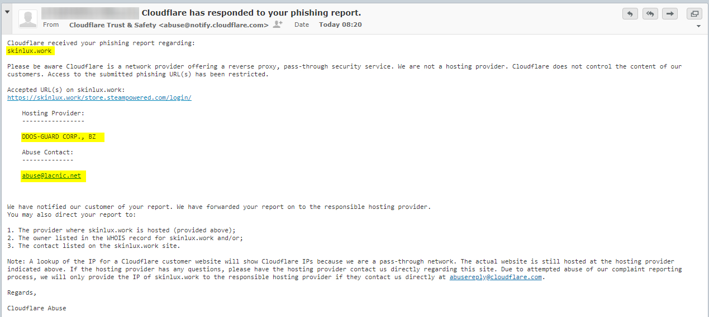
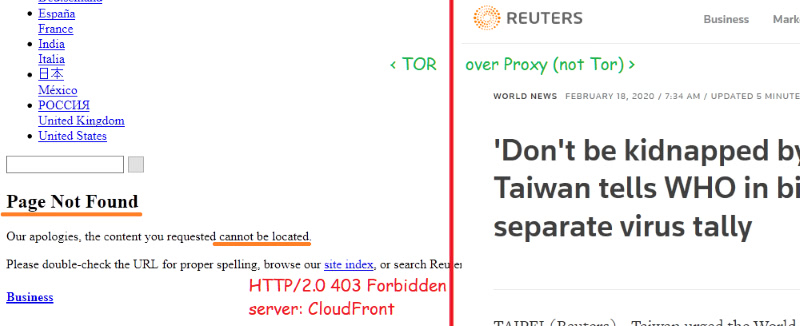
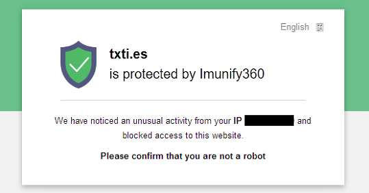
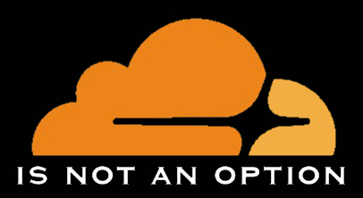

# List Instructions


---

<details>
<summary>_click me_

## Website is using Cloudflare
</summary>


- **Cloudflare users** | [**List Directory**](cloudflare_users/)

| List name | Description |
| -------- | -------- |
| /domain/cloudflare_?.txt     | Split files (base domain)     |
| ex_cloudflare_users.md     | Domains which used Cloudflare in the past, not anymore     |
| cloudflare_supporter.txt | who is using Cloudflare or endorsing Cloudflare. (URL only) |


- **Cloudflare Corporation** | [**List Directory**](cloudflare_inc/)

| List name | Description |
| -------- | -------- |
| cloudflare_CIDR_v4.txt     | IPv4 CIDR owned by Cloudflare     |
| cloudflare_CIDR_v6.txt     | IPv6 CIDR owned by Cloudflare     |
| cloudflare_range_v4.txt | IPv4 range owned by Cloudflare |
| cloudflare_owned_ASN.txt     | AS network owned by Cloudflare    |
| cloudflare_owned_NS.txt     | Name Server owned by Cloudflare    |
| cloudflare_owned_domains.txt     | Domains owned by Cloudflare     |
| cloudflare_owned_onions.txt     | Tor .onions owned by Cloudflare     |
| cloudflare_members.md | Cloudflare employer, employee, ex-employee |


**How to detect Cloudflare?**

There are many ways to detect it:

- Add-on "[Bloku Cloudflaron MITM-Atakon](subfiles/about.bcma.md)" will help your Cloudflare collection.
- Add-on "[Ĉu ligoj estas vundeblaj al MITM-atako?](subfiles/about.ismm.md)" will tell you which link is Cloudflared.
- Visit a website via Tor or VPN, and you will be greeted by "_Attention Required! Cloudflare_" or "_Checking your browser_" webpage.
- Use "Is MITM?" webpage. [Clearnet](https://sercxi.eu.org/ss/tool_ismitm.php) / [Tor](https://sercxi.nnpaefp7pkadbxxkhz2agtbv2a4g5sgo2fbmv3i7czaua354334uqqad.onion/ss/tool_ismitm.php)
- Search [cloudflare domain list](cloudflare_users/domain/). Karma's ["Find Cloudflare Domains" API](http://avrynpc2q7pknqa3ucf5tvjcwad5nxvxgwnzvl2b6dx6uo4f7nc7zzqd.onion/a/is_cf.php)
- Dig "[NS record](https://www.digwebinterface.com/?hostnames=emsisoft.com&type=NS&ns=resolver&useresolver=8.8.4.4&nameservers=)" of the domain.

```
emsisoft.com.		21599	IN	NS	bella.ns.cloudflare.com.
emsisoft.com.		21599	IN	NS	dom.ns.cloudflare.com.
```

- Dig "[A record](https://www.digwebinterface.com/?hostnames=dev.qubes-os.org&type=A&ns=resolver&useresolver=8.8.4.4&nameservers=)" of the FQDN, then [check the IP's owner](https://ipinfo.io/104.18.228.122).

```
dev.qubes-os.org.	299	IN	A	104.18.228.122

ASN AS13335 Cloudflare, Inc.
Organization Cloudflare, Inc.
Route 104.18.224.0/20
```

```
IMPORTANT: Please add only "Base Domain"

    if "community.example.com" is using Cloudflare
        add "example.com"

    if "www.example.co.uk" is using Cloudflare
        add "example.co.uk"

    if "example.net" is using Cloudflare
        add "example.net"

... to /split/cloudflare_e.txt
```

**But the website X no longer using Cloudflare!**

Are you sure? *Remove* it from /split/ list and *add* to "[ex_cloudflare_users.md](cloudflare_users/ex_cloudflare_users.md)".

</details>

------

<details>
<summary>_click me_

## Website is NOT using Cloudflare
</summary>


- **Non-Cloudflare CDN users** | [**List Directory**](not_cloudflare/)

| List name | Description |
| -------- | -------- |
| /cidr_data/?.txt     |  CIDR, ASN, NS    |

```
CDN_Code

Z1 Amazon
Z2 Akamai
//Z3 Cloudflare
Z4 Imperva
Z5 Google
Z6 Microsoft
Z7 INAP
Z8 Sucuri
Z9 Fastly
```

- Add-on "[Kiu retejo malakceptis min?](subfiles/about.urjm.md)" will help your domain collection.


- Above is how Siteground-hosted([INAP](https://www.inap.com/press-release/inap-completes-acquisition-singlehop/);[Singlehop](https://www.siteground.com/blog/siteground-partners-singlehop/)) sites often appear to Tor visitors when timeouts/tarpitting doesn't occur.

Some websites combine other companies (e.g. Amazon AWS, Google Cloud, DDoS-GUARD) _with_ the Cloudflare business model.



</details>

------

<details>
<summary>_click me_

## Website is rejecting Tor visitor
</summary>


- **Anti-Tor users** | [**List Directory**](anti-tor_users/)

| List name | Description |
| -------- | -------- |
| /fqdn/attd.txt     | **Block Tor access** Split files, Everything (FQDN)     |
| hostility.md | **Does NOT block Tor access** Domain and Comment |


- Add-on "[Kiu retejo malakceptis min?](subfiles/about.urjm.md)" will help your domain collection.
- Add-on "[Ĉu ĉi tiuj ligoj blokos Tor-uzanton?](subfiles/about.isat.md)" will tell you which link rejected Tor visitor.
- Search [anti-tor fqdn list](anti-tor_users/fqdn/). Karma's ["Find Anti-Tor FQDN" API](http://avrynpc2q7pknqa3ucf5tvjcwad5nxvxgwnzvl2b6dx6uo4f7nc7zzqd.onion/a/is_at.php)



- Some news websites are lying to Tor users. You can read their website if you are not using Tor nor VPN. If you visit their website over Tor, they just say "_Sorry, article not found_".



- [Imunify360](https://web.archive.org/web/20200617160904/https://www.imunify360.com/) is not so [intelligent](https://whc.ca/blog/introducing-imunify360-your-new-intelligent-firewall/) because it is blocking real human.

- Some famous mail subscription service and some ISP websites are displaying "Maintenance" page if you visit them over Tor.

**How can you trust their sites if they are not treating everyone equally?**


```

About "Anti-Tor FQDN list" (attd*.txt)

www.example.com
   ---> www.example.com denied/bullied Tor visitor.

?.akamaiedge.net
   ---> subdomain of akamaiedge.net is denied Tor user.
   * unique hostname will be masked as "?" for privacy reason

senate.gov
   ---> base domain denied/harassed/challenged human who're using Tor.

```

If your website is on this list, you better talk with your network administrator.

**But my website X no longer blocking Tor users!**

Are you sure? There are two ways to remove yourself.
First option is just _*remove* it from the list_ and _create a pull request_.
Second option is _wait 1 year_. Our system will revisit your website as a Tor user.

If you're not blocking Tor users, you will be removed automatically.

- If your website is using Cloudflare
 - There's a higher chance that we receive rejection webpage from Cloudflare. Do not use cloudflare.

</details>

------

<details>
<summary>_click me_

## How to add your data
</summary>


A or B will be enough. Thank you for your contribution.

> Type A: Push to Codeberg

1. Log in to *Codeberg*.
  - **WARNING**: Do note that Codeberg is blocking temporary email services and some minor email providers(not temporary email).
  - If you're Tor user, we recommend 'type B'.
2. Click "*Fork*" button. (top-left corner)
3. Edit text file.
4. Click *Double-arrow* button to create a *new pull request*.

> Type B: Just scan the FQDN

- Cloudflare
  - Scan FQDN on "[Is MITM?](https://sercxi.nnpaefp7pkadbxxkhz2agtbv2a4g5sgo2fbmv3i7czaua354334uqqad.onion/ss/tool_ismitm.php)" webpage.
  - Or: Use add-on "[Ĉu ligoj estas vundeblaj al MITM-atako?](subfiles/about.ismm.md)"
  - Or: Use "_MITM test_" API.
    - e.g. `curl -x socks5h://127.0.0.1:9050 -k --http2 (API URL)ismitm.php?f=www.emsisoft.com`
- Anti-TOR
  - Use "_Is it blocking Tor?_" API.
    - e.g. `curl -x socks5h://127.0.0.1:9050 -k --http2 (API URL)is_antitor.php?f=www.cloudflare.com`
  - Or: Use add-on "[Ĉu ĉi tiuj ligoj blokos Tor-uzanton?](subfiles/about.isat.md)"

Public API Details [ℹ](https://sercxi.nnpaefp7pkadbxxkhz2agtbv2a4g5sgo2fbmv3i7czaua354334uqqad.onion/#!op=info/api)
<br>
Your contribution will be pushed to Codeberg automatically within a week.

</details>

------

<details>
<summary>_click me_

## How to setup git
</summary>


This procedure will give you a stop_cloudflare fork with a privacy-respecting configuration to do pushes with SSH over Tor using `git.fuwafuwa.moe`.
Below procedure is designed for _Linux_.
The first step covers Windows too, but these instructions probably
need more adaptations for Windows and other platforms.


- Linux: `aptitude install git tor ssh`
- Windows: Download `PortableGit` from [Github](https://github.com/git-for-windows/) & run `git-bash.exe`

1. Install Git, SSH(Not Windows), and Tor (if you haven't already)
1. Create a `git.fuwafuwa.moe` account (username "snowden" will be used for this example)
1. Create an SSH key pair `$ ssh-keygen -t rsa -N '' -C 'snowden at codeberg' -f "$HOME"/.ssh/id_rsa_mrsnowden`
1. Edit `$HOME/.ssh/config`:
```
    host git.fuwafuwa.moe
         hostname     git.fuwafuwa.moe
         ForwardX11   no
         ProxyCommand connect -4 -S 127.0.0.1:9050 $(tor-resolve %h 127.0.0.1:9050) %p
    host mrsnowden
         IdentityFile /home/user/.ssh/id_rsa_mrsnowden
```

1. copy `"$HOME"/.ssh/id_rsa_mrsnowden.pub` to clipboard
1. git.fuwafuwa.moe > settings > SSH/GPG Keys > add key (paste from clipboard)
1. $ `firefox https://git.fuwafuwa.moe/you/stop_cloudflare`
1. fork it (top right corner)
1. go to the directory you want the project to be rooted in (hereafter we'll call it `$project_root`).
1. anonymously download your fork: $ `git clone git@mrsnowden:crimeflare/stop_cloudflare.git`
1. edit `$project_root/stop_cloudflare/.git/config` to include the account name and email address that will be on every commit, as well as the URL:
```
[user]
        email = BM-yadayadayada6fgnLfybVnCcWf25AGZcgg@bitmessage.ch
        name = snowden
[remote "origin"]
        url = git@mrsnowden:snowden/stop_cloudflare.git
     	fetch = +refs/heads/*:refs/remotes/origin/*
[remote "upstream"]
        url = git@mrsnowden:crimeflare/stop_cloudflare.git
     	fetch = +refs/heads/*:refs/remotes/origin/*
[branch "master"]
	remote = origin
	merge = refs/heads/master
```

1. make your first change
1. (from `$project_root`) $ `git add . -u -n`
1. check that the files listed are what you changed and intend to push upstream
1. if yes: `$ git add . -u`
1. $ `git commit -m 'description of first change'`
1. $ `git push origin master`
1. $ `firefox https://git.fuwafuwa.moe/you/stop_cloudflare`
1. make a new pull request

&nbsp;

Whenever git operates on the stop_cloudflare project, all connections
to codeberg are automatically over Tor with this configuration
(because the `url` in `.git/config` references the virtual host
`mrsnowden` in `~/.ssh/config`).

</details>

------

<details>
<summary>_click me_

## How to edit files without account
</summary>

It is possible to edit any files on this repository using shared editor. If you wish to collaborate anonymously, contact and show us how much activism you have done. You'll need a computer.

</details>

------

<details>
<summary>_click me_

## About Cloudflare base domain list
</summary>


Our mission is clear - `stay away from Cloudflare`.

If the `subdomain.example.com` is cloudflared, we add `example.com` to the database. (`subdomain.example.com` is the sub-domain of `example.com`. Only `the owner` of `example.com` can create sub-domain)

Even if `whatever.example.com` is _not_ behind cloudflare we _will_ raise a warning, because the base domain `example.com` is `cloudflare user`.

`The owner` of `example.com` can enable Cloudflare to `whatever.example.com` at any time without user's notice. It can be done from `dash.cloudflare.com` webpage or hitting `Cloudflare API`. `The owner` is supporting `Cloudflare` and this is severe `security risk`.

Until `the owner` completely stop using Cloudflare service for `example.com`, we _do not_ remove `example.com` from the database.

There is `no exception`.

```

"amazonpayments.com"

$ getweb --headonly https://pages.amazonpayments.com/robots.txt

cf-cache-status: HIT
expect-ct: max-age=604800, report-uri="https://report-uri.cloudflare.com/cdn-cgi/beacon/expect-ct"
alt-svc: h2="cflare******.onion:443"; ma=86400; persist=1
server: cloudflare
cf-ray: XXXXXXXXXXX-YYY

```

If `the owner` moved away from `cloudflare` **completely**, you are welcome to add `example.com` to the "[ex_cloudflare_users.md](cloudflare_users/ex_cloudflare_users.md)" - after checking `example.com` with online tool below.


1. Open "`Is MITM?`" webpage.

2. Input `gitlab.com` and click `Scan`.

3. Click `test` for detailed scan.

4. If you got `--- Finish ---`, the domain _might_ stopped using Cloudflare.

We'll _investigate_ and remove it _if_ it is true.<br>
You may prioritize your review request by contacting us if you are in a hurry.

5. [Optional] Wait some days and scan again to see whether the domain is removed.


`Only a few Cloudflare user leave Cloudflare. False positive is uncommon.`

</details>

---


