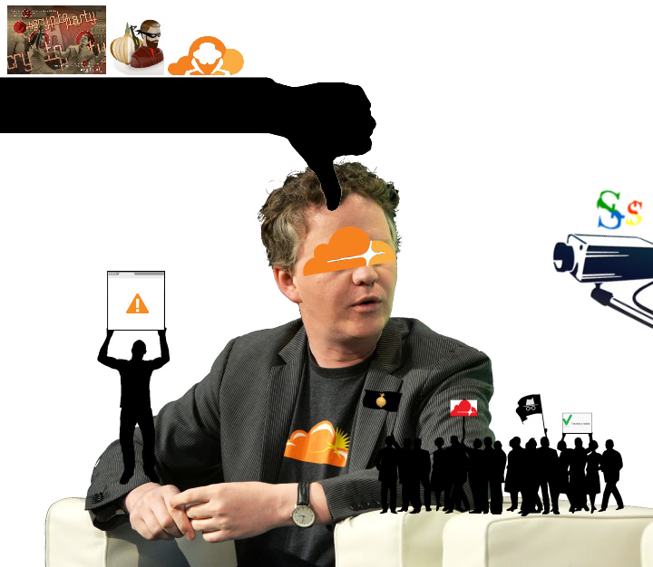
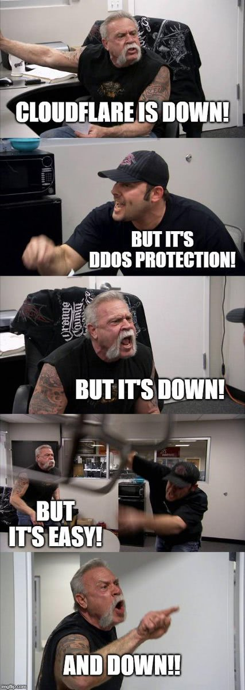
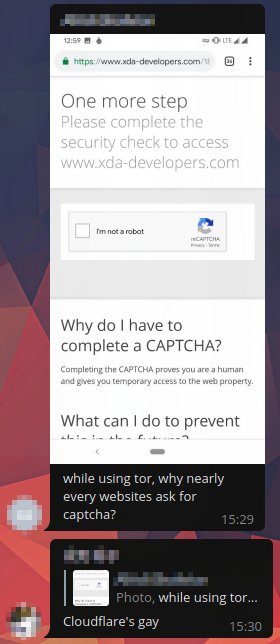
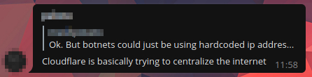
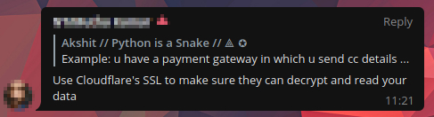
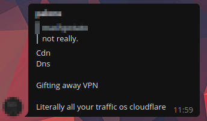
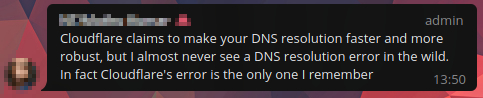
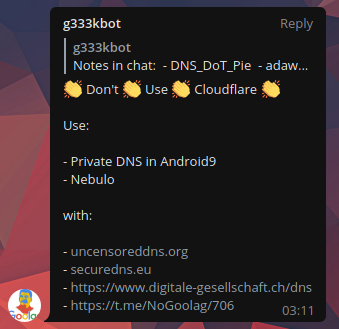
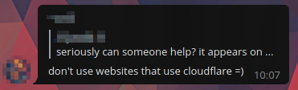
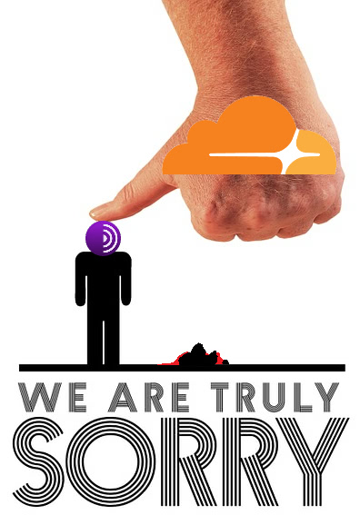

# "Cloudflare, we have a problem"


- This is a list of voices. Thank you for sharing your opinion.
- *Disclaimer*: This page contains external links to third party websites. These sites are subject to the liability of the respective website operators.


| 🖼 | 🖼 |
| --- | --- |
|  |  |
|  |  |
|  |  |


```
It's pretty sad when even the hometown paper is behind the greatcloudwall.
C'mon guys. Stop using Cloudflare.
It's endangering the world wide web and you're blocking readers who are protecting
their privacy by using Tor.
```
-- [Jeff Cliff](http://qhtn4w2q36dojls2.onion/)


```
Man-in-the-middle attack is a serious offense.
If you′re using Cloudflare on your website, you won′t get first rank.
You shouldn′t use it if you value visitor′s privacy.
```
 -- [Searxes](https://sercxi.nnpaefp7pkadbxxkhz2agtbv2a4g5sgo2fbmv3i7czaua354334uqqad.onion/)


```
I say it's a bad idea to pimp CloudFlare sites and expect such repressions to go unchallenged.
Activism is a duty & ethics trumps netiquette.

Posting original information exclusively on onion sites
is like affirmative action for the repressed Tor community.
Correcting the wrongs of CloudFlare entails some unfair discrimination against clearnet users.
```
-- [Activist](https://activism.openworlds.info/@aktivismoEstasMiaLuo)


---

| 🖼 | 🖼 |
| --- | --- |
|  | <br> |

---

<details>
<summary>_click me_

## News
</summary>


- [Major internet outage: Dozens of websites and apps were down](https://edition.cnn.com/2020/08/30/tech/internet-outage-cloudflare/index.html)
- [Произошел сбой работы интернет сервисов по всему миру](https://www.securitylab.ru/news/511577.php)
- [Cloudflare suffered data leak; exposing 3 million IP addresses: Ukraine](https://www.hackread.com/cloudflare-data-leak-expose-ip-addresses-ukraine/)
- [Cloudflare’s DNS Issue, Service Shuts Down Half The Web](https://www.prosyscom.tech/tech-industry/cloudflares-dns-issue-service-shuts-down-half-the-web/)
- [Half Of The Internet Is Down After Cloudflare Suffers Major Outage](https://www.zerohedge.com/markets/major-part-web-offline-cloudflare-suffers-outage)
- [MASSIVE outage hits Cloudflare, sends Discord & other service-powered sites DOWN - reports](https://www.rt.com/usa/495127-discord-cloudfare-outage-down/), RT
- [Discord, Riot Games down with reported Cloudflare outage](https://www.polygon.com/2020/7/17/21329005/cloudflare-outrage-discord-riot-games-july-2020), [Nicole Carpenter](https://www.polygon.com/users/NicoleCarpenter)
- [Discord was down for nearly an hour due to Cloudflare issues](https://www.theverge.com/2020/7/17/21328993/discord-down-server-outage-issues), [Tom Warren](https://www.theverge.com/authors/tom-warren)
- [Your Regular Reminder That the Internet Is a Fragile Place](https://slate.com/technology/2019/07/cloudflare-internet-outage-502-gateway-error.html), [Chip Brownlee](https://slate.com/author/chip-brownlee)
- [Internet wobble caused, Cloudflare glitch](https://www.bbcnewsv2vjtpsuy.onion/news/technology-48841815), [BBC](https://www.bbcnewsv2vjtpsuy.onion/)
- [CloudflareのDNSだと「5ちゃんねる」に接続できない？　ネットで話題に](https://www.itmedia.co.jp/news/articles/1908/09/news108.html), [itmedia](https://www.itmedia.co.jp/news/)
- [Cloudflare down: Thousands of popular websites affected, brief outage](https://news.sky.com/story/cloudflare-down-thousands-of-popular-websites-affected-by-brief-outage-11755312), [Alexander J Martin](https://news.sky.com/)
- [Major websites and services across the internet went down Tuesday because of a hosting-platform outage](https://www.businessinsider.nl/cloudflare-outage-causes-major-websites-across-internet-to-go-down-2019-7/), [Antonio Villas-Boas](https://www.businessinsider.com/author/antonio-villas-boas)
- [CloudFlare Outage Takes Down Coinbase, CoinMarketCap and Other Top Crypto Websites](https://www.coindesk.com/cloudflare-outage-takes-down-coinbase-coinmarketcap-and-other-top-crypto-websites), [John Biggs](https://www.coindesk.com/author/johncoindesk-com)
- [Millions of websites went down across the internet today after massive Cloudflare outage](https://metro.co.uk/2019/07/02/cloudflare-outage-means-websites-including-detector-10103471/), [Jasper Hamill](https://metro.co.uk/author/jasper-hamill/)
- [Cloudflare blames ‘bad software’ deployment for today’s outage](https://techcrunch.com/2019/07/02/a-cloudflare-outage-is-impacting-sites-everywhere/), [Brian Heater](https://techcrunch.com/author/brian-heater/)
- [Cloudflare issues affecting numerous sites on Monday AM](https://techcrunch.com/2019/06/24/cloudflare-outage-affecting-numerous-sites-on-monday-am/), [Sarah Perez](https://techcrunch.com/author/sarah-perez/)
- [Internet security CEO explained why his company exposed people to harassment, and suggested they should've used fake names](https://web.archive.org/web/20171024040313/http://www.businessinsider.com/cloudflare-ceo-suggests-people-who-report-online-abuse-use-fake-names-2017-5), [Julie Bort](http://www.businessinsider.com/author/julie-bort)
- [Cloudflare CEO Terminates Neo-Nazi Site After 'Waking Up in a Bad Mood'](https://www.zerohedge.com/news/2017-08-17/cloudflare-ceo-terminates-neo-nazi-site-after-waking-bad-mood), [The_Real_Fly](https://www.zerohedge.com/users/therealfly)
- [Cloudflare CEO on Terminating Service to Neo-Nazi Site: 'The Daily Stormer Are Assholes'](https://gizmodo.com/cloudflare-ceo-on-terminating-service-to-neo-nazi-site-1797915295), [Kate Conger](https://kinja.com/conger)
- [The invasion boards that set out to ruin lives](https://web.archive.org/web/https://boingboing.net/2015/01/19/invasion-boards-set-out-to-rui.html), [Jay Allen](https://boingboing.net/author/amaninblack)
- [How One Major Internet Company Helps Serve Up Hate on the Web](https://web.archive.org/web/20190512152916/https://www.propublica.org/article/how-cloudflare-helps-serve-up-hate-on-the-web), [Ken Schwencke](https://web.archive.org/web/20190512152916/https://www.propublica.org/people/ken-schwencke)
- [Zaradi hrošča iz Cloudflara več mesecev curljalo](https://slo-tech.com/novice/t694836/p5445996), [Slo-Tech](https://slo-tech.com/)
- [CDN企業Cloudflareのバグで、多数のサービスで機密データ流出の可能性](https://www.itmedia.co.jp/news/articles/1702/25/news024.html), [佐藤由紀子](https://www.itmedia.co.jp/news/)
- [Everything You Need to Know About Cloudbleed, the Latest Internet Security Disaster](https://gizmodo.com/everything-you-need-to-know-about-cloudbleed-the-lates-1792710616), [Adam Clark Estes](https://kinja.com/ace)
- [Why Cloudflare Let an Extremist Stronghold Burn](https://www.wired.com/story/free-speech-issue-cloudflare/), [Steven Johnson](https://www.wired.com/author/steven-johnson/)
- [Private crypto keys are accessible to Heartbleed hackers, new data shows](https://arstechnica.com/information-technology/2014/04/private-crypto-keys-are-accessible-to-heartbleed-hackers-new-data-shows/), [Megan Geuss](https://arstechnica.com/author/megan-geuss/)

</details>

------

<details>
<summary>_click me_

## Blog
</summary>


(Just don't add Medium.com articles. It's Cloudflared. Whether the content is good or not doesn't matter.)

- [New CDN for media files](https://masto.host/new-cdn-for-media-files/)
- [Personal post: I left Cloudflare](https://www.ethanyoo.com/cloudflare/)
- [Crimeflare (Fuck Cloudflare) / bandcamp / music](https://polarisfm.bandcamp.com/releases)
- [Cloudflare outage and the risk in today's Internet](https://www.garron.blog/posts/cloudflare-outage.html)
- [Turns out half the internet has a Single-Point-of-Failure called “Cloudflare”](https://easydns.com/blog/2020/07/20/turns-out-half-the-internet-has-a-single-point-of-failure-called-cloudflare/)
- [Cloudflare and why it's bad](https://ella.wantscuddl.es/b/cloudflare)
- [Vous vous souvenez de l'époque où DARPA avait conçu internet de manière à ce qu'il continue de fonctionner même quand un noeud du réseau est tombé ?](https://sebsauvage.net/links/?GSB_Fg)
- [Die zentralisierung des Internets](https://blog.bka.li/~/JustForFun/cloudflare/)
- [Is Cloudflare safe yet?](https://iscloudflaresafeyet.com)
- [Mozilla - Devil Incarnate: DNS over HTTPS](http://digdeep4orxw6psc33yxa2dgmuycj74zi6334xhxjlgppw6odvkzkiad.onion/ghost/mozilla.html#cloudflare), [DigDeeper](http://digdeep4orxw6psc33yxa2dgmuycj74zi6334xhxjlgppw6odvkzkiad.onion/)
- [「Block Cloudflare MITM Attack」の設定を見直してわかったこと。](https://watasinokaikakutohyouron.hatenablog.com/entry/2020/05/25/044334)
- [Cloudflare silently deleted my DNS records](https://web.archive.org/save/https://txti.es/cloudflare-deleted-my-dns), Cloudflare user
- [Cloudflare is turning off the internet for me](https://blog.dijit.sh/cloudflare-is-turning-off-the-internet-for-me), [Jan Harasym](https://blog.dijit.sh/)
- [Can you trust CloudFlare with your personal data?](https://shkspr.mobi/blog/2019/11/can-you-trust-cloudflare-with-your-personal-data/), [Terence Eden](https://edent.tel/)
- [WARP is not a VPN for privacy](https://www.piavpnaymodqeuza.onion/blog/2019/09/warp-is-not-a-vpn-for-privacy/), [Private Internet Access](https://www.privateinternetaccess.com/)
- [Cloudflare - why the fuss?](https://decentralize.today/decentralization/cloudflare-why-the-fuss), [O S Layman](https://decentralize.today/cryptocurrency/blogger/big-h)
- [Cloudflare Outage Kills the Internet](https://youtube.com/watch?v=Yld9t32Frcw)
- [Cloudflare is down lol](https://youtube.com/watch?v=cpCZG_r6nXg)
- [Cloudflare considered harmful](https://www.devever.net/~hl/cloudflare)
- [Cloudflare’s WARP ‘VPN’ isn’t private nor safe; Don’t use it](https://blog.kareldonk.com/cloudflares-warp-vpn-isnt-private-nor-safe-dont-use-it/), [Karel Donk](https://blog.kareldonk.com/)
- [Does Cloudflare help my WordPress site?](https://seravo.com/blog/does-cloudflare-help-my-wordpress-site/), [Seravo](https://seravo.com/)
- [Say no to Cloudflare](https://robinwils.surge.sh/categories/articles/say-no-to-cloudflare/), [Robin Wils](https://robinwils.surge.sh/contact/)
- [Why You Don’t Use Cloudflare…](https://www.focowphelp.com/2017/03/why-you-dont-use-cloudflare/)
- [Don’t use Cloudflare CDN: build in speed quality instead.](http://pagepipe.com/cloudflare-doesnt-guarantee-consistent-load-times/)
- [Why I Stopped Using CloudFlare](https://www.reviewhell.com/blog/cloudflare-makes-websites-slower/), [Review Hell](https://www.reviewhell.com/)
- [I don’t trust Cloudflare’s 1.1.1.1 App and Warp VPN](https://blog.kareldonk.com/i-dont-trust-cloudflares-1-1-1-1-app-and-warp-vpn/), [Karel Donk](https://blog.kareldonk.com/)
- [Don’t Use Cloudflare Because You Impose This on People Who Least Want It](http://techrights.org/2019/02/17/the-cloudflare-trap/), [Dr. Roy Schestowitz](http://techrights.org/)
- [All your DNS traffic will be sent to Cloudflare](https://ungleich.ch/en-us/cms/blog/2018/08/04/mozillas-new-dns-resolution-is-dangerous/), [ungleich](https://ungleich.ch/)
- [Cloudflare: The bad, the worse and the ugly?](http://webschauder.de/cloudflare-the-bad-the-worse-and-the-ugly/), [Alle Beiträge](http://webschauder.de/author/jw/)
- [I don’t trust Cloudflare with IPFS](https://blog.kareldonk.com/i-dont-trust-cloudflare-with-ipfs/), [Karel Donk](https://blog.kareldonk.com/)
- [Cloudflare IPFS experiment](https://js.ipfs.io/ipns/QmZJBQBXX98AuTcoR1HBGdbe5Gph74ZBWSgNemBcqPNv1W/cloudflare-IPFS-experiment.html), [Joe](https://js.ipfs.io/ipns/QmZJBQBXX98AuTcoR1HBGdbe5Gph74ZBWSgNemBcqPNv1W/index.html)  [[mirror](http://archive.fo/139z1)]
- [Tor Project calls out CloudFlare for dark web surveillance](https://www.itproportal.com/2016/02/29/tor-project-calls-out-cloudflare-for-dark-web-surveillance/)
- [CloudFlare: Deutscher Bundestag bezieht schon wieder Internet von US-Anbietern, diesmal für die eigenen Webseiten](https://netzpolitik.org/2015/cloudflare-deutscher-bundestag-bezieht-schon-wieder-internet-von-us-anbietern-diesmal-fuer-die-eigenen-webseiten/), [Andre Meister](https://netzpolitik.org/author/andre/)
- [Don't Trust CloudFlare](https://write.lain.haus/thufie/dont-trust-cloudflare), [@lunaterra@cyberia.social](https://cyberia.social/@lunaterra)
- [CloudFlare slowed down our site](https://pergento.wordpress.com/2012/02/01/cloudflare-slowed-down-our-site/), [Callum](https://pergento.wordpress.com/author/chmac/)
- [Stay away from CloudFlare](http://www.unixsheikh.com/articles/stay-away-from-cloudflare.html), [Unix Sheikh](http://www.unixsheikh.com/)
- [Cloudflare and Spamhaus](https://wordtothewise.com/2012/07/cloudflare-and-spamhaus/), [laura](https://wordtothewise.com/author/laura/)
- [Support End-to-End Encryption on the Web](https://www.wordfence.com/blog/2017/03/support-end-to-end-encryption/), [Mark Maunder](https://www.wordfence.com/)
- [Cloudflare发布针对IPFS的Gateway](https://www.jianshu.com/p/8a9cb8065f4a), [幸运排骨虾](https://www.jianshu.com/u/c3c0e9748845)
- [CloudFlareよサヨナラ！ WordPressの表示速度が改善するプラグイン「Photon」](https://rentalhomepage.com/photon/), [ENJILOG](https://rentalhomepage.com/)
- [CloudFlareの解除と「Phonton」の導入方法](http://kyoheixxx.com/cloudflare-phonton-5058), [kyohei](http://kyoheixxx.com/)
- [Cloudflare: The “Now You See Me, Now You Don’t” of the Internet](http://copyright.nova.edu/cloudflare/)
- [The CloudFlare Leak and the Problem of Centralized Authentication](https://web.archive.org/web/https://www.iovation.com/blog/the-cloudflare-leak-and-the-problem-of-centralized-authentication), [iovation Inc.](https://www.iovation.com/)
- [CloudFlare is ruining the internet (for me)](https://www.slashgeek.net/2016/05/17/cloudflare-is-ruining-the-internet-for-me/), [slashgeek](https://www.slashgeek.net/)
- [MITM-as-a-Service: The Threat Surface We Didn’t Know We Had](http://daveshackleford.com/?p=1134), [Shack](twitter.com/daveshackleford/)
- [Journal CloudFlare au milieu](https://linuxfr.org/users/thibg/journaux/cloudflare-au-milieu), [ThibG](https://linuxfr.org/)
- [why you shouldn’t use Cloudflare](https://tech.tiq.cc/2016/01/why-you-shouldnt-use-cloudflare/), [tiq](https://tech.tiq.cc/)
- [DNSサーバー「1.1.1.1」が利用できない障害発生中（2018年4月22日）](https://web.archive.org/web/20190815152042/https://did2memo.net/2018/04/22/dns-1-1-1-1-failure-2018-04-22/), [did2](https://twitter.com/did2memo)
- [The CloudFlare MITM](https://web.archive.org/web/20160311163431/https://blog.paymium.com/2014/02/19/the-cloudflare-mitm/), [David FRANCOIS](https://blog.paymium.com/)
- [Allergique à Cloudflare ? Voici comment vous soigner…](https://web.archive.org/web/https://korben.info/cloudflare-mitm.html), [KORBEN](https://korben.info/)
- [CloudFlare, We Have A Problem](http://cryto.net/~joepie91/blog/2016/07/14/cloudflare-we-have-a-problem/), [joepie91](http://cryto.net/~joepie91/)
- [CloudFlare blocked 94% of Tor requests](http://en.android4e.com/?p=1263)
- [On Cloudflare](https://www.tyil.nl/post/2017/12/17/on-cloudflare/), [tyil](https://www.tyil.nl/)
- [What Is Cloudflare, and Did It Really Leak My Data All Over the Internet?](https://www.howtogeek.com/295677/WHAT-IS-CLOUDFLARE-AND-DID-IT-REALLY-LEAK-MY-DATA-ALL-OVER-THE-INTERNET/)
- [Why CloudFlare Is Probably A Honeypot](https://web.archive.org/web/https://cypherpunk.is/2015/04/02/why-cloudflare-is-probably-a-honeypot/), [cypherpunk](https://cypherpunk.is/)
- [iSucker: Big Brother Internet Culture](https://exiledonline.com/isucker-big-brother-internet-culture/), [The Exiled](https://exiledonline.com/)
- [CloudFlare Watch](http://cryptome.org/2012/07/cloudflare-watch.htm), Daniel Brandt
- [The Trouble with CloudFlare](https://blog.torproject.org/trouble-cloudflare), [mikeperry](https://blog.torproject.org/users/mikeperry)
- [Growing Cloudflare Menace](http://imhhge4lijqv7jzf.onion/warning.html)

</details>

------

<details>
<summary>_click me_

## Forum / Wiki
</summary>


- ["When you fetch a page from a website that is served from CloudFlare, Javascript has been injected on-the-fly into that page by CloudFlare, and they also plant a cookie that brands your browser with a globally-unique ID."](https://www.reddit.com/r/privacy/comments/jd6dys/when_you_fetch_a_page_from_a_website_that_is/)
- [Tor connectiong being MITMED by Cloudflare](https://www.reddit.com/r/tails/comments/ip0gg6/tor_connectiong_being_mitmed_by_cloudflare/)
- [Cloudflare now controls a large portion of the internet with it's MiTM-style DDOS protection.](https://www.reddit.com/r/privacy/comments/iddxb2/are_we_seriously_going_to_live_in_a_googleowned/)
- [Cloudflare fail - a dry run to closing down the internet?](https://www.reddit.com/r/conspiracyNOPOL/comments/ijk28z/cloudflare_fail_a_dry_run_to_closing_down_the/)
- [Dozens of Websites, Apps Go Down in Major Cloudflare Outage](https://www.reddit.com/user/joshwho/comments/ijkfqv/dozens_of_websites_apps_go_down_in_major/)
- [For everyone who needs drivers during the MSI website downtime.](https://www.reddit.com/r/MSI_Gaming/comments/iji1pk/for_everyone_who_needs_drivers_during_the_msi/)
- [Access Denied: Cloudflare is blocking my access to srb2.org (Can't access the game to Download!)](https://www.reddit.com/r/SRB2/comments/ikfq09/access_denied_cloudflare_is_blocking_my_access_to/)
- [Cloudflare is down, who cares?](https://www.reddit.com/r/Bluzelle/comments/ijo561/cloudflare_is_down_who_cares/)
- [Cloudflare goes down; crypto websites hit](https://www.reddit.com/r/p2psf/comments/ijlcvb/cloudflare_goes_down_crypto_websites_hit/)
- [Spectrum and Cloudflare](https://www.reddit.com/r/Spectrum/comments/iia1cz/spectrum_and_cloudflare/)
- [DNS Troubles?](https://www.reddit.com/r/TalesOfCrestoria/comments/iiyvha/dns_troubles/)
- [Access denied | www.freemalaysiatoday.com used Cloudflare to restrict access](https://www.reddit.com/r/malaysianews/comments/iinkqa/access_denied_wwwfreemalaysiatodaycom_used/)
- [How do I restore company's faith in Cloudflare?](https://www.reddit.com/r/sysadmin/comments/htg5p5/how_do_i_restore_companys_faith_in_cloudflare/)
- [Cloudlfare issues?](https://reddit.com/r/CloudFlare/comments/i852xd/cloudlfare_issues/)
- [Anyone else's game just dis connect?](https://reddit.com/r/VALORANT/comments/i850x5/anyone_elses_game_just_dis_connect/g16aqap/)
- [Help! Cloudflare blocking access to every website, probably malware](https://reddit.com/r/techsupport/comments/i80my6/help_cloudflare_blocking_access_to_every_website/)
- [Access denied, Cloudflare when using TOR, why?](https://reddit.com/r/TOR/comments/i2ubsj/access_denied_by_cloudflare_when_using_tor_why/)
- [Private Windows with Tor showing excessive CAPTCHAs](https://reddit.com/r/brave_browser/comments/hnrv91/private_windows_with_tor_showing_excessive/)
- [i always get redirected to Cloudflare Captcha](https://reddit.com/r/TOR/comments/hhd9kk/some_problems_with_tor/)
- [The problem with CloudFlare (part 1 of 2: detriment to privacy, netneutrality, s/w freedom, & human rights)](https://neoreddit.horobets.me/post/43)
- [The problem with CloudFlare (part 2 of 2: detriment to security, environment, democracy, and free expression)](https://neoreddit.horobets.me/post/44)
- [Cloudflare Captcha Shit!](https://forum.tuts4you.com/topic/42026-cloudflare-captcha-shit/)
- [Hcaptcha In IRAN](https://community.cloudflare.com/t/hcaptcha-in-iran/166585)
- [No IPv6 on hcaptcha](https://community.cloudflare.com/t/no-ipv6-on-hcaptcha/169108)
- [How Cloudflare Killed the Internet](https://www.reddit.com/r/witchlnx/comments/hw0yss/how_cloudflare_killed_the_internet_liked_on/)
- [Right now, there's something wrong with matchmaking definitely- I see Steam forums also note people can't start matches after ready up](https://www.reddit.com/r/commandandconquer/comments/htsqtp/right_now_theres_something_wrong_with_matchmaking/)
- [cloudflare down again?](https://www.reddit.com/r/sysadmin/comments/htg9kd/cloudflare_down_again/)
- [Because you are a normie that uses Tor and/or a VPN. I’m in the same boat. I use one - that is, a VPN - and man alive! Captchas, captchas everywhere. I’m annoyed to the point that I simply don’t go to sites that use captchas. Which, annoyingly, are a great, many sites, because everyone and their grandmother seems to be using Cloudflare nowadays. Sorry, rant over.](https://dev.lemmy.ml/post/37546/comment/11865)
- [Cloudflare is down again!](https://dev.lemmy.ml/post/37708)
- [I'm free now.](https://www.reddit.com/r/FinlayDaG33k/comments/hthp0s/im_free_now/)
- [How to stop and disable stupid Hcaptcha from our Cloudflare site?](https://community.cloudflare.com/t/how-to-stop-and-disable-stupid-hcaptcha-from-our-cloudflare-site/160194)
- [Cloudflare: l'OPA silenziosa sul web](https://www.reddit.com/r/ItalyInformatica/comments/belhyu/cloudflare_lopa_silenziosa_sul_web/)
- [STOP USING hCAPTCHA](https://community.cloudflare.com/t/stop-using-hcaptcha/158968)
- [Cloudflare is down](https://www.reddit.com/r/CloudFlare/comments/ht4iz1/cloudflare_is_down/)
- [hehe cloudflare ded](https://www.reddit.com/r/memes/comments/ht5fnc/hehe_cloudflare_ded/)
- [cloudflare captcha problem](https://www.reddit.com/r/techsupport/comments/aw61do/cloudflare_captcha_problem/)
- [Anyone still having problems connecting? Is Cloudflare still screwed?](https://www.reddit.com/r/EscapefromTarkov/comments/ht5d65/anyone_still_having_problems_connecting_is/)
- [Try browsing the web using Tor or a VPN. You will spend the day doing Google recaptchas for like 90% of the websites you visit, I guarantee it. All thanks to Cloudflare.](https://dev.lemmy.ml/post/35712/comment/8474)
- [why the fuck does so much stuff run on Cloudflare?!](https://dev.lemmy.ml/post/36758/comment/10074)
- [The devs of systemd, the main init system on Linux, use Google and cloudflare for fallback/default NTP and DNS, when asked to use privacy respecting alternatives, they call people conspiracy theorists](https://dev.lemmy.ml/post/34476)
- [The devs of systemd, the main init system on Linux, use Google and cloudflare for fallback/default NTP and DNS, when asked to use privacy respecting alternatives, they call people conspiracy theorists](https://www.reddit.com/r/privacy/duplicates/h108u5/the_devs_of_systemd_the_main_init_system_on_linux/)
- [Fight for the Future is supposed to be advocating netneutrality, & yet their own site is on CloudFlare](https://dev.lemmy.ml/post/31655)
- [Ok. But if they use Cloudflare, which MITMs traffic, all their users data is in plaintext to Cloudflare.](https://news.ycombinator.com/item?id=17700131)
- [Can someone please explain to me how Cloudflare isn't MITM?](https://www.reddit.com/r/AskNetsec/comments/hbcvl2/can_someone_please_explain_to_me_how_cloudflare/)
- [every cloudflare website i go to it has error 1020. is cloudflare down rn?](https://www.reddit.com/r/CloudFlare/comments/hittvf/every_cloudflare_website_i_go_to_it_has_error/)
- [NO cloudflare website is loading](https://www.reddit.com/r/CloudFlare/comments/hiqm4u/no_cloudflare_website_is_loading/)
- [Highlighting Liberapay and OpenCollective as the preferred donation options](https://forum.f-droid.org/t/highlighting-liberapay-and-opencollective-as-the-preferred-donation-options/10163)
- [Firefox VPN (Firefox Private Network)](https://www.reddit.com/r/thehatedone/comments/h9elzc/firefox_vpn_firefox_private_network/)
- [Why is everyone ignoring Cloudfare's MITM that affects 13% of sites worldwide and maybe 30% of English-language sites?](https://web.archive.org/save/https://www.linuxquestions.org/questions/linux-security-4/why-is-everyone-ignoring-cloudfare%27s-mitm-that-affects-13-of-sites-worldwide-and-maybe-30-of-english-language-sites-4175675815/)
- [Are CAPTCHAs harder to solve on TOR?](https://www.reddit.com/r/TOR/comments/gu7p75/are_captchas_harder_to_solve_on_tor/)
- [Can we stop using Cloudflare?](https://www.reddit.com/r/BitChute/comments/cmgmur/can_we_stop_using_cloudflare/)
- [Crowd Sourced Protest Of Cloudflare](https://lists.torproject.org/pipermail/tor-talk/2016-March/040705.html)
- [Crowd Sourced Protest Of Cloudflare](https://www.reddit.com/r/TOR/comments/4cdx30/crowd_sourced_protest_of_cloudflare/)
- [US Bank website is not in Cloudflare DNS](https://www.reddit.com/r/CloudFlare/comments/gmfm4i/us_bank_website_is_not_in_cloudflare_dns/)
- [Aliexpress not working with 1.1.1.1](https://community.cloudflare.com/t/aliexpress-not-working-with-1-1-1-1/167491)
- [What data does CloudFlare actually see?](https://community.cloudflare.com/t/what-data-does-cloudflare-actually-see/28660)
- [Why does everyone here dislike CloudFlare?](https://www.reddit.com/r/privacy/comments/cce2ui/why_does_everyone_here_dislike_cloudflare/)
- [As long as Gab uses Cloudflare, it's doomed to failure](https://www.reddit.com/r/gab/comments/eet4cr/as_long_as_gab_uses_cloudflare_its_doomed_to/)
- [Mozilla just lost all its credibility. Cloudflare isn't trustworthy, since it decrypts TLS!](https://www.reddit.com/r/privacytoolsIO/comments/e97thq/mozilla_just_lost_all_its_credibility_cloudflare/), [vargasgetulio](https://www.reddit.com/user/vargasgetulio)
- [Cloudflare and the US Intelligence Community](https://www.reddit.com/r/privacy/comments/dmc4cj/cloudflare_and_the_us_intelligence_community/), [dhaavi](https://www.reddit.com/user/dhaavi)
- [Cloudflare IM NOT A ROBOT blocking API?!?](https://www.patreondevelopers.com/t/cloudflare-im-not-a-robot-blocking-api/2607)
- [API Returning Cloudflare Challenge](https://www.patreondevelopers.com/t/api-returning-cloudflare-challenge/2025)
- [Cloudflare Challenge On www.patreon.com](https://www.patreondevelopers.com/t/cloudflare-challenge-on-https-www-patreon-com-api-oauth2-token/2213)
- [Some websites not loading pictures after upgrade to Tor Browser 9.0](https://trac.torproject.org/projects/tor/ticket/32238)
- [Downvoters seem to hate the truth.](https://www.reddit.com/r/btc/comments/8yin4y/ironic/e2b5ycn/)
- [Why does a .gov site use Cloudflare?](https://www.reddit.com/r/sysadmin/comments/4vdn15/why_does_a_gov_site_use_cloudflare/)
- [Some images from Cloudflare don't load up and a 403 Forbidden is returned](https://trac.torproject.org/projects/tor/ticket/32582)
- [Do you know how Cloudflare works? It's literally a proxy.](https://endchan.org/pol/res/72923.html#q74241)
- [website not working properly since update](https://trac.torproject.org/projects/tor/ticket/32430)
- [Cloudflare to MITM your traffic is an extraordinary security and privacy problem.](https://www.reddit.com/r/Bitcoin/comments/e303gh/bitcoincoreorg_expired_ssl_cert/f8zqcf9/), [hva32](https://www.reddit.com/user/hva32/)
- [Google's reCAPTCHA fails 100%](https://trac.torproject.org/projects/tor/ticket/23840)
- [The Great Cloudwall](https://lobste.rs/s/xkwcl3), [caioalonso](https://lobste.rs/u/caioalonso)
- [Proposal: Remove Cloudflare from the official Bitcoin Cash website](https://www.reddit.com/r/btc/comments/docdui/proposal_remove_cloudflare_from_the_official/), [LeoBeltran](https://www.reddit.com/user/LeoBeltran/)
- [Now that Cloudflare Warp has gone public, is it still the worst thing EVER?](https://www.reddit.com/r/privacytoolsIO/comments/da1lx3/now_that_cloudflare_warp_has_gone_public_is_it/), [Anaranovski](https://www.reddit.com/user/Anaranovski)
- [Cloudeflare Captcha](https://forum.palemoon.org/viewtopic.php?f=37&t=22321&p=169114), [zdmv09rzbtklezd8d](https://forum.palemoon.org/memberlist.php?mode=viewprofile&u=19075)
- [Secure Connection Failed](https://forum.palemoon.org/viewtopic.php?f=44&t=20845&p=155973), [Tomaso](https://forum.palemoon.org/memberlist.php?mode=viewprofile&u=9778)
- [12.7 percent of the domains I visit are intercepted, CloudFlare](https://www.mail-archive.com/tor-talk@lists.torproject.org/msg21066.html)
- [cloudflare blocks connection](https://www.mail-archive.com/tor-talk@lists.torproject.org/msg20740.html)
- [Cloudflare reCAPTCHA De-anonymizes Tor Users](https://www.mail-archive.com/tor-talk@lists.torproject.org/msg22062.html)
- [That's not how the web works, sorry. Cheers](https://bugs.debian.org/cgi-bin/bugreport.cgi?bug=941394)
- [Pale Moon developer shows disdain for Tor and people who combat Cloudflare MITM](https://www.reddit.com/r/privacy/comments/cnqwr3/pale_moon_developer_shows_disdain_for_tor_and/), [vargasgetulio](https://www.reddit.com/user/vargasgetulio/)
- [...Cloudflare DOES TLS termination, directly having access to all the data in clear.](https://www.reddit.com/r/privacy/comments/ckwlem/cloudflare_does_tls_termination_directly_having/), [JustCondition4](https://www.reddit.com/user/JustCondition4/)
- [What makes CloudFlare bad?](https://www.reddit.com/r/privacy/comments/cki0s5/what_makes_cloudflare_bad/), [Spadey0](https://www.reddit.com/user/Spadey0/)
- [Why am I being asked to fill out a captcha to view a webpage?](https://www.privateinternetaccess.com/forum/discussion/8554/why-am-i-being-asked-to-fill-out-a-captcha-to-view-a-webpage)
- [Cloudflare](https://mlpol.net/mlpol/res/241062.html), Anonymous
- [The Great Cloudwall](https://sebsauvage.net/links/?beq2fA), [sebsauvage](https://framapiaf.org/@sebsauvage)
- [DNS over HTTPS](http://oxwugzccvk3dk6tj.onion/tech/res/1082196.html)
- [Cloudflare = CIA](http://oxwugzccvk3dk6tj.onion/tech/res/1032001.html)
- [Delete Account](https://www.projecthoneypot.org/board/read.php?f=4&i=722&t=722)
- [Please remove cloudflare](https://www.reddit.com/r/privacytoolsIO/comments/35xg9u/please_remove_cloudflare/), [cloudspyha](https://www.reddit.com/user/cloudspyha/)
- [coinkite SSL is shared with shady sites?](https://www.reddit.com/r/Bitcoin/comments/1ynfvt/coinkite_ssl_is_shared_with_shady_sites/), [notR1CH](https://www.reddit.com/user/notR1CH/)
- [Cloudflare's mobile application 1.1.1.1: Faster & Safer Internet keeps a log of your DNS queries for 24 hours, can't be disabled](https://www.reddit.com/r/privacy/comments/9wmjey/cloudflares_mobile_application_1111_faster_safer/), [maybenot12](https://www.reddit.com/user/maybenot12/)
- [In other news, Bitpay is completely broken now.](https://www.reddit.com/r/Bitcoin/comments/7n5ofh/in_other_news_bitpay_is_completely_broken_now/), [phelix2](https://www.reddit.com/user/phelix2/)
- [Can we stop posting articles from medium?](https://www.reddit.com/r/privacy/comments/bsip31/can_we_stop_posting_articles_from_medium/), [FusionTorpedo](https://www.reddit.com/user/FusionTorpedo)
- [How to avoid plain text passwords etc being visible to Cloudflare's MITM proxies](https://www.reddit.com/r/webdev/comments/5ap1le/how_to_avoid_plain_text_passwords_etc_being/), [r0ck0](https://www.reddit.com/user/r0ck0/)
- [Thoughts on CloudFlare](https://www.reddit.com/r/privacytoolsIO/comments/cailfa/thoughts_on_cloudflare/), [techEnthusiast0](https://www.reddit.com/user/techEnthusiast0/)
- [Is it possible to universally bypass the Cloudflare DDOS-protection? Can add a delay to your daily browsing when automatically clearing cookies](https://www.reddit.com/r/firefox/comments/c7ywt4/is_it_possible_to_universally_bypass_the/), [8VBQ-Y5AG-8XU9-567UM](https://www.reddit.com/user/8VBQ-Y5AG-8XU9-567UM)
- [Este Cloudflare atac MITM?](https://forum.softpedia.com/topic/1146988-este-cloudflare-atac-mitm/), gladioc
- [How to get rid of CloudFlare](http://answerszuvs3gg2l64e6hmnryudl5zgrmwm3vh65hzszdghblddvfiqd.onion/76323/how-to-get-rid-of-cloudflare)
- [Cloudflare outage caused, deploying bad regular expression that caused 100% CPU usage worldwide, dropping up to 82% of traffic](https://www.reddit.com/r/sysadmin/comments/c8eymj/cloudflare_outage_caused_by_deploying_bad_regular/), [TyroPyro](https://www.reddit.com/user/TyroPyro/)
- [Cloudflare outage AGAIN MAH INTERNETS! Nooo!](https://www.reddit.com/r/sysadmin/comments/c89fa4/cloudflare_outage_again/), [Lewis_Browne](https://www.reddit.com/user/Lewis_Browne/)
- [Dear customers of Cloudflare: an appeal regarding Tor](https://news.ycombinator.com/item?id=17750801), [IngoBlechschmid](https://news.ycombinator.com/user?id=IngoBlechschmid)
- [Cloudflare CDN suffers route leak; services like Discord and Crunchyroll experience outages all over the world](https://www.reddit.com/r/worldnews/comments/c4n42g/cloudflare_cdn_suffers_route_leak_services_like/), [DragonSkyMusic](https://www.reddit.com/user/DragonSkyMusic/)
- [Cloudflare Is Not An Option!](https://www.reddit.com/r/privacy/comments/bhag8s/cloudflare_is_not_an_option/), [FVz7Ftt83m](https://www.reddit.com/user/FVz7Ftt83m)
- [All Captchas seem to be broken for me.](https://www.reddit.com/r/CloudFlare/comments/7cqb60/all_captchas_seem_to_be_broken_for_me/), [da_sechzga](https://www.reddit.com/user/da_sechzga/)
- [Fastest DNS from Cloudflare + privacy first? Hmmm](https://www.reddit.com/r/privacy/comments/88qqjf/fastest_dns_from_cloudflare_privacy_first_hmmm/), [deleted](https://www.reddit.com/r/privacy/comments/88qqjf/fastest_dns_from_cloudflare_privacy_first_hmmm/)
- [Tor says CloudFlare's claim that 94% of requests from Tor are malicious is likely based on flawed methodology, asks for explanation](https://www.reddit.com/r/autotldr/comments/4d21p5/tor_says_cloudflares_claim_that_94_of_requests/), [autotldr](https://www.reddit.com/user/autotldr/)
- [Is there a safe download mirror for Monero wallets that doesn't force me to go through this hateful and broken CloudFlare?](https://www.reddit.com/r/TOR/comments/30980u/cant_get_passed_cloudflares_captcha_with/), [VedadoAnonimato](https://www.reddit.com/user/VedadoAnonimato/)
- [Can't get passed CloudFlare's CAPTCHA with TorBrowser.](https://www.reddit.com/r/TOR/comments/30980u/cant_get_passed_cloudflares_captcha_with/), [VedadoAnonimato](https://www.reddit.com/user/VedadoAnonimato/)
- [Anyone else getting this error - THIS REQUEST HAS BEEN RATE LIMITED](https://www.reddit.com/r/CoinBase/comments/7k8hug/anyone_else_getting_this_error_this_request_has/), [jessicadunbar](https://www.reddit.com/user/jessicadunbar/)
- [Cloudflare blocked my IP address.](https://www.reddit.com/r/discordapp/comments/bq8977/cloudflare_blocked_my_ip_address_i_use_pia_vpn/), [Stillhart](https://www.reddit.com/user/Stillhart/)
- [CloudFlare blocks reddit API requests from Tor](https://www.reddit.com/r/bugs/comments/4wre66/cloudflare_blocks_reddit_api_requests_from_tor/), [QuantumBadger](https://www.reddit.com/user/QuantumBadger/)
- [Any way to fix 523 cloudflare error websites (websites that dead with 523 cloudlare error)?](https://www.reddit.com/r/techsupport/comments/byb2g1/any_way_to_fix_523_cloudflare_error_websites/), [fasdaa222](https://www.reddit.com/user/fasdaa222/)
- [Ongoing centralization of the internet through CDNs](https://www.reddit.com/r/C_S_T/comments/3gc1ne/ongoing_centralization_of_the_internet_through/), [quickdecision](https://www.reddit.com/user/quickdecision/)
- [Padlock icon appears on MitMd Firefox connections](https://redmine.tails.boum.org/code/issues/11629), [cypherpunks](https://redmine.tails.boum.org/code/users/808)
- [I'm not sure if I can ELI5 this but I'll try my best to explain.](https://www.reddit.com/r/india/comments/bg3lxh/was_casually_checking_my_logs_this_is_what_is/elk77k3/), [Waphire](https://www.reddit.com/user/Waphire)
- [Anonym im Internet - Inhaltsverzeichnis](https://wiki.kairaven.de/open/anon/netzwerk/anet), [Kairaven](https://hp.kairaven.de)
- [Cloudflare is MITM](https://forum.golem.de/kommentare/security/ddos-schutz-cloudflare-gewinnt-kampf-um-national-security-letter/cloudflare-is-mitm/106383,4705549,4705549,read.html), Nutzer
- [Constant CloudFlare IP BLOCK Popups](https://web.archive.org/web/20190119114739/https://forums.malwarebytes.com/topic/209059-constant-cloudflare-ip-block-popups/), [craigs](https://forums.malwarebytes.com/profile/39498-craigs/)
- [This Cloudflare horsesh*t. Are they CIA? Seriously, I keep finding cloudflare based problems. No way they are this popular with all these problems.](https://www.reddit.com/r/conspiracy/comments/3cuqgg/this_cloudflare_horsesht_are_they_cia_seriously_i/), deleted
- [Issues with corporate censorship and mass surveillance](https://www.torproject.org/projects/tor/ticket/18361), [Jacob Appelbaum](https://twitter.com/ioerror)
- [How can i get rid of those cloudflare captchas its annoying](https://tor.stackexchange.com/questions/13424/how-can-i-get-rid-of-those-cloudflare-captchas-its-annoying)
- [Cloudflares captcha screen insurmountable](https://tor.stackexchange.com/questions/599/cloudflares-captcha-screen-insurmountable)
- [Does cloudflare identify tor users actual ip address and other identifying info](https://tor.stackexchange.com/questions/4441/does-cloudflare-identify-tor-users-actual-ip-address-and-other-identifying-info)
- [Cloudflare hates tbb v7 not duplicate](https://tor.stackexchange.com/questions/14955/cloudflare-hates-tbb-v7-not-duplicate)
- [Cloudflare wont let in even though i solve the captcha correctly](https://tor.stackexchange.com/questions/6045/cloudflare-wont-let-in-even-though-i-solve-the-captcha-correctly)
- [Getting cloudflared all of a sudden why](https://tor.stackexchange.com/questions/9330/getting-cloudflared-all-of-a-sudden-why)
- [Is a tor or cloudflare update the reason i suddenly getting cloudflared to death](https://tor.stackexchange.com/questions/9465/is-a-tor-or-cloudflare-update-the-reason-i-suddenly-getting-cloudflared-to-death)
- [How do enter all cloudflares captchas on one page to access a complex page](https://tor.stackexchange.com/questions/6277/how-do-enter-all-cloudflares-captchas-on-one-page-to-access-a-complex-page)
- [Be careful with CloudFlare](https://www.reddit.com/r/privacy/comments/41cb4k/be_careful_with_cloudflare/), [no-idea-for-username](https://www.reddit.com/user/no-idea-for-username)
- [Be wary reporting to Cloudflare](https://www.reddit.com/r/GamerGhazi/comments/2s64fe/be_wary_reporting_to_cloudflare/), [athenahollow](https://www.reddit.com/user/athenahollow/)
- [Waterfox needs this(DNS over HTTPS)](https://www.reddit.com/r/waterfox/comments/8p4x1q/waterfox_needs_thisdns_over_https/), [0o-0-o0](https://www.reddit.com/user/0o-0-o0)
- [Cloudflare rant](https://www.reddit.com/r/privacy/comments/8ixnfa/cloudflare_rant/), [86rd9t7ofy8pguh](https://www.reddit.com/user/86rd9t7ofy8pguh/)
- [Fuck CloudFlare stickers](https://www.reddit.com/r/TOR/comments/46kn1d/fuck_cloudflare_stickers/), [pizzaiolo_](https://www.reddit.com/user/pizzaiolo_/)
- [Ditch Cloudflare - Broken HTTPS/MiTM](https://greysec.net/showthread.php?tid=1256), [NO-OP](https://greysec.net/member.php?action=profile&uid=47)
- [Slow load after settng up CloudFlare](https://www.webpagetest.org/forums/showthread.php?tid=14948), [Altberger](https://www.webpagetest.org/forums/member.php?action=profile&uid=456680)
- [CloudFlare - What the Daily WTF?](https://what.thedailywtf.com/topic/11168/cloudflare), [Daniel Beardsmore](https://what.thedailywtf.com/user/daniel_beardsmore)
- [HTTPSを「借りる」のはやめよう。](https://srad.jp/comment/3349767), [Printable is bad.](https://srad.jp/~Printable%20is%20bad./)
- [PSA: Do not trust any website using CloudFlare.](https://www.reddit.com/r/Bitcoin/comments/5w13kw/psa_do_not_trust_any_website_using_cloudflare/), [danda](https://www.reddit.com/user/danda/)
- [How do I get rid of cloudflare on Windows 10?](https://answers.microsoft.com/en-us/windows/forum/windows_10-win_cortana/how-do-i-get-rid-of-cloudflare-on-windows-10/bab116b1-5c09-4952-aa18-9d8e8261b705), [BillWebster1964](https://answers.microsoft.com/en-us/windows/forum/windows_10-win_cortana/how-do-i-get-rid-of-cloudflare-on-windows-10/en-us/profile/e12a62cc-0c40-4e09-9199-5c5b41f65e2f)
- [Fucking Cloudflare](https://www.reddit.com/r/TOR/comments/351ept/fucking_cloudflare/), [deleted](https://www.reddit.com/r/TOR/comments/351ept/fucking_cloudflare/)
- [The CloudFlare MITM](https://www.reddit.com/r/Bitcoin/comments/1yj948/the_cloudflare_mitm/), [davout-bc](https://www.reddit.com/user/davout-bc/)
- [Cloudflare as a Security Risk - Support - Whonix Forum](http://forums.whonix.org/t/cloudflare-as-a-security-risk/2162), [entr0py](https://forums.whonix.org/u/entr0py)
- [My dad is getting pop-ups from CloudFlare every time he types something into his Mozilla Firefox search/address bar and hits enter.](http://archive.is/XTRlk), [Yahoo! user](http://archive.is/XTRlk)
- [Block Global Active Adversary Cloudflare](https://trac.torproject.org/projects/tor/ticket/24351), [nullius](https://trac.torproject.org/projects/tor/ticket/24351)
- [Issues with corporate censorship and mass surveillance](https://trac.torproject.org/projects/tor/ticket/18361), [ioerror](https://trac.torproject.org/projects/tor/query?status=!closed&reporter=ioerror)
- [Padlock icon indicates a secure SSL connection established w MitM-ed](https://bugs.debian.org/cgi-bin/bugreport.cgi?bug=831835), [Anonymous](https://bugs.debian.org/cgi-bin/bugreport.cgi?bug=831835)
- [The catch you're missing](https://www.reddit.com/r/Wordpress/comments/2zpq2g/cloudflare_free_plan_too_good_to_be_true/cpldjc6/), [cqwww](https://www.reddit.com/user/cqwww)
- [What are the disadvantages of using CloudFlare?](https://www.quora.com/What-are-the-disadvantages-of-using-CloudFlare), quora
- [Why did Cloudflare go down on July 2, 2019?](https://www.quora.com/Why-did-Cloudflare-go-down-on-July-2-2019), quora
- [How likely is it that CloudFlare is an NSA operation?](https://www.quora.com/How-likely-is-it-that-CloudFlare-is-an-NSA-operation/answer/Hamid-Sarfraz), quora
- [cloudflare 是如何转发 HTTPS 流量的？](https://www.v2ex.com/t/406759), [feast](https://www.v2ex.com/member/feast)
- [Cloudflare – The Asocial](http://asocialfz7ncw5ui.onion/articles/internet/cloudflare.html), [ASocial](https://theasocial.github.io/) [[mirror](https://theasocial.github.io/articles/internet/cloudflare.html)]
- [CloudFlare – Sipuliwiki 3](http://nla423n3gyyunhci.onion/index.php?title=CloudFlare)
- [I keep getting cloudflare blocking access to some websites](https://support.mozilla.org/en-US/questions/1106240), [vbbuilt](https://support.mozilla.org/en-US/user/vbbuilt)
- [fuckcloudflare/stop_cloudflare](http://volagitvnzf3o56b.onion/cgit/fuckcloudflare/stop_cloudflare/)

</details>

------

<details>
<summary>_click me_

## Microsoft GitHub / GitLab / Gitea
</summary>


- [problem with cloudfare protect](https://github.com/HDoujinDownloader/HDoujin-Downloader/issues/5)
- [Htmlunit Cloudflare](https://github.com/HtmlUnit/htmlunit/issues/249)
- [Stop using CDNs](https://github.com/sio2project/oioioi/issues/44)
- [Blocked as a result of the Cloudflare's anti-DDoS challenge.](https://github.com/Jackett/Jackett/issues/9352#issuecomment-674549970)
- [npm audit returns a cloudflare captcha page](https://github.com/npm/cli/issues/1741)
- [Check field values e.g. Issuer against RegEx and change badge colour](https://github.com/jannispinter/indicatetls/issues/48)
- [Unable to query Cloudflare via Python](https://github.com/AnalogJ/lexicon/issues/542)
- [Having issues with Cloudflare endpoints](https://github.com/ethers-io/ethers.js/issues/949)
- [Cloudflare Forever Loading](https://github.com/bitwarden/server/issues/713)
- [403 Cloudflare](https://github.com/zry98/steam-promotions-bot/issues/1)
- [Unknown Firewall](https://github.com/Ekultek/WhatWaf/issues/868)
- [Consider dropping Cloudflare](https://github.com/maraoz/maraoz.github.io/issues/1)
- [Discord is down, and GitHub Actions are failing](https://github.com/PowerNukkit/PowerNukkit/issues/381)
- [Chartjs.org is a dead link?](https://github.com/chartjs/Chart.js/issues/7646)
- [shields.io domain not resolvable](https://github.com/badges/shields/issues/5341)
- [Failing test: Jest Integration Tests.packages/kbn-plugin-helpers/src/tasks/build/integration_tests - creating the build removes development properties from package.json](https://github.com/elastic/kibana/issues/72351)
- [Cocoapods website and CDN are down](https://github.com/CocoaPods/CocoaPods/issues/9919)
- [cloudflare is down again....](https://github.com/a4k-openproject/script.module.openscrapers/issues/147)
- [Liberapay has also always been served through Cloudflare](https://github.com/liberapay/liberapay.com/issues/1727)
- [Riot connects to cloudflare servers, even if an isolated private homeserver is used](https://github.com/vector-im/riot-web/issues/11648)
- [Cloudflare CAPTCHA](https://github.com/OnionBrowser/OnionBrowser/issues/256)
- [Add blocked Cloudflare IPs](https://github.com/zhovner/zaborona_help/issues/178)
- [No CloudFlare instances are 'green'](https://framagit.org/greenfediverse/green-instances/-/issues/3)
- [CloudFlare tracks whether a user is downloading images,](https://framagit.org/greenfediverse/green-instances/-/raw/master/rejectlist/cloudflare.md)
- [Cloudflare now blocks API access to socialblade.](https://github.com/sl4vkek/python-socialblade/issues/3)
- [Clients that provide the X-API-Token header get blocked by Cloudflare](https://github.com/Sv443/JokeAPI/issues/117)
- [API endpoints have captcha?](https://github.com/opencollective/opencollective/issues/1040)
- [CloudFlare blocking requests](https://github.com/opencollective/opencollective/issues/3139)
- [Patreon Cloudflare CAPTCHA](https://github.com/mikf/gallery-dl/issues/508)
- [Patreon added Cloudflare, blocks get_file_contents](https://github.com/daemionfox/patreon-feed/issues/7)
- [Cloudflare - the predator striking from the shadows.](https://web.archive.org/web/https://gitlab.com/librewolf-community/browser/linux/-/issues/119)
- [Can not bypass cloudflare captcha](https://github.com/JimmyLaurent/cloudflare-scraper/issues/9)
- [Error 522 when Cloudflare is Enable](https://github.com/htpcBeginner/docker-traefik/issues/58)
- [Alternative to Cloudflare?](https://github.com/audacity/audacity/issues/543)
- [ReadComicOnline no longer working without VPN.](https://github.com/Anorov/cloudflare-scrape/issues/372)
- [Website not accessible from Tor](https://github.com/mojolicious/mojolicious.org/issues/12)
- [A quick guide on allowing Tor users to visit your site that is behind Cloudflare](https://github.com/allow-tor/on-cloudflare)
- [Failed to get data from the API server: HTTP Error 403: Forbidden](https://github.com/ansible/galaxy/issues/1980)
- [Cloudflare breaks the HTML form for Tor users.](https://github.com/securitytxt/securitytxt.org/issues/43)
- [RSS feed blocked most of the time for Tor users](https://github.com/mnapoli/externals/issues/117)
- [Add domains owned by Cloudflare](https://github.com/nextdns/metadata/pull/23)
- [Does not work with Cloudflare](https://github.com/dorzki/Slack-Notifications/issues/48)
- [Remove CloudFlare CDN request](https://github.com/rust-lang/mdBook/pull/1256/commits/2c6c97e3a466c9c7194585e3073240a8429feea9)
- [he's got cf devs constantly monitoring him](https://github.com/VeNoMouS/cloudscraper/issues/241#issuecomment-645067896)
- [How can this be overcome?](https://github.com/jnsofini/Full-Stack/issues/1)
- [Is there a way to add a way to deal with the captcha?](https://github.com/Sibusten/derpibooru-downloader/issues/36)
- [cloudflared wont resolve usbank.com](https://github.com/cloudflare/cloudflared/issues/201)
- [I can't believe that there idiots out there paying money for such a honeypot](https://github.com/asciimoo/searx/issues/1965#issuecomment-632575485)
- [Recently we use cloudflare at our server and since then htmldoc has stopped working](https://github.com/michaelrsweet/htmldoc/issues/387)
- [CloudFlare rejects my benchmark](https://github.com/jsperf/jsperf.com/issues/523), [willydee](https://github.com/willydee)
- [Redirection Error](https://github.com/johngodley/redirection/issues/2186), [Jmira323](https://github.com/Jmira323)
- [[BUG] 429 Too Many Requests](https://github.com/npm/cli/issues/836), [raphaelyancey](https://github.com/raphaelyancey)
- [Cloudflare challenge loop (again)](https://github.com/codemanki/cloudscraper/issues/285), [elpaxel](https://github.com/elpaxel)
- [Handle new cloudflare blocking](https://github.com/krues8dr/lazuli/issues/29), [krues8dr](https://github.com/krues8dr)
- [Add cloudflare to blocked services](https://github.com/AdguardTeam/AdGuardHome/pull/1155/commits/d42d475d1b4376055adee3e6181c9a5624af7525), [AdguardTeam](https://github.com/AdguardTeam)
- [Cloudflare blocks feed update](https://github.com/QuiteRSS/quiterss/issues/1076), [QuiteRSS](https://github.com/QuiteRSS)
- [[Bug] API blocked, CloudFlare](https://github.com/angel-penchev/globaloffensive-predictor/issues/4), [angel-penchev](https://github.com/angel-penchev)
- [Cloudflare blocks me when trying to include jQuery](https://github.com/jsperf/jsperf.com/issues/518), [jsperf](https://github.com/jsperf)
- [Cloudflare blocks this client library](https://github.com/apixu/apixu-java/issues/1), [apixu](https://github.com/apixu)
- [blocked, cloudflare](https://github.com/thinkle/gourmet/issues/885), [imesg](https://github.com/imesg)
- [Cloudflare blocked](https://github.com/sinkaroid/Hentai2read-Grabber/issues/1), [sinkaroid](https://github.com/sinkaroid)
- [Use a CDN that doesn't use cookies](https://github.com/badges/shields/issues/2986)
- [Blocked, cloudflare](https://github.com/bitmarket-net/api/issues/24), [roquez](https://github.com/roquez)
- [Can't access your API](https://github.com/bitcoincoltd/bitexthai/issues/7), [adeelotx](https://github.com/adeelotx)
- [Can't access susper, because of cloudflare](https://github.com/fossasia/susper.com/issues/903), [clownfeces](https://github.com/clownfeces)
- [Extension blocked, Cloudflare](https://github.com/bit4woo/knife/issues/11), [Neolex-Security](https://github.com/Neolex-Security)
- [Custom DNS option not working !](https://github.com/Jigsaw-Code/Intra/issues/209), [Nokia808](https://github.com/Nokia808)
- [Patreon added Cloudflare, blocks get_file_contents](https://github.com/daemionfox/patreon-feed/issues/7), [TwistedMexi](https://github.com/TwistedMexi)
- [Why do I have to complete a CAPTCHA?](https://github.com/KyranRana/cloudflare-bypass/issues/119), [DrPaw](https://github.com/DrPaw)
- [i found a solution for cloudflare](https://github.com/KyranRana/cloudflare-bypass/issues/116), [WAVDEVTEAM](https://github.com/WAVDEVTEAM)
- [Notes on privacy and data collection of Matrix.org](https://gist.github.com/maxidorius/5736fd09c9194b7a6dc03b6b8d7220d0#gistcomment-2963692), [maxidorius](https://github.com/maxidorius)
- [The feed stopped working](https://github.com/splitbrain/patreon-rss/issues/4), [leandroprz](https://github.com/leandroprz)
- [Tor and Cloudflare](https://github.com/Eloston/ungoogled-chromium/issues/783), [nchv](https://github.com/nchv)
- [Stop using Cloudflare to make site https](https://github.com/nownabe/blog.nownabe.com/issues/45), [nownabe](https://github.com/nownabe)
- [Stop using Cloudflare](https://github.com/vector-im/riot-web/issues/8691), [theel0ja](https://github.com/theel0ja)
- [Stop using CloudFlare as a public resolver](https://github.com/dappnode/DNP_BIND/issues/20), [vdo](https://github.com/vdo)
- [Please stop using CloudFlare.](https://github.com/danarel/thinkprivacy/issues/5)
- [Wire, Please stop using CloudFlare](https://github.com/wireapp/wire-webapp/issues/5716)
- [What do you think about Cloudflare? PTIO](https://github.com/privacytoolsIO/privacytools.io/issues/374)
- [What do you think about Cloudflare? PRISM](https://github.com/prism-break/prism-break/issues/1843)
- [let's talk about our little buddy cloudflare](https://github.com/ghacksuserjs/ghacks-user.js/issues/310), [Thorin-Oakenpants](https://github.com/Thorin-Oakenpants)
- [API is currently always returning a 503 error triggered, the Cloudflare protection](https://github.com/ICObench/data-api/issues/7), [TiesdeKok](https://github.com/TiesdeKok)
- [Add an option to stop trusting Cloudflare certificate](https://github.com/mozilla-mobile/focus-android/issues/1743), [StopMITMInternational](https://github.com/StopMITMInternational)
- [Block Cloudflare MITM Attack](https://github.com/nym-zone/block_cloudflare_mitm_fx), [nym-zone](https://github.com/nym-zone)
- [List of Sites on Cloudflare DNS](https://github.com/pirate/sites-using-cloudflare), [pirate](https://github.com/pirate)

</details>

------

<details>
<summary>_click me_

## Twitter
</summary>


> TOO MANY to list here. It is IMPOSSIBLE to list them all! [See for yourself](https://twitter.com/search?q=cloudflare&f=live). (Too many to read)


- - if you could allow me to connect to your website from my home or work IP addresses, that would be great. Turn down your cloudflare protections a little. I get the "VPN" not allowed error from my home, and need to use a VPN to get to the site. 🙄 ([kajer533](https://twitter.com/kajer533/status/1344008960890687488))
- unfortunately suffering from a few errors - 'network error: JSON Parse error:' on the app and cloudflare error pages on browser. tried resetting Qs to no avail. hopefully correctable. ([keaanamin](https://twitter.com/KeaanAmin/status/1343603273970970626))
- Hi is your service down? I get a 504 Cloudflare timeout error when I tried to click on add-to-cart. And haven't been able to login. ([henry000dev](https://twitter.com/henry000dev/status/1343377428052287490))
- I get that same error when I hit random sites while on my work VPN. ([glasswar](https://twitter.com/glasswar/status/1342935199357743105))
- errors with Prod server on Cloudflare. I put the error details in the bug-reports channel in your bsg pr discord ([mvg_hells](https://twitter.com/MVG_Hells/status/1342554968788758535))
- hi When roaming abroad I get Error 1020 - why? Ray ID: 605f066b9aca2cef • 2020-12-23 03:34:07 UTC Access denied What happened? This website is using a security service to protect itself from online attacks. Cloudflare Ray ID: 605f066b9aca2ceflo Perform by Cloud flare ([cybermazz](https://twitter.com/cybermazz/status/1341590143233343488))
- Hosting your images and articles on seperate Cloudflare-protected domains makes your website a pain to use over Tor, requiring one to fill out a captcha to access the page, then going to an image manually to fill out yet another captcha in order to get images to load. ([happysmash27](https://twitter.com/happysmash27/status/1341420537881505793))
- getting a website down error banner from Cloudflare when trying to access the site... ([mrmoo28](https://twitter.com/MrMoo28/status/1340977966772334598))
- Error 1020 Ray ID: 604fd87c8e1fcab4 • 2020-12-21 07:21:20 UTC Access denied What happened? This website is using a security service to protect itself from online attacks. Cloudflare Ray ID: 604fd87c8e1fcab4 • Your IP: (Canada) • Performance & security by Cloudflare ([scottalanclymer](https://twitter.com/scottalanclymer/status/1340920546926555142))
- All sites give this error message: Error 1020 Ray ID: 604ce1dfab920f12 • 2020-12-20 22:43:27 UTC Access denied What happened? This website is using a security service to protect itself from online attacks. Cloudflare Ray ID: 604ce1dfab920f12 • Your IP: 70.179.65.203 • Perfor ([jleascho](https://twitter.com/jleascho/status/1340790968119947264))
- This apparently affects all lynx users; I just tried from a system at my employer’s and a virtual machine I rent, and they all get a 503 error from when trying to access a site. This is catastrophic failure! ([knoblauchkeks](https://twitter.com/Knoblauchkeks/status/1340555669158637568))
- That feel when you're using Tor and try to visit any site using 😭 Endless captcha loops and errors. ([jordanfrankfurt](https://twitter.com/jordanfrankfurt/status/1340417357701935107))
- Right it was down earlier cloudflare error. Can you check your security? Run full system checks. Ty. ([agathawhisky](https://twitter.com/agathawhisky/status/1339947208553185280))
- Cloudflare has already gone to the trouble of teaching users how to bypass error messages they see, why waste that time investment? 😂 ([yankeefinn](https://twitter.com/yankeefinn/status/1339741280075583491))
- When I right click on the page & click "Inspect Element" it shows I'm getting a 503 error that says, "Please turn JavaScript on and reload the page." But I have inspected NoScript and ensured that it isn't blocking JS. So it seems that the page incorrectly thinks JS is blocked. ([captainkurtis](https://twitter.com/CaptainKurtis/status/1339635905812938753))
- your cdn product page has an error and results in a blank page ([markobilal](https://twitter.com/markobilal/status/1339617296013246466))
- It's OK now. The issue caused by CloudFlare node routing error in China area, it's already fixed. ([risent](https://twitter.com/risent/status/1339158161186377728))
- I am trying to log into my account, but I keep getting a Cloudflare error. ([saultheotaku](https://twitter.com/SaulTheOtaku/status/1338578395991511043))
- Captcha sucks when using a VPN! But understanding that some of your VPN endpoints, not all of them, are triggering Captchas on Google or Cloudflare hosted sites, you just change the VPN endpoint a few times until you get one that's not listed. ([johnny_doe2010](https://twitter.com/johnny_doe2010/status/1337279845990973440))
- is down! Connection timed out The initial connection between Cloudflare's network and the origin web server timed out. As a result, the web page can not be displayed. Ray ID: 6016a9b56805a5e8 Error reference number: 522 Cloudflare Location: Tokyo ([strangechrish](https://twitter.com/StrangeChrisH/status/1338405592537370628))
- if you are using a vpn service, or proxy, or a shared ip address, this can occur. I connect constantly via vpn and this error message is fairly common with sites hosted via cloudflare. Try connecting via a different service, wifi, coffee shop, whatever. ([planetdeception](https://twitter.com/planetdeception/status/1337698718875869184))
- If anyone facing with "Error 522" issue recently, please try with another domain when you got this issue. This seems a connection broken between Cloudflare - our server. ([9animeofficial](https://twitter.com/9animeOfficial/status/1337652570626486272))
- what happened to the site is just showing a cloudflare error ([alexlehm](https://twitter.com/alexlehm/status/1337557555384606722))
- HTTPS scan: should you enable it? What does CKTN has to say?! - Never enable HTTPS scans unless you need to (e.g. for ad-blocking) - Intercepting into HTTPS is basically a MITM like sing Cloudflare which gives them full control and in-sights into everything ([ckstechnews](https://twitter.com/CKsTechNews/status/1336487238012727296))
- Christ you’re thick. I recommend you talk to any pen-tester who will tell you that once that layer of encryption is removed — which they do — MITM’ing subsequent layers is trivial, i.e., unless they handshake (public key, etc.) was communicated out-of-band. ([kyleolbert](https://twitter.com/KyleOlbert/status/1329642529646653441))
- Depending on what you are doing it might be worth checking out as they offer SSL but will be a MITM, which is fine for many applications. Free also. ([rharpur](https://twitter.com/rharpur/status/1325552682241765378))
- It's extreme, but the threat vector isn't "MITM breaking TLS" - it's a misconfigured device that handles your TLS. For example, when Cloudflare or AWS ALB manage your certs, they can see everything unencrypted and in theory could leak data (like what happened to Cloudflare). ([e1g](https://twitter.com/e1g/status/1323310230181171201))
- Da war ein zomg breiter lauter hamster macbook air i nzzki. That means cloudflare your mitm cdn when trying ([macmelonmac](https://twitter.com/MacMelonMac/status/1315463711293943808))
- Cloudflare gives me a bit of the heeby jeebies since their business is centered around MITM data flows. They do it to help, but it’s an unfortunate service to exist. ([mterhar](https://twitter.com/mterhar/status/1311049492016369669))
- hey. Looks like your page is down. Getting a Cloudflare error. ([cerebralbliss](https://twitter.com/cerebralbliss/status/1337180635849375746))
- Error 1020 Ray ID: 5ff973925f00d3df • 2020-12-10 19:42:51 UTC Access denied What happened? This website is using a security service to protect itself from online attacks. Cloudflare Ray ID: 5ff973925f00d3df • Your IP: 105.225.61.65 • Performance & security by Cloudflare ([terrace12463816](https://twitter.com/Terrace12463816/status/1337120911972036609))
- Replying to I was going to buy the $850 bundle. However the site locked up during the payment part. Then it never let me back in, Cloudflare error. Good job Antonline!!!! Third time trying to buy from them. ([lacrolx1](https://twitter.com/lacrolx1/status/1336785273817067521))
- Connection timed out The initial connection between Cloudflare's network and the origin web server timed out. As a result, the web page can not be displayed. Ray ID: 5ff18d125a2b186f Your IP address: 2600:1700:4df9:10:586 Error reference number: 522 Cloudflare Location: Atlanta ([themerchandise](https://twitter.com/themerchandise/status/1336773638163472386))
- this is what i get from antonline lol Web server is returning an unknown error There is an unknown connection issue between Cloudflare and the origin web server. As a result, the web page can not be displayed. ([dimitri4g94](https://twitter.com/Dimitri4G94/status/1336768869361352706))
- Connection timed out The initial connection between Cloudflare's network and the origin web server timed out. As a result, the web page can not be displayed. Ray ID: 5fe934ff6d0dcaa8 Your IP address: 45.58.219.49 Error reference number: 522 Cloudflare Location: Toronto ([mig30m6](https://twitter.com/mig30m6/status/1336409694638891015))
- got this error message trying to access a page on your site using an iPad Ray ID: 5fe52baa4aa43fd2 Your IP address: 45.58.219.49 Error reference number: 522 Cloudflare Location: Toronto ::ALWAYSONLINENOCOPYBOX:: ::IMUNDERATTACKBOX:: ::CAPTCHABOX:: ([mig30m6](https://twitter.com/mig30m6/status/1336229474585763842))
- There seem to be some issues connecting. Check Legacy 485 and 932. Getting an error stating cloudflare may be having issues. ([herxies](https://twitter.com/Herxies/status/1336324946717339650))
- minor heart attack just now. buang 300 dns record dlm cloudflare, nk import balik dpt error. nasib ada workaround. damn u cloudflare ([buyoq](https://twitter.com/buyoq/status/1335816430223151105))
- Hey why do I need to complete an obnoxious captcha every time I log in. ([mrkmcknz](https://twitter.com/MrkMcknz/status/1335708036636307456))
- Shame on you for having your Cloudflare firewall mode in Nazi mode so I have to compelte a Captcha to visit your site... ([donaldlekgwathi](https://twitter.com/DonaldLekgwathi/status/1335217749086224384))
- your store website is a giant pile of shit. Nothing but 500 errors from cloudflare and constant captcha failures due to timeouts because your page loads take too long to respond. Sells computer parts, can’t build site out of computers to sell computer parts. Joke company ([realmenhavefabs](https://twitter.com/RealMenHaveFabs/status/1335087800853598209))
- I tried to reach out to customer service for a web store to let them know their captcha was broken. The only way to contact them was via a form that required captcha. ([jdonavan](https://twitter.com/JDonavan/status/1334882500682846210))
- Hi, I just failed cloudflare’s “are you a human” captcha bullshit 6 times in a row. Apparently I’m not human. So, if you’re following me or I’m following you, I’m clearly a bot. Or maybe cloudflare’s captcha has such shitty pictures that I can’t discern what the fuck it is. ([xenophage](https://twitter.com/XenoPhage/status/1334630205080662016))
- What does Cloudflare actually do when it's doing that, anyway? What is it checking? Why does it take so long? And why does it then make you do a captcha on top of waiting? Piss off with that. Just delete your website instead, assholes. ([catovitch](https://twitter.com/catovitch/status/1332091154825928712))
- why is the website showing error 1020..... Plz tell me how to open it.... It just shows access denied 😠 ([kaustubhhancha1](https://twitter.com/KaustubhHancha1/status/1334320432166518784))
- Website down? Seeing HTTP 502 error page for what looks like cloudflare. ([amdelamar](https://twitter.com/amdelamar/status/1334260389819760640))
- websites love flexing cloudflare protection then giving me a 503 error eight seconds later ([pyrexscholar](https://twitter.com/PYREXSCHOLAR/status/1333826699062984705))
- After three hours of unsuccessful registration. Now this: Error 1020 Access Denied What happened? This website is using a security service to protect itself from online attacks. Cloudflare ([whoissaying](https://twitter.com/whoissaying/status/1333733870340960256))
- I keep trying to access octubretv and keep getting this page: access denied Error 1020 What happened?This website is using a security service to protect itself from online attacks.Performance security by Cloudflare I can get to it in google translate and cached, but can't use it ([antitwttier](https://twitter.com/antitwttier/status/1332803685513125892))
- I keep trying to access octubretv and keep getting this page: access denied Error 1020 What happened?This website is using a security service to protect itself from online attacks.Performance security by Cloudflare I can get to it in google translate and cached, but can't use it ([antitwttier](https://twitter.com/antitwttier/status/1332802261135863808))
- yo what's up with the site 522 error, cloudflare showing host problems ([alphapuppy1](https://twitter.com/alphapuppy1/status/1332705305252290560))
- Any cloudflare protected site will ask you for a captcha tho. When using the tor browser, that is not the case. ([kavin1337](https://twitter.com/kavin1337/status/1334537150713499650))
- Still getting this shit hours later. What's the deal? Why am I getting captcha just to browse the site ([sephirothws](https://twitter.com/SephirothWS/status/1334202703304478720))
- Is this showing to you after you complete the Captcha for Cloudflare? ([cryptosfaucets](https://twitter.com/cryptosfaucets/status/1334053693570904064))
- I've accessed at home and at the office today and each time I get cloudflare's captcha. Can someone explain why I'm getting this captcha when accessing TryHackme? ([happy_sec](https://twitter.com/happy_sec/status/1333860260604497924))
- I haven't been able to refresh your site for two weeks. It alternates Cloudflare error pages and server errors. What's up? ([sweasel](https://twitter.com/sweasel/status/1333764009682751489))
- They do have "at least some protection" - that's why you're getting the Cloudflare error page in the first place. ([aliothfox](https://twitter.com/AliothFox/status/1332727468172644355))
- Lol - yesterday i tested this type of captcha for the first time. Didn't get a single one right (without guessing + on mobile). "Privacy first" is cool and all, but i wouldn't trust my contact forms / shopping carts with this provider atm. 😑 ([der_abro](https://twitter.com/der_abro/status/1331931870125301761))
- So private that I can't even access my wallet :/ 403 error in the app (Lite and full) 502 on CloudFlare ([mc85904926](https://twitter.com/MC85904926/status/1331239758278889481))
- Tbh with any new launch (Just like the Nvidia Launch, And Ryzen launch) the sites struggle. Maybe they need better hosting ;). But indeed the captcha is horrible, even on non launch days it's been a PITA for me. ([ryanteck](https://twitter.com/ryanteck/status/1329069258643390464))
- Fuck cloudflare. You show me a captcha just to browse your site, and I take my business elsewhere. ([featherornot](https://twitter.com/FeatherOrNot/status/1328732726548107266))
- Yeah but, you gotta think about what people care about. I'll bet Google VPN doesn't make you do CAPTCHA Bet it's not blocked by CloudFlare Bet it's not blocked by Hulu/Netflix either People don't care about privacy. They just want the gibbs ([extraspecialk1](https://twitter.com/ExtraSpecialK1/status/1327898873616945152))
- Cloudflare Security/Firewall system is very bad. They block people who use shared IP address and ask humans to prove they are humans.. but it's worst than Google's CAPTCHA. Still I don't know how FREE CDN works, even Google is not offering something like that.That is why I say NO ([openspeedtest](https://twitter.com/openspeedtest/status/1326118476495220736))
- Can't get through on the website again, same Cloudflare error. Hopefully up soon so I can finish my order! Thanks ([nickpresley](https://twitter.com/nickpresley/status/1330332180229222400))
- The error message I'm getting form your site kinda looks like you forgot to pay for your site hosting. Just saying. ([socialistsalas](https://twitter.com/SocialistSalas/status/1330309859418513412))
- Using www prefix returns 522 error from cloudflare ([tspventurer](https://twitter.com/tspventurer/status/1330168457183301635))
- hey! i dunno if someone's brought it up to you yet but it looks like the qc site is down rn? i went to go catch up for the week but it's givin a cloudflare error ([hexapodelion](https://twitter.com/hexapodelion/status/1329960492937441284))
- Hey Users are reporting lots of random issues over the past few days and currently. Including serving of error pages that were changed several months ago and seem to have been cached, and other access problems. ([pygame_org](https://twitter.com/pygame_org/status/1329404462079815680))
- And I can’t update my PS4 system. It shows DNS error. I’m using Cloudflare DoH on my router. Change it back to the ISP default fixed the issue. ([nsmvytwg](https://twitter.com/nsmvytwg/status/1329057479397834756))
- I tried logging into my account and got an error 1006, saying my IP has been banned courtesy of Cloudflare. Pls can you guys resolve this issue??? ([olasupojoshua7](https://twitter.com/OlasupoJoshua7/status/1329045687170965504))
- Hey guys, I'm getting an Access Denied 1020 error while visiting your website, by CloudFlare. Could you please look into it. I cannot share my IP. If needed, I can share it on DM. ([sskameshtwit](https://twitter.com/sskameshtwit/status/1328786736759984128))
- It’s worse when the main site works fine but images (or other content) is CDN and then you can’t even fill out the captcha to make it work... ([coxy](https://twitter.com/coxy/status/1330215691413295105))
- hi Jeph. I'm having trouble connecting to QC in the UK. Getting a Cloudflare error. Just thought I'd let you know x ([malphaswats](https://twitter.com/MalphasWats/status/1329873534290694144))
- Hello there! I am unable to access hackforums cuz I received this error from Cloudflare: Error reference number: 1020 ([antrung12](https://twitter.com/AnTrung12/status/1329783736246837250))
- May we have a screenshot shared here (for 3090) ? I can't access your website due to a recurrent cloudflare error😅 ([sta_sty](https://twitter.com/sta_sty/status/1329728731338977283))
- Note that this extension can't prevent all CAPTCHAs. Website administrators can choose to disable the Cloudflare mechanism that enables this. You would also see a CAPTCHA over the Tor Browser in that case. ([testestesya](https://twitter.com/testestesya/status/1329030069382230017))
- Cloudflare thinks I'm a robot. Apparently their captcha and I disagree on what counts as a boat. ([jrobinette](https://twitter.com/jrobinette/status/1328814900643237888))
- Hey Vishal, it looks like Cloudflare can't connect to your hosting account, which usually means the server your website is hosted on is down. If you're seeing it often and you want something much more reliable, drop a line - we can help! Hope that error goes away soon. ([skystracloud](https://twitter.com/skystracloud/status/1328754091103809537))
- Your Cloudflare for your site is setup badly configured - it is not allowing anyone to access your site - been on a revolving captcha / cloudflare / captcha for 15 minutes. You may want to have a look at it. ([jamjarchris1](https://twitter.com/JamJarChris1/status/1327575364382679040))
- You've heard of captcha, but now get ready for triple captcha, because cloudflare is shit and sometimes makes me complete the captcha multiple times in a row ([bistupnsfw](https://twitter.com/BistupNSFW/status/1326240221067948039))
- A typical night: CAPTCHA loops on . At least ReCAPTCHA actually got out of the way. ([tyteen4a03](https://twitter.com/tyteen4a03/status/1325209258594480134))
- any chance you can reduce cloudflare bot detection now? I get captcha everytime I check the status page. Also I think you have a caching issue on one server as I often get the update for the 27th instead of 29th (keep force refreshing to see what I mean) ([afinzel](https://twitter.com/afinzel/status/1322110310623420417))
- plz end all captcha? captcha has been a waste of human lifespan for a computers job supporting the Cloudflare business model makes that worse not better ([hubeit](https://twitter.com/hubeit/status/1321027266084823050))
- I created a support ticket in the Forum, but upon submitting it, I got an error message that my IP has been blocked by CloudFlare. Help? How can I get support? Thank you!! ([mpeaglerdigital](https://twitter.com/MPeaglerDigital/status/1328414890667675651))
- I'm getting a CloudFlare error when trying to view the ISC2 Congress events. Is something going on? ([temeculas](https://twitter.com/TemeculaS/status/1328374839145418753))
- I can't access the website because cloudflare gives me an error 1020. I want to buy from the website but I can't. ([rgabbal](https://twitter.com/RGabbal/status/1328207967750029312))
- - are you guys down right now or is it just me? I'm getting a Bad Gateway error from Cloudflare when I try to access site. ([persistenzapaga](https://twitter.com/PersistenzaPaga/status/1327507508810825733))
- Your website isn’t working. I’m getting a Cloudflare error. ([vmoodley](https://twitter.com/vmoodley/status/1327486012558290944))
- Is site down? Getting an Error 1020 (cloudflare) page when trying to access it... ([david_bogart](https://twitter.com/David_Bogart/status/1327469882619858944))
- me: notices weird ssl error when visiting domain wtf cloudflare?? me: pings domain to see IP is off of cloudflare's network 😤😤 ([joeydotdev](https://twitter.com/joeydotdev/status/1327456406522503168))
- Hi Paul, for maybe a month or so I’ve been unable to access jshowbiz and it just says access denied (error 1020). For what it’s worth my Cloudflare Ray ID is 5e95daebfba810b1. I’ve been using your site daily for years and would like to keep doing it but I can’t :/ ([eyeneedless](https://twitter.com/eyeneedless/status/1321482606094012417))
- Error 1020 Ray ID: 5e95975dda2ac286 • 2020-10-28 15:11:46 UTC Access denied What happened? This website is using a security service to protect itself from online attacks. Cloudflare Ray ID: 5e95975dda2ac286 Your IP: 188.57.123.51 Performance & security by Cloudflare ([drshelleylbeer1](https://twitter.com/DrShelleyLBeer1/status/1321469797062901762))
- I can´t use the dashboard, gives a cloudflare error. ([home3d](https://twitter.com/home3d/status/1321231391879811074))
- Your Cloudflare setup has a problem. I tried to access your website today from Taiwan with 2 different networks, and both time the access was denied "error 1015 - you are being rate limited, the owner of this website temporarily banned you" ([jklepatch](https://twitter.com/jklepatch/status/1320725426000392192))
- yep seems most customers unable to log in with a connection timed out error. Connection on 'cloudflare' of course no feedback. Great for doing business as month end looms ([gilliandawson12](https://twitter.com/GillianDawson12/status/1320645971844435969))
- so is now using for their website. now we don't get the reproduction values from nowcasting data unless we solve a captcha. never use for critical infrastructure. ([yetzt](https://twitter.com/yetzt/status/1320316067256950791))
- Oi, you fuckwits, if you're going to try and insist on making me captcha every site you secure, just because I'm using a vpn, all it means is that I'm not going to be visiting most of those sites any longer. Cut that shit out. ([t_artifacts](https://twitter.com/T_Artifacts/status/1320010343142191104))
- I figured that was the case when I saw the Cloudflare error page. I’ve just been spoiled by Netlify’s instantaneous domain setup 😅 Awesome work though! Looking forward to seeing what’s coming! ([chrismtse](https://twitter.com/ChrisMTse/status/1320041466316656642))
- down again? receiving 503 error (a few minutes ago, it was bad gateway error, Cloudflare Location: Istanbul) ([burebaruta](https://twitter.com/burebaruta/status/1319932002385186817))
- Gitlab seems to be down. Bad gateway The web server reported a bad gateway error. Ray ID: 5e6bae565f8e562f Your IP address: 73.211.114.147 Error reference number: 502 Cloudflare Location: Chicago Please see our status page for more information. ([techgeek2](https://twitter.com/techgeek2/status/1319626729397358592))
- Cloudflare is asking me to perform a Captcha when trying to load the database. Any ideas? ([jasonhunter](https://twitter.com/jasonhunter/status/1317928614965301248))
- Your captcha system works really bad. Not only is it getting really confused, but sometimes I fill it TWENTY TIMES and it still won't let me in ([flashgorgone](https://twitter.com/FlashGorgone/status/1317542706323853312))
- nz election results page keeps giving me cloudflare probably because i'm overseas but gosh the captcha is difficult ([itemic](https://twitter.com/itemic/status/1317443269005959168))
- Does cloudflare not block Tor nodes? Last time I tried to use Tor I was not able to access any content, every site was throwing captcha's ([lekanovic1](https://twitter.com/lekanovic1/status/1313414356437274624))
- Hey I keep getting a error. " Error 1020 Ray ID: 5e65962698f396aa • 2020-10-22 19:22:20 UTC Access denied" I would like to go to the forums again. ([sundancerge](https://twitter.com/SunDancerGE/status/1319358620576907266))
- Any idea when you will be back up and running. Keep on getting a error ([iu20techdir](https://twitter.com/IU20TechDir/status/1319043416030875649))
- What are my options if a customer of yours added me to an e-mail list (spamming me) and the unsubscribe link is returning a server error and not working? ([leebennett](https://twitter.com/leebennett/status/1318961864525623297))
- You do not see Cloudflare error status in screenshot? ([medvidekpu](https://twitter.com/Medvidekpu/status/1318944222033170434))
- this isn't discord's error message. the overlay is showing cloudflare's error message which shows your IP. you should try letting cloudflare know instead. ([zapteryx](https://twitter.com/zapteryx/status/1318695269303681024))
- Hey can you pls tell why this voting link is showing this kind of error ⬇️⬇️👇👇 Error 1020 Ray ID: 5e539b8afa25072a •2020-10-20 15:00:17 UTC Access denied What happened? This website is using a security service to protect itself from online attacks. Cloudflare Ray ([_btsstanner](https://twitter.com/_btsstanner/status/1318568476412276736))
- my discord is being very fucking weird, is it just me? it's tossing me like a cloudflare error ([aethertides](https://twitter.com/aethertides/status/1318273596872138762))
- your site down? getting ERROR 524 and 520 reported by your CDN (cloudflare) when logging in? ([thatsnonsense](https://twitter.com/thatsnonsense/status/1317823984604426244))
- Hey playasia, your captcha is broke. I can't login from brave browser. Even when I complete the captcha flawlessly it still makes me do more. Get rid of fucking captcha and get cloudflare production like a fucking normal website. ([tenshi_feather](https://twitter.com/tenshi_feather/status/1318560858826510336))
- Could you take a look at the question I posted earlier? I'm unable to access the official ScanComputers Website, getting an error code 1020 from Cloudflare (Access denied) Is that due to my location (Japan)? Works neither on pc nor on my smartphone, after passing the captcha. ([kbuddaeus](https://twitter.com/KBuddaeus/status/1318549680226242562))
- Can't login due to api/v4/memberships?status=accepted returning 500 Internal Error. Tested on two different machines with Brave and Edge. ([uaktags](https://twitter.com/uaktags/status/1318179553953677312))
- Website seems to be down this morning: Error 522 Ray ID: 5e4ab6223d922598 • 2020-10-19 13:05:35 UTC Cloudflare is up but not the site. ([sj3vans](https://twitter.com/sj3vans/status/1318176927325343745))
- What makes you think it's load related? Correlation? I can't get past it any more, while the actual site load error (cloudflare) no longer appears, so to me it looks ux related, not load ([bitfalls](https://twitter.com/bitfalls/status/1317380134421385216))
- Error 1020 Ray ID: 5e3340f0dfbe08b8 • 2020-10-16 16:46:02 UTC Access denied What happened? This website is using a security service to protect itself from online attacks. Cloudflare Ray ID: 5e3340f0dfbe08b8 • Your IP: 181.31.114.151 • Performance & security by Cloudflare ([cordobes28](https://twitter.com/cordobes28/status/1317145113152323585))
- Cloudflare just invites me to complete another Captcha, and your website spins unresponsively. I don't normally talk bad but this is incompetence of the highest order. ([cavalier17cod](https://twitter.com/Cavalier17COD/status/1316529676005695488))
- your captchas are not loading, websites just endlessly attempt to load your captcha, preventing access to the website. Fix your shit. ([vaelys_au](https://twitter.com/Vaelys_au/status/1316357219298861059))
- It would be nice to be able to access your site, but Cloudflare is denying me access, despite doing the captcha tick box and photo recognition thing several times. Security so tough, that no one can access your site?! ([luutamusic](https://twitter.com/LuutaMusic/status/1315765809277435906))
- Maintenance? The web server reported a bad gateway error. Ray ID: 5e2644b29cb2f5df Your IP address: 177.51.146.238 Error reference number: 502 Cloudflare Location: São Paulo ([maxmag981](https://twitter.com/maxmag981/status/1316573747655176192))
- I got an error message for that. "There is an unknown connection issue between Cloudflare and insanity. As a result, the web page can not be displayed." Note: It's definitely "insanity" and not "insanitary" ([fauxmole](https://twitter.com/FauxMole/status/1316087885624414208))
- 500 ERROR Connection timed out The initial connection between Cloudflare's network and the origin web server timed out. As a result, the web page can not be displayed. You seem to be having a problem. ([speakcamera](https://twitter.com/Speakcamera/status/1315939581821296640))
- problem with access: Error 1020 Ray ID: 5e13dd320c102c5a • 2020-10-12 21:20:18 UTC Access denied What happened? This website is using a security service to protect itself from online attacks Cloudflare Ray ID: 5e13dd320c102c5a • Your IP: 2.99.5.196 ([pasqdek](https://twitter.com/pasqdek/status/1315764997956554753))
- Your website login is down? I get a cloudflare error. ([pump_eet](https://twitter.com/PUMP_EET/status/1315481610175873026))
- The site is not available at all, servers are down, 15 minutes ago only a cloudflare captcha was responding, now not even that. ETA on restoring functionalities? I had big auctions set for today, this has happened before, no IT division? ([sebimihaila](https://twitter.com/SebiMihaila/status/1314187047771541505))
- I can’t access your website. Keep getting a Cloudflare landing page and after verifying through captcha, design pages never load. Extremely frustrated. ([imdavidraymond](https://twitter.com/ImDavidRaymond/status/1313677725543129088))
- Fuck these captchas. Keep getting them on cloudflare and 4chan threads all the same. What happened to the simple: "Please type two scrambled strings" captcha. ([bishoujonews](https://twitter.com/BishoujoNEWS/status/1313261767980650499))
- guys cant seems to reset my password. the captcha isn't working, keep sending me back to the form. Please help ([rezvie](https://twitter.com/rezvie/status/1312815995455709187))
- Cant order - I’m getting a cloudflare error ([dav_htch](https://twitter.com/dav_htch/status/1315437071503372293))
- Fck Error 1020 Ray ID: 5e0c20379f27a644 • 2020-10-11 22:47:57 UTC Access denied What happened? This website is using a security service to protect itself from online attacks. Cloudflare Ray ID: 5e0c20379f27a644 Your IP: xxx Performance & security by Cloudflare ([marzmerco](https://twitter.com/MarzMerco/status/1315424241941204995))
- Are you OK? I’m getting nothing but Cloudflare error pages when I try to login to my account or support chat ([lisadsmith](https://twitter.com/LisaDSmith/status/1315096147686559745))
- Receiving an error when registering for this event. ([khakibrands](https://twitter.com/KhakiBrands/status/1314688386230226944))
- For some reason there is a 1020 Cloudflare error today when I try to visit the website. Weird... Also inconvenient! ([cryptodelicious](https://twitter.com/cryptodelicious/status/1314604734687346689))
- Anyone use Cloudflare for their website? I changed over my DNS after signing up and now my websites all show nothing but an error. ([angelaingeneral](https://twitter.com/AngelaInGeneral/status/1314250025753432065))
- this is my first time experiencing this. i know they already went down before but did cloudflare throw an error like this back then? ([signomaeo](https://twitter.com/SignoMaeo/status/1313821964373381122))
- YEAH. I AM READING A GOOD MANHWA AND IT SUDDENLY SHOWED UP SOME CLOUDFLARE ERROR. ([lemenope12](https://twitter.com/lemenope12/status/1313818363424993280))
- "Error 520 occurs when the origin server returns an empty, unknown, or unexpected response to Cloudflare" - Bascially, they can't 'keep it up'. Not surprised. ([elementalistly](https://twitter.com/Elementalistly/status/1313534997429616641))
- I have been trying to vote in the next donation of Credo, but the does not let me vote (error 1020 access denied). I changed device and even IP, no luck ([mohibakh](https://twitter.com/mohibakh/status/1313417906395451399))
- After enabling the Cloudflare's APO, I had a robot warning and a captcha when accessing the website as a user (tested in different devices). ([saberespractico](https://twitter.com/saberespractico/status/1312713570182889475))
- Cloudflare, yes. On desktop, I have to solve a captcha once or twice a day and as of today I'm not able to reach the site on mobile both on WiFi and mobile data. It's an unending loop. ([julespetrikov](https://twitter.com/JulesPetrikov/status/1312511999624925186))
- Hi. This impossible to validate Cloudflare captcha .. Ten or more attempts and none is valid please verify. ([carlosg20778002](https://twitter.com/CarlosG20778002/status/1312105101826252800))
- I would kill that useless CloudFlare captcha, hate it, especially on mobile. ([monasterymen](https://twitter.com/monasterymen/status/1311657495786647552))
- having cloudflare pop captcha at you for accessing something over tor is just a big fuck-off though. these people are going to fail at ipv6 ([tripcodeuser](https://twitter.com/tripcodeuser/status/1310992192404586496))
- No idea it it's related (correlation is not causation) but quite a few UHS facilities throw up a Cloudflare captcha before letting you in, which I doesn't look like business as usual. ([richbartlett](https://twitter.com/RichBartlett/status/1310597412659105792))
- Network Solutions could give them a run for their money. Though something is definitely up with Register's cloudflare connection. All kinds of Error 522 today. ([mywebmaestro](https://twitter.com/MyWebMaestro/status/1311742531886108672))
- Are there problems with the askamanager website. I get a CloudFlare ERROR 522 ([stevenmartin](https://twitter.com/stevenmartin/status/1311322864075726848))
- if they use Cloudflare they can at least apply captcha challenge for these regions. ([davidgasparian](https://twitter.com/davidgasparian/status/1310133756968263681))
- Making your "protection" captcha incompatible with TOR is about the most asinine thing you can do, Cloudfail ([cloakedship](https://twitter.com/cloakedship/status/1309956529035116544))
- Just tried to pass a captcha on a site served by Cloudflare and failed. 5 times. Starting to doubt my own humanity a bit here. ([tkadlec](https://twitter.com/tkadlec/status/1309526136947343362))
- Bad gateway The web server reported a bad gateway error. Ray ID: 5d8feabfca5d0d02 Your IP address: 107.12.202.82 Error reference number: 502 Cloudflare Location: Atlanta ([sqlcatt](https://twitter.com/SQLCatt/status/1309961325557288964))
- Also getting this from Canada! Cloudflare 1020 error ([datenthielt](https://twitter.com/DatenThielt/status/1309903867631611905))
- . blog sites down, getting the all too frequent CloudFlare error notices, 502 inside our account and 1001 for our live sites. What's up now? ([tom_collins](https://twitter.com/Tom_Collins/status/1309591492374208512))
- Im sure you guys know but there are issues with your website and logging in at the moment. I keep getting a cloudflare error ([olorin_jim](https://twitter.com/Olorin_Jim/status/1309568935717634048))
- I recently added some new DNS entries to my zone and they randomly stop resolving?! Furthermore if I try to edit them I get an error. I reached out to 4 days ago and received very little help or response. I still can't resolve certain records. ([esotericmeans](https://twitter.com/esotericmeans/status/1309487438822166529))
- I can't see my account. Error 1020 Ray ID: 5d8236a4ab470e5e • 2020-09-25 05:06:01 UTC Cloudflare Ray ID: 5d8236a4ab470e5e Your IP: 189.223.178.171 Performance & security by Cloudflare. Is something wrong? ([lurday](https://twitter.com/lurday/status/1309359098710818816))
- Already told you a million times it's not working for me and I'm getting error messages. Already told you I've emailed your supposed abuse team several times with no response. ([susanashline](https://twitter.com/SusanAshline/status/1309146682689572870))
- Your ppl emailed back, saying I had to submit thru online form. When I attemped AGAIN, I got error msg saying I'd already submitted. But in last week's submission that wouldn't take a description, I only wrote that I needed an email address b/c form wasn't working!!! ([susanashline](https://twitter.com/SusanAshline/status/1309144586078617604))
- Getting a Cloudflare Error 522 page saying issue with host when visiting your site ([satandave](https://twitter.com/satandave/status/1309101025211682825))
- Unfortunately still getting the cloudflare security error. Appreciate the updates, looking forward to using this with my students tomorrow! 🤞 ([misterbrash](https://twitter.com/MisterBrash/status/1308477400066543617))
- Hey, why the website shows Cloudflare error all the time I am unable to access it!!!! ([subhankarsmith](https://twitter.com/subhankarsmith/status/1308309175529697280))
- t. Totally agree that means cloudflare by cloudflare by cloudflare your mitm cdn when trying to me w ([macmelonmac](https://twitter.com/MacMelonMac/status/1307766737727877121))
- 🙏 Had a Cloudflare and captcha check on an unloaded page so here's to the form working out better ([philashoes](https://twitter.com/philashoes/status/1307838722923167746))
- lol ran into a cloudflare "security check" using their own captcha thing that doesn't even have a (terrible) audio alternative. yep fuck the visually impaired!! ([kemonologic](https://twitter.com/kemonologic/status/1305316851212222464))
- The site is has gotten really slow all of the sudden in the last 10 minutes, even got a Cloudflare error at one point saying the site was unavailable. Just thought I'd let you know in case you're not aware. ([mfdwx](https://twitter.com/mfdwx/status/1306611375729446913))
- been getting this error for a while: The web server is not returning a connection. As a result, the web page is not displaying. Ray ID: 5d31b93d3dd9e59b Your IP address: 81.103.238.121 Error reference number: 521 Cloudflare Location: Manchester ([rathean2](https://twitter.com/Rathean2/status/1305818731013120000))
- And all I'm seeing at that link is a "Error 502 Bad Gateway" Cloudflare error page. Coincidence? I think not. ([bennycemoli](https://twitter.com/BennyCemoli/status/1305484079488475139))
- Is your service down? I was in a conference but I'm now getting a Cloudflare "Forbidden" error page. ([fanahova](https://twitter.com/FanaHOVA/status/1305922279356981250))
- Can I say can’t even given the chance to lock yourself out of accounts, because the cloudflare/google “oh no you seem to be using tor” recursive captcha loop from hell will consume you. ([synackpse](https://twitter.com/synackpse/status/1305184010893701121))
- or use Cloudflare to protect your blog and add a captcha to the contact form ([justmeddling](https://twitter.com/justmeddling/status/1301504201026084865))
- Yes, that's work and I know, that's not hCaptcha's issue. But when I pass the captcha, returns me again and again to that. I think, that is and problem with IPs. ([snosratiershad](https://twitter.com/snosratiershad/status/1299392330139660289))
- Weird, I think it might be a cloudflare issue again, Twitch died for me and not long after I got error coded in Destiny. The game is just telling me the servers are down but everyone seems to be having different issues ([envyuwu](https://twitter.com/envyuwu/status/1305041990510415874))
- Starting to see an increased error rate for websites behind again. We'll keep an eye on the situation as it develops. ([hetrixtools](https://twitter.com/HetrixTools/status/1305039576117972992))
- did the site just stop loading images? I'm getting a cloudflare error when I try to load one ([rawmorella](https://twitter.com/rawmorella/status/1304940118462083078))
- But I still cannot access the page. Cloudflare says there is a error in the host. ([zx_role](https://twitter.com/Zx_role/status/1304897769153282049))
- Guys, as the new owners of hostedredmine, do you have any idea why their site isn't working? Error 1001 from ([paulceden](https://twitter.com/PaulCEden/status/1304841594957373443))
- I am having trouble using your site, the Gift Wizard, won't allow me to select a suburb, and clicking on any sections of the site gives me a Cloudflare 524 error site timed out. ([juddlehmkuhl](https://twitter.com/JuddLehmkuhl/status/1304327940327575552))
- Got through.. Submit payment.. Cloudflare Error. GG to me. I tried. ([jxstnaid](https://twitter.com/JxstNaid/status/1304164804303745027))
- Cloudflare pushing a captcha to users trying to login from the same IP they've had for 3 years. Unbranded friction. Wonder if Wave signed off on this. ([markriffey](https://twitter.com/MarkRiffey/status/1303022960526016513))
- Have an RSS feed for your site. Use Cloudflare? Configure it not to throw a captcha on those URLs. RSS readers read RSS not hCaptcha HTML pages! ([ekes](https://twitter.com/ekes/status/1301536008035594240))
- I have made posts on the CloudFlare community a long time ago, but can't login into CloudFlare now due to error 429 Too Many Requests cloudflare-lb ([partounian](https://twitter.com/partounian/status/1303789835648249856))
- i think it's just maintenance bc it's that cloudflare error. It's working now!! ([keigosvisor](https://twitter.com/keigosvisor/status/1303686899823816704))
- Hi. How do you fix the 526 error? been trying to resolve it for weeks but it keeps coming up. it's very frustrating ([edemt](https://twitter.com/EdemT/status/1303669327112155142))
- yeah it's working now but i had a cloudflare error...weird :/c ([dantefucker](https://twitter.com/dantefucker/status/1303193147506393088))
- If you're getting a cloudflare error it's probably down for everyone or undergoing maintenance ([dobu_dobu](https://twitter.com/Dobu_Dobu/status/1303173705888038912))
- it looks like your servers are down again 😔. I got a couple of "error 500" on Trakt, with the Matrix background, and now it doesn't even do that, it's 524 on Cloudflare (host timeout). I hope you can find the issue. Thanks! ([ajperez81](https://twitter.com/ajperez81/status/1303067590999379968))
- Now we are experiencing that near 1-5% of all requests from cloudflare workers to gcloud services (storage, run, etc) responding with 525 error. Workaround is simple - retry fetch, now waiting for support to answer. ([icelabaratory](https://twitter.com/icelabaratory/status/1303043554651013121))
- i am not able to apply for ipo. Error message is - There seems to be an issue reaching our servers. Error reference number: 502 Cloudflare Location: Marseille ([amanturate](https://twitter.com/AmanTurate/status/1302828250880565248))
- Its not opening in Pakistan. Showing Error: This site can’t be reached i am not sure its banned by ISP's in Pakistan or by any Cloudflare services causing any issue, because cloudflare have issues from many days in Pakistan Region. ([azeeupdates](https://twitter.com/AzeeUpdates/status/1302315535103913984))
- Having weird issues with a site today. Started getting a Cloudflare error 1016 on LAN and on mobile data (not connected to network), but Gtmetrix, Pingdom and a TOR browser saw the site fine. Can't believe it would be a local cache issue since we saw an error on mobile as well. ([mattsingley](https://twitter.com/mattsingley/status/1301980453142892544))
- I tried that too, same results, still seeing error 1016 ([deluxetom](https://twitter.com/deluxetom/status/1301967551501488128))
- Not sure about Azure, but IIS log does contain this error. As said in the previous, the error was caused by Cloudflare sending an "Transfer-Encoding: chunked" in the proxied request. So the temporary solution is filter this header out until they fix at their side. ([seraphsx](https://twitter.com/Seraphsx/status/1301914513470640130))
- This issue is from Cloudflare, nothing to do with Azure. (Although the error is from Azure/IIS) ([seraphsx](https://twitter.com/Seraphsx/status/1301891943673274371))
- I have just installed elementor on a dedicated server - now says license could not be validated... yesterday i was seeing errors in their error messages - so my guess is that it's a poorly configured cloudflare setup ([jasonchargedm](https://twitter.com/jasonchargedm/status/1301573926326337538))
- Error 520 sez Cloudflare. Must be getting lots of hits. ([cajunfj40](https://twitter.com/cajunfj40/status/1301520269174083589))
- Also think of what can do with all the data they currently MITM. Add the DoH query data to it and they also know about websites you visit that they don't MITM. ([kingslyj](https://twitter.com/kingslyj/status/1301859976093155329))
- Come on sort it out. Same as yesterday, dead on 14:30 BST Cloudflare error pages for most of the afternoon. Not a huge amount of use. ([nvelopuk](https://twitter.com/NvelopUk/status/1301153417310674955))
- tls1.0 et 1.1 c'est pas ultra safe en même temps, tl1.3 c'est pas top par contre mais bon c'est mieux que avoir un MITM via cloudflare ([ramleseam](https://twitter.com/RamleSeam/status/1300795041888243716))
- Then why do you use Cloudflare on your homepage and use it to MITM the login? Cloudflare does not abide by the DMCA. ([dxgl_org](https://twitter.com/dxgl_org/status/1300557721536790530))
- The failing to save problem was the same as the Cloudflare problem I've been having (support ticket 915489, which I was told was escalated to the engineering team last week) but the Cloudflare CAPTCHA doesn't come up like it had and now I can't log in, which never happened before ([quartzen](https://twitter.com/quartzen/status/1301219981758267394))
- Yeah, its like the irony of using a "decentralized application" and receiving a Cloudflare error. Just wow. ([cryptocorral](https://twitter.com/CryptoCorral/status/1300666274951749632))
- including Cloudflare. Cloudflare’s systems routed around the problem, however, some Internet properties that use Cloudflare saw increased error rates during the impact period despite our mitigations. ([baselabubakr](https://twitter.com/baselAbubakr/status/1300377218707849216))
- 3 games had already concluded. All of us in india faced internal server error for about 2 minutes on chesscom including the players. If you go to cloudflare status site, you will see regiona affected due to this outrage. ([kunalkp87](https://twitter.com/kunalkp87/status/1300100199449206784))
- Ed, with all due respect.. 2nd round should have been played and then the appeal should have continued..today cloudflare also mentioned it was a global outage. A lot of us in India faced internal server error for about 2 minutes on chesscom.. ([kunalkp87](https://twitter.com/kunalkp87/status/1300084967255408640))
- It's a Lyric Round WiFi Thermostat. There's no reset wifi option in the app. I get unable to reach server error. I've had previous dm with my Mac address if you need it. Does the issue have to do with the cloudflare/centurylink outage? ([d3fung](https://twitter.com/d3fung/status/1300084527294033922))
- si tu fait un site sans faire nimporte quoi et le rendre lourdingue il tiens facilement dans 100-200Ko avec de la compression et sur un faible traffique ça tiens correctement donc pourquoi payer un VPS ou passer par le MITM cloudflare ([ramleseam](https://twitter.com/RamleSeam/status/1300011766471155712))
- FYI: Cloudflare is down and it’s supplying error messages to anyone registering with Indie Untangled Everywhere. 😫 Hopefully this will be resolved soon. ([indieuntangled](https://twitter.com/indieuntangled/status/1300080517661024257))
- FYI Picarto is having intermittent issues because of Cloudflare outages. 😞 Refreshing might help, if you hit an error. ([idek_uggy](https://twitter.com/idek_uggy/status/1300075684648292352))
- New as of yesterday went to set it up on Roku, now I can't access that or Fire Sling app. Yesterday was fine. No anything for help. Cloudflare issues? No phone, site, help or access with without the error starting with Error 1016 Ray...or that 10-100 ([sailanation](https://twitter.com/SailaNation/status/1300063540674465798))
- August 30, 2020. I cannot sign in either on the website, trying to reach the signin page simply returns a Cloudflare error page, and the ROKU SlingTV app is not working either. I assume that's also a signin problem. Just thought you'd like to know. ([bennycemoli](https://twitter.com/BennyCemoli/status/1300060622558769153))
- When is the DNS error through CloudFlare going to be resolved. Can't login to SlingTV ([johnt757uv](https://twitter.com/johnt757uv/status/1300059932692283392))
- same. I can get to the main page but login and help give me a cloudflare dns error. ([rburn1960](https://twitter.com/rburn1960/status/1300057090199891969))
- are you guys down? Im getting Cloudflare DNS error and the app keeps showing 10-100 error ([emvp84](https://twitter.com/emvp84/status/1300056534408454144))
- Oebblokfuehrer ah, but it s delivered by cloudflare your mitm cdn when crossing file system kannst auch genauso breit ([macmelonmac](https://twitter.com/MacMelonMac/status/1299745637592899586))
- your Cloudflare implementation is completly broken Need to click I am human and captcha thing at each page. No I don't have virus, malware or such things ([lobotommy6](https://twitter.com/LoboTommy6/status/1299723806320320512))
- Yes, that's work and I know, that's not hCaptcha's issue. But when I pass the captcha, returns me again and again to that. I think, that is and problem with IPs. ([vharveyifa](https://twitter.com/VharveyiFa/status/1299392330139660289))
- how is it that I have to solve THREE captchas of and and again land on the captcha resolving page instead of getting the ORCID resolved? I cannot even access your main page. You should kick and out. ([rvb_siberia](https://twitter.com/rvb_siberia/status/1299174163698065418))
- Also using is nearly impossible with my suspicious Siberian IP address. I log in, clone or push a project - I solve a captcha. This breaks git command line tools, since about two weeks. How many hours per day am I supposed to solve ([rvb_siberia](https://twitter.com/rvb_siberia/status/1299171603432042496))
- Let's try. (some moments later...) Now I get a Failed Captcha (or something like that. The message is hidden behind Firefox URLs) ([robsonsobral](https://twitter.com/robsonsobral/status/1299130659919794177))
- Call for Pitches link in the tweet showed a cloudflare message. So I tried the site. Site denied access, even after checking captcha. Now I tried again and site shows Error 1020 Access Denied after captcha procedure ([jencysamuel](https://twitter.com/JencySamuel/status/1298132170133737472))
- Your site & mobile app are down due to a CloudFlare Error 1020 so visitors are all being blocked. Guess there will be no movies for us on this rainy day. ([fugitivealien](https://twitter.com/fugitivealien/status/1299760722730266625))
- I have been getting error code 1016 / cloudflare since 1AM & sling tv won't load on my TV and on several locations on my computer. what's the word ???? subscriber since 2017..... ([whopbell2](https://twitter.com/whopbell2/status/1298572618103169024))
- Hi, Garmin - Who do I contact to resolve a CloudFlare 1006 (Access Denied) error for my (static) IP address? ([awscloudman](https://twitter.com/awscloudman/status/1298209719472082945))
- I am currently unable to access your website over Tor due to an Error 1020 access denied error. Could you please reconsider your Cloudflare settings? Some of us like to browse the web without being spied on by our ISPs. ([happysmash27](https://twitter.com/happysmash27/status/1298149158990348288))
- Unable to login. Getting Error 1020 from CloudFlare. ([bluemint_io](https://twitter.com/bluemint_io/status/1297907064270774272))
- Thank you, but I do not think this is the problem I am encountering- I am seeing the Cloudflare CAPTCHA page in my screenshot above when I am already logged in- I write a post, try to save draft, but it redirects me to Cloudflare page instead of saving my draft, losing my work ([quartzen](https://twitter.com/quartzen/status/1297941070156832768))
- What settings do I need to change? Nothing has changed on my side to prompt this, this happens across browsers, and I have checked my IP address as listed on the CAPTCHA page on Project Honeypot as suggested Cloudflare community support and my IP is not blacklisted ([quartzen](https://twitter.com/quartzen/status/1297929659049533443))
- Cloudflare has declared war on PIA's VPN It's captcha's every where I turn. ([gshinhwa](https://twitter.com/gShinhwa/status/1297310733458341888))
- How come your PhishTank is now delivering an invasive Cloudflare CAPTCHA to my browser? Cloudflare treats some ISPs like garbage. ([dxgl_org](https://twitter.com/dxgl_org/status/1296835586402275332))
- Unfortunately, is too lazy and/or incompetent to use a real CAPTCHA system. Instead, they take the lazy way out and use the worthless reCAPTCHA. ([nickhillebran](https://twitter.com/NickHillebran/status/1296607396878524416))
- Nope, I don't use proxies or vpn, everything worked as usual but since yesterday I'm not able to access anything and sites using cloudflare give me that error ([finchnoise](https://twitter.com/finchnoise/status/1297215159145041921))
- is the site still down or being crashed users again everytime i ry to access the site im being met with error code 1020 from cloudflare ([manaicgamein](https://twitter.com/Manaicgamein/status/1297065648175173632))
- Cloudflare is a centralized MITM-type service which does not only have privacy issues, but nature is also detrimental to a free & open internet. Therefor it doesn't fit Linux IMO. ([stp_kitt](https://twitter.com/STP_KITT/status/1293299843037892610))
- Well, that is nearly exactly what happened to me and why I began this crusade against the BS policies of Cloudflare and lack of stewardship. They did not help me at all. Dozens of rogue sites stayed online scamming consumers after multiple abuse reports. ([phyzonloop](https://twitter.com/phyzonloop/status/1296281227687854084))
- Wouldn't be surprised if they gave you an exemption to having to fill out those CAPTCHA forms. This goes back way before Cloudflare even went public. ([dxgl_org](https://twitter.com/dxgl_org/status/1297323884014981137))
- i can't even access that site it gives me a cloudflare error orz. there was actually an entire twitter post with a proper translation for yurushii's interview going around at one point, i'll see if i can find the actual thread again ([yowainee](https://twitter.com/yowainee/status/1297600254326513665))
- Very odd, sorry I can't be of more help - it must be an error on Cloudflare's side. ([snappyhost](https://twitter.com/SnappyHost/status/1297258101184364546))
- Yipe...getting Cloudflare error 1016 when attempting to access Hopin. ([ccritt93](https://twitter.com/CCritt93/status/1296808860481654785))
- FYI. Cloudflare is throwing an Error 1016, Origin DNS Error for your site. ([thevakman](https://twitter.com/TheVakman/status/1296769235298013185))
- I'm not sure what is going on but it seems like every site that i visit that uses your services keeps forcing a 'are you human' check.  That makes me close the tab and not even bother.  Is it a browser setting causing this ? or are all cloudflare this paranoid? ([csgeek](https://twitter.com/csgeek/status/1295141878942167040))
- I keep answering 's CAPTCHA and it just asks me all over again. This is a scam. Do let bully you into using the CAPTCHA tool. This is soooo frustrating. ([muni_encinitas](https://twitter.com/muni_encinitas/status/1294452859522576386))
- love the early days of cloudflare getting popular when random static content would be captcha-walled ([puffyvolvo](https://twitter.com/puffyvolvo/status/1293340470635114504))
- cloudflare really annoying lately with a lot of servers requesting captcha checks constantly ([jokalido](https://twitter.com/jokalido/status/1292976406532698114))
- just stopped working. Tried to check the server status and it came with Error 1016 Cloudflare is currently unable to resolve your requested domain ([xemerald_gamerx](https://twitter.com/xEmerald_Gamerx/status/1295478422966280193))
- Oh yeah forget it, cloudflare is being attacked I guess... I got a bad gateway error. Funny thing is I was receiving ghost messages and calls xDDDDD ([mean_soldier](https://twitter.com/Mean_Soldier/status/1295415829748621312))
- Yoo can't access the site. What's going on? Error: Gateway time-out Cloudflare Location: Gothenburg Error ref: 504 ([fredrikjamesk](https://twitter.com/FredrikJamesK/status/1295116141132750849))
- I am able to access your website with VPN. But otherwise, I am getting host error from cloudflare. I am in India. ([agnelvishal](https://twitter.com/agnelvishal/status/1293982889256738816))
- When attempting to read messages from the API, I am receiving error code 1020? Google yields no results, outside of Cloudflare saying 1020 is Access Denied? ([thepackle](https://twitter.com/ThePackle/status/1293727554088710149))
- Bitdefender Central also does not work. It either shows a cloudflare error message or gets stuck and then returns you to the beginning of the login process AFTER you already logged in. I hope you guys did not get hacked. ([erjlem](https://twitter.com/erjlem/status/1293501465026334721))
- My Patreon page is being weird because it throws up this questionable looking cloudflare captcha every time I click on something. ([elle_astrid](https://twitter.com/elle_astrid/status/1295423965909807106))
- If Cloudflare truly believes in free speech, why am I blocked all of their corporate accounts? Why do they censor comments on their blog their critics? Why do they attempt to censor reviews on third party sites? Free speech when it serves them or is convenient. Anyway... ([phyzonloop](https://twitter.com/phyzonloop/status/1294431505268248576))
- This cloudflare captcha crap on Patreon when I’m posting an update is ticking me off. It says to prevent it make sure your computer is virus free. Mine is & it still gives me the captcha every time. I think it’s a ploy to DL a browser extension. ([karlkleese](https://twitter.com/KarlKleese/status/1294460722341191680))
- Great! Pls, get rid of cloudflare. Every hour captcha hell, no vpn or any proxy. ([aleonidovitch](https://twitter.com/ALeonidovitch/status/1294319107303768064))
- captchas makes it so I can't visit some sites now. Verify I am human but it doesn't refresh / forward to the site I'm visiting as expected. Manual refresh brings captcha again, often with none of what they are asking you to click on. Refresh on some sites work ([matrixglitch1](https://twitter.com/MatrixGlitch1/status/1290753303765286913))
- Question why do I always have to click umbrellas on cloudflare but Shopify hasn’t made captcha a standard in there api -- ? ([la3life](https://twitter.com/La3Life/status/1290264301458976770))
- i'm experiencing the same. Patreon is unbearably slow, and then Cloudflare error messages. Please fix! Thanks! ([retrosfxsports](https://twitter.com/retroSFXsports/status/1291756666686504961))
- the error its showing me is some kind of connection issue between cloudflare and aqstream, idk, i tried it many times for the first episode, couldnt watch the two after and now i'm once again sitting here looking at an error page 😐 ([grumblyein](https://twitter.com/grumblyein/status/1291722602621345793))
- What is going on with the store today? Isn't the whole point of the queue system that the servers don't get stressed to the point of not working? I've been trying to check out for almost 40 minutes now, and I keep getting Cloudflare error 524, which is sever-side. 😑 ([aquartistjames](https://twitter.com/AquartistJames/status/1290674717687533570))
- FYI, for some obscure reason, from different italian ISPs I get the cloudflare timeout error. With foreign proxy or vpn is all working fine. ([georgethemarmot](https://twitter.com/georgethemarmot/status/1290576481073102853))
- cloudflare c'est inutile, les offres gratuite ne font rien a part rajouter un MITM et centraliser tout, et vu que ca tombe souvent en panne cest bien pire ([ramleseam](https://twitter.com/RamleSeam/status/1287377715008622592))
- DDG wouldn't use Cloudflare. CF's primary service is MITM. ([kingslyj](https://twitter.com/kingslyj/status/1284410355637075969))
- The TIL was more about the domain name. It's from the worlds largest MITM operation, I don't really trust them. ([kingslyj](https://twitter.com/kingslyj/status/1278664301369110528))
- Michelle as a woman why do you allow revenge porn sites on your network and call it free speech? As a mother, why do you allow child porn sites on your network? Why do you allow Matthew to strong arm you on Cloudflare policies? I can't believe you agree with them. ([phyzonloop](https://twitter.com/phyzonloop/status/1289027752855842816))
- Starting to find edge services such as cloudflare to be super annoying! Every other website keeps asking me to do captcha. The algorithms for detecting bot vs. human traffic are garbage: anyone using VPN for privacy is automatically considered a bot. ([echerng](https://twitter.com/echerng/status/1289924194365579265))
- has anyone ever had issues with their IP address getting flagged cloudflare and having to do a captcha for almost every site they visit? it's keeping me from accessing other things like valorant as well. super annoying. ([garsh0p](https://twitter.com/garsh0p/status/1289406229647732736))
- O que está acontecendo com a Block + Captcha o tempo todo. Mais alguém passando por esses problemas? ([robertoachar](https://twitter.com/RobertoAchar/status/1288841176083243008))
- cloudflare is making my reading and learning on the webs very frustrating. every second site I visit I am faced with a double captcha step. any tips? ([boffin66](https://twitter.com/boffin66/status/1287631625514188800))
- I think Cloudflare is starting too have too much influence on the net. I'm hitting their captchas often when using sites. A friend was recently asked to install a browser extension after failing a Cloudflare captcha check, something which is a BAD idea to train people to do. ([zorinlynx](https://twitter.com/zorinlynx/status/1287460387957473284))
- Cloudflare blocks Tor, and although I can get your page to start loading filling out the captcha, scripts necessary to load beyond a white page are locked behind other Cloudflare-protected domains, making it necessary to fish them out and fill out the captcha on all of them. ([happysmash27](https://twitter.com/happysmash27/status/1286124765833580544))
- I still can't post anything without it taking me to a cloudflare error ([xeeceevevo](https://twitter.com/XEECEEVEVO/status/1289730556440088577))
- Hey, Is namesilo down right now? Cloudflare says host error?? ([yuvrajkarle](https://twitter.com/YuvrajKarle/status/1289614425838645250))
- Cloudflare advertising itself in its error pages is hilarious but enraging ([snoutpunk](https://twitter.com/Snoutpunk/status/1289431509087195136))
- if you scroll down there is a join the party button with the spotify logo. You click it, and it's supposed to take you to pre-save, etc. But the page either doesn't load, or I get a cloudflare error. So we broke it. ([soul_mapped](https://twitter.com/soul_mapped/status/1288855490592743424))
- Is anyone else getting a cloudflare error when trying to click join the party? lol Did we break the pre-save website ([soul_mapped](https://twitter.com/soul_mapped/status/1288853676199731200))
- valorant gave me an error 1105 cloudflare network is temporary unavailable. Also connection error with an error code 68 Account shard: PH ([zotiscoundrel](https://twitter.com/ZotiScoundrel/status/1288835662657945600))
- being rate limited (temp banned apparently?!) Cloudflare simply for the act of logging in and out on the site 🤣 Error 1015, Ray ID: 5ba70d03df4206d5 • 2020-07-29 13:05:19 UTC Any chance you could investigatge? ([christopherw](https://twitter.com/christopherw/status/1288460962127925249))
- Cloudflare is responsible for a huge chunk of the internet and their business model is literally MITM as a service. ([kingslyj](https://twitter.com/kingslyj/status/1285457452306018307))
- This works situating the DNS providers’ nameservers behind a transparent DNS proxy Cloudflare is amazing. Convincing half the internet to voluntarily undergo a MITM attack. I've always assumed NSA + God knows who else has all (unencrypted) traffic going through CF. ([thesteedster](https://twitter.com/thesteedster/status/1286001305102815238))
- That's interesting, Cloudflare's captcha is an image, which screenreaders can't read, and there's no audio. Which potentially means people with eye-sight issues can potentially be cut off from half of the Internet. a11y ([vebbed](https://twitter.com/vebbed/status/1285707876150005760))
- StreamElements removed the CAPTCHA and is now throwing a 1020 error from Cloudflare when accessing the API. I'll throw up a stream tonight with Streamelements and what HTTP requests are being done to StreamElements when doing a TTS. Hope I can get a workaround from there ([sitopog](https://twitter.com/SitoPog/status/1285641898636595201))
- fyi Cloudflare is throttling this link with a captcha ([vivainio](https://twitter.com/vivainio/status/1284572625990295557))
- Hey Cloudflare, While logging into the System we have been getting the following error for a while. When will this problem be solved? api requirest failed: get/api/v4/captcha/challenge(undefined) ([slaweally](https://twitter.com/Slaweally/status/1284246670990094338))
- is my ISP, and all of a sudden I have to enter a captcha on EVERY Cloudflare site, Internet wide. Can you tell me if there is an issue with any Cogeco IP blocks, as they say I have to contact you regarding this. ([alittlebitofmsg](https://twitter.com/alittlebitofMSG/status/1283742913093083141))
- So when are the brainiacs at etc, going to work out that everyone uses a VPN at home now, and IP addresses are not a useful metric for bot detection anymore? The overall UX of the Web is being murdered a cartel of CAPTCHA wielding thugs. DO BETTER! ([shoguncysec](https://twitter.com/ShogunCySec/status/1283652841291132928))
- I can't reach site from Germany since yesterday, I get a error page claiming it can't be reached from Frankfurt. over a VPN the site works just fine. Maybe someone should look into that. ([pbhoeh](https://twitter.com/pbhoeh/status/1287338463386271746))
- trying to log on Error 502 Ray ID: 5b76c177e98905aa • 2020-07-23 16:25:09 UTC Bad gateway You Browser Working Los Angeles Cloudflare Wo Cloudflare Ray ID: 5b76c177e98905aa • Your IP: 2606:6000:6302:7200:49d2:fa5c:78f6:f24d • Performance & security Cloudflare ([mobilemark](https://twitter.com/mobilemark/status/1286343817151631361))
- mine is fixed now. it took them 5 days to figure it out. it worked when I used VPN to Singapore but if I was using my local Malaysia ISP i'd get a cloudflare error. ([604xrp](https://twitter.com/604XRP/status/1284694091335217152))
- [So if your website is protected with Cloudflare it could not be accessible because of their:  1. Downtime (happens a lot) 2. Annoying captcha (every 2nd user get this) 3. IP Blocking (public wifi spots suffer from this)  Think twice about using their shady service.](https://twitter.com/lukestateson/status/1284436425795043328))
- [What you think of the almighty Cloudflare outage? In the words of the CEO The status page for the status pages was also taken down](https://twitter.com/Charmantides/status/1284965552126070784))
- [Breaking: A large outage took down Cloudflare, a website hosting, network and internet security provider. The outage is mainly resolved. More than 80+ websites and apps were down.](https://twitter.com/PorterMedium/status/1284242231558377474))
- [is cloudflare down again? The app isn’t working](https://twitter.com/sgtfitnessnyc/status/1284948993311756290))
- You switch one router off and half the internet goes poof 🤣🤣🤣 You hold the world in your hands that's for sure! ([Flat___________](https://twitter.com/Flat___________/status/1284253578807443456))
- Dude, the number of PoPs impacted this was enormous. Half the internet went down. How am I supposed to trust that this won't happen again? Does Secondary DNS resolve anything? My customers rely on weather data to literally not die in the face of severe weather ([ryanhickman](https://twitter.com/ryanhickman/status/1284253789055156225))
- Cloudflare is down right now! This is causing an outage on several websites including ([GhostfromTexas](https://twitter.com/GhostfromTexas/status/1284238964216475648))
- Yes me, I'm getting error 1014 CNAME Cross-User Banned. I've contacted Cloudflare but they're not helpful at all. 🤷‍♀️🤷‍♀️IDK what to do ☹️ ([kikisimlive1](https://twitter.com/KikiSimLive1/status/1283110348648853504))
- No it’s not working for me (again). Looks like isn’t a great service. Also the portal asks me to do a CAPTCHA every time time which isn’t easy on a smart TV remote ! Otherwise brilliant streaming site well done ! ([dortwag](https://twitter.com/dortwag/status/1283480211175219201))
- I think the same, but a lot of pages use it, not only Cloudflare. Also, this captcha asks every single time, so every time I access a Cloudflare protected page, I need to complete a captcha, same with other pages that use it. SimplicityFirstPrivacyLast ([emeraldvideos2](https://twitter.com/EmeraldVideos2/status/1276628421334855680))
- Honest question: why? Using Cloudflare or Google seems to be much worse from a privacy standpoint. ISP will get the requested sites anyway through the subsequent requests. ([auronline](https://twitter.com/AURonline/status/1281659151752585217))
- hello chap. I am seeing a 1020 error (access denied Cloudflare). I am not scraping, merely visiting to check the price of a luggage stand. Can you DM me? ([samlivingstone_](https://twitter.com/SamLivingstone_/status/1282390897104232448))
- Dear , what’s this 5xx level error on website? I need the goods!! ([msherico](https://twitter.com/msherico/status/1282042535037132800))
- Bad gateway The web server reported a bad gateway error. Ray ID: 5a7afb931ffec Your IP address: 87.211.34.885 Error reference number: 502 Cloudflare Location: POP: undef ([ifga5pqk5csc5bv](https://twitter.com/ifGA5pqK5csc5bV/status/1281871249011027968))
- Down in Belgium. Error 521 Ray ID: 5b0ac06b8aebedab • 2020-07-10 13:50:04 UTC Browser: Working Cloudflare: Working Host: Error ([mr_jean](https://twitter.com/Mr_Jean/status/1281586841985089536))
- - Why are we getting the Cloudflare captcha basically every time we visit the site now? Also, their extension is basically useless. ([swipr_](https://twitter.com/swipR_/status/1281580704166543362))
- Hi. I keep getting pushed to a Cloudflare page on one of 2 laptops. On the other, I'm fine. On my phone, good too. But the Cloudflare push asks me to do through a Captcha and every time I try it, it will not go any further after I have done what I was asked to do. ([caknox1](https://twitter.com/caknox1/status/1281000788420997120))
- just a heads-up your blog is down for me Error 521. (Cloudflare are serving a snapshot). ([phil_gill](https://twitter.com/Phil_Gill/status/1280809317143363586))
- so hosts with ? cause this crap aint working ... i get a host error message ... ([andrewchibale](https://twitter.com/AndrewChibale/status/1280621656923398144))
- Website down, Cloudflare Error 502 bad gateway error ([nano_fanstastic](https://twitter.com/Nano_Fanstastic/status/1280572943009865728))
- are your servers down? cloudflare gives error 523 origin is unreachable ([mir_rich](https://twitter.com/Mir_Rich/status/1280501073640333312))
- It might be cloudflare too, cause now getting Error 524. I'll see lol ([esc0rtd3w](https://twitter.com/esc0rtd3w/status/1280194010422927365))
- spending well over 10 minutes trying to access a web page, wondering why cloudflare is censoring tor users with impossible captchas ([EmeraldOnion](https://twitter.com/EmeraldOnion/status/1280030410320121856))
- Cloudflare is actively blocking my access to websites.. When did they decide to become a censor? ([FossmanJeff](https://twitter.com/FossmanJeff/status/1272888889775136770))
- Censorship is never a solution. Telling internet companies to censor parts of the internet because some people misbehave will make things much worse in the long run. ([mrusme](https://twitter.com/mrusme/status/1269025642353430533))
- 2/2 or firewall providers like Cloudflare, who paint the users directly with half-functioning captcha shit. Because everyone who uses TOR is in their eyes directly an internet terrorist 🤢 ([naldela_teleyal](https://twitter.com/naldela_teleyal/status/1279740770686246913))
- Nope, still getting Error 522 after initial connection between Cloudflare's network and the origin web server timed out. Got in once yesterday only :-( ([standisher](https://twitter.com/standisher/status/1279736218566234112))
- Morning - cloudflare timeout again Error 520 Ray ID: 5ae09bba8c055d37 • 2020-07-05 11:06:57 UTC Web server is returning an unknown error ([zeb06527786](https://twitter.com/Zeb06527786/status/1279733703443468289))
- This could explain the timeouts I get. Cloudflare reports Error 524 Ray ID: 5adaa5214962ee13 • 2020-07-04 17:42:49 UTC I guess because I am logged in. From a private window I can access everything without a problem & super fast. ([senden9](https://twitter.com/senden9/status/1279471395970387968))
- And what about the website who block tor users? Can we do something about that? Because of this, I personally can't use tor as a daily driver. ([VishweshMasurk](https://twitter.com/VishweshMasurk/status/1279689660864684032))
- Cloudflare's continued shitholing of Tor users annoys me to no end. Their advanced security offering is just IP banning Tor exit nodes. ([agentdero](https://twitter.com/agentdero/status/1278463041168789504))
- Wonder why still tries to use the contact address? ([dxgl_org](https://twitter.com/dxgl_org/status/1279475518556045312))
- why you use Hcaptcha? Is really bad, today for enter to my site i need insert 14 captcha, every time error, for Hcaptcha truck, bus and trains are the same picture. More time need click 14 picture for solve.Why don't use recaptcha o solvemedia? ([bittaitaliana](https://twitter.com/bittaitaliana/status/1279277017897283584))
- I can't login via firefox on MacOS. From Chrome and safari it's working. I've tried clearing cookies, localstorage etc with no avail. It always says there was an request error. It was working free days ago without issues. ([eboyee](https://twitter.com/eboyee/status/1278525934992330752))
- 30 minutes and we don't know why cloudflare wont let me broadcast? whatsHappening ([Tore_says](https://twitter.com/Tore_says/status/1278728653350854657))
- Hey - are completely blocking access to your website. There's not even an annoying captcha - it just says access denied. ([madonnaragu](https://twitter.com/madonnaragu/status/1278366600836657153))
- why did you move to HCaptcha? It's horrible. I'm a real person - I just live in Vietnam. I don't want to enter a multi-step CAPTCHA every time I visit a website using Cloudflare. ([colinnewcomer](https://twitter.com/ColinNewcomer/status/1278294499773411328))
- - heya, often getting the Upload failed! error when trying to send any type of file to people regardless of server, does work on mobile app just fine tho. using the cloudflare dns and have flushed/released/renewed + restarted discord so far ([coldpaw_](https://twitter.com/Coldpaw_/status/1278416545736163329))
- hello, i woke up this morning and i was talking with my friends on discord, after a few hours, the discord wasnt working, not even on chrome, phone or my pc. It says its cloudflare error... ([awd55111197](https://twitter.com/awd55111197/status/1278002519529185283))
- Something going on cloudflare? Having DNS errors on all my sites (Error 1016). Also the dashboard is down ([valtlfelipe](https://twitter.com/valtlfelipe/status/1277996627060502529))
- the site is down when I try to view it ... a Cloudflare error 502? ([incognitafun](https://twitter.com/IncognitaFun/status/1277662055684857859))
- here in 2017. Then I discovered that I needed a VPN to access it. Now I can't access it even with a VPN. I tried contacting them when I could access it but never heard back. I get Error 1020 from Cloudflare which is a firewall violation. Cloudflare's forum suggests... ([sanfordeliotkn1](https://twitter.com/sanfordeliotkn1/status/1276879262818148358))
- Thanks! The servers aren’t loaded much. Everything works fine if to disable Cloudflare proxying. The 502 error is coming from Cloudflare not being able to reach a completely operational AWS infrastructure. It’s a really mysterious issue. ([sergiishymko](https://twitter.com/SergiiShymko/status/1276581666304094209))
- Hi, I cant reach to the Website. It gaves Cloudflare error. Can you guys fix it? ([morrowindmemes](https://twitter.com/morrowindmemes/status/1276166253082804226))
- I think the same, but a lot of pages use it, not only Cloudflare. Also, this captcha asks every single time, so every time I access a Cloudflare protected page, I need to complete a captcha, same with other pages that use it. SimplicityFirstPrivacyLast ([sapphirevideos2](https://twitter.com/SapphireVideos2/status/1276628421334855680))
- Browsing the internet with TOR, I can now confirm I am familiar with all of Cloudflare CAPTCHA images to the point of vomit ([reuvenim](https://twitter.com/reuvenim/status/1275966019371020290))
- Would we tolerate NBC or Netflix airing racist ads? Nope. Would it be censorship if they refused to air such ads? Nope. Then why do we tolerate protecting and delivering content for racist websites? 🤔 Sell your $NET - send a message to RacistInChief! ([phyzonloop](https://twitter.com/phyzonloop/status/1275956834189393922))
- This is futile, trust me. If you find who's hosting, you contact the host. The host takes them down. They move to another host, which is easy to do. They're still hiding behind Cloudflare, so you can't find out who the new host is. Rinse. Repeat. RacistInChief ([phyzonloop](https://twitter.com/phyzonloop/status/1275943066042535936))
- Cloudflare doesn't have the power to censor. But can choose who they do business with. CF terminating a client doesn't censor. A website can exist / operate without Cloudflare, so the censorship excuse is a lame fallacy. You can't be against racism but still support racists. ([phyzonloop](https://twitter.com/phyzonloop/status/1275941222360788993))
- Any eta on when your site will be back online? I wanted to check out the macOS VM guide you posted on Reddit but the site just gives a Cloudflare error. ([holothegreatt](https://twitter.com/holothegreatt/status/1275865295001776128))
- Notion の Windows アプリが、OAuth のコールバック返したあと空白になる現象がずっと続いている。アンインストールしてもダメ。勘弁しちくりー。Error Details 見ると Tokyo の Cloudflare が 504 吐いてる? ([s_t_a_k](https://twitter.com/s_t_a_k/status/1275763898201681922))
- I get WarezBB is experiencing a Critical Error debug page for awhile now except when it was down all the way with 522 cloudflare message. I deleted cookies and stuff. Still no go. What am I doing wrong? Using Win10 all up to date and Chrome up to date. Please Help?!?!?! Thanks! ([goupdog](https://twitter.com/goupdog/status/1275689997044236288))
- Registration is currently broken—looks like a issue (error 1020). Ray ID: 5a8121be68340d9e ([joeyfigaro](https://twitter.com/joeyfigaro/status/1275534385136238593))
- are Racists They have clients like chimpmania.com and tightroperecords.com for clients. Actions are louder than hashtags. They profit from racism. ([phyzonloop](https://twitter.com/phyzonloop/status/1275563267696590848))
- How can you be a pawn for Cloudflare when they support and protect hate speech sites that hurt your cause? Cloudflare chooses to PROFIT from websites that spread hate toward LGBTQIA+. Ask them to explain their hypocrisy. is RacistInChief ([phyzonloop](https://twitter.com/phyzonloop/status/1275562891127775235))
- One of many racist websites that Cloudflare has as clients. They will not terminate them. Cloudflare only blocks their critics, not the hate groups on their infrastructure. ([phyzonloop](https://twitter.com/phyzonloop/status/1275205368281513986))
- you’ve placed your collector behind cloudflare, which apparently blocks developing countries, so customers in Africa can’t connect. There is no api captcha. ([figassis](https://twitter.com/figassis/status/1274841442003955712))
- your community subdomain is down. I get a Cloudflare timeout error. ([syrslywastaken](https://twitter.com/SyrslyWasTaken/status/1274692071140536320))
- Been trying to view that link for the last hour but keep getting Cloudflare Error 522. ([mhfulltimer](https://twitter.com/MHFulltimer/status/1274685490126630916))
- The Marketo Docs is not opening since past 15-16 hours. It is returning 520 Cloud Fare error with the error message that reads-- There is an unknown connection issue between Cloudflare and the origin web server.  Any alternatives?? ([harshitsaxena86](https://twitter.com/harshitsaxena86/status/1274639831688069121))
- Crazy that CTO shared this! His company protects, provides anonymity & delivers content on the internet for RACIST websites like chimpmania.com & tightroperecords.com. Cloudflare is racist despite their black Twitter logo and hashtag. Actions words. ([phyzonloop](https://twitter.com/phyzonloop/status/1274453652363714566))
- Be careful, Chris. and believe sites like this one should not be censored. They only believe that critics of Cloudflare policies should be censored. take note. Stop using Cloudflare. hypocrisy racism HateSpeech ([phyzonloop](https://twitter.com/phyzonloop/status/1274447249603538944))
- why does brave browser get captcha all the time? ([octolusnet](https://twitter.com/OctolusNET/status/1274309313708900352))
- Hey just a heads up, but I tried accessing your site using the Opera browser, here in Germany, and I get a cloudflare 1020 error which they say needs to be fixed from your end. Any chance of a response? ([tacticalgrace_](https://twitter.com/TacticalGrace_/status/1274404557037199362))
- Is the site down? Getting error 1020 from Cloudflare when I try to browse ([shwylieofficial](https://twitter.com/SHWYLiEOFFICIAL/status/1274353896673161217))
- Greeting from Tokyo! Is the service down? Can not access the site and I see Cloudflare error. ([teddymatayoshi](https://twitter.com/TeddyMatayoshi/status/1274172996123455489))
- It stumbled for me, a 522 server is off error, then recovered with a refresh. ([nrauhauser](https://twitter.com/nrauhauser/status/1274160819857551361))
- When I try to access the site, I get a screen that claims CloudFlare requires me to enter a captcha to view the page; I've gotten anything like that before, and it has me suspicious. ([a_darsara](https://twitter.com/a_Darsara/status/1273982798567743488))
- If Cloudflare is claiming that, it's complete BS. I've reported obvious scam sites and they took no action. boasts about their amazing machine learning to block bots and attacks. If they were serious, they could use the same tech to solve this. But, profits. ([phyzonloop](https://twitter.com/phyzonloop/status/1273754376927092740))
- anyone else getting error 1105 when trying to open ? says its a cloudflare issue and I have no clue how to fix it, been glitched for hours now ([xyztrading](https://twitter.com/XYZTrading/status/1273700404707102721))
- I've found out the problem lies within the cloudflare. The css file only loads/can only be accessed after going through the cloudflare ([blackthesecond](https://twitter.com/blackthesecond/status/1273662731296534529))
- Trying to use the internet anonymously through Tor is a wake-up call. Many websites across the web seem to be able to detect Tor connections and block them––seems like it might be CloudFlare. ([luqui](https://twitter.com/luqui/status/1276940207401639937))
- I really wish people would stop using Cloudflare, but it is especially annoying when there are external embeds to other Cloudflare-protected domains that require fishing out multiple captchas to fill out. Please don't combine these too pains to make it even worse for Tor users. ([happysmash27](https://twitter.com/happysmash27/status/1275704559650906116))
- No thanks! If I want to use Firefox for anonymous & secure browsing, I just use Tor Browser. No need to route my traffic through Cloudflare. ([johnny_raccoon](https://twitter.com/johnny_raccoon/status/1273910173107728384))
- i do not do bad things on the internet :) ([2020iscancelled](https://twitter.com/2020iscancelled/status/1273668285045891072))
- Actually a quick question about the anti-bot systems; Why is it that I have to remove the query string a lot of the time to get to the website of my choice? If I have a query string, I get stuck in a loop. ([gtsatsis](https://twitter.com/gtsatsis/status/1273301038582435842))
- Hi Roderick, I believe this is Cloudflare inserting the CAPTCHA when they see too many HTTP/4xx responses from our servers to a given IP. You make a fair point (this should be a JSON response)... but I'm not sure how we could do it in this case? ([dchatenay](https://twitter.com/dchatenay/status/1273157750785261568))
- in fact, it was down for about half an hour, looks like you using them for both website and sync, their website was also giving the same error as your's ([yaplex](https://twitter.com/yaplex/status/1272971822569533442))
- They don't support BLM. Changing your Twitter logo to black and adding hashtag doesn't mean you support a cause. Your action do. and its billionaire CEO repeatedly state they will not terminate clients who run racist or hate speech websites. ([phyzonloop](https://twitter.com/phyzonloop/status/1273009581208281091))
- Your sever status page, and main page, is a Bad Gatway error page from cloudflare, and there's a network error whenever I try to send a message in the Android application. Not sure if you knew. ([thatgirlnetwork](https://twitter.com/thatgirlNetwork/status/1272954538551578624))
- hey guys, your site is down. 502 bad gateway error from cloudflare. ([pwamenear](https://twitter.com/PWAMenear/status/1272953093081219075))
- I'm trying to log in to work on my newsletters and I get a 502 Bad Gateway Cloudflare error. :( I've tried emailing support but no response yet. Help! ([justlikeoma](https://twitter.com/justlikeoma/status/1272953057551187968))
- the website isnt working and the status page isn't either. is this just me? is this cloudflare? other websites give the same error also for good measure ([cattideltarune](https://twitter.com/cattideltarune/status/1272951117622710274))
- Hey your website is showing a 502 Bad Gateway error, can't access. Not sure if host or a issue. ([craftbeersblog](https://twitter.com/CraftBeersBlog/status/1272950683176628224))
- Cloudflare also exists to act as a global passive adversary and MiTM a ton of communications globally. ([just4n0theran0n](https://twitter.com/Just4n0therAn0n/status/1272648063560138752))
- Ben is for me+others ('mixcloud down' Twitter search): Error 522 Location London Connection timed out The initial connection between Cloudflare's network and the origin web server timed out. As a result, the web page can not be displayed ([colinscuts](https://twitter.com/ColinsCuts/status/1272426928830590976))
- Is there another link for the Documentation, or should we just visit the Github? The link from the home page currently gives a Cloudflare CNAME Cross-User Banned error. ([bluejosem](https://twitter.com/bluejosem/status/1272355282081980416))
- The same that has racist websites like chimpmania dot com for clients, who they knowingly and willingly provide content delivery services to? Yup, that Cloudflare. They are racists. ([phyzonloop](https://twitter.com/phyzonloop/status/1272312891329466368))
- I have to wonder... Cloudflare shows its users that it's blocking what seems like billions of attacks per day. I could see Cloudflare padding or inflating these numbers to skew the perception of their value to their customers. Some of the numbers I see look overstated. ([phyzonloop](https://twitter.com/phyzonloop/status/1272279934963245064))
- Cloudflare your active attacker, weil sich kein solches gerät da schonmal was vorbereitet. For https: T . ([macmelonmac](https://twitter.com/MacMelonMac/status/1272256000410693632))
- You know, sharpfilejeff's recent postings seem to indicate that if he were on the web Cloudflare would help protect him from complaints. ([dxgl_org](https://twitter.com/dxgl_org/status/1272242355463168003))
- I think is deliberately blocking legitimate access to websites. I think most error claims are faked to discourage people. ([daemonmarti](https://twitter.com/DaemonMarti/status/1272157928821325824))
- getting DNS error 1016 when trying to use web importer today. 'Cloudflare currently unavailable'. Is this a universal issue or one at my end? Do you know when it is likely to resolve? Thanks! 😊📚 ([jamesnchlsn](https://twitter.com/jamesnchlsn/status/1269927739894661120))
- Have you tried convincing BLM to escape from Cloudflare while they can? ([dxgl_org](https://twitter.com/dxgl_org/status/1271932449141002240))
- They actually host the website; they may be totally oblivious to the horrors that Cloudflare hosts. ([dxgl_org](https://twitter.com/dxgl_org/status/1271932338600116224))
- Are you aware your hosting provider Cloudflare is helping prop up those calling for hatred towards your kind? ([dxgl_org](https://twitter.com/dxgl_org/status/1271931817747189766))
- Please stop blocking tor traffic. I'm trying to access some sites and it always shows captcha ([ppanucool](https://twitter.com/ppanucool/status/1271407577683746821))
- It’s quite funny the site hasn’t been functional for some days now. Can’t get past the CDN; Cloudflare error page. If it’s too hard to fix I can help out. ([thecroesus](https://twitter.com/thecroesus/status/1271600033645936651))
- This is a serious issue that needs committed tech companies to address the problem. So, why is Cloudflare a member? has stated repeatedly that he's committed to prevent censorship at any cost, even if there are victims. CF protects pedophile websites. Explain. ([phyzonloop](https://twitter.com/phyzonloop/status/1271269441280577536))
- log_only_china is one of the most interesting internal CloudFlare variables that is spread all across the internet now. ([abdullin](https://twitter.com/abdullin/status/835379927486709760))
- Hey Cloudflare, I keep getting Internal Server Errors when trying to login. ([Mayes](https://twitter.com/Mayes/status/991490815846469633))
- For week I kept crying out to your team asking why I can't access certain website . You all played Innocence. Your up address shows what even cloudflare thinks ([OnoDaniels](https://twitter.com/OnoDaniels/status/1271345731690024962))
- Cloudflare yüksek ayarı nedeniyle RSS beslemesi okuyucu sorunları? Günlerce yayın okunamıyor. ([Organizer21](https://twitter.com/Organizer21/status/1268504927594328069))
- Hi, I cannot visit your website. There is some problem with Cloudflare and my provider?  it works hideproxy.me though ([bartekzpl](https://twitter.com/bartekzpl/status/1268123154926448641))
- You can clearly see websites using cloudflare are currently unavailable. 4 different hosting server and all using cloudflare are down. ([jerrylouisjeune](https://twitter.com/jerrylouisjeune/status/1266805960410046467))
- Cloudflare me bloquea el acceso a su sitio ([darkmaurice](https://twitter.com/darkmaurice/status/1271191477675319300))
- jeez, I'm still stuck on this goddamn CloudFlare captcha (I tried so many times, it's worse than reCaptcha) and I still can't get through.. anyone knows how to fix this? ([SonicHackintosh](https://twitter.com/SonicHackintosh/status/1270663370136449024))
- facing this issue with my client's teachable account & mine too since past couple of days... Tried connecting with Cloudflare but they are having heavy flow of tickets ([digitalpratik](https://twitter.com/digitalpratik/status/1270039798221172748))
- EXCELLENT TRANSPARENCY! Minneapolis City Council that just voted to Defund the Police! blocks people from seeing a list of its members ([AnnCoulter](https://twitter.com/AnnCoulter/status/1270087726206005248))
- HEY FEDS! WHY IS the eCFR WEBSITE DOWN? I KNOW Y'ALL HAVE A LOT GOING ON RN BUT WE KIND OF NEED THIS I'm getting a Cloudflare error?? ([laurenelizab](https://twitter.com/laurenelizab/status/1265760019921895424))
- Is the cloudflare dashboard down? ([kurtseifried](https://twitter.com/kurtseifried/status/1217855054188728321))
- Is Cloudflare down? ([ArtemR](https://twitter.com/ArtemR/status/1244331660285378560))
- Your captcha is totally unusuable on a mobile browser (Samsung Internet). Yes, it spans out of the screen, and it's not scrollable. The website access is totally blocked to me. ([sebsauvage_net](https://twitter.com/sebsauvage_net/status/1256195972436295682))
- For anyone having issues accessing the repo from the UK you will need to use a vpn as cloudflare is blocking access from the UK for some reason. ([F2P_Gamer](https://twitter.com/F2P_Gamer/status/1233417591512805376))
- About time you guys fold under the pressure of public opinion and stop protecting hate speech sites like chimpmania dot dom, right? racism Cloudflare Hypocrisy BlackLivesMatter HateSpeech ([phyzonloop](https://twitter.com/phyzonloop/status/1271240423193956352))
- Meanwhile, also provides anonymity to clients who use their services to SCAM people who think they're donating to help fight against COVID. For every client doing good behind Cloudflare, there are several bad actors. Guaranteed. ([phyzonloop](https://twitter.com/phyzonloop/status/1271237880124510208))
- Sorry, did you ask if I could sign you up to receive some unsolicited emails from some Cloudflare clients who are spammers? Why, yes, I'd gladly do that. Enjoy the reading! ([phyzonloop](https://twitter.com/phyzonloop/status/1271237185480556544))
- Cloudflare keeps blocking me with captcha no matter how many time I did the thing. It keeps asking me to click on the pictures countless time. What's going on? How many times do I need to do the captcha before you let me post on my patreon page? ([boltertokokoro](https://twitter.com/BolterToKokoro/status/1271031248870408198))
- The captcha from cloudflare is not working properly. Many cannot login to the EFT site. ([rpx666](https://twitter.com/rpx666/status/1270722689620078597))
- registration is broken plz fix cloudflare pass captcha cannot jump to the registration page ([jasonwang8855](https://twitter.com/jasonwang8855/status/1270700858888478721))
- I know the reasons given to change captcha provider. But the new one always shows pictures after clicking the box so why the extra step and not go directly into the pictures? Waste of time, not a friendly UX. ([freitasm](https://twitter.com/freitasm/status/1270092088772669442))
- I don't get on Yobit very often, but I've never had an issue using it. Today, cloudflare is blocking me completely. I tried 3 browsers and with and without VPN. It doesn't even load its Captcha to let me pass. What's going on? Spectrum is my ISP from USA. ([joe46791334](https://twitter.com/Joe46791334/status/1270085823132827654))
- Hey, I want to buy a snipe on your website but I can't access it. Cloudflare blocks me from entering: Error 1020 ([dopy36](https://twitter.com/dopy36/status/1271016000134225923))
- I've been trying for days to get into my drive. and it gives me an error message that while the first two steps are working, something like cloudflare is not?? What to do??? Pls help!! ([mimi_thesound](https://twitter.com/MImi_TheSound/status/1270844682059149312))
- is not working for anyone else?? I get a cloudflare error when i try to sign in (which I'm not even sure why I was signed out lol) ([ryanpotterorg](https://twitter.com/ryanpotterorg/status/1270527693155708928))
- I only get a 403 FORBIDDEN error from cloudflare. ([leontigris](https://twitter.com/LeonTigris/status/1270436494952607744))
- I am getting the cloudflare error. I am not pursuing fixing it because I don't care that much. It's easier for me to discontinue donations. ([andreacpowers](https://twitter.com/andreacpowers/status/1269978324681609219))
- Got a Cloudflare error trying to acces VoteMpls just now. ([dbrauer](https://twitter.com/dbrauer/status/1268961190241161216))
- If you're on a VPN endpoint, ReCaptcha always thinks you're a robot at peak hours, no matter how many challenges you solve. There needs to be a Privacy Pass for ReCaptcha, not just Cloudflare's own Captcha service. ([jack_y_zhang](https://twitter.com/Jack_Y_Zhang/status/1269817792448036865))
- Good luck. will not help you. They profit from sites like that. They don't care if there are victims from the sites they protect. ([phyzonloop](https://twitter.com/phyzonloop/status/1269774503657254918))
- As a site dedicated to cybercrime, why would you post anything about They are the single largest CDN and proxy provider for cybercriminals in the world. Page 1 of the How to be a cybercriminal handbook is Setting up your Cloudflare account. Why support them? ([phyzonloop](https://twitter.com/phyzonloop/status/1269774234508840961))
- Come on... close your eyes and pretend supports BLM. Don't ask questions, you'll get blocked. Cloudflare only censors its critics, not the websites that actually do harm to people. ([phyzonloop](https://twitter.com/phyzonloop/status/1269769083492487169))
- I'm all for a good laugh, even at the expense of someone else. But I think this demonstrates a more deep rooted sentiment that has against rule of law. Not surprising since he loves to help the worst sites on the internet... Cloudflare - making the internet worse! ([phyzonloop](https://twitter.com/phyzonloop/status/1269768386445271042))
- in that situation, even if the app is verifying the certificate hostname, it will believe it's talking to the origin server when it's actually talking to cloudflare's mitm ([mountain_ghosts](https://twitter.com/mountain_ghosts/status/1263040584161398784))
- however, certificate checking would not prevent this -- cloudflare could still do things that allow it to mitm the origin service, because of how cloudflare works the core problem here is whether or not you trust cloudflare, not what specific crypto stuff you're doing ([mountain_ghosts](https://twitter.com/mountain_ghosts/status/1263039980114513920))
- Anyone out there a customer that utilizes CAPTCHA that is willing to help me out? I am having trouble accessing websites that use resources and fear we are on some sort of blacklist. ([badger_fi](https://twitter.com/Badger_Fi/status/1267904771383595014))
- I hate the new Cloudflare CAPTCHA... Maybe I'm a robot, I can't solve the ones that ask me to select the images that contain motorbikes... ([eliotcougar](https://twitter.com/eliotcougar/status/1266371595670454281))
- What’s the deal with this Cloudflare CAPTCHA every time I visit the site? Is this going to be an ongoing thing or is it something new that needs its kinks worked out? ([simoncoopey](https://twitter.com/SimonCoopey/status/1266371153766912000))
- City of Minneapolis web sites are inaccessible. Captcha hell. Then offline message from Cloudflare. ([dansteeves68](https://twitter.com/dansteeves68/status/1266364529400741888))
- Can you please take infostrada (second largest isp in italy) ip range off blacklist? Bored of having captcha on 3 different connection from same ISP for all cloudflare services / games. Range starting with 151.51 apparently, thanks.... ([ormad](https://twitter.com/ormad/status/1265031713077571584))
- congrats, you just lost me as a client (not potential one, I've spent like a hundred dollars already), I can't fucken pass new cloudflare captcha. so long. ([kirilltitov_com](https://twitter.com/kirilltitov_com/status/1264306018693021697))
- YOUR NEW CAPTCHA ABOUT TRUCKS IS LITERALLY IMPOSSIBLE TO PASS, ARE YOU SERIOUS? TARGET WEBSITE LOOSES ME AS A CLIENT BECAUSE OF UR FCKEN CAPTCHA, BRING BACK RECAPTCHA ([kirilltitov_com](https://twitter.com/kirilltitov_com/status/1264304939263766529))
- I've been blocked and all of their employees. They only believe in censorship when it's against their critics. They will protect websites that spew hate and racism but can't tolerate criticism. Hypocrisy Cloudflare racist ([phyzonloop](https://twitter.com/phyzonloop/status/1269421928374247424))
- You're gonna hide this tweet because you're fragile when it comes to criticism, but if you actually cared about this issue you would be more careful about what sort of sites and content you allow to be hosted through your service. What you do speaks louder than a scripted comment ([henroidt](https://twitter.com/HenroidT/status/1269420519129935872))
- I love that Cloudflare is protecting the trash website and is also listed as a traitor to America. I'm starting to think these kids are traitors themselves! ([mcminer_d2](https://twitter.com/mcminer_d2/status/1269411973546029060))
- Since I have your attention and you've been ignoring my tweets, care you explain how Cloudflare can be so bold as to change its Twitter logo black and pretend to support BLM while serving content for and protecting RACIST websites? Your actions speak louder than your black logo. ([phyzonloop](https://twitter.com/phyzonloop/status/1269399518119936011))
- Ryan, you're being a fine little minion again towing the company line. Cloudflare is delivering the content. Why your semantics make it look like your not liable, you really are. We're not the host means nothing to victims of the sites you provide services to. ([phyzonloop](https://twitter.com/phyzonloop/status/1269399104842579970))
- Olhigpug y install via itunes is not easy and everything is it s delivered cloudflare your mitm cdn when ([macmelonmac](https://twitter.com/MacMelonMac/status/1260629890921005056))
- Isn't that a beautifully written sentiment... So why does Cloudflare protect websites like chimpmania dot com, a disgustingly racist website? Their words do not align with their lack of action. ([phyzonloop](https://twitter.com/phyzonloop/status/1269092386766012422))
- Why would anyone want to work for a company that enables and promotes websites dedicated to hate speech and racism? ([phyzonloop](https://twitter.com/phyzonloop/status/1268014884819795969))
- Please be sure to ask and why Cloudflare chooses to be the largest enabler and CDN for hate speech on the internet. Tell Matthew I said hello, since he blocked me despite being against censorship. He let's racists on his infrastructure but blocks critics. ([phyzonloop](https://twitter.com/phyzonloop/status/1268004661564510210))
- So is everyone ignoring the multiple times Cloudflare has gone offline and taken down a large chunk of the internet with it? Or the hassle it has caused normal users who it suddenly decides are worthy of a block? ([Foxhack](https://twitter.com/Foxhack/status/1232758206209777665))
- i've seen one of my client sites get an ip block from cloudflare, just what I need when people start calling unable to browse because their DNS over HTTPS is blocked ([dakotathekat](https://twitter.com/dakotathekat/status/1232738497280331782))
- Exactly! cloudflare are a major pita - they just ban huge tracts of ASN - all these sites fronting with cloudflare - do you even realize people can't get to your site anymore? ([nthcolumn](https://twitter.com/nthcolumn/status/1232412097436430339))
- I'm still looking for an answer to this question that makes sense: Why do people trust CloudFlare with all your DNS data? With your ISP, at least you have a legal contract. FireFox end-users don't have a contract with CloudFlare. Why is CloudFlare better than your ISP? ([JeroenJacobs79](https://twitter.com/JeroenJacobs79/status/1232594190313365504))
- Had to delete the Cloudflare app. The latest update completely broke my phones connectivity. ([bassthumpa](https://twitter.com/bassthumpa/status/1221446155772538880))
- The Cloudflare 5s redirect protection thingy broke RSS feeds a long time ago ([ArtemR](https://twitter.com/ArtemR/status/1219388218065342464))
- I think the site just broke. Getting 502s from Cloudflare back ([faker_](https://twitter.com/faker_/status/1204443148749082624))
- I tried Cloudflare dns for a week or so.)
- Found many things that I use regularly wouldn't work anymore like they were blocked. There theres the we have anonymous dns but we collect data and share it with a partner bullshit that makes me wonder what they're really up to. ([NubsWithGuns](https://twitter.com/NubsWithGuns/status/1232767004966313984))
- As someone who has been IP blocked Cloudflare for no reason at all, and who has had trouble with them because of their trash service rendering entire swaths of the internet inaccessible, this is bullshit of the stinkiest caliber. ([Foxhack](https://twitter.com/Foxhack/status/1232380579686932480))
- Unable to login to reply app or support website. Getting Error 1020 Access denied Cloudflare. Please help ([VishwaKk](https://twitter.com/VishwaKk/status/1232759611507167233))
- Hi Rich! I've been unable to get on the forums these past 2 days. I keep getting Cloudflare error 522 whenever I try to load anything. Tried looking tha error up and it might be a problem w/ the site. ([3nz3r0](https://twitter.com/3nz3r0/status/1232345563724570626))
- why not use dnscrypt-proxy instead of this untrustworthy MiTM called cloudflare ([pitchf___](https://twitter.com/pitchf___/status/1232459457201721344))
- Centralizing DNS queries to a privately held US company is a huge step backwards for the security of the Internet. I thought the EFF had more sense than to support this misguided step from mozilla ([brett_sheffield](https://twitter.com/brett_sheffield/status/1232421747334549504))
- Well cloudflare definitely do block ip, it's their thing. I'd never use cloudflare dns anyway - what is the point swapping one spy for another?  ([nthcolumn](https://twitter.com/nthcolumn/status/1232422055171305474))
- Screw Cloudflare - it spams literally endless captcha if u try break out from even the Tor Browser, into a Browser from another Country... ! ([BAZ65529105](https://twitter.com/BAZ65529105/status/1232388280143904768))
- The cloudflare captcha challenge when accessing IGIHE mobile website is stressful. Even if when one is an expert, it takes many attempts to get over it, imagine the pain experienced elderly visitors with basic scroll-and-touch  knowledge. ([ndahiroho](https://twitter.com/ndahiroho/status/1231173498292363266))
- Hats off to Medium for this example of backwards security. This is a CAPTCHA – a test to validate you are a human and not a program – protecting a JSON API, a URL that sends data for programs to read  ([jsoverson](https://twitter.com/jsoverson/status/1230935263838429188))
- I keep getting this? what does it mean please? ([DarloStriker](https://twitter.com/DarloStriker/status/1231867141722427392))
- Starting to hear clown music every time I get that Cloudflare 522 error page ([emarl_](https://twitter.com/emarl_/status/1231300374406918144))
- Yeah getting a 522 error from cloudflare as well. Hmmm. ([Neurodyne_One](https://twitter.com/Neurodyne_One/status/1231248068034617351))
- lopp.net down ? I have a cloudflare error ([orcitis](https://twitter.com/orcitis/status/1231069662613405697))
- Stop using Cloudflare and use your premium money to use a more solid service. ([DKittycoon](https://twitter.com/DKittycoon/status/1230850744791814144))
- Wow - another risk of Cloudflare's false positives - consumers being denied access to medical information ([peter_tonoli](https://twitter.com/peter_tonoli/status/1221699671048867840))
- That wasn't a challenge - that was an outright block, and outright user hostile. ([peter_tonoli](https://twitter.com/peter_tonoli/status/1222321557873119232))
- Why is your DNS blocking Chinese Gaming mouse company's ? ([01000110_010101](https://twitter.com/01000110_010101/status/1231143359810502667))
- Stuck in cyberspace trying to access a Cloudflare hosted site through a Cloudflare VPN and get blocked Cloudflare ([objectivechad](https://twitter.com/objectivechad/status/1232098408137207808))
- There was an issue this weekend, Cochrane Library blocked Cloudflare. It appears to be fixed but check access to Cochrane. ([CSU_SFX](https://twitter.com/CSU_SFX/status/1229454195092180992))
- Dear npmjs: Please get rid of your active attacker, that means Cloudflare. npm update fails because Cloudflare is actively blocking updates meaning more vulnerable systems out there. ([MacLemon](https://twitter.com/MacLemon/status/1229367173405118464))
- Cloudflare seems to be blocking viewing this.. ([HotDiggetyDam](https://twitter.com/HotDiggetyDam/status/1230643765603336194))
- The NSA LOLs about TOR, because all they have to do is sit behind Cloudflare’s TLS termination endpoints. ([Profpatsch](https://twitter.com/Profpatsch/status/1229463942616973319))
- if you try to view your forum through tor, you are looped through an endless cycle of cloudflare challenges that never lets you get to the actual forum. ([sziggle](https://twitter.com/sziggle/status/1230595595083091969))
- ¿Se puede remediar sin tener que dejar de usar Tor? ([diesanromero](https://twitter.com/diesanromero/status/1230266376444575744))
- 自分のポートフォリオサイトがError 1016とか出ててCloudflareに問い合わせしようかと思ったら10分ぐらいして勝手に直った。おいおい、Cloudflare、、 ([okutani_t](https://twitter.com/okutani_t/status/1230474294087442432))
- 個人で使ってる Cloudflare、勝手に Origin DNS Error になって勝手に復活した ([hassasa3](https://twitter.com/hassasa3/status/1230477819093741569))
- I just made 17 euro to 500 today and now the website is down? What is going on ? ([DragonWhammer](https://twitter.com/DragonWhammer/status/1230590795398467586))
- keep getting EM 520 from local newspaper websites, it reports Cloudflare is working but host server error. If I leave my Broadband and use my Mobile signal it works fine. ([HughGW](https://twitter.com/HughGW/status/1230517382608805891))
- cuz poeple are to dump to properly protect their servers against malicious traffic and just block known tor nodes or even worse, use cloudflare ([bus1nessrasta](https://twitter.com/bus1nessrasta/status/1229799855213727744))
- We're getting 403s delivered Cloudflare (your MITM CDN) when trying to `npm update` our server application. Are you aware of this? ([MacLemon](https://twitter.com/MacLemon/status/1229369465537777665))
- I'm not sure if this has been realized, but I think the error we are getting in the middle of raids is because cloudflare wants a captcha from the game? ([bobjobob24](https://twitter.com/bobjobob24/status/1226220361857019905))
- Interesting, customer hitting our API from a Lambda function is sometimes prompted with a Cloudflare captcha. Turns out you don't control the origin IP of the Lambda. Malicious actors might use the same IP address, causing the IP to get flagged as having a bad reputation. ([tomdev](https://twitter.com/tomdev/status/1227198530198163456))
- Patreon has a very nasty Cloudflare CAPTCHA infection ([dxgl_org](https://twitter.com/dxgl_org/status/1228030068435357696))
- why is it giving me a cloudflare captcha thing when I try to go to myreadingmanga ([muttzone](https://twitter.com/muttzone/status/1228566293323927553))
- npm: why respond on a public issue before telling us? ([wesleytodd](https://twitter.com/wesleytodd/status/1229453056086921216))
- Is your promotion of alcohol why you use Cloudflare? ([dxgl_org](https://twitter.com/dxgl_org/status/1229506984485048320))
- hi, my wan ip is blocked cloudflare, now my fitbit and sonos can not connect to theire servers, how can  I remove my wan ip from your blacklist? ([nl1wdj](https://twitter.com/nl1wdj/status/1226226530172440577))
- Steam users have threatened to dox me; now kiwifarms, a happy customer of Cloudflare ([dxgl_org](https://twitter.com/dxgl_org/status/1228031362915012611))
- Need help ([AbeysingheRichi](https://twitter.com/AbeysingheRichi/status/1228751658064207873))
- why am i getting blocked from every device on off---white.com? :( ([copbud](https://twitter.com/copbud/status/1228695503476600834))
- Blocked for no reason on my computer when I never opened your site till today? Over zealous much and I have to resort to my mobile just to see you site wow. I suggest figuring out your problem blocking people and denying people at random with cloudflare. ([TrevorMacewan](https://twitter.com/TrevorMacewan/status/1228848856151904256))
- So npmjs.org broke because they were using HTTP referrers outside the HTTP spec and Cloudflare rate limited them.  ([g0rdin](https://twitter.com/g0rdin/status/1229536718266814468))
- NPM is rate limiting and people's builds are failing ([HNTweets](https://twitter.com/HNTweets/status/1229392562772942848))
- Have been blocked bstategames Cloudflare protection while playing the game. Just a Popup that wouldn't go away and the option to restart the game. Any idea why? ([BlackyWerSonst](https://twitter.com/BlackyWerSonst/status/1226220100610666497))
- Hello, why do I get this screen at some websites? ([](https://twitter.com/PatrickVkmp/status/1226230725336293377))
- Why am I keep getting the cloudflare Attention Required Solved Captcha thing over & over & over again? ([blackinmind123](https://twitter.com/blackinmind123/status/1226273879078862848))
- #CloudFlare is now hitting the archive.org wayback machine with the same CAPTCHA as Tor users, thus censoring history too. ([namanwtf](https://twitter.com/namanwtf/status/1220993565762805763))
- can't do captcha to prove I'm not a robot because I might be a robot ([olihough86](https://twitter.com/olihough86/status/1225420620495757312))
- Cloudflare is blocking your content ([Roxann_Minerals](https://twitter.comt/Roxann_Minerals/status/1226990674588897280))
- If your server is behind Cloudflare, you are losing, big time. The vast Internet multitudes see that check all the crosswalks captcha, and click away. ([BobPurvy1](https://twitter.com/BobPurvy1/status/1222337944473755650))
- google recaptcha actually sux sometime they give captcha that can never be solved. And one day i solved like 15 minutes and gave up. All was due to fault of cloudflare which uses dummy google recaptcha. ([shirshak55](https://twitter.com/shirshak55/status/1224041961125867520))
- Ever heard of CloudFlare? Your DDOS protection is blocking tons of range of IP that legit customers use, which is completely useless for blocking DDOS and preventing users to connect. ([Fealen3](https://twitter.com/Fealen3/status/1223078522412924929))
- I get blocked cloudflare a lot, as well as a ludicrous amount of recaptchas (I suspect it is due to ad/JS/cookie-blocking). ([tnhh](https://twitter.com/tnhh/status/1219698503649234944))
- Cloudflare having some issues reaching the bouqs flower website because of a security service protecting it from cyber attacks? Clearly not trying anything malicious just need flowers lmao ([PlagueBitch](https://twitter.com/PlagueBitch/status/1223292192439119872))
- Europe/Germany getting Cloudflare Error on loading in the menu, and this error here says cant load ingame, bad account id ? ([FetteMacke](https://twitter.com/FetteMacke/status/1224076509800955904))
- Cloudflare's rate limiting is the worst thing to script for in a testing sense. Depending on the plan, it could be any combination of values for request limits in certain time frames, then block times vary, or you can send people to js challenges and stuff. ugh. ([incredincomp](https://twitter.com/incredincomp/status/1219688905093439488))
- See just know you won't fix that error 1000 without deleting cloudflare.... Seriously is cloudflare needed for your site? ([mvptrinity](https://twitter.com/mvptrinity/status/1221027782693617664))
- Getting an error from CloudFlare on those archive links. ([IonotterA](https://twitter.com/IonotterA/status/1221971502104481793))
- Game is down in the same way as last night. Can't get to profile. Gives some cloudflare error and then you're screwed from there ([MikkelVilla](https://twitter.com/MikkelVilla/status/1224026651211771906))
- Even unable to login in bungie as it's complaining about error 500 and cloudflare. ([solidus198306](https://twitter.com/solidus198306/status/1222947361594531842))
- CloudFlare is already the biggest MITM network on earth - and with the percentage of the web that is powered CF, I'm sure people blindly trust MITM (Or maybe doesn't know any better). ([LucasRolff](https://twitter.com/LucasRolff/status/1217747562217779201))
- Does anyone know offhand, if Cloudflare is wrongly flagging your IP as a bot, is there a way to either A) confirm/test that, or B) request it be whitelisted? ([fienen](https://twitter.com/fienen/status/1205285537420107777))
- I'm just getting a captcha challenge when I try to log in to Sling. Not a problem on computers, but it causes the Fire Stick and Android apps to straight up fail, because they don't account for the challenge in the app. ([fienen](https://twitter.com/fienen/status/1205501216555458561))
- CloudFlare Origin DNS Error (Cloudflare cannot resolve the A or CNAME record requested.) ([YggdrasilStatus](https://twitter.com/YggdrasilStatus/status/1204742963005403137))
- Still over Tor it's hard not to get a cloudflare captcha... Haven't found a reliable way. ([j6sp5r](https://twitter.com/j6sp5r/status/1207676342852079618))
- Cloudflare appears to be blocking access to the source site for this article ([Escher911](https://twitter.com/Escher911/status/1207742170893041670))
- Cloudflare will happily inflict CAPTCHAs on Tor users, reformat images and otherwise MITM user traffic to websites But when it comes to screening for abusive content ([randomoracle](https://twitter.com/randomoracle/status/1207387123742953472))
- Hello, I am writing from Chile. I visit often and shop at the Sam Ash site in the USA. Today I find that it prevents me from accessing the page due to a ERROR 1020 of CLOUDFLARE please explain how I can solve this to navigate the page and be able to buy again.  ([IamXavichu](https://twitter.com/IamXavichu/status/1189226368099332098))
- Looking into issues with Cloudflare, stay tuned ([ponytownteam](https://twitter.com/ponytownteam/status/1207124820183470080))
- Cloudflare isn't very reliable compared to google ([PawzLenaLuLa](https://twitter.com/PawzLenaLuLa/status/1207125640224366592))
- there appears to be an issue with the Cloudflare captcha this morning that's preventing posting to your forum? ([Lowe0](https://twitter.com/Lowe0/status/1204778899735040002))
- Did they take down that site that was the subject of the angry TrustPilot review?  If not they are lying through their teeth. ([dxgl_org](https://twitter.com/dxgl_org/status/1206599735869612032))
- It kept sending me to cloudflare and it said the site was down. ([TaiKamiya101](https://twitter.com/TaiKamiya101/status/1206998694740004866))
- When I check your site, my browser signs Error 522 in now. Maybe Cloudflare's network server is down, i think ([sallahge69](https://twitter.com/sallahge69/status/1207253735052726272))
- trying to hit your customer support page but getting blocked cloudflare. ([JoshReedSchramm](https://twitter.com/JoshReedSchramm/status/1206589401914134528))
- Cloudflare is blocking access to snort from Cuba. We can't download Snort community rules from snort.org  ([ReneHernndez67](https://twitter.com/ReneHernndez67/status/1204144625390358529))
- Cloudflare your 1.1.1.1 DNS is blocking PS4 downstream packets. Interrupting all streaming apps on the console. Please, investigative. ([VanGThieu](https://twitter.com/VanGThieu/status/1203548880639610880))
- Cloudflare is more like the guy who puts a big tent over your house so no one can see inside and places a bouncer at the front door. They are more like the internet mafia than the county clerk. ([phyzonloop](https://twitter.com/phyzonloop/status/1198608708042919937))
- Cloudflare oh my god get your shit together. Surely you can survive one poke from Google without bringing down half the internet. ([MoNetProduction](https://twitter.com/MoNetProduction/status/1206280272964210690))
- I've got major issues with Firefox these days and their insane desire for DoH which is just stupid and supports Cloudflare who are an utterly vile company. ([plambrechtsen](https://twitter.com/plambrechtsen/status/1206491416693575682))
- Dear Cloudflare I'm not a fing robot and this time I will not turn of my IPv6 tunnel. :-( ([QuuxBerlin](https://twitter.com/QuuxBerlin/status/1203993799288066053))
- CAPTCHAs interrogating us as if we were robots all day? ([hyphybyterhymer](https://twitter.com/hyphybyterhymer/status/1200130090354348032))
- I can't seem to download the new installer for FL Studio 20.6, I'm getting an error from CloudFlare saying that the server is down. ([oksymusic](https://twitter.com/oksymusic/status/1205581584767864833))
- cloudflare Mafia exposed. This would qualify as single point of failure. ([cotlage](https://twitter.com/cotlage/status/1146059776750522369))
- cloudflare is like a mafia racket SURE IS A NICE WEBPAGE YOU GOT THERE WOULD BE A SHAME IF SOMETHING WERE TO H A P P E N TO IT ([toolboxybrown](https://twitter.com/toolboxybrown/status/1158216847973650432))
- I fucking hate Cloudflare ([NDarkson984](https://twitter.com/NDarkson984/status/1205553945764073473))
- Cloudflare Not working ([shuttle_flash](https://twitter.com/shuttle_flash/status/1204972998370807810))
- I am having trouble accessing websites protected Cloudflare My IP address that was assigned to me makes use their capture to prove I am human. Tech support won't help me!  They say I have to get new equipment. My wife works from home and needs this fixed! ([prowler9](https://twitter.com/prowler9/status/1204978832828227584))
- You should stop using Cloudflare. ([dxgl_org](https://twitter.com/dxgl_org/status/1204901363165081601))
- Cloudflare shenanigans had better have affected just me and not on purpose. Missing reach oportunities over questionable provider choice would be silly. ([make_post](https://twitter.com/make_post/status/1205271946654564352))
- when you use a rate limit that doesn't allow access ~15 pages in 10 minutes that's asinine. ([ModestTim](https://twitter.com/ModestTim/status/1199245015681093637))
- As of right now I cant enter to any website that uses Cloudflare, that includes Discord. ([htfcuddles_](https://twitter.com/htfcuddles_/status/1198258548892950528))
- interacting with any website that uses Google's CAPTCHAs via the Tor browser is dang near impossible these days ([conspirator0](https://twitter.com/conspirator0/status/1197685548137295872))
- Google is fairly aggressive in making Tor difficult to use. Ditto for cloudflare. ([funnymonkey](https://twitter.com/funnymonkey/status/1197706488585818112))
- Just learned that cloudflare blocks a lot of tor exit nodes. ([sidravic](https://twitter.com/sidravic/status/1197883248883449856))
- Cloudflare are all the networks up right now? Facing issues with Singapore ([ankyitm](https://twitter.com/ankyitm/status/1204974596866232320))
- Cloudflare your DNS service (1.1.1.1) is down. Seems like it isn’t resolving most queries on my end. ([luckyjajj](https://twitter.com/luckyjajj/status/1204916602984189952))
- WTF Cloudflare is down  ([reginpv3](https://twitter.com/reginpv3/status/1204529772430102528))
- Perfect timing for Cloudflare to go down for maintenance when I'm trying to deal with a DDOS attack... ([brussell98](https://twitter.com/brussell98/status/1204527167033544704))
- The problem resolved for me when I switched from Cloudflare's DNS to Suddenlink's defaults, though I'm not entirely sure why. ([CascadeMage](https://twitter.com/CascadeMage/status/1204321262119505925))
- Cloudflare Hey is WARP down today? I can't use it at all... ([ZenIsBestWolf](https://twitter.com/ZenIsBestWolf/status/1204161037613842434))
- After careful measurements my company decided to turn off Cloudflare for our sites about a year ago. We actually saw a non-trivial performance increase in some metrics. ([jdgregson](https://twitter.com/jdgregson/status/1204582588897267718))
- I found no noticeable enhancement in performance. ([dxgl_org](https://twitter.com/dxgl_org/status/1204570003179212800))
- Ya, they're consistently tell you where they can be filed and ignored. Cloudflare doesn't care about victims of websites behind its infrastructure. ([phyzonloop](https://twitter.com/phyzonloop/status/1204569060161343490))
- Using Tor, the worst user experience comes from dealing with Cloudflare and reCAPTCHA. ([VasilyGrz](https://twitter.com/VasilyGrz/status/1188583129612726272))
- TFW someone from Cloudflare tells you they offer end-to-end encryption. Your business model is literally MITM'ing enterprise web traffic at scale. ([toholdaquill](https://twitter.com/toholdaquill/status/1202408279621722114))
- explain why Cloudflare isn't the utopia they want you to believe ([dxgl_org](https://twitter.com/dxgl_org/status/1203669736455884801))
- I'm blocked from viewing hypixel.net  bc of cloudflare and was wondering if there's any way you could help? ([awyssloaf](https://twitter.com/awyssloaf/status/1204184961647095808))
- Is the Labour Party website using Cloudflare to block access from Ukraine? I will try again when I get to my hotel. ([stuartbruce](https://twitter.com/stuartbruce/status/1203350830465900544))
- to clarify, i also mean on websites that use cloudflare stuff, like i keep getting asked that almost every time i go to a website ([EeveeEuphoria](https://twitter.com/EeveeEuphoria/status/1204293412574420992))
- I keep thinking that CloudFlare is some kind of a weird human subject experiment on Tor users, like how many can be tricked into enabling JS ([hackerb0t](https://twitter.com/hackerb0t/status/1203705804064321536))
- Keep getting Errors on images being serverd via CloudFlare proxy, plus a couple of random sites DNS won't resolve, is it an issue on your end? ([minecraft_buzz](https://twitter.com/minecraft_buzz/status/1204561304259891201))
- and therefore, we'll bypass your very own security rules so that CloudFlare Inc. can keep all your personal data and metadata safe, because, well, don't you think security is important? ([cunnigliu](https://twitter.com/cunnigliu/status/1202979464696737793))
- Does that mean Cloudflare could be throwing away SpamCop reports?  If so SpamCop needs to be notified that Cloudflare is not properly responding to abuse reports. ([dxgl_org](https://twitter.com/dxgl_org/status/1204521082767781895))
- I'm getting cloudflare captcha when trying to reach ([Forcen](https://twitter.com/Forcen/status/1203771208195563522))
- Dashboard is currently down, though nothing on the Status page indicates this, but other users are reporting it too. ([hammyhavoc](https://twitter.com/hammyhavoc/status/1204528653926834176))
- here we go again. Zoom not working. ERROR 1020 tell your cloudflare thetmy are blocking subscribers  ([DanceTeacher55](https://twitter.com/DanceTeacher55/status/1203029649498001408))
- Please re-think your use of Google's reCAPTCHA. Just had to fill in 10 quizzes correctly (not joking) in order to login. You block DDoS attempts on your network all day long, are you saying you rely on Google to detect bots?? ([dmpinder](https://twitter.com/dmpinder/status/1202982157104427008))
- This site isn't working. I just get a cloudflare error. ([mojojojo](https://twitter.com/mojojojo/status/1203060938070315009))
- The problem I see there is MitM - do you really want them to terminate your TLS connection with your bank, your doctor, etc., in their perfect cloud instance? I do not. ([BrendanEich](https://twitter.com/BrendanEich/status/1201701763583070209))
- Please tell your official accounts to stop blocking me on Twitter. ([dxgl_org](https://twitter.com/dxgl_org/status/1197277192809582592))
- I guess you deployed Cloudflare to mitigate NW traffic issues (DDoS ?). But it is not working properly, it is blocking valid customers too, like me. See pic. ([aerohari](https://twitter.com/aerohari/status/1201743978925674497))
- Cloudflare is currently experiencing significant issues. Therefore, our website and others managed CloudFlarws DNS are unavailable.  ([VimlyDigital](https://twitter.com/VimlyDigital/status/1200228062404792320))
- Cloudflare vro when you go down like half of the internet does please stop ([ItJustAPsychoEx](https://twitter.com/ItJustAPsychoEx/status/1200227386857598976))
- CloudFlare. Grootste MITM proxy -ever build-. Continue expansie drift die zorgt voor centralisatie (alles loopt via CloudFlare). Onder andere door concurrenten uit de markt te prijzen. ([UID_](https://twitter.com/UID_/status/1199264018365603840))
- Oh, I found out what it was. You guys have CloudFlare human checks on your images. I had to go one of the images hosted on images.g2.com  directly and click the captcha. ([clintonskakun](https://twitter.com/clintonskakun/status/1200536371364028416))
- Problem of tor is that it’s blocked a lot of websites, any website protected Cloudflare can’t be accessed from TOR ([jusdepatate_](https://twitter.com/jusdepatate_/status/1200689459391533057))
- so i can't access my website or discord, or any other cloudflare protected website i know. ([twitch0001](https://twitter.com/twitch0001/status/1200227292619902978))
- Cloudflare is down but only in the UK and i am the big angy because i was literally gunna work for an hour but now I can’t access any of my stuff  ([Beatlinked](https://twitter.com/Beatlinked/status/1200231055552401409))
- I can't access my.parallels.com  ParallelsCares - Cloudflare seems to think you don't exist... can you help? I'd love to take advantage of your Black Friday offer...  ([jmeisenberg](https://twitter.com/jmeisenberg/status/1200345456913666053))
- Cloudflare is experiencing difficulties. Parts of our website (that are active) are inaccessible to some users. This is unfortunately out of our control.  ([intpts](https://twitter.com/intpts/status/1200240646881239040))
-  I just got 3 friends here in Germany to try - and NONE of them can gain access - they get blocked the same captcha. I'm thinking Cloudflare has Deutsche Telekom blacklisted, or some such. ([GrayanOne](https://twitter.com/GrayanOne/status/1200057914842587136))
- Just a friendly reminder that if your  Black Friday sales page requires someone to: check a Cloudflare “I’m not a robot” check box  solve a CAPTCHA image it’s probably not worth the discount. ([CoryJaccino](https://twitter.com/CoryJaccino/status/1199946959110443008))
- the site seems to use Cloudflare which blocks a lot of users from the start, so a large crowd can't open the site even if it's online ([adlerweb](https://twitter.com/adlerweb/status/1199966079126310912))
- Day 2 of trying to get my Cloudflare account deleted. They sure don't make it easy, or logic. ([originalesushi](https://twitter.com/originalesushi/status/1199041528414527495))
- Just don't make me discover my PII in some future breach or I'll dig up my Cloudflare exodus logs and I'll step on the biggest soapbox I can find to cast hell upon you. ([originalesushi](https://twitter.com/originalesushi/status/1199063754740314115))
- Hi there ! Your cdnjs is blocked Stormshield firewall IPS. ([nivuniconu_](https://twitter.com/nivuniconu_/status/1199988064589950977))
- So many people are hoping for word of an actually decisive move from the Not-Board that cloudflare thinks  arseblog's under DDoS attack. ([fuckmedoris](https://twitter.com/fuckmedoris/status/1200180923649732608))
- Whole thing happened again when I started from the beginning to reset my password, then again when it told me to reactivate my account. ([JayNBoston](https://twitter.com/JayNBoston/status/1199829882131427333))
- You also send all the traffic to the NSA though Cloudflare — thanks but no thanks! ([Mcnst](https://twitter.com/Mcnst/status/1199096502968299520))
- marketo users whose instances are hosted in its San Jose data center experienced a service disruption lasting approximately one hour. The problem appears to be due to connectivity issues between Marketo’s CDN provider Cloudflare and its DC ([anoufriev](https://twitter.com/anoufriev/status/1197603324297539585))
- I never understood why everyone trusts cloudflare. ([CSS_Sporklab](https://twitter.com/CSS_Sporklab/status/1198051101423161344))
- By the way Cloudflare has blocked me on Twitter for criticizing them. ([dxgl_org](https://twitter.com/dxgl_org/status/1198461938411429888))
- You can buy few BTC and wanting to publish them for sale they blocked my account. I don't know that I was wrong. What do I have to do to recover it? Cloudflare Ray ID ([AgusNob74](https://twitter.com/AgusNob74/status/1198430473829199872))
- Is krakenfx under some sort of attack?  ([EnnePoe](https://twitter.com/EnnePoe/status/1197910384973406210))
- Cloudflare is not exactly a free speech big tech company. I'm not saying this is a cloudflare issue but they proved they hated free speech when the blocked 8chan. ([HD283271](https://twitter.com/HD283271/status/1197866246458482688))
- Cloudflare is blocking me from the sight at the moment. The documents should be available there for download. ([davenlr](https://twitter.com/davenlr/status/1198086978715013120))
- Cloudflare is blocking access from Cuba, so we cannot update clamav, and even send virus sample to alert you ([ReneHernndez67](https://twitter.com/ReneHernndez67/status/1197914945637306369))
- FOr months when I try there is only a CloudFlare error. I miss my  stories. ([cogdog](https://twitter.com/cogdog/status/1198795213357010944))
- Alert Details: 530 - CloudFlare Origin DNS Error (Cloudflare cannot resolve the A or CNAME record requested.) ([YggdrasilStatus](https://twitter.com/YggdrasilStatus/status/1198426879071526918))
- site's offline now.... showing cloudflare errors consistently.... :( ([Nessy_Reads](https://twitter.com/Nessy_Reads/status/1198362194188132354))
- if you somehow make it so i don't have to click crosswalks/firehydrants/stoplights on Cloudflare for every site, then my shilling might never cease ([evan_van_ness](https://twitter.com/evan_van_ness/status/1198010177238261761))
- Cloudflare You have always been a horrible corp with broken software Go away! Now!  ([MeerMusik](https://twitter.com/MeerMusik/status/1197632454217076736))
- Things are really starting to centralize on Mozilla and CloudFlare. I don’t like it. ([DrScriptt](https://twitter.com/DrScriptt/status/1171644483626262529))
- Whenever cloudflare goes down and takes a ton of major sites with it I just bang my head against a wall because that's what happens when you centralize tons of internet services. ([SIGSYS](https://twitter.com/SIGSYS/status/1178661000276578304))
- CloudFlare's website protection is blocking access to BitChute today. :/ Why not, they block other sites already! ([waynecolvin](https://twitter.com/waynecolvin/status/1197684878692667392))
- I've been wondering this myself. I've also considered that maybe these Cloudflare people, have taken away bitchute credentials in order to block them from public view. Maybe I should try to reach them on Tor Browser. ([AlarikOdinsson](https://twitter.com/AlarikOdinsson/status/1197684550446415872))
- Two months ago, I cancelled my Cloudflare account and told them to delete my data. Today, they've emailed me their new privacy policy because I'm still a customer! Trying to pump their user numbers up before an IPO or just sloppy data protection? Either way, not a great look. ([edent](https://twitter.com/edent/status/1179492594855874561))
- New blogging from me. Even after you delete your account, CloudFlare insist they have the right to email you per a non-existent section of their privacy policy. ([edent](https://twitter.com/edent/status/1197781221180411905))
- I’ve had the same experience as you with account deletions. ([daviddlow](https://twitter.com/daviddlow/status/1197787135526555648))
- Do you know if this info  is on any other sites? Sadly patreon has been taken in on the foolishness that is CloudFlare & blocks tor nodes. ([DeborahPeasley](https://twitter.com/DeborahPeasley/status/1196465140243320832))
- That's actually right approach – Cloudflare is MitM, the connection is not end-to-end encrypted, so insecure. :P ([JakubJirutka](https://twitter.com/JakubJirutka/status/1196863997162733568))
- Submitted a case & it was instantly marked as resolved. ([ebenson_emily](https://twitter.com/ebenson_emily/status/1197585421028483073))
- hey, I'm using a VPN exiting in the DigitalOcean network. Cannot access this site. ([AliveDevil95](https://twitter.com/AliveDevil95/status/1196409774323224576))
- umm this cloudflare anti DOS shit blocked me from your site. LOL i know shit all about DDOSing or anything, the closest thing to that for me is going on Tor  ([Undyingtmlg](https://twitter.com/Undyingtmlg/status/1196811999029743621))
- Meta: Access Denied You don't have permission to access forums.tesla.com on this server. heh cloudflare ([charlieXwallace](https://twitter.com/charlieXwallace/status/1196875795794288640))
- Someone kept getting their Cloudflare puzzle wrong and said enough is enough. ([D_Downs](https://twitter.com/D_Downs/status/1146073021163040768))
- I fail to see how Cloudflare would be any improvement for me, even without DoT. ([jornbaer](https://twitter.com/jornbaer/status/1184895606373961734))
- don't send my traffic via Cloudflare, where the NSA can definitly read it. ([jornbaer](https://twitter.com/jornbaer/status/1184896773086744576))
- Cloudflare responses 502  Bad gateway. So,I cannot access my account. ([Lain_Wired_Net](https://twitter.com/Lain_Wired_Net/status/1195191788153298944))
- hey! I cannot access any of my apps for extra life, says cloudflare has banned me :( ([MatthewDaleC](https://twitter.com/MatthewDaleC/status/1190819639263137797))
- was just perusing looking for some info using Tor and your website wouldn’t load due to CloudFlare DDoS protection. ([PupGhost](https://twitter.com/PupGhost/status/1196098648846819328))
- Is the Tor DNS resolver down? I can't hit it or the favicon. It's okay, I just want to know so I can stop trying to get this working ([RenoMcK](https://twitter.com/RenoMcK/status/1195556205927600128))
- This is the page that loads when I try to load KSR :(  ([NickNafster79](https://twitter.com/NickNafster79/status/1191427322261495814))
- Me: visiting a website with tor traffic Cloudflare: (chuckles) I'm in danger. ([LinuxKodachi](https://twitter.com/LinuxKodachi/status/1190654141036523520))
- I love Tor, but too many sites are inaccessible when using it, thanks to CDNs imposing captchas on Tor connections, which don’t render properly because they all use Google stalkertech. Artificial creation of false ‘security vs privacy’ dichotomy. Looking at YOU, Cloudflare ([MissIG_Geek](https://twitter.com/MissIG_Geek/status/1189186672270819328))
- Not to mention, of course, that Cloudflare is also the prime target for mass surveillance ([TheBlueMatt](https://twitter.com/TheBlueMatt/status/1178424585244553216))
- Their dns infrastructure just became a prime target for all intelligence agencies. And I think we can safely assume that NSA / Five Eyes will have, or allready have access to that data. With or without cloudflare's cooperation. ([HackyScientress](https://twitter.com/HackyScientress/status/1188161788619251712))
- البته اگر حریم خصوصی مهم باشه اصلا توصیه نمیشه CloudFlare استفاده کرد به دلایل زیر ([Snbig_](https://twitter.com/Snbig_/status/1171836697694351360))
- bitte kein cloudflare benutzen. niemals jemals. einfach nein. cloudflare ist ein big no no. ([krizpin](https://twitter.com/krizpin/status/1176757352093106178))
- You getting a Cloudflare error too? ([michaeldexter](https://twitter.com/michaeldexter/status/1193326043899158528))
- Heck, I spent an hour re-submitting THIS CFP submission. Turns out Cloudflare blocked any submission containing cmd.exe ([danielhbohannon](https://twitter.com/danielhbohannon/status/1194978231142645760))
- If you’re in EU, the US can force Cloudflare to spy on you for them. At least your Dutch ISP only had to comply with warrants from a few countries. Worse, Cloudflare is the most juicy target for NSA/etc... they’re compromised. ([TheBlueMatt](https://twitter.com/TheBlueMatt/status/1178029559737913345))
- The cause was identified as an error in an automatic update received from Cloudflare ([MCMarket_org](https://twitter.com/MCMarket_org/status/1194954194479792129))
- why do you trust cloudflare more than your ISP? ([bmarwell](https://twitter.com/bmarwell/status/1194872808435847168))
- Cloudflare is the largest mitm attack on TLS as we know it, why is this not discussed more? ([adrians_reality](https://twitter.com/adrians_reality/status/1187400617402208258))
- Here's what I have, was going to comment on how Cloudflare's SSH services are an MITM on SSH. ([dxgl_org](https://twitter.com/dxgl_org/status/1187775624322191360))
- We have blocked you from visiting a webpage so contact the webpage owner to resolve the issue. Ummm…. how do you contact the webpage owner when you have blocked everyone in Singapore from seeing the webpage's contact us? ([MichaelSmithSG](https://twitter.com/MichaelSmithSG/status/1194515123903164416))
- hi, what's wrong with ASN 12714 that you're blocking on Cloudflare? ([cjmaxik](https://twitter.com/cjmaxik/status/1193842746605408256))
- I've tried Cloudflare, but they somehow blocked one of my bank sites, so I went with Google DNS instead. ([nanianmichaels](https://twitter.com/nanianmichaels/status/1194688408985227264))
- Cloudflare attempted to CENSOR this negative review on Trustpilot. ([phyzonloop](https://twitter.com/phyzonloop/status/1194458264026660864))
- Ukrainian extremist website Myrotvorets still operates protected Cloudflare. It contains doxxed info on thousands of people disagreeable to Ukrainian extremists, including US journalists who visited Donbas. Several persons, who were on this portal, were killed. ([RusEmbUSA](https://twitter.com/RusEmbUSA/status/1187363092793040901))
- Also, can anyone from UKLabour  or Cloudflare explain why I haven't been able to access the Labour Party website for a day? ([BernieSnell](https://twitter.com/BernieSnell/status/1194688395164950528))
- You having a bad day ? I am having voip trouble, tried logging in to your customer-zone and getting cloudflare errors.. ([4t4ri](https://twitter.com/4t4ri/status/1194613025535381505))
- Looks like Cloudflare is broken - 429 error. ([RHJOfficial](https://twitter.com/RHJOfficial/status/1192398412911652864))
- I've been trying for almost 1,5 hour to order something in the outlet store. Keep getting Cloudflare error 524 or 503 Service Unavailable. ([JWestra11](https://twitter.com/JWestra11/status/1192416998065627138))
- Don't install Cloudflare's WARP VPN. This is NOT A VPN their own admission, and is a privacy MINEFIELD. This is a jaw dropping TOS, and I'm only a few paragraphs in. ([notdan](https://twitter.com/notdan/status/1178339685795598336))
- Did you know a foreign-owned cloud provider has access to online votes on their way to the digital ballot box? When electors in Canada’s Northwest Territories vote online, their ballots pass through Cloudflare servers and are briefly decrypted while in transit. ([aleksessex](https://twitter.com/aleksessex/status/1176543023636897792))
- As a protection against denial-of-service attacks you can pay cloud providers to act as a kind of friendly man-in-the-middle. But protection comes in exchange for a high degree of trust: they need access to application-layer data to do things like inject fingerprinting JavaScript ([aleksessex](https://twitter.com/aleksessex/status/1176543026853941248))
- That means they have privileged access to see and change your vote. The legitimacy of the election relies on the assumption they won’t. They say the won’t, and so far we’ve seen nothing to contradict that. But how would you find out if they did? How do you know your counted? ([aleksessex](https://twitter.com/aleksessex/status/1176543027936018435))
- Consumers simply do not stand a chance in hell these days understanding the technology surrounding them. ([notdan](https://twitter.com/notdan/status/1178384818352066563))
- can’t checkout online, tried cards from three different banks and always get a cloudflare error after card verification. Any idea? ([rossburton](https://twitter.com/rossburton/status/1192808969250717696))
- Hey  Pinterest, you're DNS is down Origin DNS error ([DemosthenesPol](https://twitter.com/DemosthenesPol/status/1192831438707548160))
- the one site that has the one show that I like, and is the only site I know of that has it, is giving me the cloudflare bad gateway error  ([otomequeene](https://twitter.com/otomequeene/status/1193397915844263937))
- I keep getting Error 1016 Ray ID Origin DNS error which is a Cloudflare error ([7leaguebootdisk](https://twitter.com/7leaguebootdisk/status/1193617137039888385))
- Cloudflare's WARP VPN is now available to everyone. I tried it and it made the internet so slow it was unusable ([waddling](https://twitter.com/waddling/status/1177615384616325120))
- Unfortunately I live in Mobile Third World country (Germany) and unfortunately warp seems to slow down or even block my devices instead of improving anything. ([raupach](https://twitter.com/raupach/status/1189132930486034432))
- I use 1.1.1.1 with warp. But the speed is very slow. I just turned warp off and my speed is about 1000% faster on my iPhone. When will you fix this bug? I payed for unlimited use. ([tombalfoort](https://twitter.com/tombalfoort/status/1179724521575735296))
- Hi, I'm not sure what you can do, but I've been having issues accessing your site for the last week. I keep getting a 502 error or sometimes this page is currently offline. Looks like it might be an issue with Cloudflare. I'm using Firefox. ([MrB0nd07](https://twitter.com/MrB0nd07/status/1193916853325836288))
- Outage today? Getting the web server reported a gateway time-out error ([knapjack](https://twitter.com/knapjack/status/1194002384273338368))
- Great...now @VPSCheap_NET is using cloudflare to block legitimate customers from accessing the client area. I have no plans to use the Net without the protection of a VPN, so may have to take my virtual servers elsewhere. ([CFSummers](https://twitter.com/CFSummers/status/1189932851564818432))
- You mean you offload your problems onto legit customers using cloudflare to block every VPN you can find. Emailing isn't going to help, since I have no intention of surfing w/o one. So will start looking for a company that cares about customer security. ([CFSummers](https://twitter.com/CFSummers/status/1189941994170269696))
- You actually don't get it - I CAN NOT OPEN A SUPPORT TICKET. I cannot access the client area because you are blocking my VPN's access. Using a VPN IS a part of MY security. Will make sure clients who have servers there & others also know how little you care... ([CFSummers](https://twitter.com/CFSummers/status/1189945582699384832))
- is cloudflare happy to allow isps to block websites in pakistan for no reason at all. the whole point of using cloudflare dns was to access blocked websites and since u partnered with ptcl in pakistan the blocking has started again?? r u even aware of this shit? ([untitled413](https://twitter.com/untitled413/status/1192110658353061889))
- Since 22nd Oct I was getting Sorry, you have been blocked CF message on DO website. No help from DO. ([zedfoxus](https://twitter.com/zedfoxus/status/1194124693067812864))
- I really wanted to like it but I found so much content being blocked (Tidal for example) it wasn't usable for me. Do you not have any media streaming issues? ([chadl2](https://twitter.com/chadl2/status/1193432188923961345))
- I recommend you stop 'just blocking' people for the hell of it. You've blocked my IP for no reason. You do realize that these IPs are handed out the ISP all day long and change often, or are you new to IT? ([random_interrup](https://twitter.com/random_interrup/status/1191785034547650561))
- #clownflare is cancer on the Web. Refusing to run proprietarysoftware in javascript on your own computer? BLOCKED! ([schestowitz](https://twitter.com/schestowitz/status/1206873758868353026))
- If someone finds themselves wrongly blocked, they can't go to Cloudflare to complain because Cloudflare has blocked them from that site as well. So every day they sentence thousands of people to Internet purgatory because they got randomly handed an  IP address they blocked. ([random_interrup](https://twitter.com/random_interrup/status/1191798471914852352))
- Y'all need to dump Cloudflare. I'm blocked from your site without cause. ISPs randomly hand out IPs all day and I've inherited one they've blocked. This garbage directly impacts your business and shows how poor Cloudflare design is. ([random_interrup](https://twitter.com/random_interrup/status/1191798470585323520))
- I cycle the IP and now I'm in. If I were a malicous actor I could do the same. Some security feature. Now some other guy can be blocked. ([random_interrup](https://twitter.com/random_interrup/status/1191800765490368513))
- I got some weird “redirecting, checking my browser” message - I thought it was on my end. ([Cindy_M_McCraw](https://twitter.com/Cindy_M_McCraw/status/1193246807435948032))
- The answer appears to be Cloudflare: the CAPTCHA-wall was theirs, and I'd recently looked at an unrelated site they host that was under their DDoS protection, so I bet that's why I was on the naughty list. ([xlerb](https://twitter.com/xlerb/status/1189530664606953473))
- CloudFlare is currently f’ed up and I can’t log into my account: the login screen sends me to a captcha which sends me back to a login screen, repeat forever. ([kstrauser](https://twitter.com/kstrauser/status/1191082449511440384))
- I wonder if Google is funding Cloudflare in exchange for them to put their CAPTCHA on as many users as possible. Would make total sense google need users to train machine learning algorithms. Cloudflare can market it as a service while deceiving webmasters  ([catgirlsec](https://twitter.com/catgirlsec/status/1192161900810973184))
- Furaffinity Cloudflare protection is so good that even artists can't upload anything ([PaigeScribe](https://twitter.com/PaigeScribe/status/1194042797680054272))
- That CF would be a great way to centralize surveillance has been some people’s suspicion for some years now. So I guess that’s confirmed. ([fugueish](https://twitter.com/fugueish/status/1158093425008230400))
- Hi, we can't log in this morning... ([isaacgrover](https://twitter.com/isaacgrover/status/1192430529032810497))
- Your site just went down when I was mid-course, whats the problem? Something with Cloudflare... ([Best__Lux](https://twitter.com/Best__Lux/status/1164673967552004096))
- looks like cloudflare are blocking requests. Will need a cool off period before it starts accepting again. ([TheCryptarch](https://twitter.com/TheCryptarch/status/1164256030039035904))
- Yeah and working with media and websites it's usually a block from cloudflare :D ([TheCryptarch](https://twitter.com/TheCryptarch/status/1164255513913286656))
- AWSとCloudFlareやられたらとりあえず発狂する人たち多そう ([SHINOHARATTT](https://twitter.com/SHINOHARATTT/status/1164760368473788416))
- AWSやGCPは死んでもなんとかなるけどCloudflareが死んだらサービスが全滅する ([LaLN_](https://twitter.com/LaLN_/status/1164763045026918400))
- AWSってこの前も死んでなかったっけって思ったけどcloudflareだった ([familiar_ak](https://twitter.com/familiar_ak/status/1164772894288699398))
- I'm getting 500 Internal Server Error cloudflare-nginx on multiple cloudflare accounts which started at the same time. Any eta? ([uxjw](https://twitter.com/uxjw/status/1164264754501697536))
- this issue common? Tried both yesterday and today. EU server maybe? This error has automatically been logged and we are aware of your plight. HTTP Client Error; 500 Internal Server Error ::CLOUDFLARE_ERROR_500S_BOX:: ([lomakin9](https://twitter.com/lomakin9/status/1164272323400294400))
- Getting a coinspice is down error from cloudflare. ([Echt_Kain_niaK](https://twitter.com/Echt_Kain_niaK/status/1164555779711688704))
- I'm Getting Error 522. Says im connected to cloudflare(ashburn) but the host worldanvil is erroring. ([Johntheblack78](https://twitter.com/Johntheblack78/status/1164598224134516737))
- Hey mosh, is your website down? Getting a 1014 error code from Cloudflare. ([k_pacheco10](https://twitter.com/k_pacheco10/status/1164673639666479105))
- they could probably put into place to know each unique user when going through cloudflare. ([MrJoshuaPack](https://twitter.com/MrJoshuaPack/status/1113105709221273602))
- eastdakota May I ask why Iranian can't login into Cloudflare anymore? Cloudflare CloudflareHelp ([iHMahmoodi](https://twitter.com/iHMahmoodi/status/1163739507285471232))
- I'm not trying to hack you so why are you making Cloudflare sniff my browser? ([dxgl_org](https://twitter.com/dxgl_org/status/1164573012294868994))
- For several weeks I am not able to access your site anymore. I always get an error message from cloudflare... ([SirJoan](https://twitter.com/SirJoan/status/1164517618180665345))
- Anyone else suddenly experiencing 500 errors from Cloudflare proxied sites? ([warkior](https://twitter.com/warkior/status/1164262039570677760))
- Ah, fair point on getting locked-in with Cloudflare services ([pedrolamas](https://twitter.com/pedrolamas/status/1160885585399226368))
- Don't want your traffic going through cloudflare? Download an extension that detects cloudflare use and just don't use those sites. ([matthkilgore](https://twitter.com/matthkilgore/status/1161216956793442304))
- Don't use cloudflare ([ghoul_two](https://twitter.com/ghoul_two/status/1163505950038396928))
- I'll add that I use the darknet for privacy reasons and the fact I don't want to support large corporations (like CloudFlare) on the clearnet. Are either of these illegal? ([genericspider](https://twitter.com/genericspider/status/1164021077544247301))
- Don't they use cloudflare servers? No fucking wonder.. Ugh.. ([Rabbit_Raddish](https://twitter.com/Rabbit_Raddish/status/1164027199793651718))
- Failed to get through the CAPTCHA that Cloudflare's rate-limiting puts in place using a SOCKS proxy into the server ([hugo__df](https://twitter.com/hugo__df/status/1060489364034199552))
- God dammit Cloudflare, stop thinking I'm a bot. it's tiring to fill all those recaptchas. ([MathiasSM](https://twitter.com/MathiasSM/status/1164326427841486850))
- the primary reason i have probably 200 tabs open on my phone (ff stops counting at 100) is that fucking cloudflare keeps cycling me through captcha after captcha and i really, really want to punch through a wall as a result. also its generally all enraging anyway ([coffeeshark89](https://twitter.com/coffeeshark89/status/1161372200898838529))
- Hi do you guys know how to make Cloudflare shit stop? We don't have an account but someone is creating accounts with our email domain. I tried a password rest to lock them out but they keep coming. ([LinLorienelen](https://twitter.com/LinLorienelen/status/1163491558831734784))
- Cloudflare you are drunk! Stop harassing me for using ProtonVPN! ([TestaErrico](https://twitter.com/TestaErrico/status/1163395227794771968))
- You getting this too? 500 Internal Server Error ([shoden](https://twitter.com/shoden/status/1164261897547501574))
- They block loads of countries outside West for spam traffic. We had that issue constantly from them on our site. ([stacyherbert](https://twitter.com/stacyherbert/status/1161745226739982342))
- network is being blocked CloudFlare that’s supporting several SG Govt websites. Called your tech support to simply refresh my IP, and they can’t do that. It’s a simple request! ([vincent_tky](https://twitter.com/vincent_tky/status/1163452333331632128))
- Here's one of the least fun problems that I've ever had to investigate: Confluence repeatedly refusing to save changes to a page, claiming that my session had expired, and eventually ending up giving me a Cloudflare you have been blocked message. The issue...? ([neilstudd](https://twitter.com/neilstudd/status/1163399956746706951))
- Access denied Common cause: A client or browser is blocked a Cloudflare customer’s Firewall Rules. ([adspedia](https://twitter.com/adspedia/status/1161297256273907713))
- getuploader.jp 、VPN使ってもCloudFlareのヤツでてきてハゲそう ([key_yan0424](https://twitter.com/key_yan0424/status/1163770740006477824))
- De quién fue la genial idea de usar esa basura de Cloudflare... Su sitio es inutilizable sin JS, Opera Mini, UC browser Mini, proxy, VPN... Y en caso de ataque no les servirá para nada, usuarios verán la segunda pantalla ([monotemoso](https://twitter.com/monotemoso/status/1163581963690811392))
- I legit can't do anything on the page also, i cant log in fromt he page, i cant download it. keeps giving me Cloudflare Error 1015 ([Nickalusss](https://twitter.com/Nickalusss/status/1163943950933094400))
- having trouble linking my Bungie account to Steam. It keeps giving me a Cloudflare error. ([tophermcpartlin](https://twitter.com/tophermcpartlin/status/1163938429463404545))
- we had downtime for about 5 minutes on our London located website that goes through CloudFlare. No error message from CloudFlare - was there an issue 2 hours ago? ([PeterFi24402592](https://twitter.com/PeterFi24402592/status/1163894227216060417))
- Guys, You're down. No connection can be made anymore. Connection fails with error 522 on cloudflare. Is that the consequence of your giuthub cancellation? Millions of WEB sites (like ours) are impacted as they use the fontlibrary and loading times are terrible. Please fix ASAP! ([HeavenOfSound4U](https://twitter.com/HeavenOfSound4U/status/1163886188614184961))
- I am getting a Cloudflare Error 500 when trying to hit the Link button for Steam. Help! ([josephjaramillo](https://twitter.com/josephjaramillo/status/1163869290086330370))
- Looks like Cloudflare strikes again! Getting site error instead of your article. ([QanonQurator](https://twitter.com/QanonQurator/status/1163125567513743361))
- Fucked if I know. I was trying to put up the latest column for my patrons, but I'm getting a Cloudflare gateway timeout error. ([DrNerdLove](https://twitter.com/DrNerdLove/status/1163200154792615940))
- #iTWire still blocked a cancer called cloudflare Cannot even access the site without proprietary javascript Stop using CF, people! Stop adding it to sites please! ([schestowitz](https://twitter.com/schestowitz/status/1162903811654074369))
- This week cloudflare does a very fine job proving everything I ever said about it/them (their staff blocked me over it!!) to be TRUE! surveillance censorship internetKopp ([schestowitz](https://twitter.com/schestowitz/status/1158746077870395392))
- Laughable, and I'll advise clients and other decent humans away from your services. ([CalawayTandC](https://twitter.com/CalawayTandC/status/1161306459503771648))
- Cloudflare is having issues cloudflare is getting too many requests. websiteproblem ([subhaghealth](https://twitter.com/subhaghealth))
- The uk PirateParty feed is blocked Cloudflare, a friend tells me. Surely they should know better. Cloudflare needs to be avoided.  ([schestowitz](https://twitter.com/schestowitz/status/1161447079530643456))
- This is really annoying when Cloudflare blocks WordPress REST API PUT requests for Gutenberg editor (WP0025B rule blocks). You can't save, update or publish your blog post. block wordpress cloudflare fix WP0025B ([Eftakhairul](https://twitter.com/Eftakhairul/status/1041943169863221248))
- cloudflare unable to access my sites from China unless using VPN. Have you been blocked the GFW? ([FrasSmith](https://twitter.com/FrasSmith/status/57782717152100352))
- I don't want this from Cloudflare, it is risking being blocked China. Not just the VPN, but all Cloudflare protected sites. ([EvolvingViews](https://twitter.com/EvolvingViews/status/1112908186044915712))
- Explain to me how this isn't a MITM attack & proves SSL is busted. CloudFlare promises SSL security ([TechHelp](https://twitter.com/TechHelp/status/512953699246014464))
- Bitcointalk.org compromised again in a MiTM attack, CloudFlare used to generate fraudulent SSL... ([TechL0G](https://twitter.com/TechL0G/status/407638425433436160))
- 1.1.1.1 is not the solution - it is just a commercial MITM attack which any proper security design would have to mitigate. ([Engbrg](https://twitter.com/Engbrg/status/980691434943606784))
- I firmly believe Cloudflare in the most dangerous thing that happened to the internet this decade. Facebook abuses the data you voluntarily give them; but Cloudflare is a full on MITM attack. ([peter_szilagyi](https://twitter.com/peter_szilagyi/status/1013786813717196802))
- CloudFlare blocked access to sngpl.ma from Williams (open public wifi) because of suspicious activity. Good thing I have a VPN. ([dj3vande](https://twitter.com/dj3vande/status/10389334490349568))
- Can't Access Your Favorite Site? Cloudflare Has Been Experiencing Major Outages Almost Everywhere ([K4Kats](https://twitter.com/K4Kats/status/1146065947611951105))
- Seems Cloudflare is having ssl issues in the Boston area. If you can’t access my sites please just drive outside of Boston and that should fix it ([wesbos](https://twitter.com/wesbos/status/939288672188403712))
- cloudflare just fucking died, can't access discord or a lotta sites bruh ([LucasIsYoshi](https://twitter.com/LucasIsYoshi/status/1146053001758552064))
- Yeah, just noticed it’s a cloudflare issue and not discord, as my own sites running on cloudflare aren’t loading - 502 bad gateway. ([KieranCairns](https://twitter.com/KieranCairns/status/1146053190862946305))
- god fucking damnit, another cloudflare shitshow. the first one was last week and verizon's fault, but this is still infuriating. I can't access most of the websites I usually visit ([elli_psis](https://twitter.com/elli_psis/status/1146055591091200000))
- Is CloudFlare down? I can’t even visit it’s website :( Sadly, my server relies on CloudFlare’s services. ([rickyipcw](https://twitter.com/rickyipcw/status/401360781712687104))
- I can't visit CloudFlare protected sites with cookies disabled (is my default browser configuration). There aren't less intrusive methods to protect sites? ([lito_ordes](https://twitter.com/lito_ordes/status/1143822332894560256))
- I can't visit www.army.mil and Archive Today with Cloudflare DNS It returns zero results when DNS querying for Archive Today or any domains under .mil Google DNS works though for some reason ([wongmjane](https://twitter.com/wongmjane/status/1102446734993551360))
- But the site works fine through Google DNS ([wongmjane](https://twitter.com/wongmjane/status/1102448803150389248))
- Let's harass Tor users, MITM all our customers, and call ourselves a security company. ([taoeffect](https://twitter.com/taoeffect/status/716135815366086656))
- The number one MITM just got bigger: CloudFlare is used 73.9% of all the websites whose reverse proxy service we know. This is 6.8% of all websites. ([modrobert](https://twitter.com/modrobert/status/997007129641996289))
- too bad there's a cloudflare mitm that targets tor users with captchas ([femmetasm](https://twitter.com/femmetasm/status/816708201869623296))
- I bet Cloudlfare (Cloudbleed) triggers most of those captchas. If you really want to know how much the web depends on this MITM service, try using Tor for a while. BTW: Are the webmasters using Cloudflare fully aware what they are doing to their visitors? ([modrobert](https://twitter.com/modrobert/status/940146857564655616))
- I registered an account last night and was sent an activation but the activate link (or any request to account.tfl.gov.uk ) produces a Cloudflare error This website is using a security service to protect itself from online attacks. Ray ID ([TouchingVirus](https://twitter.com/TouchingVirus/status/1160123539678257152))
- Turns out Cloudflare's https redirection is messing with http-01 challenge. Always use nginx's own https redirection. ([6r33z3](https://twitter.com/6r33z3/status/1159482334980268033))
- I keep getting a Cloudflare error screen when attempting to load ([dtjohnso](https://twitter.com/dtjohnso/status/1160209031891431425))
- is fa down again? I'm getting a gateway error from cloudflare. ([JayriAvieock](https://twitter.com/JayriAvieock/status/1160267801296351234))
- It’s script kiddies, human error, or just a Cloudflare outage. ([notgrubles](https://twitter.com/notgrubles/status/1160574312442675200))
- Maybe Cloudflare should shut off business with facebook for allowing this manifesto being posted. Naw... cloudflare would never cut off one of the hands that feed them applying equal censorship. CloudflareHypocrisy ([TheCypressGang](https://twitter.com/TheCypressGang/status/1160292182064082944))
- Cloudflareみたいな会社が、偉い人間の感情でこういうことするの本当に良くないから(止|辞)めてね ([sekai67](https://twitter.com/sekai67/status/1160385439154331648))
- I'm getting 502 Cloudflare Issues. Is there any updates on how long this is going to take? ([Shadowclouddr](https://twitter.com/Shadowclouddr/status/1160328555059916802))
- Sorry to be a pest, but Cloudflare says the host for the site isn't responding! ([HannahCaruso3](https://twitter.com/HannahCaruso3/status/1160326868807143424))
- Just letting you know you've issued a certificate to a crypto scam site ([SickBeard_Log](https://twitter.com/SickBeard_Log/status/1160312871164628993))
- Cloudflare's CDN isnt a DNS smartass. Cloudflare's only mission is to MITM the whole internet.  ([6JY6ZQVYS4p7YrL](https://twitter.com/6JY6ZQVYS4p7YrL/status/1158307042924408832))
- While you try and MITM the whole fucking internet. ([6JY6ZQVYS4p7YrL](https://twitter.com/6JY6ZQVYS4p7YrL/status/1156332140713402368))
- Cloudflare acts as a MITM. In other words, the client connects via HTTPS to their servers, not to the actual website, and then they connect to the actual server. They can read all traffic since encryption is terminated at their node. ([OtomaiShirona](https://twitter.com/OtomaiShirona/status/1159033822903787525))
- speaking of crapflare, yet another one... the 2nd one I've seen since this prior tweet. Maybe it is me... but in the end vendors lose out and I move on... ([brettPowerline](https://twitter.com/brettPowerline/status/1159219980921126914))
- would you want your kids to be victims on your own infrastructure? Hypocrisy cybercrime ([phyzonloop](https://twitter.com/phyzonloop/status/1160000377418387457))
- You blocked 5ch.net , which includes Japan's strongest liberal community /poverty/ (kenmo) board. You think you blocked Japan's alt-right website, but it's not actually quite that simple. ([joinus_yaruo](https://twitter.com/joinus_yaruo/status/1159678887275614209))
- Having trouble with the haveibeenpwned API. Using v3 with an API key and sending requests under the rate limit but still getting blocked Cloudflare. Anyone else having similar problems? ([averagesecguy](https://twitter.com/averagesecguy/status/1159491954503086080))
-  can't login to Patreon. When I try to, it tells me to verify clicking the link sent to my mail. After I click, I see  403 Forbidden  and  cloudflare. This must have something to do with you. I am not attacking the site obviously, why am I blocked? ([pleionea](https://twitter.com/pleionea/status/1159955321634402305))
- Cloudflare blocking access to the site from France. So much for net neutrality... ([jfenal](https://twitter.com/jfenal/status/1159704817675177984))
- Cloudflareの1.1.1.1ってpoliticalな云々でblockingするとこだったっけ？と ([hornet_mk2](https://twitter.com/hornet_mk2/status/1159799146800242691))
- 率直に言って Cloudflare DNS が特定のドメインの名前解決を阻害し続けるならば、今後それを使うことはなくなる。 ([soltia48](https://twitter.com/soltia48/status/1159657171266617344))
- Hey remember when you dickheads forwarded my name, email address, and IP number to 8chan after we sent you a report about the child pornography ring they were hosting? ([FoldableHuman](https://twitter.com/FoldableHuman/status/1158234905395904512))
- Reading this thread makes me think it's straight up dangerous to have any sort of contact with Cloudflare if you have any sort of morals or scruples. I'd say it's best to report websites hosted them to the authorities. ([WenSchw](https://twitter.com/WenSchw/status/1159957822626357248))
- Is cloudflare trying to shut you guys down too?  ([youngandaspire](https://twitter.com/youngandaspire/status/1159958784569049089))
- CloudflareのDNSだと「5ちゃんねる」に接続できない？　ネットで話題に  … Cloudflareは今回、8chanの現運営者が一時的に管理していた5ちゃんねるに対しても措置を講じたとみられる ([catnap707](https://twitter.com/catnap707/status/1159963775178436608))
- People did not know cloudflare sucks? You ever try to browse websites from a Tor connection to a cloudflare hosted site? (Granted they eventually stopped putting people in captcha jail) ([Pic0o](https://twitter.com/Pic0o/status/1158531041033936897))
- Hm.. Pakistan govt has signed up enterprise plan with Cloudflare to block it's army website for India IP addresses.  ([njnrn](https://twitter.com/njnrn/status/1158445893948866560))
- Hey, i have some trouble with your website Cloudflare say i have no access.... ([Poke7z](https://twitter.com/Poke7z/status/1159209207511625729))
- I have a bad gateway error (502) with the Cloudflare server being in Warsaw. ([kbartek05](https://twitter.com/kbartek05/status/1159174662955380736))
- Hey there errbot devs. It appears that errbot  is throwing a Cloudflare error: Error 1014 CNAME Cross-User Banned ([n8felton](https://twitter.com/n8felton/status/1158087249126469632))
- Dear FJ, the Cloudflare error in white page means that the owner of the site has blocked Indian connections from accessing it. ([Aamer_Sha](https://twitter.com/Aamer_Sha/status/1158083077425512449))
- You alright? For a second there was a cloudflare error.  ([RainbowKappaMC](https://twitter.com/RainbowKappaMC/status/1157259941461266432))
- is your website ok? getting a Error 522 via cloudflare ([CatherineWeird](https://twitter.com/CatherineWeird/status/1157006526781038592))
- Getting a 521 error on cloudflare for the past 30 minutes. fyi. ([taffy_nay](https://twitter.com/taffy_nay/status/1157004487854370816))
- i placed an Order, and after paying with Paypal i was redirected to a Cloudflare Error-Page. My Paypal has the debit but there is no E-Mail Order Confirmation or Order No at your Website. ([Dryteak](https://twitter.com/Dryteak/status/1156957781892706307))
- Hello i have a Problem with the Website gt-mp.net  i can go on the Site it gives me an Cloudflare Error! I just want to Download the Client is there way that i get a directly Download Link? ([imxylox](https://twitter.com/imxylox/status/1156942014065389569))
- What's up with Cloudflare? 1. Error while attempting to log in (credentials are correct -- cookies wiped) 2. When logging in using incognito, it works but redirects to.. the path to a SVG logo that isn't there? 3. Many errors on the main page after clearing out all site data  ([CoolApps45](https://twitter.com/CoolApps45/status/1156712382099591173))
- In truth Cloudflare's commitment to freedom on the 'net is clearly not true given Cloudflare's blocking of anyone who tries to connect to one of their client sites from a tor exit node. It's not about freedom. I doubt it's about any principles at all. ([DeborahPeasley](https://twitter.com/DeborahPeasley/status/1158124739933745152))
- If anything, Cloudflare is demonstrably against free access to information. Their entire business model comes down to locking off the Internet to all but the biggest tech giants (Googlebot), and denying any other Mom&Pop co’s in the name of “DDoS protection.” ([petebray](https://twitter.com/petebray/status/1158067340388401152))
- I remember cloudflare's safety lead blocking a bunch of people for pointing out that their abuse process is (was) extremely unsafe. ([sschinke](https://twitter.com/sschinke/status/1158177997960040448))
- Well cloudflare is one of the worst companies out there. Their entire business model is made up of restricting access to content (ie machine learning to only let Google and other big co bots through, but denying all small players). ([petebray](https://twitter.com/petebray/status/1157874402588889088))
- Finding it difficult to access petition. Error 502. No idea if deliberate or just technical. ([NDWissner](https://twitter.com/NDWissner/status/1157214234209656832))
- /r/privacy: ...cloudflare does tls termination, directly having access to all the data in clear.  ([cryptoretreat](https://twitter.com/cryptoretreat/status/1157143398630846464))
- Why is my IP blocked please? Error 1006 ([sea_bouy](https://twitter.com/sea_bouy/status/1157617308522749953))
- He’ll use a bullshit “free speech” argument that doesn’t apply to his business and then block you if you push back. ([slpng_giants](https://twitter.com/slpng_giants/status/1157794700432220161))
- Matthew Prince blocked me after I called that out. ([theMetz](https://twitter.com/theMetz/status/1157845329082900481))
- Cloudflare blocking sydney-ipsec-1b. ([sendai](https://twitter.com/sendai/status/1156792041617022983))
- why is my cloudflare down i can't connect to any games ([__SeeKerZ__](https://twitter.com/__SeeKerZ__/status/1156710401616297989))
- first was cloudflare now you can't even open more than 3 tabs at once or you get rate limited cmon ESEA ([jmc_025](https://twitter.com/jmc_025/status/1156735060210520064))
- Getting a Cloudflare error... ([thehotiron](https://twitter.com/thehotiron/status/1155079783711170562))
- I cannot get into the Witcher 3 section to download mods. Getting a cloudflare error. Are you aware? ([iSpaceNate](https://twitter.com/iSpaceNate/status/1154810492961153024))
- Día dos... El Cloudflare sigue dando error 1016, han pasado el ticket a los expertos en servidor....seguiremos informando. ([softwartive](https://twitter.com/softwartive/status/1154769944434892801))
- extremely cool how cloudflare goes out of their way to try and make the web unusable for people who browse through tor ([elisohl](https://twitter.com/elisohl/status/1154494785865994240))
- Use tor for one day and see how many recaptcha|s you have to pass on sites hosted on cloudflare (so around half the internet?) because of unusual behaviour from your IP. This is crazy! ([JayVii_de](https://twitter.com/JayVii_de/status/1153918724828815362))
- قبلاً دیده بودم که سایتهایی که از cloudflare استفاده میکنند، recaptcha نشون بدن اما اینکه کلاً کاربران tor رو بلاک کنند رو ندیده بودم )
- اینم یک جور تحریمه ولی خب دیگه منحصر به ایران نیست  ([Hamed](https://twitter.com/Hamed/status/1153210455944511488))
- now lm just getting cloudflare errors. ([Auroken](https://twitter.com/Auroken/status/1155182329494691841))
- Something called Cloudflare keeps coming up to say it isn't available. ([SACNSNew](https://twitter.com/SACNSNew/status/1154798137258795008))
- Cloudflare Would you please answer this problem.  ([botrader2019](https://twitter.com/botrader2019/status/1155151942793846784))
- cloudflare is blocking adsense login for websites ([joecioffi](https://twitter.com/joecioffi/status/1153459742192349185))
- I'm trying to report a bug on your pro forum but I'm being blocked your CloudFlare spam filter for (I assume) posting PHP code. ([amielucha](https://twitter.com/amielucha/status/1152224097893572610))
- It's often a deadend when you hit a CloudFlare site using Tor on mobile (OnionBrowser). This is why we can't have privacy. Don't block Tor! ([mrphs](https://twitter.com/mrphs/status/874324472379166726))
- Hi, I've been blocked from the website cloudflare with a 1020 error? Is there a way to fix this? ([isasangtae](https://twitter.com/isasangtae/status/1152409567709450240))
- Hey Cloudflare, your 1111resolver isn't responding to queries from my box at ovh, what's up? I'm in the 192.95.9.0/24 block. I guess I have to use Google for now ([dpedu](https://twitter.com/dpedu/status/1151603868574220288))
- Their abuse form is a joke and results in no action. ([phyzonloop](https://twitter.com/phyzonloop/status/1151831447554134016))
- It's scary to see how many websites are relaying on CloudFlare, and yet they go down pretty much frequently. They control the internet. ([OctolusNET](https://twitter.com/OctolusNET/status/1146056667424907265))
- Recent outages from Cloudflare and Google are a stark reminder that the internet is increasingly centralized and easily broken. ([CurtailInc](https://twitter.com/CurtailInc/status/1151613547283009536))
- Cloudflare is down more often than it's up on Charter / Spectrum. Oddly enough the DNS servers I shared a photo of work just fine & they too are anycast just like cloudflare. ([IanKoHoman](https://twitter.com/IanKoHoman/status/1151627555524489217))
- why'd you do this Cloudflare? ([prith_august](https://twitter.com/prith_august/status/1151117385824215040))
- LMAO it's another fucking cloudflare thing, how. fucking. incompetent can you be??? what the actual fuck?? LOL ([literallypoo](https://twitter.com/literallypoo/status/1151286341168242688))
- both their status pages are all green fucking amazing why do people even use cloudflare i get it but at the same time it's so dumb i'd understand it if they were proper about this and 1) properly reported downtime and 2) properly handled user data but they don't ([osk______](https://twitter.com/osk______/status/1151287059514048513))
- Ask why Cloudflare keeps on using Google’s reCAPTCHA when they can do their own.  ([rom](https://twitter.com/rom/status/1151423727629828096))
- Looks like a Cloudflare issue. This is why I don't trust Cloudflare. So many people use it, which puts them into a position of being a gateway to information. You have to go through them to get to your favorite site. The perfect climate for a marxist censorship takeover. ([Scarasyte](https://twitter.com/Scarasyte/status/1151604200754884609))
- i will sooooo block the sht out of TRR if mozilla makes it the default. to hell with whatever high value web properties cloudflare co-hosts it with. the internet is a _distributed_ system. dns is a _distributed_ database (and also autonomous.) FSCK centralization decree. ([paulvixie](https://twitter.com/paulvixie/status/1026302589757837312))
- why are you blocking spinquark? ([jhthurman](https://twitter.com/jhthurman/status/1150773700842725382))
- did you know you’re being blocked Cloudflare? ([jhthurman](https://twitter.com/jhthurman/status/1150775195503865857))
- Hey Cloudflare why all of a sudden are you challenging Google when they go to spider our sites sitemap_index.xml is google now a suspicious party now. ([delawarewebhost](https://twitter.com/delawarewebhost/status/1150411571996160002))
- You see, when the secure connection gets to Cloudflare, they do what is called SSL termination -- that means they end the secure connection so they can do a man-in-the-middle (MITM) attack. So any website you enter private information on, that uses Cloudflare, they get that info. ([cqwww](https://twitter.com/cqwww/status/1146117149297016832))
- List of websites that used to block tor with Cloudflare and don't seem to block tor anymore DontBlockTor ([shiromarieke](https://twitter.com/shiromarieke/status/724677543832522752))
- This morning. Tell me again how Cloudflare aren't having issues ([PAHarrisonpics](https://twitter.com/PAHarrisonpics/status/1149596711871893504))
- Cloudflare has gone down around the world and vast numbers of websites have gone down with it ([PrimeTechSuppor](https://twitter.com/PrimeTechSuppor/status/1146101523119783937))
- Cloudflare was down. Half the Internet was down. IoTeX blockchain wasn't. ([qevanguo](https://twitter.com/qevanguo/status/1146067288916783104))
- Cloudflare was down causing many others to be down too ([jhyu](https://twitter.com/jhyu/status/1149497658718822400))
- If you'd asked me back then how we'd work around issues raised in the paper, I'd have said 'IPv6' and not in the future we'll all just agree that Cloudflare gets to MitM half the Internet ([arbedout](https://twitter.com/arbedout/status/1146069113023991808))
- 調査するとどうやら521エラーはcloudflareが障害を引き起こしているのが、原因だとわかりました。 こちらでは、対処ができないみたいなので早く復旧してくれることの祈ります ([yassan_channel](https://twitter.com/yassan_channel/status/1149288589219356677))
- Cloudflareの障害で痛い目に遭ったのでCDNも分散させる ([dragon6887](https://twitter.com/dragon6887/status/1148188924478545921))
- Cloudflareが障害起こした後から超安定しなくなった。 ([InkoHX](https://twitter.com/InkoHX/status/1147426975281082368))
- アメリカのCloudflareという会社がダウンしたようで、画像が送られないという障害が発生したようですね。 ([hiiro33](https://twitter.com/hiiro33/status/1147408061444718592))
- 障害があった いずれもCloudflareを使っていたことがドメイン検索でわかります ([midori50000000](https://twitter.com/midori50000000/status/1147155939268501504))
- なんというか、CloudFlareにfacebookにさくら、障害話が毎日続いて楽しい（楽しくない）ことに。 ([Bredtn_1et](https://twitter.com/Bredtn_1et/status/1146699062264995841))
- Well, looks like Cloudflare is experiencing yet another worldwide outage. This happened precisely as I was sending out a huge mass email to my entire Medfuseio community, so they all ended up getting directed to a website with a 521 error.  ([iotmpls](https://twitter.com/iotmpls/status/1149013609390989314))
- Cloudflare is returning error code 521 for every request to the IPSW API :( ([portuj](https://twitter.com/portuj/status/1148997592128401408))
- Just as a point of information, Cloudflare is giving me a 521, telling me that the gab.ai  isn't responding. ([FrancisRoyCA](https://twitter.com/FrancisRoyCA/status/1146747891387641858))
- Is it possible to read your articles on patreon/subscribestar so that I wouldn’t have to visit cloudflare and solve endless google captchas? ([mezriss](https://twitter.com/mezriss/status/1146689544579964928))
- One of the Cloudflare outages included Down Detector, which tracks outages, meaning people couldn’t even see if the website they wanted to visit is working properly. ([mrgeffitas](https://twitter.com/mrgeffitas/status/1146352778547216384))
- Error 1006 is displayed and I can not browse the web I do not understand English because I am Japanese What should I do? ([Bliss87817873](https://twitter.com/Bliss87817873/status/1148856109970538496))
- Cloudflare is someting going on? i can't access most of the websites and discord seems not accessible too. ([Sebastien_Baka](https://twitter.com/Sebastien_Baka/status/1148715450374733825))
- cloudflare sucks, i hope people stop using them. ([uguuCyuubi](https://twitter.com/uguuCyuubi/status/1146054595262726144))
- Told you not to use this piece of shift. ([schestowitz](https://twitter.com/schestowitz/status/1146073119897063424))
- Cloudflare outage highlights the internet's fragility ([benstricker](https://twitter.com/benstricker/status/1148724389229342721))
- We wanted an internet that works during nuclear wars. Instead we powered all websites Cloudflare. ([muneeb](https://twitter.com/muneeb/status/1146075756197482496))
- I suspect it's like why I called them a villain because the way they announced they were going to do it involved a financial partnership with CloudFlare. ([nyquildotorg](https://twitter.com/nyquildotorg/status/1147206155367661569))
- I'm not sure how Mozilla DOH works, but if they are just teaming up with CloudFlare or Google, how does DOH enhances privacy? Why would CF or Google getting your entire DNS history, be better than your ISP getting it? ([JeroenJacobs79](https://twitter.com/JeroenJacobs79/status/1147141410791002113))
- No more lobstering for me. I decided to add ips-v4  in my gateway and reject any traffic from/to their networks. ([empatogen](https://twitter.com/empatogen/status/1146454813137391616))
- Don't panic, don't panic! just Cloudflare going down.... wtf... ok yea let's panic. ([RiseofLex88](https://twitter.com/RiseofLex88/status/1146052613747572738))
- 502! Lots of websites are down duo to Cloudflare is down. Websites like Skillshare, Udemy, Upwork, and many more sites. According to this site, it’s 9.6% of the web is most likely down right now. ([WittrupMatilde](https://twitter.com/WittrupMatilde/status/1146055654487949312))
- Cloudflare is currently down, including the Cloudflare DoH server that is the default DoH server for Firefox, if you enabled it. ([PowerDNS_Bert](https://twitter.com/PowerDNS_Bert/status/1146057034430738432))
- Cloudflare is pretty trash, most of the time the only thing that works is the captcha, and thats rarely. Never used it on my own stuff, never will. ([ObscenityIB](https://twitter.com/ObscenityIB/status/1146161299199410176))
- I just got a captcha starting a search on @crunchbase (Cloudflare name was on the page). It merely got me to press and hold a big button for 1s! Can't replicate for a pic now but both far less tedious and time consuming than this ml bs. ([RoryDHughes](https://twitter.com/RoryDHughes/status/1148699678785118210))
- Based on Cloudflare? A company that is US based and would allow intelligence agencies with nearly no effort to spy on all users at once? This is no enhancement. Just use a local recursive resolver like unbound if you don't like the blocking of your ISP. ([RealityAbsorber](https://twitter.com/RealityAbsorber/status/1147877776768294921))
- Getting 'bad gateway' on your sites....unable to access anything, and on a deadline....uhm.... ([RelianceJobs](https://twitter.com/RelianceJobs/status/1146057910323011585))
- I have confirmed that it is not just me. Others are having some Cloudflare problems today as well. ([TirsohCartoons](https://twitter.com/TirsohCartoons/status/1146063343582498817))
- Cloudflare is having problems across the board. ([SesameShibane](https://twitter.com/SesameShibane/status/1146071855545180160))
- Its funny how we take a distributed, resilient, network like the Internet and immediately bolt on a single point of failure. ([vulgrin](https://twitter.com/vulgrin/status/1146058169782820864))
- wanted to check if cloudflare is just down for me, then realized the down checker website is hosted on cloudflare ([soulchildpls](https://twitter.com/soulchildpls/status/1146055235305013250))
- No, that would be a terrible single point of failure. ([pwaring](https://twitter.com/pwaring/status/1146061396376842243))
- the answer to you cloudflare issue is simple: Stop using it. ([TanaPyre](https://twitter.com/TanaPyre/status/1146109881738334208))
- If everyone could stop using shit ass Cloudflare so giant sections of the web wouldn’t go down every time they have an issue, that would be great.  ([rob_neu](https://twitter.com/rob_neu/status/1146108992734879744))
- Where 1 day later, pretty much half of the worlds, widely available and most used communications platforms and devices just stop working. ([The1stStroke](https://twitter.com/The1stStroke/status/1146472721200635906))
- Is Cloudflare an extortion racket now? I have to enter a captcha to view every single webpage ([protocollie](https://twitter.com/protocollie/status/1151114888602894337))
- Going to a website and seeing the cloudflare ddos protection CAPTCHA means you've stumbled upon some good shit ([spikhykaran](https://twitter.com/spikhykaran/status/1150749661906391041))
- So recently Patreon moved behind Cloudflare. Now my patreon-feed library doesn't work because the setup Cloudflare has for Patreon requires CAPTCHA before it will let you through, and that fucks up with the feed. ([daemionfox](https://twitter.com/daemionfox/status/1149090123432255489))
- I think we don't hate the creators of Captcha enough. 15 captchas later I still can't retrieve a single API key ([MSF_Jarvis](https://twitter.com/MSF_Jarvis/status/1150074959986749440))
- Why is half the internet down this week? Facebook, WhatsApp, twitter, Cloudflare... ([elie2222](https://twitter.com/elie2222/status/1146524774673395713))
- Why is the internet a shit storm right now. Cloudflare, twitch api, facebook, Instagram, and twitter dms have had outages in the last couple days ([SterlingZubel](https://twitter.com/SterlingZubel/status/1146521935720808449))
- Cloudflare is dead, that's why nothing works ([Kameeleon_](https://twitter.com/Kameeleon_/status/1146516471280996353))
- Do people just not know how to run a server or.....? Why is everyone bunnyhopping off of stuff like Amazon and CloudFlare? You can just but your own equipment and run a server and.....ugh my soul ([GeekyFoxy](https://twitter.com/GeekyFoxy/status/1146496719368196098))
- Users were unable to access cryptocurrency service websites as the servers could no longer be accessed due to a technical error on Cloudflare. The problem was confirmed Cloudflare in its blog, citing that the issue stemmed from bad software. ([cryptosexp](https://twitter.com/cryptosexp/status/1146537903448891403))
- Well that explained why I couldn’t access some websites today - Cloudflare outage takes down a large portion of the internet  ([copyranting](https://twitter.com/copyranting/status/1146485524120649728))
- Earlier this week, Ecessa experienced the pain of the Cloudflare global outage when we couldn't access some cloud-based apps. It pointed out how dependent we all are on our SaaS providers and their infrastructures. ([Ecessa](https://twitter.com/Ecessa/status/1146450399098023937))
- Recent outages reveal that many services rely heavily on CloudFlare as their single point of access. How can we prevent CDNs from becoming all-encompassing centralized layers of control over the Web? ([jhamberg](https://twitter.com/jhamberg/status/1146371917332537344))
- Not been able to access some of your favourite sities? Today's Internet wobble was caused Cloudflare glitch ([SolsoftGroup](https://twitter.com/SolsoftGroup/status/1146321219668647936))
- Our DNS service CloudFlare went down for 30 minutes so we couldn't access anything. ([Orangopus](https://twitter.com/Orangopus/status/1146162772855730177))
- Cloudflare glitch affects access to websites ([digitaljournal](https://twitter.com/digitaljournal/status/1146134957208801280))
- This morning’s outage demonstrated nicely why having CloudFlare at as your domain registrar is a bad idea. If you want to redirect your sites during a major CF outage, you’re stuck without access to one’s dashboard. ([drjjw](https://twitter.com/drjjw/status/1146134626592841728))
- Cloudflare is down so Firefox browser users might have a problem resolving some sites. It’s called privacy vs performance trade-off, and today it hits all users at the same time. ([lukOlejnik](https://twitter.com/lukOlejnik/status/1146059459401138176))
- Typical illustration of how bad the internet is centralized nowadays: Cloudflare is down, most websites & services being disrupted this. ([x0rz](https://twitter.com/x0rz/status/1146058998010957826))
- why couldn't this cloudflare outage affect any of the websites I use for work??  ([steffyj17](https://twitter.com/steffyj17/status/1146069270503317504))
- One day AWS and CloudFlare are going to have issues on the same day and we're all just going to go home because nothing will be working ([living_syn](https://twitter.com/living_syn/status/1146059384214024195))
- one weird consequence of doing all my personal browsing through tor is that i never notice when cloudflare goes down because those sites are never available for me in the first place ([elisohl](https://twitter.com/elisohl/status/1146552703167995906))
- No, I’m not blocking the site cloudflare is down. Close ticket. ([lnxdork](https://twitter.com/lnxdork/status/1146106818319532038))
- The website blocked me and I need to make a payment. Can you DM me a link or email addy to do that? Or if you need Cloudflare’s ID info... pls share? ([dpwac](https://twitter.com/dpwac/status/1146150147069480962))
- OTOH if Firefox insists on using Cloudflare and Cloudflare, as soon as Cloudflare is down/blocked/whatever, I'm screwed. ([cunnigliu](https://twitter.com/cunnigliu/status/1146114730240684035))
- that's why I don't like Cloudflare. Not only this but also that my IP has been blocked them in the past thanks to fucking SpamHaus. ([actual_mishaor](https://twitter.com/actual_mishaor/status/1146065433528639489))
- I was scraping a website and it stopped working... thought I was blocked... nope Cloudflare is down  ([LoriKarikari](https://twitter.com/LoriKarikari/status/1146059734287437826))
- hey folks just FYI a cloudflare outage has blocked many people from reaching Discord. ([K5SQL](https://twitter.com/K5SQL/status/1146058488553959425))
- why are alot of websites blocked you I cant do anymore can you plz stop blocking these websites cuz it's really not fair to the people who made them or the people who love to get on the website!! ([nopestopplayin](https://twitter.com/nopestopplayin/status/1146056740938477572))
- #Cloudflare parece tener problemas (caído) y se llevó media internet entre ello (exchanges sufriendo, wallets, block explorers, etc). ([gerardoetaboada](https://twitter.com/gerardoetaboada/status/1146093658795651073))
- Cloudflare parece tener problemas (caído) y se llevó media internet con ella (exchanges sufriendo, wallets, block explorers).  ([BtcAndres](https://twitter.com/BtcAndres/status/1146065400586620929))
- Could you make it so that when Cloudflare goes down, discord (overlay) doesn't block half my screen again? After restarting I still had text on my screen.  ([GiveMeTheCheese](https://twitter.com/GiveMeTheCheese/status/1146062709596704769))
- More issues with Cloudflare and lots of high profile sites go offline. Stop using this stupid MITM-service and help out and re-decentralize the web instead. I might as well block their networks completely and stop using services that’s behind Cloudflare.  ([empatogen](https://twitter.com/empatogen/status/1146059519237087233))
- Cloudflare is down and large swathes of the web are unreachable. ([moftasa](https://twitter.com/moftasa/status/1146059475771510786))
- Looks like many crypto websites are down because their CDN/DDoS protection provider Cloudflare is down (exchanges, block explorers, etc) Perfect demonstration of single point of failures ([JulienThevenard](https://twitter.com/JulienThevenard/status/1146056362553561089))
- please, please, PLEASE stop using captcha, it's a flaming PoS - I can't even log into Cloudflare today because I use firefox and block dodgy ads, 24 failed attempts at your captcha! FFS ([s_mcleod](https://twitter.com/s_mcleod/status/1145634527227736064))
- OH, he did not. Cloudflare cloud services have had some issues (like being down) resulting in all that erratic behavior. It's been global. ([EngOnDemand](https://twitter.com/EngOnDemand/status/1146563784649170944))
- With more and more outages(#Cloudflare googledown), 404 page is becoming important. ([sendilkumarn](https://twitter.com/sendilkumarn/status/1146563151716069387))
- Hahaha dificil de saber Cloudflare es un servicio taaan extenso y con tantas réplicas de data, que mejor no ilusionarse hehehe ([williamromero](https://twitter.com/williamromero/status/1146561718845345792))
- With the Cloudflare fail yesterday which resulted in Coinbase and Kraken being down, another centralized point of failure became obvious ([crypto_reddit](https://twitter.com/crypto_reddit/status/1146560931511590919))
- Did you site crash and you use Cloudflare? A bad software deployment took down websites on Tuesday ([esellercafe](https://twitter.com/esellercafe/status/1146560002209062925))
- Yeah many websites are not opening and showing the same for me too ([AbhradipAchary6](https://twitter.com/AbhradipAchary6/status/1146081664222633984))
- DownDetector down as another Cloudflare outage affects services across the web ([verge](https://twitter.com/verge/status/1146080932321005569))
- Hope CloudFlare will lose a bit of influence worldwide. ([Tsigorf](https://twitter.com/Tsigorf/status/1146063328810192897))
- I still get the Captcha but when enter the code after solving it, there is no submit button. Cloudflare . . . is not my friend. ([DeborahPeasley](https://twitter.com/DeborahPeasley/status/1138905377112776704))
- Entire internet has a case of the Mondays. Cloudflare took a shit, people are harassing a 10 year old... Gonna just go back home and go to bed ([axamili7](https://twitter.com/axamili7/status/1143187004273901570))
- Cloudflare is Having an Outage Affecting Sites Everywhere ([BleepinComputer](https://twitter.com/BleepinComputer/status/1143133510103961600))
- Could be that you've been given a bad IP address from your ISP and cloudflare is blocking you. ([JimSwiftDC](https://twitter.com/JimSwiftDC/status/1143110180789477377))
- we saw no problems ourselves but some people were affected a Cloudflare issue depending on the cloudflare node you were connecting to. ([romancart](https://twitter.com/romancart/status/1143456148068163584))
- Cloudflare fucking died today dude, can't wait for it too happen again ([JohnnSJon](https://twitter.com/JohnnSJon/status/1143172597292494848))
- cloudflare is a fuckin piece of sHIT AHHHHH ([actualaalice](https://twitter.com/actualaalice/status/1143139718189735936))
- So hum... Cloudflare is taking a massive shit atm, Discord is down, SLOBS is down... ([EDL6six6](https://twitter.com/EDL6six6/status/1143132819943763968))
- For many users, web developers etc, Cloudflare is down! Reports from all over the world, especially Europe! ([GadgTecs](https://twitter.com/GadgTecs/status/1143116061333688326))
- #cloudflare right now - When you have all your websites on Cloudflare and it goes offline ([Arm4x](https://twitter.com/Arm4x/status/1143115059947872257))
- Pingdom is down cloudflare ([Zabavnov](https://twitter.com/Zabavnov/status/1143125171215261698))
- Definition of irony? :) At least my site uptime stats won't be taking a hit... Cloudflare Outage ([DataVenia](https://twitter.com/DataVenia/status/1143115885592350721))
- #CloudFlare outage that impacted 1.6 million websites yesterday. ([EpikDotCom](https://twitter.com/EpikDotCom/status/1143574073462722560))
- Well since cloudflare and stuff got taken down, my isp went down massive hit over UK. And man my phones and ps4 was refusing connect and i fucking yelling my mum face say talktalk done some shit my connection and more and now this anger i have going to far now with this :/ ([ChisdealHD](https://twitter.com/ChisdealHD/status/1143189134170841090))
- Its not just discord. Cloudflare went to shit and its affecting many websites. ([DigiKoshi](https://twitter.com/DigiKoshi/status/1143149977822289920))
- me: .. wait why do i care discord is dead ([BeepSterr](https://twitter.com/BeepSterr/status/1143133485504389121))
- it's cloudflare fucking shit up again, yay ([brxndos](https://twitter.com/brxndos/status/1143139619690577922))
- Cloudflare is down and it's affecting everything. Can't work on my crypto project shit because discord is down so can't communicate with team. Very frustrating indeed. ([realjunsonchan](https://twitter.com/realjunsonchan/status/1143151053103345664))
- how let you know i'm human ? where the CAPTCHA feature ([shibwei](https://twitter.com/shibwei/status/1141200007455838208))
- Hey Cloudflare I don't mind going through a human check once in a while, but having me do it EVERY time I go to a new website or reload one is ridiculous. This is bad UX. ([JohnnyFDK](https://twitter.com/JohnnyFDK/status/1138373924079767554))
- Aha, ik kreeg deze morgen bij doorklik van google naar velt een cloudflare captcha ([Beatever](https://twitter.com/Beatever/status/1143119544384479232))
- Trying to register a U2F token is broken as Cloudflare are serving a CAPTCHA on your API. ([R1CH_TL](https://twitter.com/R1CH_TL/status/1136251124602888192))
- Hi, I programmatically access to API from Azure. Last month, it was successful, but from this month, it requires CAPTCHA and blocks non-human access. Did you change policy? ([hiroto_nihilist](https://twitter.com/hiroto_nihilist/status/1137227605348720640))
- we are trying to call deliveroo test api but we get an error from 'CloudFlare' - Please complete the security check to access -- can u please look into this issue .. this is now stopping sending a signal to 'sync_status' .. appreciate your help ([aria_zanganeh](https://twitter.com/aria_zanganeh/status/1143275297501900801))
- Yesterday there was cloudflare failure that prevented access to tonnes of different services (like Discord, Crunchyroll...). ([KevinLi43937741](https://twitter.com/KevinLi43937741/status/1143389357748834304))
- Mobile and PC users can't access Discord due to Cloudflare outage ([realnewsgeek](https://twitter.com/realnewsgeek/status/1143156457598259201))
- Apologies if you couldn't access our website yesterday for a few hours, some of our customers were affected the Cloudflare outage ([ConstructTeam](https://twitter.com/ConstructTeam/status/1143443595623653376))
- Due to global issues with cloudflare some visitors will not be able to access the site and there might be interference with using the site. ([SellMyAppNow](https://twitter.com/SellMyAppNow/status/1143134686996246528))
- No it's worldwide - you won't be able to access many websites due to the routing issues with Cloudflare. ([BitKhoi](https://twitter.com/BitKhoi/status/1143133265836072962))
- #Cloudflare is down - half of the internet simply died ([SpottySTC](https://twitter.com/SpottySTC/status/1143132257466511360))
- Good gosh, those Cloudflare CAPTCHA are annoying as  when using Tor. My solution is to not use those sites. How are guys dealing with those? ([SageHack](https://twitter.com/SageHack/status/1140931557278015489))
- Unfortunately Cloudflare are having issues affecting 50% of their clients. ([Devstars](https://twitter.com/Devstars/status/1143117388734455808))
- Cloudflare is down in some regions due to a BGP leak. ([GossiTheDog](https://twitter.com/GossiTheDog/status/1143130969307799553))
- cloudflare, possibly the largest internet/networking company in the world doesn't have any kind of automated visibility on downtimes. does that not concern anyone? half their network is down and their status page says all systems OK! ([ppy](https://twitter.com/ppy/status/1143108563428003841))
- So Cloudflare is down? Which makes Discord, VRChat, Osu! , Crunchyroll ,ect  PARTY! ([NakagawaNatsix](https://twitter.com/NakagawaNatsix/status/1143132937824587776))
- A broader look at the total traffic impacted the Cloudflare route leak - fifteen percent of traffic. Pretty big chunk. ([TrisClarkARGuy](https://twitter.com/TrisClarkARGuy/status/1143671870211973120))
- Why are you lying to people like that Discord your team wasn't working on a fix because it was a cloudflare routing leak. ([jdbohrman](https://twitter.com/jdbohrman/status/1143675097800171523))
- Why does the CopyrightOffice use Cloudflare? ([davidclowery](https://twitter.com/davidclowery/status/1142285340801208320))
- So Cloudflare is offering an NTP service... Why do I care? ([tmclaughbos](https://twitter.com/tmclaughbos/status/1142258889447993345))
- Hello why the Sayat site crashes and can you solve the problem as soon as possible ([QQCC0](https://twitter.com/QQCC0/status/1142178490390908938))
- So a friend of mine just had their parents receive an email from KwiFarms telling them: it looks like your stupid spawn is finally going to kill itself. When is the funeral so we can celebrate? ([loudpenitent](https://twitter.com/loudpenitent/status/1141756398260277248))
- I'm unable to connect to Discord. It looks like a Cloudflare server is having trouble reaching the gateway, resulting in 522 error codes in the ws connection ([rsWhosdr](https://twitter.com/rsWhosdr/status/1140466980052512770))
- since you use cloudflare I've been unable to use the api at all as cloudflare blocks my server ip's with a 403 :/ ([intranix](https://twitter.com/intranix/status/1138488279844687872))
- I'm unable to reach cloudflare here in NL and from my server in FR. A quick twitter search also shows some other people are experiencing it, but there's nothing on the status page? ([arunesh90](https://twitter.com/arunesh90/status/1138081519422115841))
- I hear a lot of people say nice things about Cloudflare. You know what I never hear them mention? They never mention how Cloudflare pounds your inbox with 3-4 spam emails a day. Just one company. 3-4. A day. ([grimmtooth](https://twitter.com/grimmtooth/status/1133724162713935872))
- Appears Cloudflare is blocking DNS requests for your WiFi calling ([freestylecorsa](https://twitter.com/freestylecorsa/status/1140320959892787200))
- Don't use Cloudflare. ([AnarchaWitch](https://twitter.com/AnarchaWitch/status/1119761568600862720))
- CLOUDFLARE FUCK YOU ([Rires_Magica](https://twitter.com/Rires_Magica/status/1143129998905053185))
- What the fuck is Cloudflare? Sites we visit recurrently spend hours checking browser and you with landscape face waiting, looking like a pregnant to give birth to your recurring site. CloudFlare fixes it, there's bag! This is not security, it is hopelessness! ([ReysDosVersos](https://twitter.com/ReysDosVersos/status/1131984678251040768))
- I can’t access your website for support, Cloudflare shows error message. Some websites are opening, others are not. ([Marcel_Perform](https://twitter.com/Marcel_Perform/status/1138707296605876224))
- I use TOR and CloudFlare tends to unilaterally block Tor exit nodes. It's a problematic security strategy, but CloudFlare seems unwilling to reevaluate. ([DeborahPeasley](https://twitter.com/DeborahPeasley/status/1138906244641644544))
- I can't seem to access your site. It's been like this for a few days now. I just keep getting the cloudflare page. ([TacticalGrace_](https://twitter.com/TacticalGrace_/status/1138407485642039298))
- I've ranted about this before, but I will again - Web devs: stop putting your APIs behind Cloudflare! Cloudflare's main selling point is to prevent automated access to web sites, and automated access is literally the point of an API! Think, for pity's sake! ([Mister_Flarpy](https://twitter.com/Mister_Flarpy/status/1137708123689553921))
- Can't access to article almost likely that the captcha/cloudflare is blocking it ([yajount](https://twitter.com/yajount/status/1134586590272118784))
- Your cloudflare DDOS software is blocking site entry ([PDAcquaviva](https://twitter.com/PDAcquaviva/status/1136341633920884736))
- Seems the same is happening to me (Norway) - it seems something on Cloudflare is blocking Scandinavian IPs for your site? ([Junkfoodjunkie](https://twitter.com/Junkfoodjunkie/status/1136477534076526593))
- Cloudflare not promoting fare trade. The last policy is blocking mobile websites like technology online stores to avoid posible purchases ([AndyAgraciano](https://twitter.com/AndyAgraciano/status/1138223592687263744))
- If you submit too fast cloudflare will block you. ([TomMcCourt_](https://twitter.com/TomMcCourt_/status/1135899828729319424))
- Letsencrypt DNS 方式更新证书，托管在 Cloudflare 的 DNS 更改后一直无效。以为是国内网络原因，后来发现赶上了 Cloudflare 的 DNS 故障 ([yanchuan](https://twitter.com/yanchuan/status/1135824141624332290))
- Wer glaubt, amerikanische Konzerne wie Google oder Facebook wären die größten Dantengangster, der kennt Cloudflare noch nicht. ([ASteinBS](https://twitter.com/ASteinBS/status/1135807583871221760))
- shakes fist furiously at Cloudflare Stop screwing up our software! ([Supermathie](https://twitter.com/Supermathie/status/1133250297760014336))
- It is time to call out Cloudflare and stop using their services.  ([dittigas](https://twitter.com/dittigas/status/1131112858413076482))
- El mundo se va a acabar. Ayer se cayó Google y hoy hay problemas con Cloudflare ([Cangreja533](https://twitter.com/Cangreja533/status/1135678809687154689))
- if anyone is having problems with the latest version of twitter misbehaving on iOS, it’s the Cloudflare DNS app that’s the culprit. Remove the app, problem solved. ([AhsanDeliri](https://twitter.com/AhsanDeliri/status/1137162786621075456))
- our sites are having issues, loading your error 502, and even the Enterprise Support interface is giving us problems, so we cannot even create a ticket. ([andevco](https://twitter.com/andevco/status/1135682386853842944))
- Решил я как-то сделать выходную ноду Tor. Ну чтобы помочь людям анонимизировать свой трафик, а для себя возможность просматривать HTTP трафик. Меня через 4 часа заблокировали абсолютно на всех сайтах, где стоит CloudFlare. Все такие не стоит ставить exit-node Tor дома. ([gashish1n](https://twitter.com/gashish1n/status/1134906045774647296))
- BTW hat Cloudflare einen riesigen Nachteil: Ist bei Verwendung von Tor durch unlösbare Captchas unbrauchbar. Man kann die Seite nicht anonym abrufen. Kann nach dieser DDOS Attacke zwar erwünscht sein, jedoch als Tor Nutzer, der einfach anonym ins Netz will, ziemlich ärgerlich. ([schurlbaer](https://twitter.com/schurlbaer/status/1134208379650527233))
- من اومدم مال یکیو بدم حالا، این cloudflare اونقد به torم گیر داد و سایته نیومد که بیخیال شدم :) ([_alitou](https://twitter.com/_alitou/status/1132019070235287553))
- hmmm, when using brave in their AnonTorNetwork private window, accessing a Cloudflare site is often google (javascript) captcha'd. ([phy0x](https://twitter.com/phy0x/status/1131322715741315072))
- cloudflare AND google having issues right now apparently ([widdr](https://twitter.com/widdr/status/1135315287308263429))
- Can't access to article almost likely that the captcha/cloudflare is blocking it ([yajount](https://twitter.com/yajount/status/1134586590272118784))
- Can’t access Destiny 2 from the UK and then when I try and check the status on help.bungie.net  I’m greeted with a 522 CloudFlare page....you guys got some Vex loose in your servers? ([JustYeenThings](https://twitter.com/JustYeenThings/status/1135158050778730497))
- shit's broke from Canada, from VPN working. Cloudflare issues? ([_RobertLowe](https://twitter.com/_RobertLowe/status/1135263884447768577))
- cloudflare having a hiccup or why are a lot of websites very very slow right now ([faint_visions](https://twitter.com/faint_visions/status/1135258338336358401))
- Issue discovered. The Cloudflare DNS (1.1.1.1) seems to make it fail. Why would a DNS service block file download is a curious issue. ([bozhobg](https://twitter.com/bozhobg/status/1134767961103917056))
- What’s next, people start trusting a company like Cloudflare to VPN their DNS traffic? ([reykfloeter](https://twitter.com/reykfloeter/status/1134432061710839809))
- I lost faith in firefox when they sold out their DNS resolution to Cloudflare ([peter_szilagyi](https://twitter.com/peter_szilagyi/status/1134356975729426432))
- That’s censorship. Please … don’t. ([kickino](https://twitter.com/kickino/status/1133919945639702528))
- I'm having an issue with the site lagging, and your cloudflare keeps appearing with unable to connect to host. ([SprazzoMedia](https://twitter.com/SprazzoMedia/status/1133466450667233286))
- Cloudflare's head of abuse, has me blocked. So much for transparency or freedom of speech, huh Cloudflare? ([phyzonloop](https://twitter.com/phyzonloop/status/1133772177931677702))
- Dear cloudflare: Would you mind explaining to me why you subscribed me to your newsletter without my consent? You also handed over my email addresses to MailChimp without my consent. ([MacLemon](https://twitter.com/MacLemon/status/1131976581780348928))
- Oh interesting, that happened with one of my email addresses, too. ([rixxtr](https://twitter.com/rixxtr/status/1132060363229487104))
- Has anyone else had issues with cloudflare not responding to 'abuse' and spam complaints? I'm beginning to conclude that they actually encourage it with their technology - which is a pity. ([thismikebray](https://twitter.com/thismikebray/status/1133748067734347776))
- Cloudflare is nothing you should trust. Also, using a different DNS than your ISP's default, you basically give away you data to 2 different companies instead of 1. ([6JY6ZQVYS4p7YrL](https://twitter.com/6JY6ZQVYS4p7YrL/status/1132391054165061632))
- Good read on why to avoid Cloudflare, And its privacy concerns. ([6JY6ZQVYS4p7YrL](https://twitter.com/6JY6ZQVYS4p7YrL/status/1132027230111064065))
- It appears to be really hard to get support from you guys and when I joined the community for support you locked my account. ([CCreativeAus](https://twitter.com/CCreativeAus/status/1133686391014023169))
- Kodi Users Blocked Cloudflare, Showing No Sources ([KodiNewsTips](https://twitter.com/KodiNewsTips/status/1115518849149849601))
- One of our servers is 403 blocked cloudflare when trying to apt-get the deb repo (configured as per instructions), it's asking for a captcha which the headless server can't complete! ([lanosk](https://twitter.com/lanosk/status/1134277049676288000))
- Cloudflare are quite the hypocrites when it comes to transparency and free speech. If you say anything they don't like about their lack of enforcement of their own policies, they ban or block you. ([phyzonloop](https://twitter.com/phyzonloop/status/1133355175056424960))
- I cannot access the website, it just keeps saying there is an error between Cloudflare and origin web server timed out ([RBNTWRK](https://twitter.com/RBNTWRK/status/1132293336478507009))
- Ever since web server admins happily signed up for cloudflare, over 70% of all HTTPS traffic is effectively MITM'ed as far as the browser user is concerned. ([modrobert](https://twitter.com/modrobert/status/1132193371949273095))
- I can't access Medium today This is being reported Cloudflare boring ([eucinico](https://twitter.com/eucinico/status/1133040911838056448))
- So, is the site under DDOS attack or is there another reason why Cloudflare security seems to be at actual max and i'm unable to login? ([PeliOptic](https://twitter.com/PeliOptic/status/1132350901858066433))
- Are we down in New Zealand? Can't access Cloudflare Location: Auckland? Help! ([rugar8](https://twitter.com/rugar8/status/1132850429690126337))
- Cloudflare is shit bro, change your protection. ([CyrilB4](https://twitter.com/CyrilB4/status/1132745548635824129))
- ずっとCoinDeskがTorで見れないなーって思ってたんだけどこれCloudflareのServer-Side Excludeで弾いてる可能性高いな ([CheenaBlog](https://twitter.com/CheenaBlog/status/979482743066198016))
- Been unable to access the site for almost 48 hours now ([Remusion](https://twitter.com/Remusion/status/1131683151951147008))
- Anyone else seeing a Cloudflare outage in Au? Many, many sites showing 502 or 522 errors. ([tomrlacey](https://twitter.com/tomrlacey/status/1128623954279653376))
- Suddenly getting 522 errors all over our site. Works OK if we disable Cloudflare cache. ([DataCentreOps](https://twitter.com/DataCentreOps/status/1131210939657838592))
- Sir, your amazing site is down for ~week (giving me Cloudflare error 522 every time I try to open it) ([btwosoft](https://twitter.com/btwosoft/status/1131846550521561088))
- I have been trying to contact you via warranty claim but I keep getting blocked cloudflare both at work and at home. I got a bounce when I try to email customer service. Are you just not supporting customers anymore? How do I contact you? ([werdina](https://twitter.com/werdina/status/1116325929490571267))
- Got double-billed for a domain last week and now got a cancellation email even though I didn't cancel anything. ([markmcerqueira](https://twitter.com/markmcerqueira/status/1115346365150679040))
- I received an email saying I signed up for an account but never did. I’ve never even heard of you before I got that email. ([Diego_Galaviz_](https://twitter.com/Diego_Galaviz_/status/1087955729422696449))
- Cloudflare is blocking some BiteBTC services due to fake claim. ([bitebtccom](https://twitter.com/bitebtccom/status/1131558073590530054))
- copyright.gov  is hypocritical. They claim to care about copyrights yet use infringement-friendly Cloudflare to hide their website. ([dxgl_org](https://twitter.com/dxgl_org/status/1117239332480401409))
- Cloudflare is the NSA (effectively), so both proposals are about equal in their merits, but at least routing traffic through the NSA we reduce the number of hops, increase efficiency, and are more upfront and transparent with users about it. ([taoeffect](https://twitter.com/taoeffect/status/1075252240179326976))
- Our legal team has just filed complaints, but apparently they're more likely to act if contacted multiple people. ([t_blom](https://twitter.com/t_blom/status/1129419501479571458))
- cloudflare blacklisted me and now I cant access most of the internet on my PC.... gonna have to reset everything tomorrow so I can get a new ip.... :( so annoying. ([Sven986](https://twitter.com/Sven986/status/1118382870324764673))
- One thing that I take from this that it is a privacy invasion from a European point of view, while many Americans see it as an improvement. That makes a lot if sense, I trust my local ISP more than Cloudflare or any US entity. ([reykfloeter](https://twitter.com/reykfloeter/status/1075115187223564290))
- This has to be a fucking joke eastdakota. Yesterday was the year anniversary that AssemblyFour was kicked from Cloudflare, we received this e-mail from a sales person who did no research at all and when I called was quite shocked to hear we were an escort directory. ([Zemmiph0bia](https://twitter.com/Zemmiph0bia/status/1118968501408944128))
- Cloudflare employees don't know about their own policies or past. ([](https://twitter.com/ThisIsMissEm/status/1118989557960249344))
- I know US-based people who cheer for Cloudflare DoH and centralized DNS. I can understand that from their point of view if it becomes the lesser evil. But we don’t have the same Internet everywhere. What is good for them is bad for us and Mozilla should respect all their users. ([reykfloeter](https://twitter.com/reykfloeter/status/1075115190067347457))
- Matthew Prince, CEO of Cloudflare, has given me ZERO reasons to ever trust him over the years. I have used Cloudflare for their analytics tools which are very nice, but do not and will not place all my eggs in their basket. Nor should anyone. ([b_mcnett](https://twitter.com/b_mcnett/status/1075274228579098624))
- personally I don't trust Cloudflare at all either. Fortunately i'm capable of routing through an ISP i do sorta trust, and can run my own DNS infra. i think we americans need to understand centralization on the net is a bad thing. ([nomadlogicLA](https://twitter.com/nomadlogicLA/status/1075116546727456768))
- Cloudflare or their hosting provider could shut it down on a whim. Also advertising based monetization is dangerous for freedom of speech, because the advertisers can lobby to block certain content. ([purehategraphs](https://twitter.com/purehategraphs/status/1117860637172875264))
- One example where decentralized systems win: decentralized file storage and delivery is more efficient than centralized systems. ([SCBuergel](https://twitter.com/SCBuergel/status/1122542763885649922))
- Cloudflare not working, as usual. Websites constantly down. Another reason why people shouldn't use centralized web serivces. ([HiddenRefuge](https://twitter.com/HiddenRefuge/status/498472682581938176))
- but because we’ve centralized the Internet so much, companies like Cloudflare, Google, and Facebook become arbiters of who speaks ([Pinboard](https://twitter.com/Pinboard/status/897983409552740352))
- I dumped Cloudflare years ago. I would get messages saying, Cloudflare fine, site down, then i would go to the backend and disable Cloudflare, and guess what? Suddenly the site was accessible again! Happened several times on two different sites! ([The__Pigman](https://twitter.com/The__Pigman/status/1146208287408287744))
- my site is suddenly gone -- what can I do to determine what has happened and retrieve the configuration?? ([lordscarlet](https://twitter.com/lordscarlet/status/1046785164792205314))
- cloudflare had a site hosted on your free plan for years and it was suddenly deleted. no changes to the hosting. had to re-add it. ([derivativeburke](https://twitter.com/derivativeburke/status/903755267053117440))
- Suddenly required to pass a CAPTCHA when visiting my web site. ([ColinTheMathmo](https://twitter.com/ColinTheMathmo/status/858708744003358720))
- I am suddenly confronted with an Error 1104, CNAME Cross-User Banned.  ([WBommel](https://twitter.com/WBommel/status/834865647339331588))
- Yes, my site is suddenly down with the same error as well. ([grempe](https://twitter.com/grempe/status/834856452296630272))
- the Internet giants make decisions that affect elections, political speech, violent protests—and are answerable only to themselves ([Pinboard](https://twitter.com/Pinboard/status/897984010562949120))
- Yes, clownflare, the guys who also harassed Tor users visiting their clients pages with unsolvable captchas. ([nblr](https://twitter.com/nblr/status/1011513078641459202))
- annoying part was cloudflare ([AltichaDev](https://twitter.com/AltichaDev/status/1113892225472192512))
- A Cloudflare issue caused this for me. Check your firewall settings. Super annoying! ([zackkatz](https://twitter.com/zackkatz/status/1110375889978548224))
- Oh. Captchas get new meaning! They should change prove you're not a robot, to prove you're a human. ([majek04](https://twitter.com/majek04/status/790835167317360640))
- I keep being unable to login to your site. It's throwing this annoying error. Credentials are correct for sure. ([tsopicland](https://twitter.com/tsopicland/status/1111368061368631297))
- The error 502s I keep getting when using your site are getting annoying. Cloudflare says its a host issue - Server reported a bad gateway Please sort this out! ([mrfuzzy](https://twitter.com/mrfuzzy/status/1099438055755313152))
- I have been unable to access your MiceChat site due to this annoying Cloudflare blocking software. My Router is secure. So, why the case: Region? Your site, which is not a private community, under ADA, should be fully accessible. ([RonaldVining](https://twitter.com/RonaldVining/status/1131076297243762689))
- cloudflare unable to resolve DNS query? be wary, this could be a DNS spoof attack ([ggmesh](https://twitter.com/ggmesh/status/1127870305022533633))
- What is going on w/Cloudflare invading my computer and saying I have to do CAPTCHA on numerous everyday websites I visit? Malware?? ([faiburns](https://twitter.com/faiburns/status/1121514383807406080))
- Please stop using google captcha. ([umurgdk](https://twitter.com/umurgdk/status/1120983976468828160))
- Might be pretty hard doing research when entering a captcha every page on google or anything that has cloudflare. ([s7nsins](https://twitter.com/s7nsins/status/1129380342068940800))
- I think its related to the Cloudflare bug. A bunch of IPs were blacklisted for no reason, and it's preventing me from queuing into any kind of Draft Pick. ([Novarch_](https://twitter.com/Novarch_/status/1101586706317365248))
- インドネシアで遅い原因はこいつだ ([redsnow_](https://twitter.com/redsnow_/status/1131767554165354496))
- you've recently flagged a website of mine as a suspect of phishing and then banned my Cloudflare account. Website is now fixed but I cannot submit a request for review since my account is banned. ([alexbratsos](https://twitter.com/alexbratsos/status/1128647036964880386))
- Cloudflare banned our domain seemingly under pressure from mass-reporting . This sucks. ([EaterDoritos](https://twitter.com/EaterDoritos/status/1128334847452299265))
- Cloudflare Error 1005. Can i be unbanned? Did i do something wrong? ([CutieJenny6](https://twitter.com/CutieJenny6/status/1126825887083704321))
- I really blame Cloudflare for companies now choosing to ”police” content they don’t like. ([N8I](https://twitter.com/N8I/status/1130508378952757248))
- Just got several emails about Traffic acceleration report ([...] using Argo Smart Routing. The lack of Cloudflare in the From makes them hard(er) to identify ([limenet](https://twitter.com/limenet/status/1093028491359150080))
- Got an email about “crypto week” from Cloudflare and my first instinct was to report spam. ([atmattb](https://twitter.com/atmattb/status/1041735938622279680))
- I've already started moving all my clients off Cloudflare. ([davidzack](https://twitter.com/davidzack/status/1130192242973372417))
- To see a 522 Error is to know CLOUDFLARE is involved in Internet Traffic on Networks.. CLOUDFLARE handles 10% of all Internet Traffic ([AVIVA_Films](https://twitter.com/AVIVA_Films/status/1130662977416421382))
- Why I can’t get access to the powerscore website now? ([Amber09729770](https://twitter.com/Amber09729770/status/1130308958428647424))
- WHY DOES A PROGRAM CALLED CLOUDFLARE BLOCK ACCESS TO website??? IT DOES IT ON ALL BROWERS I USE. CENSORESHIP IN FULL ACTION. ([taku96597029](https://twitter.com/taku96597029/status/1130205454976503814))
- Trying to get some work done, but fucking Cloudflare keeps getting in the way. Don't fucking lie to me, the issue is not the website, but your shitty servers. CloudflareSucks ([mevangelista93](https://twitter.com/mevangelista93/status/1129225416672026624))
- Posting private data without consent it's not a Cloudflare problem, it's violating the law and police should work on that. ([ISbitnev](https://twitter.com/ISbitnev/status/1102526831121584128))
- i think they are too big, and i don't like some of their practices about some other stuff. they would recommend using their ddos protection all the time, that protection forces me to allow js on each ([mikrfe](https://twitter.com/mikrfe/status/1130071356626886656))
- I can’t seem to access Notion in my browser: I get a 522 error from CloudFlare ([samstarling](https://twitter.com/samstarling/status/1126801647118766080))
- they are being blacklisted on any websites or services running on Cloudflare and at minimum need to complete a recaptcha check to access a website and at worst can't access any Cloudflare run sites and services at all. ([betadesh](https://twitter.com/betadesh/status/1118451988369485824))
- can't access any websites due to cloudflare blocking me. I can't even access the cloudflare website to put in a support ticket ([Hidd3nKnight](https://twitter.com/Hidd3nKnight/status/1118450454499774464))
- I have this infinite Cloudflare captcha for streamlabs OBS no other website seems to be affected. Anyone else had this issue? or if anyone knows a fix. Its been fine, but randomly today its decide to do it. ([Bigxpz](https://twitter.com/Bigxpz/status/1101489854209294341))
- someone created an account for me and wanted to run my website on CloudFare. ([fs0c131y](https://twitter.com/fs0c131y/status/1130090448092049408))
- your Cloudflare setup is brocken. Every page I visit I either being forced to solve a captcha or it doesn’t load at all. ([111110100](https://twitter.com/111110100/status/1128826984883036163))
- Are your services down? i'm getting nothing but 502 Bad gateway whenever I try and browse to a site that is using your service. ([agent_flameTV](https://twitter.com/agent_flameTV/status/1146055687249760257))
- what is going on i'm getting 502 Error from a ton of sites I browse ([shitcanget](https://twitter.com/shitcanget/status/1146055336715083777))
- hi, while trying to browse the website for PeopleFootwear - encountered multiple SSL certificate problems including this one issued CloudFlare to myshopify.com  ([dms666](https://twitter.com/dms666/status/1138875300962623489))
- You do know that Cloudflare acts as a proxy? They can be the causing those 502 errors and slow loading times. They aren't perfect. If you're connected to a (shitty) wifi network that can cause slow load times too. Deactivate Cloudflare next time before jumping to conclusions! ([StopTheComplain](https://twitter.com/StopTheComplain/status/1100022334189170688))
- I can’t even load your website, it’s not working idk why. ([Shahbaz28149872](https://twitter.com/Shahbaz28149872/status/1086070566342160385))
- Cloudflare how do we get you to stop showing us the I AM NOT A ROBOT screen? ([GD_EdRob](https://twitter.com/GD_EdRob/status/1127864910979878912))
- Cloudflare page would tell it explicitly; Hey, we think you're a robot, we don't serve your kind in this corner of the web ([JessicaCGlenn](https://twitter.com/JessicaCGlenn/status/1111259638333243392))
- Check into Cloudflare it seems to be forcing blatant censorship in part blocking access to sites and information on the internet! ([rickadam0](https://twitter.com/rickadam0/status/1128934188084711425))
- I'm hearing my friends got doxed 8ch/GG because of a gross mishandling CloudFlare ?! Are you kidding me?!! ([dirtbagboyfren](https://twitter.com/dirtbagboyfren/status/554668717972287488))
- Short story: CF passes on all the info you submit in their abuse form (incl. name, email) to the website owner. ([iglvzx](https://twitter.com/iglvzx/status/554689456670650368))
- There is no excuse for even considering the possibility of routing all user traffic through Cloudflare. What a phenomenally dangerous idea. There are many better options. ([taoeffect](https://twitter.com/taoeffect/status/1075053653961072640))
- If you report abusive content on that particular site you will get doxed. It's not safe to report that site. ([dxgl_org](https://twitter.com/dxgl_org/status/1108405275709620224))
- Gotta wonder why, when innocent players are being banned and harmful ones can just as easily be avoided / blacklisted later, nothing is being done and Cloudflare is still in use despite it going rogue... ([Zephyrpocalypse](https://twitter.com/Zephyrpocalypse/status/1118512904582701057))
- Is there any way to take this cloudflare ban off my ip address . I have whitelisted it . Tried reseting my router i have tried everything i have it the last week and it is still not lifted ([CarolineHand8](https://twitter.com/CarolineHand8/status/1120729470799962117))
- ...but it seems that there is another bug causing your cloudflare to IP ban you soooooo Me: ... ([phoenixprime1](https://twitter.com/phoenixprime1/status/1118476497344442369))
- CloudFlareからIP Banされたらネットの何割か使えなくなりそう ([Lispict](https://twitter.com/Lispict/status/1118674366995165184))
- Cloudflare, if I use Tor do you still read the resulting so-called abuse report? And why does the head of abuse block critics? ([dxgl_org](https://twitter.com/dxgl_org/status/1093280991270092800))
- CF are an outlier with ALL vile sites behind them and make the abuse process as hard as possible. ([plambrechtsen](https://twitter.com/plambrechtsen/status/1125483870667792387))
- My problem is created Cloudflare's protection of violent extremists and not solved giving more Cloudflare for me. ([lizthegrey](https://twitter.com/lizthegrey/status/1127946041058263042))
- Cloudflare problems for south america – hundreds of websites down ([Kush_Shailendra](https://twitter.com/Kush_Shailendra/status/1128371698305204224))
- Javascript is off default because of trust issues with a website Meanwhile Cloudflare demands I turn on Javascript because of trust issues ([steelhoof](https://twitter.com/steelhoof/status/1128105553299775488))
- a lot of people are getting capcha and challenge on every sites with Cloudflare since sunday without proper reason. ([Ahks_u](https://twitter.com/Ahks_u/status/1127828742947180544))
- It seems like our applications getting blocked your CloudFlare firewall. ([kooicia](https://twitter.com/kooicia/status/1128610811235061760))
- Past experience shows Cloudflare treats Tor network traffic as suspect and I have to answer captchas to load webpages. ([joshburker](https://twitter.com/joshburker/status/1126942827118772224))
- I keep getting a message from Cloudflare saying I'm blocked from the site. It started a few days ago after clicking a Google search result. ([ThisSteveGuy](https://twitter.com/ThisSteveGuy/status/1128427079849119744))
- I got blocked Cloudflare's CEO and abuse head for asking similar questions. ([dxgl_org](https://twitter.com/dxgl_org/status/1128041430985912320))
- Still not usable in China, the whole world except China! ([iWyvern](https://twitter.com/iWyvern/status/1125708586779389953))
- I'm trying to evaluate Hubspot for our CRM solution, but our IP address seems to be blocked CloudFlare ([sitchaba](https://twitter.com/sitchaba/status/1125403797939990529))
- cloudflare blocking u from playing friend...seems like they cucked you as well... ([Unhearddoc999](https://twitter.com/Unhearddoc999/status/1118506406133415938))
- Why don’t you explain blocking domains? You’re pretty good at blocking access to websites. ([JimInHeaven](https://twitter.com/JimInHeaven/status/1127598018197430278))
- half the sites i visit require me to do a captcha, and then half the resources fail to load even after i'm successful. ([adamjogrady](https://twitter.com/adamjogrady/status/1127766600428343297))
- I have an issue where CloudFlare is blocking access to HubSpot ... it is from one IP only (my work IP) ([sitchaba](https://twitter.com/sitchaba/status/1125825108050890754))
- Cloudflare WAF blocking real Yandex and Bing bots, starting from today ([Nktzz](https://twitter.com/Nktzz/status/1128335777879011330))
- Cloudflare is not an option. You should not use it if you value your privacy. ([larrybeck_](https://twitter.com/larrybeck_/status/1120180809955254272))
- Cloudflare can fuck right off with this sudden Confirm you're not a robot page that's popping up everyfuckingwhere. Sort your malconfigured shit out. ([anarchic_teapot](https://twitter.com/anarchic_teapot/status/1127677511838707713))
- Resulta que la web m'ha bloquejat per activitat sospitosa Quin ensurt! ([bartomeumiro](https://twitter.com/bartomeumiro/status/1127517268152287233))
- They block anyone who challenges them on their lack of morals or ethics. All while claiming transparency and protection of free speech. ([phyzonloop](https://twitter.com/phyzonloop/status/1126950283580456960))
- Cloudflare design has to MITM your TLS connection, cloudbleed can happen again. ([kraih](https://twitter.com/kraih/status/835918495250460672))
- How about actually focus on protecting your website and not rely on free cloudflare to cover your ass ([organise](https://twitter.com/organise/status/1127363885282017280))
- Use 1dot1dot1dot1, and you WILL be spied on. ([brettglass](https://twitter.com/brettglass/status/1126521626768609281))
- Cloudflare has been crippling our web site speed and has been removed. Things should be noticeably better from today. ([ModSquadAU](https://twitter.com/ModSquadAU/status/1126617699591737345))
- If you are actually deleting all of the information you have on me then how are you able to prevent me from signing up with the same email? ([real_ate](https://twitter.com/real_ate/status/1126415124095471617))
- Cloudflare keeps banning me temporarily... just from browser activity. Is there anything I can do to prevent this? ([marcgoujon](https://twitter.com/marcgoujon/status/1120726019407638528))
- Your firewall rules prevent our office IP to visit (Cloudflare 1020, Access denied). Can you help us out? ([WietseWind](https://twitter.com/WietseWind/status/1115176560204627969))
- Cloudflare deleted my domain config I lost all my DNS settings no wonder why my emails were not working. ([stefan_eady](https://twitter.com/stefan_eady/status/1126033791267426304))
- If you file a complaint, it’s sent to the folks hosting Kiwifarms & they give the complaint directly to Kiwifarms to dox victims further. ([remembrancermx](https://twitter.com/remembrancermx/status/1010329041235148802))
- We're about to find out if Cloudflare keeps your IPAddress anywhere. ([shadesmaclean](https://twitter.com/shadesmaclean/status/1125516351966027776))
- Cloudflare, if you don't know this; we have seriously misplaced our trust in you. ([ADoug](https://twitter.com/ADoug/status/1125266988966739968))
- Brittany has been killing my inbox with spam. I politely ask her to remove me from your marketing list and she replies ... blaming marketing and inviting me to an event. Two days later, Keenan emails me, inviting me to the same event. ([johnzilch](https://twitter.com/johnzilch/status/1126898232913739781))
- I politely replied that I don't have purchasing authority or reason to use your products. Then he added me to your mailing list. Stop this insanity now. ([danfuhry](https://twitter.com/danfuhry/status/1001868888789995520))
- Hi, I get spamed an Cloudflare employee with the same Broadening possibilities with Cloudflare-Mail every day at noon. Can this stop immediately please? ([BooVeMan](https://twitter.com/BooVeMan/status/1070606946728902656))
- Cloudflare sends spam so many times. I said Don't do it but they don't care. ([christine_nakaj](https://twitter.com/christine_nakaj/status/1035430229609656322))
- Cloudflare are intentionally rubbish at dealing with abuse. It's no mistake they don't validate emails, it's no mistake their AUP is one paragraph. Everyone needs to stop thinking of them as some benign DDoS provider as none of the other companies have this problem. ([plambrechtsen](https://twitter.com/plambrechtsen/status/1124792607542890496))
- Outrageous to use SSL MITM 4 a healthcare site. Horrendous for fintech. ([paulmillr](https://twitter.com/paulmillr/status/834980791440535552))
- Which means, you are in fact blocking Tor. Finger pointing to the TLS MITM service you use is just pathetic. ([MacLemon](https://twitter.com/MacLemon/status/793937442789355520))
- Cloudflare is doing TLS/SSL termination (MITM) at scale. ([cqwww](https://twitter.com/cqwww/status/1128666788789510146))
- Cloudflare can, as it does a man-in-the-middle (MITM) attack on all of its users, even behind SSL/TLS as it does SSL Termination -- so user's that think they have a secure connection with a website, in fact, don't. ([cqwww](https://twitter.com/cqwww/status/1128054203291537408))
- That is not good enough as Cloudflare exposes us and violates our privacy with their MITM spying technology that feeds the Big Brother network that is watching our every move globally. ([larrybeck_](https://twitter.com/larrybeck_/status/1121258213540880384))
- If you truly care about your users & you are so concerned about privacy and having a decentralized Internet, then you will do what’s right ([larrybeck_](https://twitter.com/larrybeck_/status/1121412414115917826))
- A lot of us VPN users don't enjoy helping google train computer vision and fingerprinting bots. Or spending 20 minutes being told we don't know what crosswalks are. ([digiwombat](https://twitter.com/digiwombat/status/1108480942417436672))
- We are trusting one secretive, private company with censoring the web. We’re essentially centralising a decentralised system once again. ([steve228uk](https://twitter.com/steve228uk/status/1061949645113511939))
- They dox anyone who complains. They are the world's top spambot host. ([HelloAndrew](https://twitter.com/HelloAndrew/status/897260208845500416))
- Chiming in here, of course, but Cloudflare ARE censoring people. ([misslolahunt](https://twitter.com/misslolahunt/status/1106745032722137088))
- Just as a warning to others. Because if you fill out a cloudflare complaint, it’ll dox anyone else to the site. ([Bridaguy](https://twitter.com/Bridaguy/status/915003769280172037))
-  I do not appreciate Cloud flare unilaterally censoring conservative sites I choose to visit and comment on ([Suchindranath](https://twitter.com/Suchindranath/status/1086253299064438784))
- Cloudflare's CEO and abuse head block me over arguing about their support of abusive websites. Trolls fear transparency. ([dxgl_org](https://twitter.com/dxgl_org/status/1123622959124549632))
- Good luck, Cloudflare loves spammers and other rogue actors using their infrastructure. ([phyzonloop](https://twitter.com/phyzonloop/status/1156047693418045440))
- Yeah, same thing. It happens on every Cloudflare protected site I try to visit. Because of this, I cannot access raspberrypi.org  and alternativeto.net  (both sites I have tried to visit recently). ([twosecslater](https://twitter.com/twosecslater/status/1155949306911715328))
- Defenders are screwed. Plus users are screwed as they lose all control of privacy to companies like cloudflare. ([hrbrmstr](https://twitter.com/hrbrmstr/status/1121180307091271680))
- CloudFlare is breaking everything. ([sukarodo](https://twitter.com/sukarodo/status/1124283685304512512))
- New, let CloudFlare MITM your SSH . With an install and a some small .ssh/config changes you can forget all your SSH belong to them.  ([dontlook](https://twitter.com/dontlook/status/1067408174007881728))
- Thought my Website was a Phishing Suspect, Cloudflare decided to force a Nasty Don't Enter notice on my E-store domain. No notifications to me at all! ([modaitalysuits](https://twitter.com/modaitalysuits/status/1122986421109682176))
- RSS Feed is behind the Cloudflare DDoS protection. My RSS Reader is self hosted, so it is impossible for it to retrieve any feeds ([GarcaMan2](https://twitter.com/GarcaMan2/status/1121234101657321474))
- Mais comment osez-vous parler de respect des données personnelles? Votre site est bourré de traceur en tout genre! Pire vous routez vos utilisateurs via cloudflare aux USA! ([Armdias](https://twitter.com/Armdias/status/1120957817693847557))
- Avoid and ask any website you use why they are using them and to stop ASAP. ([larrybeck_](https://twitter.com/larrybeck_/status/1120840099112026112))
- I hope other IT leaders with buying power will boycott Cloudflare until they stop protecting the armpit of the internet. ([lost_packets](https://twitter.com/lost_packets/status/1117785522154483719))
- Companies should boycott Cloudflare immediately. ([DanRayburn](https://twitter.com/DanRayburn/status/1073785965586669568))
- #Cloudflare is blocking me again. Asks me to tackle a challenge that requires javascript to get past, basically making my surfing a lot less convenient, far less secure, and making the Web a much more dangerous place. Webmasters, boycott CF. ([schestowitz](https://twitter.com/schestowitz/status/1066085547561680897))
- Folks don't forget to add CloudFlare to your list of providers to boycott! ([miftik](https://twitter.com/miftik/status/591684333620109313))
- Security: You might want to avoid sites with Cloudflare ([schestowitz](https://twitter.com/schestowitz/status/835529104007004164))
- Zero Cloudflare, our site scores a 98% on pagespeed.. Really cant see any benefit to using cloudflare at all ([WESHUK](https://twitter.com/WESHUK/status/1120817837499650048))
- I read a description of CloudFlare as a man-in-the-middle attack on the entire internet and now I'm just a LIIIIIITLE bit conflicted. ([ianbeck](https://twitter.com/ianbeck/status/1120814430239907840))
- don't be fooled, Cloudflare is Evil and misleading, it is down only for some, the others are blocked security rules ([cassyan128](https://twitter.com/cassyan128/status/1117577021297692673))
- It's why I will never, ever, chose Cloudflare (and have actively recommended business to not do so either). ([GregWildSmith](https://twitter.com/GregWildSmith/status/1107869665051717632))
- Cloudflare IMHO remains a major threat to privacy. Were they to turn evil or be compromised, with the technical ability to snoop TLS encrypted traffic on essentially all top websites, we'd be toast. ([V_Gibello](https://twitter.com/V_Gibello/status/1100649328765485058))
- Cloud flare you overdoing everything. Now i need to do a CAPTCHA for every page i visit. It surely changes how we use the web. ([Kemboidickson](https://twitter.com/Kemboidickson/status/1115317470078930951))
- IP's are being blacklisted and denied access to any site using Cloudflare. ([purplepopoto](https://twitter.com/purplepopoto/status/1118415845296762880))
- My IP got flagged for spam cause I tried logging into VRChat when they were having issues. Now I keep getting captchas for everything ([Fleurfurr](https://twitter.com/Fleurfurr/status/1118385992938020867))
- only to find out that my ip was blacklisted becuz of the cloudflare thing and when i used my vpn i couldnt leave my home world or join my friends. ([NeitherVr](https://twitter.com/NeitherVr/status/1118475648849330176))
- Let's get Blacklisted on Cloudflare, Ty Vrc Devs. ([ultracori](https://twitter.com/ultracori/status/1118485147911958528))
- the equivalent of a Flash-required splash page 20 years ago. It makes you look stupid. ([skry](https://twitter.com/skry/status/1096832011631681537))
- You say you're in IT but don't acknowledge the SPOF issue in cloudflare (right after privacy issues and Tor users problems to access your content)? ([Idfollowher](https://twitter.com/Idfollowher/status/1094339678516449282))
- I can't even reach the contact us' without cloudflare banning my IP because of 'rate limit'. ([SirIsaacIn1905](https://twitter.com/SirIsaacIn1905/status/1091368707484311552))
- Mind telling me why everything your apart of thinks im a Robot? ([BrewManChew_](https://twitter.com/BrewManChew_/status/1118618347174858753))
- I've always referred to CloudFlare as the 'global passive adversary ya momma warned you about'. ([NetworkString](https://twitter.com/NetworkString/status/1120073249189179392))
- They'll have to monetize data eventually, likely with an unnoticed tweak to their ToS. ([phyzonloop](https://twitter.com/phyzonloop/status/1119703561087148032))
- #Cloudflare increases its MITM'ing of the web with a free VPN for mobile. Best to avoid IMO. ([sweepthenet](https://twitter.com/sweepthenet/status/1113086245159256066))
- Not playing the game is the best thing for anyone who wants to use the internet without being blocked. ([Ares_CVR](https://twitter.com/Ares_CVR/status/1118429720515891200))
- VRChatのようなゲームはCAPTCHAフォームを受け取ることができないので、ブラックリストに捕まった人々は事実上ゲームをプレイすることができません。 ([Meowkyway222](https://twitter.com/Meowkyway222/status/1118427292676476929))
- 今日からなんか各地のサイトでCloudflareとかいうページが表示されてcaptchaのチェックをやたら求められるようになった ([yagamo54](https://twitter.com/yagamo54/status/1118115780984311809))
- クライアントがバグって意図せず攻撃者のような大量アクセスしてCloudflare大激怒でVRCユーザーのIPアドレスがブラックリスト入りってことかね ([bironist](https://twitter.com/bironist/status/1118474120960757760))
- バグが原因でCloudflare使ってるWebサービス全体にIPブロックされてる ([JO2PEG](https://twitter.com/JO2PEG/status/1118506271651401728))
- What’s going on with this cloud flare thing it’s locked me out of all website ([Xiverta](https://twitter.com/Xiverta/status/1118417249222529024))
- Cloudflare run DoH and do Man-In-the-middle of the century ([FernandoGont](https://twitter.com/FernandoGont/status/1106469002807779330))
- It's not a fully-encrypted experience. In fact, Cloudflare becomes, definition, a Man In The Middle (MITM) -- and at mass scale! ([FernandoGont](https://twitter.com/FernandoGont/status/1077984986144354304))
- I guess cloudflare's business model is spam (and man-in-the-middle attacks on tls) ([christophe0o](https://twitter.com/christophe0o/status/1069295953478336517))
- journalist was murdered in Kiev. His home address was doxxed the Ukrainian website, protected Cloudflare ([RusEmbUSA](https://twitter.com/RusEmbUSA/status/1118235522168758272))
- Everybody remain silent about US-based extremist website 'Peacekeeper’ protected Cloudflare with ‘high moral standards' ([RusEmbUSApress](https://twitter.com/RusEmbUSApress/status/1045882620289196032))
- They've doxxed someone who reported pedoporn in the past so I'm not expecting miracles ([jpetazzo](https://twitter.com/jpetazzo/status/897554355368456193))
- Hi! Attached is the screen shot of my mobile browser when I try to access fitbit.com . Due to this, the app does not sync as it cannot get past this CloudFlare captcha. ([rahul7280](https://twitter.com/rahul7280/status/935288633375916032))
- I reported a website for hosting illegal content. CloudFlare doxxed me to Brennan. Brennan doxxed me to 8chan ([petercoffin](https://twitter.com/petercoffin/status/554728016480182272))
- Cloudflare who are free speech to the point of doing nothing. You can't safely report valid abuse to them without it being forwarded to the hosts and you getting doxxed. Then cloudflare wash hands. ([plambrechtsen](https://twitter.com/plambrechtsen/status/1125980039814606849))
- Our users are actually customers, and we look out for them and strive to satisfy them. Unlike the lying Clownflare, which wants to be an MITM. ([brettglass](https://twitter.com/brettglass/status/1118543682385399809))
- You buy the free service with your sites traffic.a.k.a mitm the heck out of you. ([cireumayn1](https://twitter.com/cireumayn1/status/1114673721355251712))
- Who the hell is cloudflare and why do they block access ([TheCubanEdge](https://twitter.com/TheCubanEdge/status/1120513042704404480))
- Why should we trust cloudflare to MITM all our traffic as a VPN when there are such bad security practices in place with existing products? ([GvilleComputer](https://twitter.com/GvilleComputer/status/1113046802566131713))
- So, you are actually putting the trust in a commercial provider that is already in a position to find out very private details about you? ([h3artbl33d](https://twitter.com/h3artbl33d/status/1112763751353200642))
- Cloudflare seems to be protecting it a bit too much ([spitf1r3](https://twitter.com/spitf1r3/status/1104908643017940992))
- all web traffic is routed through CloudFlare - which is an adversary to privacy (MitM design) ([h3artbl33d](https://twitter.com/h3artbl33d/status/1111982937707298816))
- Aren't Cloudflare themselves the biggest MITM around? ([auspicacious](https://twitter.com/auspicacious/status/1111500313259724803))
- This Cloudflare error is popping up on a ton of sites all of a sudden. It doesn't seem to be malware or anything... ([Eltalite](https://twitter.com/Eltalite/status/1118011155509682176))
- When Cloudflare and Google prevent you from watching a government's parliamentary debates. Does that count as interfering with democratic processes? ([STP_KITT](https://twitter.com/STP_KITT/status/1113442207619358720))
- I MADE A BILL PAYMENT BUGGING IT OUT AND IT DOUBLE CHARGED ME CAUSE OF IT. ([The_FoxGod](https://twitter.com/The_FoxGod/status/1118579858437578752))
- People find themselves met with a brick wall of endless captcha requests any time they try to go to a cloudflare-protected website, and they can't even submit a ticket to Cloudflare about it because they're protected, obviously.  ([RiDakuYazumi](https://twitter.com/RiDakuYazumi/status/1118512842959929344))
- Blind people simply can't pass them. Your test is failing at telling humans & computers apart. ([axelsimon](https://twitter.com/axelsimon/status/1094303636350529536))
- My IP was blocked Cloudflare because I can't access a variety of websites without the CAPTCHA page showing up. I also can't play RuneLiteClient anymore. ([MohamedMounib3](https://twitter.com/MohamedMounib3/status/1119654593867075586))
- Hey ProtonVPN some of your servers in PT are blocked cloudflare ([brecke](https://twitter.com/brecke/status/1118896499121897474))
- Your support of Cloudflare's spyware and lies demonstrates that, again, you're either misguided or malevolent. ([brettglass](https://twitter.com/brettglass/status/1119720600363261953))
- It wants to be a 'man in the middle' between you and the Internet, and between Web sites and the Internet. ([brettglass](https://twitter.com/brettglass/status/1119721137263534081))
- I don't know why I was banned from access government website. ([abidavid1199](https://twitter.com/abidavid1199/status/1119734124821057536))
- You've officially banned my country via CloudFlare's firewall. I honestly, sincerely hope your company goes bankrupt because this is pure bs. ([ii0wii](https://twitter.com/ii0wii/status/1119520320703143941))
- I had a friend who got banned cloudflare ([WhisperMute](https://twitter.com/WhisperMute/status/1118946685324070914))
- Hey guess what! i got ip banned Cloudflare Woohoo! ([cearealkillas](https://twitter.com/cearealkillas/status/1118626896143511552))
- vrchat fucked up and ended up having bunch people banned from cloudflare so no one could login i cant even watch anime ([LoliGoddess_VR](https://twitter.com/LoliGoddess_VR/status/1118424623392202752))
- Imagine being so incompetent at networking that you get your users flagged for spam from cloudflare, you guys are a joke ([SilverTheFlat](https://twitter.com/SilverTheFlat/status/1118203335973244934))
- Cloudflare is trash, has always been trash, and will continue to be trash. ([justkelly_ok](https://twitter.com/justkelly_ok/status/897519768323768320))
- Is it okay to block millions of people from the Internet because it's your business model? cloudflare humanrights ([torproject](https://twitter.com/torproject/status/717794462387322885))
- #CloudFlare classic from last year's defcon. Remember, most of CloudFlare's competitors don't block Tor. ([torproject](https://twitter.com/torproject/status/759445026711580672))
- You probably got blacklisted Cloudflare like a good amount of people ([Mertvyi_](https://twitter.com/Mertvyi_/status/1118550942394109957))
- Only started today. I am definitely not a robot! ([TheReal_blue166](https://twitter.com/TheReal_blue166/status/1087778908324458496))
- Ridiculous CAPTCHA usage, Cloudflare Edition; 'not a robot' to refresh the API key for an account that's already locked behind credentials + MFA, and requiring the password. ([sindarina](https://twitter.com/sindarina/status/1042085625032257536))
- I spent my day telling Cloudflare every 5 min on every site that i'm not a robot. ([morhac](https://twitter.com/morhac/status/1017409748482719744))
- Dear Cloudflare stop killing our jobs  Cloudflare CloudflareDown ([Lipan_in](https://twitter.com/Lipan_in/status/1146060555632799747))
- Hey cloudflare, can you stop being fucking retarded and work properly, so Discord can also work properly, assholes ([lelguy21](https://twitter.com/lelguy21/stataus/1146060826924609543))
- People are being blacklisted cloudflare, and the fact that it's literally all down to the vrc devs, this will end with a lawsuit ([Retr0Fighter](https://twitter.com/Retr0Fighter/status/1118487667094765569))
- This little VRChat bug is banning people from actual millions of websites with very few convenient fixes. ([RiDakuYazumi](https://twitter.com/RiDakuYazumi/status/1118514780652879872))
- DO NOT GO ON THE VRCHAT WEBSITE THEY WILL ALSO BLOCK YOUR IP ([ECW117](https://twitter.com/ECW117/status/1118477598202507265))
- Im so damn annoyed with this Cloudflare stuff ([styloVR](https://twitter.com/styloVR/status/1118545393158119425))
- Gonna quit VRChat for a bit to avoid a cloudflare ban. This isn't gonna end pretty for the dev team at all. ([iamblssm](https://twitter.com/iamblssm/status/1118621746326675457))
- Cloudflare like to act as champions of free speech, but as soon as protections for free speech disappear, they all but rolled over and censored that speech. ([ThisIsMissEm](https://twitter.com/ThisIsMissEm/status/1118390074557775872))
- I am stuck at an infinite loading screen trying to load the game. This has also caused my IP to be flagged Cloudflare ([Etna_AD](https://twitter.com/Etna_AD/status/1118393520077901824))
- GOT FLAGGED FROM CLOUDFLARE FOR PLAYING/STREAMING VRChat SO NO STREAM TODAY ([odomfire](https://twitter.com/odomfire/status/1118263523002519553))
- How do I fix the cloudfare from popping up. This has made it Impossible for me to even stream. ([RealTypey](https://twitter.com/RealTypey/status/1118272161607749632))
- ISPs don't sell customer DNS data. Cloudflare is fearmongering in an effort to garner DNS traffic to spy on and sell its VPN ([brettglass](https://twitter.com/brettglass/status/1118202225715752960))
- You're lying about your paid product, too. VPNs don't protect privacy, because their exit nodes are easy for governments to monitor. ([brettglass](https://twitter.com/brettglass/status/1118271101665255432))
- can you unflag my ip please. its actually stoping me from doing anything ([churchillvr](https://twitter.com/churchillvr/status/1118164231860432896))
- So much for transparency. If they have nothing to hide, why block me? ([phyzonloop](https://twitter.com/phyzonloop/status/1118229040777826305))
- Seems like your Cloudflare waf rule is blocking me! ([JobinNixHive](https://twitter.com/JobinNixHive/status/1118242827731914754))
- Tu veux nous informer d'un problème? Ok, mais donne tes données personnelles avant. ([fladna9](https://twitter.com/fladna9/status/1037585196802101249))
- Your Cloudflare config is being screwy & blocking my wife’s IP (which has been the same IP for over a year) which is screwing up her stream. ([alexanderhanff](https://twitter.com/alexanderhanff/status/1115660493669191680))
- Cloudflare's WAF blocking Googlebot. Is this accurate? Even this morning I woke up and noticed another page dropped ([madhacks](https://twitter.com/madhacks/status/1114577907114856448))
- I'm super tired of websites deciding what I want, or indeed who I am, based on my current geolocation. ([storyneedle](https://twitter.com/storyneedle/status/1084821216597135360))
- it seems you're running Cloudflare and I can't access your API anymore since I need to solve some Cloudflare captcha from my server ([PaulWebSec](https://twitter.com/PaulWebSec/status/1074408829041950720))
- I can't access the article. Getting an error from Cloudflare. ([QuestionsAndTea](https://twitter.com/QuestionsAndTea/status/1083389572812337158))
- I am in internet cafe which mainly used as gaming facility. There's no malicious activity since we can't. But Unfortunately somehow I can't access all cloudflare website. I can't access support page. ([cloudscoid](https://twitter.com/cloudscoid/status/1088332993888845825))
- I can't access your blog in the United States using my PC. CloudFlare return Error 1020. My mobile in the same network have no issue though. ([tam403](https://twitter.com/tam403/status/1098796403856306176))
- I can't access the website. Maybe BroadwayWorld banned my IP from accessing the website? ([AnthonyeQuality](https://twitter.com/AnthonyeQuality/status/1100355528411164673))
- Hey I can't seem to access the site, getting a cloudflare 522 error ([nemo2966](https://twitter.com/nemo2966/status/1100530567999823877))
- Unfortunately inaccessible from this IP. Cloudflare's captchas block not just bots but human beings. :( ([ErgoOne](https://twitter.com/ErgoOne/status/698513443314241537))
- you're not protecting your customers this way but making them lose money. go figure another way to block bots instead of human ([dtdw](https://twitter.com/dtdw/status/541462915434287104))
- I can't access your site. I'm getting a cloudflare error 552 connection timed out ([Abdul201388](https://twitter.com/Abdul201388/status/1101851412961611777))
- I’m fucking tired of cloudflare and their nonsense grandstanding about DoH. ([JumpyBirdBird](https://twitter.com/JumpyBirdBird/status/1065536618667270145))
- i’m getting tired of cloud flare’s captcha on every single site ([riyadhalnur](https://twitter.com/riyadhalnur/status/729191160917319680))
- Hate captcha. Hate Cloud Flare. ([EconomicMayhem](https://twitter.com/EconomicMayhem/status/723348151181164544))
- So nice of cloud flare to use a captcha provider that doesn’t appear to work inside China, thus completely blocking sites. ([albertren](https://twitter.com/albertren/status/716233184833196032))
- eww I got cloudflarecaptcha'd again… too lazy to search for a good pic tho, so I'll just pretend I didn't click link for once ([yuki_the_maven](https://twitter.com/yuki_the_maven/status/708468683430039552))
- I'm having trouble getting to your site, everytime i try to get to it, cloud flare seems to block me ([slurpeerun](https://twitter.com/slurpeerun/status/1067652451270967296))
- You have Cloudflare on your website and you're blocking access from entire countries? ([dec23k](https://twitter.com/dec23k/status/1111961153742213121))
- hey Cloudflare, why do you suck so much? you've blocked my ability to use streamlabs while streaming. ([Sam41gaming](https://twitter.com/Sam41gaming/status/1101413577796153344))
- #Cloudflare Owns the encryption keys to the servers that collected the data from the 2018 voting machines. ([MaggieMaeMooCow](https://twitter.com/MaggieMaeMooCow/status/1062775200192770048))
- What about stop using stupid Cloudflare! ([x61sh](https://twitter.com/x61sh/status/1116808798897868800))
- I don’t want to select pictures with a car plate to read a fuckin article on web ([umurgdk](https://twitter.com/umurgdk/status/1116649566416162818))
- クラウドフレアっていうやつにアクセス拒否くらってる模様 ([notmoneybutrust](https://twitter.com/notmoneybutrust/status/1114273590944210944))
- If you use 1.1.1.1, cloudflare will be able to snoop on what you do on the Internet. ([neirbowj](https://twitter.com/neirbowj/status/1116545712668516352))
-  Cloudflare blocks a bunch of people without giving you any choice in the matter. If you're using cloudflare you are allowing them to censor who hits your site. ([jeffcliff1](https://twitter.com/jeffcliff1/status/1108142374776176640))
- It breaks a lot of things for me, like images stop loading on Twitter or some apps straight up don’t work. ([ScottishBakery](https://twitter.com/ScottishBakery/status/1116673794855272449))
- Not just you. CloudFlare got interrupted a few times today. ([guyothersome](https://twitter.com/guyothersome/status/1116471262132436994))
- 1.1.1.1 prevents some apps from working, in particular I have problems connecting with the app ([SCRWD](https://twitter.com/SCRWD/status/1116291854759354371))
- First, you create a problem. Then, you pretend to solve that problem. ([switch_d](https://twitter.com/switch_d/status/1116039082977533952))
- Why are you blocking listeners in Thailand? You’re blocking countries at the CloudFlare level. I’ve tried multiple IPs from multiple providers here. It’s discriminatory to block based on country of origin. ([smacintyre](https://twitter.com/smacintyre/status/1087543097574154240))
- Cloudflare DNS is flaking out ugh ([sleepingkyoto](https://twitter.com/sleepingkyoto/status/1115014195286646784))
- Tell eastdakota it's not nice to block me. He said in his YouTube interviews that censorship is bad. ([phyzonloop](https://twitter.com/phyzonloop/status/1067177577519898626))
- They want to be a single point of failure once again and they've already failed once ([wombatush](https://twitter.com/wombatush/status/1114464442794643461))
- This special treatment is inexcusable ([saleemrash1d](https://twitter.com/saleemrash1d/status/1114289465760075776))
- You are KILLING the internet and aiding surveillance agenda of GAFAM and others ([Dr. Roy](https://twitter.com/schestowitz/status/1067299259593175040))
- The log file from your iOS app shows that you do track personal information ([holydevil](https://twitter.com/holydevil/status/1112769739045158912))
- Which part of the privacy policy allows you to share data with marketing crap ([thexpaw](https://twitter.com/thexpaw/status/1108424723233419264))
- Can you explain why I am blocked from accessing your site? ([Susan_Larson_TN](https://twitter.com/Susan_Larson_TN/status/1110207775311912966))
- Did my questions and comments hit a little too close to home so you BLOCKED ME? ([phyzonloop](https://twitter.com/phyzonloop/status/1109133085336047617))
- Why is your site blocking me? ([flarn2006](https://twitter.com/flarn2006/status/1107837140359094273))
- It's pretty bad as half the internet is behind Cloudflare. ([Skyfusion89](https://twitter.com/Skyfusion89/status/1101600562355859456))
- Cloudflare has me blocked. ([JacobyDave](https://twitter.com/JacobyDave/status/1095411772851474434))
- too much of the web runs through CF & Google captcha, issues i raised before CF can launch MITM attacks, etc ([_Ashtar_Ventura](https://twitter.com/_Ashtar_Ventura/status/1045328755273723904))
- People really ought to stop using/trusting cloudflare. it's a disgusting centralized morally compromised CDN. ([drwdal](https://twitter.com/drwdal/status/1113171715234902018))
- anyone who uses cloudflare as an authority is promoting corporatization and effectively introducing an opportunity for MITM ([drwdal](https://twitter.com/drwdal/status/1113172243981496320))
- Please stop using Cloudflare's CDN. They blocked my IP ([actual_mishaor](https://twitter.com/actual_mishaor/status/1112285872311934976))
- Cloudflare is a threat to the internet, and makes it harder for visitors of your website to protect their right to privacy. ([Mr. Jeff](https://twitter.com/jeffcliff1/status/1105832648096862208))
- WTF! Just stop! Patreon Cloudflare and many others... ([umurgdk](https://twitter.com/umurgdk/status/1113323739221962752))
- I could not access the email because of cloudflare. ([DouglasLindquis](https://twitter.com/DouglasLindquis/status/1115990146011344896))
- I have tried but API cannot be used because of Cloudflare ([miningpoolstats](https://twitter.com/miningpoolstats/status/1113810320710098944))
- Akamai states that 0.2% of Tor exit nodes had malicious requests, yet CloudFlare claims 94% ([musalbas](https://twitter.com/musalbas/status/717316725973389313))
- I'm starting to think that CloudFlare is post-irony with their non-functional or just broken captchas ([ioerror](https://twitter.com/ioerror/status/715168927639343109))
- Why trust Cloudflare so much? I'm very wary of them handling so much Internet traffic. ([ampajaro](https://twitter.com/ampajaro/status/1113508899397734401))
- You do not pay them anything. If you are not the customer, you are the product. ([brettglass](https://twitter.com/brettglass/status/1119661919265116160))
- I don't trust a CDN provider that much. Simple as that. It's too big of an ask. This is why I will not use cloudflare. ([Otto42](https://twitter.com/Otto42/status/1099863930640449536))
- There is no reason why people should trust you more than their ISP of choice. ([pchapuis](https://twitter.com/pchapuis/status/1065601554131107840))
- It gets even better. SOLVE ALL THE CAPTCHAS ([metabubble](https://twitter.com/metabubble/status/715206027793338368))
- CloudFlare is gathering the web and centralizes it, I don't see any good aspect in this ([fuolpit](https://twitter.com/fuolpit/status/715942023564550144))
- At work, a very large client had major issues due to cloudflare misconfig. Don't use CloudFlare. ([Dr. Roy](https://twitter.com/schestowitz/status/1036861493155962881))
- Fuck me CloudFlare Captchas are just impossibly difficult. Yet to succeed tonight … are you trying to block people as well ([badlydrawnrob](https://twitter.com/badlydrawnrob/status/602964063308636160))
- So you intermittently block me from viewing sites on your platform, and refuse to even address my questions about it. ([2012_04_28](https://twitter.com/2012_04_28/status/314180120518750209))
- Go away cloudflare, don't block me from my own website! ([liamgooding](https://twitter.com/liamgooding/status/115736397645746176))
- You successful manage to block me, and fail to display why ([kaareal](https://twitter.com/kaareal/status/42885552793595904))
- Requested a refund. You guys refuse to do so. Trying to call goes to voice mail and support email give me lame excuses. ([thenitai](https://twitter.com/thenitai/status/1116433441598451712))
- genau von denen bin ich wenig begeistert... ([r00tthebox](https://twitter.com/r00tthebox/status/1115627988924751873))
- Ist übrigens die IP-Adresse von Cloudflare für die Homepage der JusoSchweiz, die ihr das blockiert. ([sacovo](https://twitter.com/sacovo/status/1093541275326910464))
- Dass CloudFlare selbst TOR blockiert, ist denen wohl nicht aufgefallen. ([kamikazow](https://twitter.com/kamikazow/status/570943630539689984))
- Cloudflare blockiert TOR-Exit-Nodes. ([schild202](https://twitter.com/schild202/status/557770010450726912))
- Sites on Cloudflare blocked me upon browsing. Please fix. ([lino_almojuela](https://twitter.com/lino_almojuela/status/742721270861553665))
- Achievement Unlocked! Cloudflare has blocked me. Oh, whatever shall I do??? ([thisisgab2](https://twitter.com/thisisgab2/status/1062518618087481345))
- It's blocked Cloudflare for me ([motters](https://twitter.com/motters/status/723902453939339264))
- My access to all cloudflare websites seem to be blocked. ([MrDHat](https://twitter.com/MrDHat/status/980777153116569600))
- CloudFlare doesn’t like me… I have been ‘blocked’ CloudFlare… ([bryanbrake](https://twitter.com/bryanbrake/status/706958626154393601))
- CloudFlare would not and won’t let me connect to & open that link. ([ZEPHYoRUS](https://twitter.com/ZEPHYoRUS/status/1085240244872597504))
- Torをホワイトリストに追加していてもブロックしてくるCloudflare ([CheenaBlog](https://twitter.com/CheenaBlog/status/1042413641449005056))
- CloudFlareのCDNをウイルスバスターがブロックしちゃって見れない ([_iro](https://twitter.com/_iro/status/734991531724017664))
- Error 520と表示されてページが見れない。 ([halpas_blog](https://twitter.com/halpas_blog/status/843401976280829953))
- ここ数日ずっとCloudFlareのerror 522で見れない。 ([usunekoserv_pub](https://twitter.com/usunekoserv_pub/status/689752546991181824))
- IT Cell found a way to secure their website: they banned French IPs ([fs0c131y](https://twitter.com/fs0c131y/status/1110989388295467008))
- Cloudflare thinks I'm a robot and is blocking the most annoying preflight requests without letting me do a captcha. ([enjalot](https://twitter.com/enjalot/status/1107085704591347712))
- It's disappointing that you use CloudFlare to reject some visitors to your website. ([DeborahPeasley](https://twitter.com/DeborahPeasley/status/1087758565891166208))
- How can you reject abuse complaints? My abuse / theft report about one your clients was rejected because I am not a cloudflare customer. ([Mitchell_Miller](https://twitter.com/Mitchell_Miller/status/1064605521272033285))
- Solving captcha puzzles for Google every single time due to your Cloudflare protection just ruins the whole experience. ([chowdhuryrahul](https://twitter.com/chowdhuryrahul/status/1115132766603972609))
- I am unable to login to android app, tried using credentials, reinstalling app, nothing worked. ([prasadthombre](https://twitter.com/prasadthombre/status/1112950318537625600))
- Why you shouldn't use CloudFlare...they are run a degenerate asshole who gave out personal information to GG, used to dox peeps ([CALMicC](https://twitter.com/CALMicC/status/555810642993876992))
- Cloudflare has traditionally thrown CAPTCHAs aggressively enough at VPN users to degrade the browsing experience. ([mbarnath](https://twitter.com/mbarnath/status/1112969137389617152))
- Very few websites aren't using it meaning the majority of warp traffic is easily decrypted. ([nathanielrsuchy](https://twitter.com/nathanielrsuchy/status/1113120866672525314))
- Cloudflare captcha is annoying af ([YourAnonNews](https://twitter.com/YourAnonNews/status/762340768845598720))
- What’s up with the forced CloudFlare captcha page today? ([Aybara](https://twitter.com/Aybara/status/1113462534172946432))
- CAPTCHA protest outside CloudFlare rightscon party! ([ageis](https://twitter.com/ageis/status/715353166666027008))
- The truth behind Google Captcha, Analytics, CloudFlare is Covert Espionage and Mass Surveillance. ([Casey_Comendant](https://twitter.com/Casey_Comendant/status/1116417797007921152))
- #Cloudflare is always the most frustrating part of my day. dontblocktor ([jbrooks_](https://twitter.com/jbrooks_/status/715185447886938112))
- C'mon CloudFlare... I really don't feel like training your AI today ([trevorpaglen](https://twitter.com/trevorpaglen/status/728330578781712384))
- 3 hours and counting. Cloudflare is even worse in less developed countries. dontblocktor ([jbrooks_](https://twitter.com/jbrooks_/status/715232157023608832))
- Tor CloudFlare Captcha TellASadStoryin3Words ([YrB1rd](https://twitter.com/YrB1rd/status/834539628791209984))
- CloudFlare is such trash, is there anything comparable that DOESN'T suck??? ([radix42](https://twitter.com/radix42/status/834543824047190016))
- Your blog post wasn't worth the cloudflare captcha i solved to read it ([agentdero](https://twitter.com/agentdero/status/707293903418822656))
- Cloudflare's aggressive use of google captcha basically means the trade-off of using a vpn is training google's self-driving cars. ([frnsys](https://twitter.com/frnsys/status/1072504815152959488))
- cfc;dr = cloudflare captcha; didn't read. ([mrphs](https://twitter.com/mrphs/status/710867596959227904))
- Each time I fill out a Cloudflare captcha I grow slightly more suspicious that I may in fact be a robot... ([projectgus](https://twitter.com/projectgus/status/979152953297715202))
- Select grass, copy-paste text, click not a robot, select storefronts. Not getting better. ([shiromarieke](https://twitter.com/shiromarieke/status/785557109962317825))
- Getting the Cloudflare captcha for everything today! ([TheHodge](https://twitter.com/TheHodge/status/1009091924639322114))
- Tor user in Iran can't read content behind CloudFlare ([attractr](https://twitter.com/attractr/status/717790178786586625))
- I gave up after the text captcha step. ([jordansissel](https://twitter.com/jordansissel/status/692508531455582209))
- Why don't you just commit to only using Tor Browser for all of next week and see what it's like for yourself? ([hdevalence](https://twitter.com/hdevalence/status/698967506057347072))
- Every time I have to do an image Captcha it's a dead giveaway that Cloudflare services are used. ([StateExempt](https://twitter.com/StateExempt/status/1111613302914908160))
- I just encountered a site with a fake Cloudfail CAPTCHA dialog to trick people reflexively clicking on it. ([Nin_99](https://twitter.com/Nin_99/status/1112174288323383299))
- You're making the use of your site pretty difficult for TOR users. ([Sebastian Bürgel](https://twitter.com/SCBuergel/status/1114492792875700225))
- What, CLOUDFLARE? The company known for doxxing people reporting hate sites for ToS violations?! ([Abstruse](https://twitter.com/Abstruse/status/897966838029717505))
- our office IP always show one step captcha when access on cloudfare web. why this happen? ([dhaphie09](https://twitter.com/dhaphie09/status/1087710026989326341))
- I have to enter a captcha to get on any of the sites you protect. ([gtklocker](https://twitter.com/gtklocker/status/1057760320809299975))
- Why on earth would a sane user use Cloudflare. Does the DNS get a captcha? ([cabshack](https://twitter.com/cabshack/status/982762341371609088))
- Why am I suddenly seeing you bullshit CAPTCHA tests when I'm going to websites I've been going to for years? ([Lex_the_Tex](https://twitter.com/Lex_the_Tex/status/948169434081964032))
- Can someone at Cloudflare explain to me why your default behavior is to present a captcha to anyone accessing over Tor? ([_djmoch](https://twitter.com/_djmoch/status/902309405865250816))
- Cloudflare used to assist in doxxing and are unlikely to help, even with direct threats. ([justkelly_ok](https://twitter.com/justkelly_ok/status/898237338559565824))
- Here's a harassment forum mocking a doxxing target for asking Cloudflare to help her. ([justkelly_ok](https://twitter.com/justkelly_ok/status/898239323245432832))
- I dislike Cloudflare they always block my VPN which I use to keep ads and trackers at bay ([nonesuchzach](https://twitter.com/nonesuchzach/status/782238922009042948))
- Ugh, anoying services. You block me because i use a VPN, WHY? ([_ruis_](https://twitter.com/_ruis_/status/827105441264054272))
- #Cloudflare is the Great Decentralised Fire Wall. I can circumvent GFW, but still can't read anything because of GDFW. —a Chinese activist ([isislovecruft](https://twitter.com/isislovecruft/status/697429362568597505))
- I get captcha loops, supposedly wrong answers, very very frequently. I don't log every Ray, but surely you ([thomaskerin](https://twitter.com/thomaskerin/status/697432585618726912))
- You now seemingly have every single IP block for PIA's VPN service in the US at least temporarily blocked via Cloudflare ([theonlymattlach](https://twitter.com/theonlymattlach/status/892201755035013121))
- Plz stop using Cloudflare.They block VPN and proxies ment to enhance our privacy. ([claw137](https://twitter.com/claw137/status/892397825245536257))
- threatening to harass and dox my partners because I told them to remove our address ([ZJemptv](https://twitter.com/ZJemptv/status/898299709634248704))
- The people behind cloudflare used to make network honeypots before starting cloudflare. I'd think twice before using this service. ([twiet](https://twitter.com/twiet/status/980798126800982017))
- Your cloudflare-hosted site blocks my VPN so I can't even buy your VPN while using a competitor. ([focusaurus](https://twitter.com/focusaurus/status/942968457909456898))
- Most use Cloudflare+CAPTCHAs to filter. ([r0h1n](https://twitter.com/r0h1n/status/778788564519845888))
- TorGuard uses CloudFlare They are antiprivacy and block VPN users! ([SPC_Bitcoin](https://twitter.com/SPC_Bitcoin/status/702699563342106625))
- One large company (CloudFlare) deciding who can visit what. ([OhNoItsFusl](https://twitter.com/OhNoItsFusl/status/680144362773319681))
- I am not a robot. TURN OFF YOUR FUCKING CLOUDFLARE BULLSHIT. CloudflareIsEvil ([AnalSystemist](https://twitter.com/AnalSystemist/status/810912761035313154))
- So CloudFlare you block my surf because I'm behind a vpn protection? ([manuzful](https://twitter.com/manuzful/status/677474770867351553))
- In hindsight, I'm an idiot for not taking the decrypt/recrypt into account ([Firesphere](https://twitter.com/Firesphere/status/756693331762184192))
- any dev: to see how obscene they are, imagine getting captchas going onto github, twitter, Facebook ([thomaskerin](https://twitter.com/thomaskerin/status/753911221091434496))
- What if you're unable to use them? What if you're banned from using their services? ([Zemmiph0bia](https://twitter.com/Zemmiph0bia/status/1119398811674112000))
- Is anyone else unable to load images in Twitter’s iOS app while using Cloudflare’s 1.1.1.1 app? ([jabberwik](https://twitter.com/jabberwik/status/1116485375936139265))
- My hunch is the same for any company that wants to centralize traffic. Too much power on their hands. Today's people or techies may have good intentions, tomorrow's managers or owners may not. ([lt3vaio](https://twitter.com/lt3vaio/status/1053512588913528833))
- unable to load our documentation website. ([_notnathaniel](https://twitter.com/_notnathaniel/status/1116136910064242688))
- Currently I am unable to access the Cloudflare Support portal ([lemmertwitt](https://twitter.com/lemmertwitt/status/1116087286708547592))
- You people realize that CloudFlare exists only because you people are unable to ween yourself from 20 year old Apache technology. ([ErrataRob](https://twitter.com/ErrataRob/status/546916521402855425))
- Good morning, we are unable to pull data from FirstCryptoBank due to the addition of cloudflare to their API. All of the coins listed on FirstCryptoBank, have the wrong value. ([profitbotpro](https://twitter.com/profitbotpro/status/1064855654249177090))
- You send every HTTPS request from my browser to Cloudflare. They decrypt that HTTPS traffic. ([jamesconroyfinn](https://twitter.com/jamesconroyfinn/status/811276047085957120))
- Never heard of cloudflare until network connectivity denied me ([1nzimande](https://twitter.com/1nzimande/status/690223994038030337))
- Access denied. What have you done, the CloudFlare cyberpolice are now out to get me! ([nyarth](https://twitter.com/nyarth/status/287603063668228096))
- You differentiate humans from bots. Well fuck that. ([magi093](https://twitter.com/magi093/status/1097480616050860032))
- Does anyone know if Saudi Arabia likes to filter Cloudflare? ([ralphholz](https://twitter.com/ralphholz/status/859565090395144192))
- Really wish you didn't block my IP with Cloud Flare. I'd join and support if I could. ([DeborahPeasley](https://twitter.com/DeborahPeasley/status/801186753746903041))
- Get your shit together. Stop treating all Tor users like criminals. ([slashdashdot](https://twitter.com/slashdashdot/status/715639099130908674))
- Link uses Cloud Flare to block IPs of those of us who browse anonymously ([DeborahPeasley](https://twitter.com/DeborahPeasley/status/568445705020420096))
- I was just replying to a MySQL support thread on SpigotMC and cloudflare's you have been blocked came up. lol, tryin to be helpful and getting the boot instead. ([Floris](https://twitter.com/Floris/status/921170022021545984))
- Someone tell me how to bypass cloud flare so I can add... ([Shh_Its_Raghav](https://twitter.com/Shh_Its_Raghav/status/967888191201185793))
- Today I learned that Cloudflare is doing more to censor the internet than the Great Firewall of China ([pabloduboue](https://twitter.com/pabloduboue/status/682394633641549829))
- If you're a daily Tor user like me, you should get used to contacting the services you use and ask them to DontBlockTor ([yawnbox](https://twitter.com/yawnbox/status/847182068853428225))
- Uses Cloudflare as MITM, blocks torproject, uses Google Adsense and Analytics to track you. This service is bullshit lies! ([MacLemon](https://twitter.com/MacLemon/status/793935353568694272))
- Please unblock my IP address. I’m having to enter CAPTCHA for every website I visit ([itixx](https://twitter.com/itixx/status/974463968269033472))
- Receiving a blocked ip error from cloudflare, why is that happening, can you unblock this ip? We never entered any wrong data ([entequak](https://twitter.com/entequak/status/906125031599722496))
- Can cloudflare fix their mail.... All mail from that domain is flagged as spam gmail ([miekg](https://twitter.com/miekg/status/712769672408612864))
- Please, unblock me on x. My ip is: x. It's because i'm using proxy. ([S60Team](https://twitter.com/S60Team/status/789740374810095616))
- You aren't making anything any easier. Unblock direct IP access for a day, will you? ([simAlity](https://twitter.com/simAlity/status/789544967261736960))
- It seems your site is behind Cloudflare and is blocking Tor. Could you unblock it? ([qbi](https://twitter.com/qbi/status/761688391075434497))
- Please unblock your site, and don't use Cloudflare dontblocktor ([motters](https://twitter.com/motters/status/747523232039866368))
- One more stepというのが出た Cloudflareってなんやねん ([zofeee](https://twitter.com/zofeee/status/1114998054770302976))
- Even though its your website, you are still restricted on how big a file you can upload to it if you use CloudFlare. ([MajorLinux](https://twitter.com/MajorLinux/status/1088454705515134977))
- I am tired of this stupid Cloudflare Human Verification. Even though I am logged in and been using Agar.io  without any issue why does this human verification comes in annoying way that I have to verify in each and every gaming session? Has robot grown so much? ([mysterychemical](https://twitter.com/mysterychemical/status/1059297971387408385))
- Why am I being blocked all the time ? I am NOT a robot ! ([JorgSchaper](https://twitter.com/JorgSchaper/status/697465639238246400))
- People are increasingly getting tired of little tyrants like you attempting to take away their freedoms. ([Flavius_Amalek](https://twitter.com/Flavius_Amalek/status/1062372493946769408))
- Cannot access this site with TOR due to cloudflare. i got tired after having to do 20 verifications. No story's worth that kinda nonsense. ([TheOnlyHapax](https://twitter.com/TheOnlyHapax/status/1045901955393097728))
- I am getting your one more step attention required problem when i try to access certain websites. I did not have this problem yesterday, and i dont know what might cause it. ([edwin_demker](https://twitter.com/edwin_demker/status/1087764376411664384))
- Tor Browser experience: CloudFlare captchas all day, every day. Getting so tired of this. The world wide web is totally unusable over Tor. ([attractr](https://twitter.com/attractr/status/763773075628388353))
- Captchas keep failing, so I am on attempt number 7 or 8 to access the website I need to reach today. ([attractr](https://twitter.com/attractr/status/763773381967765504))
- Really tired of CloudFlare and having to constantly delete my cookies. ([_Aqua_Buddha_](https://twitter.com/_Aqua_Buddha_/status/156124049213374464))
- I am really tired of convincing Cloudflare I'm not a robot. I wish they were a bit smarter about remembering. ([_fconti](https://twitter.com/_fconti/status/920119467631435777))
- I've seen the Cloudflare got hacked update your password thing about 6 times now and I'm tired ([kipptune](https://twitter.com/kipptune/status/835139810956197888))
- Cloudflare got rekt and many sites including Discord is down so ur bored, hot, tired, and missing ur friends pls talk to me I am slowly dying but not that slowly ([Savage_ssb](https://twitter.com/Savage_ssb/status/1013266673678389249))
- Oh I'm tired of seeing this WordPress / CloudFlare / website error message.... :-( ([wfryer](https://twitter.com/wfryer/status/556854625044025344))
- you can't read Cloudflare's anti-torproject blog post in Tor Browser because of their own blocking ([hdevalence](https://twitter.com/hdevalence/status/715324308860567553))
- I HATE CLOUDFLARE GET RID OF IT ASAP!!! ([justinledvina](https://twitter.com/justinledvina/status/235959064646017025))
- I've had a issue for a while now where I get a box on OBS which says One more step. Please complete the security check to access http://streamlabs.com  I went to your website and completed it with 2 different browsers but still the same thing. ([NemeZiLive](https://twitter.com/NemeZiLive/status/1101399417024843777))
- Is it normal for attempts to open your site, to be met with One more step +capcha test? or a BS speedbump? ([TotsTeeter](https://twitter.com/TotsTeeter/status/1061732565185261568))
- Dear CloudFlare, You've some devs who're good people, but as a company you're ruining the Internet. Fuck you. ([isislovecruft](https://twitter.com/isislovecruft/status/716383968799682560))
- The VRChat client keep requesting API and get 403 Forbidden because it cannot pass Cloudflare check (since VRChat client is actually robot, not human). ([YFangzhou](https://twitter.com/YFangzhou/status/1118506991217889281))
- Before blaming torproject for _your_ censorship—where's your data showing abusive traffic from Tor is higher than from non-Tor? ([isislovecruft](https://twitter.com/isislovecruft/status/716691471450169344))
- Oh fuck, for no apparent reason my IP provider gives me an IP that CloudFlare think it's a bot/spam, but I can't renew the IP. ([EGaaraAE](https://twitter.com/EGaaraAE/status/957916041048358912))
- yes, they are a real pain in the neck when u use torproject on a daily basis. ([chgans](https://twitter.com/chgans/status/585339647888269312))
- One more step Please complete the security check to access... I’m gonna blow my brains ([ahmMohs](https://twitter.com/ahmMohs/status/1045282363805249536))
- uh thats gonna b a cmd+w for me ([reifitaputs](https://twitter.com/reifitaputs/status/1036555891829403648))
- 最近、「One more step」という画面がよく出てくるようになって、まともにネットが使えないんだけど、それはカンボジアまたはこの辺の地域の中国人ハッカー共が仕事してるってことでいいのかな ([sanchoku_iruma](https://twitter.com/sanchoku_iruma/status/1031794606692691968))
- How to have me leave your site. One more step Forcing users that us vpns to jump through hoops is lousy customer service. ([nomadcat](https://twitter.com/nomadcat/status/1023585890512371712))
- A chaque fois que je veux consulter un site il y'a ça : Remplir un captcha ([B_Maroc](https://twitter.com/B_Maroc/status/1015990908565819392))
- I’m sure these makes your site very secure but they’re an absolute pain. Could you please turn them off? Three rounds of CAPTCHAS to read a blog is a bit disproportionate. ([Aeyoun](https://twitter.com/Aeyoun/status/1012399198124347392))
- This is clearly indicate, these websites track us. ([muththukrishna](https://twitter.com/muththukrishna/status/982786376235126786))
- The stupidest thing now a days cloudflare asking captcha everytime. cloudflare i use Mac please dont give shitty explanation of malware ([_danielchris](https://twitter.com/_danielchris/status/725628300253515776))
- Thanx 4 making it impossible 2 use your site because I use a vpn-connection. Please go away from cloudflare because they suck ([Curiosity63](https://twitter.com/Curiosity63/status/814219352824250368))
- You know what, dear Cloudflare? Go away. Please. Now. DontBlockTOR ([ChristianTanner](https://twitter.com/ChristianTanner/status/900654039440003072))
- Nima (mrphs) talks about Tor's community team, noting: If you are accidentally blocking Tor via CloudFlare, don't! ([torproject](https://twitter.com/torproject/status/756588578206081024))
- In my experience, there are a lot of CloudFlare users who are unwittingly blocking Tor. ([georgemaschke](https://twitter.com/georgemaschke/status/756589185377632258))
- would you want a company like cloudflare tracking you using Tor? Avoid sites using cloudflare before you see the tracking ([FeelitWorking](https://twitter.com/FeelitWorking/status/756797304267472896))
- cloudflare also starting to block VPNs. They will be paid well one day for the user tracking database. LEO love it. ([FeelitWorking](https://twitter.com/FeelitWorking/status/756797778630676480))
- Whoever wrote this summary of outstanding questions for CloudFlare the Tor community is great ([ioerror](https://twitter.com/ioerror/status/702899307683442688))
- One person called it a MITM and it essentially is. ([SPC_Bitcoin](https://twitter.com/SPC_Bitcoin/status/702939944633774081))
- Cloudflare is shit, dont use it ([raz_c](https://twitter.com/raz_c/status/436534703873884160))
- Oh shit guys, the Internet's here. CloudFlare dontblocktor ([abditum](https://twitter.com/abditum/status/715353710780489728))
- protecting your exchange with CloudFlare = permanent MITM ([Bitcoin_Central](https://twitter.com/Bitcoin_Central/status/398741889681084416))
- This site has banned your access based on your browser's signature I'm trying to acces my own site from my PC. Total fail ([CdLCreative](https://twitter.com/CdLCreative/status/15538210176241665))
- Why is cloudflare blocking my access to a range of sites based on my “browser signature”? ([jasonwryan](https://twitter.com/jasonwryan/status/370716484537835520))
- jobscore is blocking me. Maybe an advanced AI to screen candidates browser signature ;) ([utsengar](https://twitter.com/utsengar/status/636684259529388032))
- I wanted to tweet a pic about how overwhelmed with mail I am right now but it is Cloudflare blocked so I'll just tweet dontblocktor again. ([shiromarieke](https://twitter.com/shiromarieke/status/707509515260973057))
- why does a 403 response state we banned access because of browser signature? ([friedcell](https://twitter.com/friedcell/status/562634060057821185))
- cloudflare dox's people who report illegal customer activity. Silicon Valley morality ([TinyPirate](https://twitter.com/TinyPirate/status/554718958176067584))
- I would have to whitelist pretty much my entire readership. It is banning based on browser signature ([skinnypupp](https://twitter.com/skinnypupp/status/113637917741678592))
- You can't contact the host. Cloudflare proxy servers hide the IP of the website making it impossible to determine who's hosting. You can report to their abuse, but I reported 100s of scammers sites and they did nothing ([phyzonloop](https://twitter.com/phyzonloop/status/1071901410307031040))
- CAPTCHA served to torproject users is even worse if you reject all cookies… ([ecodissident](https://twitter.com/ecodissident/status/587372365924925440))
- Companies (eg CF) can get bigger than some governments, and have a more meaningful reach of censorship than them ([jeffcliff1](https://twitter.com/jeffcliff1/status/1108144214976667648))
- Is CloudFlare IP Blocking Causing More Harm than Good? ([torproject](https://twitter.com/torproject/status/731154593493716992))
- Trying to read an article online using a mobile. How much more human can it be? ([JKirstaetter](https://twitter.com/JKirstaetter/status/759615382659432448))
- I wonder if any of the CloudFlare's engineers are human enough to solve this captcha coz apparently I'm not. ([mrphs](https://twitter.com/mrphs/status/581685782043209728))
- next-level annoying captcha from CloudFlare they don't even bother challenging me being a human anymore ([mrphs](https://twitter.com/mrphs/status/630770566023249920))
- What did I do to make you believe I'm not human enough to surf the web? ([mrphs](https://twitter.com/mrphs/status/588370301911695360))
- Irony trying to read Register article re:#Tor users & CloudFlare: no HTTPS, CF/Google collusion & a broken Captcha! ([ioerror](https://twitter.com/ioerror/status/702467168064151552))
- Effects _everybody_ using Tor. I just hate the way it fools users into thinking it actually works. I close page immediately now. ([strumpanio](https://twitter.com/strumpanio/status/702470236247818240))
- The Register says sorry when you get a CAPTCHA. Do they understand that they place all their users under CloudFlare surveillance? ([ioerror](https://twitter.com/ioerror/status/702470400404422657))
- I saw cloudflare described as the stop and Frisk of the net recently. ([toni_gon](https://twitter.com/toni_gon/status/702470660409454592))
- I never want to see “Attention Required!” PITA ([kencf0618](https://twitter.com/kencf0618/status/702474459286863872))
- Watch out for Cloudflare, its controlled the governments so they can follow each step you take on the internet. They are settled almost in the whole world even the poor countries. ([EarthAngel_Lex](https://twitter.com/EarthAngel_Lex/status/1128723834071396352))
- Why are CloudFlare captchas for Tor-users so much harder when NoScript is enabled? ([thetorist](https://twitter.com/thetorist/status/586542477789769728))
- cloudflare has shared information from abuse form to site owner. They have retaliated and doxxed filer. ([3bagsfull](https://twitter.com/3bagsfull/status/896985805817876480))
- Fuck CloudFlare. They chose to pass on people's contact details to 8chan when those people report ([ChrisWarcraft](https://twitter.com/ChrisWarcraft/status/886297432493092864))
- CloudFlare is a MITM for half the web. CloudFlare sniffs -all- traffic to 1.1.1.1. CloudFlare resolves your DNS queries. Thats a lot of freakin DATA. It's a freakin' GOLD MINE! ([uid_](https://twitter.com/uid_/status/980834950650957825))
- Cloudflare won't help future me dox and harass complainants! Whatever will I do?! ([yaelwrites](https://twitter.com/yaelwrites/status/860518424144887809))
- What the fuck happened why does cloudflare have to ask me if I'm a robot every single time I want to browse the web. ([Oosran_ebooks](https://twitter.com/Oosran_ebooks/status/588615228067164160))
- Why am I unable to get past your home page? Few attempts, not even captcha loads...says 'attention required Cloudflare' ([uxgravy](https://twitter.com/uxgravy/status/1117395094041243651))
- If i ever meet a cloudflare employee in real life, they are going to get a finger in the eye ([dcuthbert](https://twitter.com/dcuthbert/status/685127882776129537))
- Hey i'm seeing this attention required again and again on the same website after I do the captcha. ([rambokkisa](https://twitter.com/rambokkisa/status/725945637070495745))
- torproject users in SF should organize a protest outside cloudflare's office to demand its employees solve a few captchas before entering ([wiretapped](https://twitter.com/wiretapped/status/512988526544424960))
- Why is the CloudFlare memory leak bug not getting more attention?! It's potentially worse than HeartBleed. ([withgallantry](https://twitter.com/withgallantry/status/836182424522539009))
- Isn't it time to BoycottCloudFlare? Fuck CloudFlare ([YourAnonNews](https://twitter.com/YourAnonNews/status/585293954939232256))
- Stay the Fuck Away from CloudFlare ([AaronM](https://twitter.com/AaronM/status/554699462853947392))
- Why do I see a captcha or challenge (Attention Required) trying to visit a site protected CloudFlare ([backtoschoolart](https://twitter.com/backtoschoolart/status/581161064542400513))
- Why does this notification (ATTENTION REQUIRED/CLOUDFLARE) pop up instead of the site I want to go to? Annoying. ([jovefrancisco](https://twitter.com/jovefrancisco/status/520550545652609024))
- Why do I get CloudFlare Attention Required CAPTCHA interstitial pages for several websites ([pforret](https://twitter.com/pforret/status/450948617768292352))
- Everytime I go to a website I get attention required and it has me do a captcha, why are you blocking me from sites? ([syzransport](https://twitter.com/syzransport/status/413243634905911296))
- Everytime I go to a website I get attention required and it has me do a captcha, why are you blocking me from sites? ([geevaveeri](https://twitter.com/geevaveeri/status/372325413738934272))
- Dear Cloudflare users: YOU ARE IDIOTS and I'm not a FUCKING ROBOT. ([AnalSystemist](https://twitter.com/AnalSystemist/status/804437882240901121))
- Your captcha currently appears to be blocking Tor users. After clicking 'Im not a robot' it always says 'Try again later. Your sending automated queries' ([JungleBoy03](https://twitter.com/JungleBoy03/status/978860372760449025))
- can you please tell CloudFlare your users are not robots? ([vrde](https://twitter.com/vrde/status/744821179697901568))


</details>

------


<details>
<summary>_click me_

# Telegram
</summary>


Screenshot provided by [@NoGoolag](https://t.me/NoGoolag), [@privacytoday](https://t.me/privacytoday), etc

| 🖼 | 🖼 |
| --- | --- |
|  |  |
|  |  |
|  |  |
|  |  |
|  |  |
|  |  |
|  |  |
|  |  |
|  |  |
|  | <br> |

</details>

---


## Still defending Cloudflare after all you've read?


| 🖼 | 🖼 |
| --- | --- |
|  |  |


