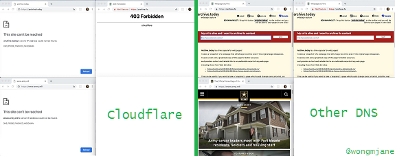

# The Great Cloudwall


---

"The Great Cloudwall" is [Cloudflare Inc.](https://www.cloudflare.com/), the U.S. company.
It is the world's [largest](https://w3techs.com/technologies/history_overview/proxy) MITM proxy([reverse proxy](https://en.wikipedia.org/wiki/Reverse_proxy)).
It sits between you and origin webserver, acting like a [border patrol agent](https://www.cbp.gov/careers/bpa).
The origin webserver administrator allowed the agent to decide who can access to their "_web property_" and define "_restricted area_".

---


---

Take a look at the first image posted below. You will think Cloudflare block _only_ attackers. You will think _Cloudflare is always online(never go down)_. However [it is not true](PEOPLE.md).

---


---

It is called this in reference to the [Great Firewall of China](https://www.comparitech.com/privacy-security-tools/blockedinchina/) which does a comparable job of filtering out many humans from seeing web content (ie everyone in mainland China and people outside) while at the same time those not affected to see a dratically different web, a web free of censorship such as an image of ["tank man"](https://en.wikipedia.org/wiki/Tank_Man) and the history of ["Tiananmen Square protests"](https://en.wikipedia.org/wiki/1989_Tiananmen_Square_protests#Censorship_in_China). (Cloudflare also [block](PEOPLE.md) legit robots(crawlers) and API clients)

---


---

Cloudflare similarly prevents those in southeast asia and elsewhere who have poor internet connectivity from accessing the websites behind it (for example, they could be behind 7+ layers of NAT or sharing same IP) unless they solve multiple image CAPTCHAs. There is no way to solve the captcha without enabling Javascript and Cookies. Cloudflare is using them to make a browser signature.

---


---

[Tor users](https://www.torproject.org/) and [VPN users](https://airvpn.org/topic/23090-cloudflare-often-bans-my-ip-address/) are also a [victim](https://blog.torproject.org/trouble-cloudflare) of Cloudflare. If you didn't try Tor until this moment, we encourage you to [download Tor Browser](https://www.torproject.org/) and visit your favorite websites. (advice: _Do not login to your bank website or government webpage or they will flag your account. [Use VPN](https://www.vpngate.net/en/) for those websites._)
You might want to say "_Tor is illegal! Tor is criminal's browser! Tor is bad!_". No.
Tor _was_ developed by US Army, but current Tor is developed by the [Tor project](https://www.torproject.org/). There are many people who use Tor, including your future friends. So, if you are using Cloudflare on your website you are blocking real humans. You will lose potential friendship and business deal.

---


---

Cloudflare also has a massive [harassment problem](https://web.archive.org/web/20171024040313/http://www.businessinsider.com/cloudflare-ceo-suggests-people-who-report-online-abuse-use-fake-names-2017-5).
Cloudflare [shares personal information](https://archive.ph/ePdvi) of those who complain about hosted sites. They sometimes ask you to provide
your true ID. If you don't want to get harassed, assaulted, [swatted](https://boingboing.net/2015/01/19/invasion-boards-set-out-to-rui.html) or killed, you better stay away from Cloudflared websites.

---


---

Let's talk about another harassment problem. Cloudflare is sending spam emails to non-Cloudflare users.

`Only send emails to subscribers who’ve opted in.`

`When the user say "stop", then stop sending email.`

It's that simple. But Cloudflare don't care.
Cloudflare said using their service [can stop all spammers or attackers](https://support.cloudflare.com/hc/en-us/articles/200170066-Will-activating-Cloudflare-stop-all-spammers-or-attackers-).
How can we stop _Cloudflare spammers_ without activating Cloudflare?

---


---

And their DNS service, [1.1.1.1](https://1.1.1.1/), is also filtering out users from visiting the website by returning fake IP address owned by Cloudflare, localhost IP such as "127.0.0.x", or just return nothing. Cloudflare DNS also break online software from smartphone app to computer game because of their fake DNS answer.

---




---

And here you might think, "_I am not using Tor or VPN, why should I care?_".
If you visit website which use Cloudflare, you are sharing your information not only to website owner _but also Cloudflare_.
It is impossible to analyze without [decrypting TLS traffic](https://github.com/nym-zone/block_cloudflare_mitm_fx/issues/15#issuecomment-354773389). Cloudflare knows all your data such as raw password.
[Cloudbeed](https://en.wikipedia.org/wiki/Cloudbleed) can happen anytime.

---


---

Do you really want to share your data with Cloudflare, and also 3-letter agency?
Internet user's online profile is a "product" that the government and big tech companies wants to buy.

US [Department of Homeland Security](https://www.dhs.gov/) said:
```
Do you have any idea how valuable the data you have is?
Is there any way you would sell us that data?
```

---


---

Cloudflare also offer _FREE_ VPN service called "[Cloudflare Warp](https://blog.cloudflare.com/1111-warp-better-vpn/)". If you use it, all your smartphone connections are sent to Cloudflare servers. Cloudflare can know which website you've read, what comment you've posted, who you've talked to, etc. You are voluntary giving [all your information](https://github.com/privacytoolsIO/privacytools.io/issues/374#issuecomment-478686469) to Cloudflare. If you think "_Are you joking? Cloudflare is secure._" then you need to learn how [VPN works](https://en.wikipedia.org/wiki/VPN).

---


---

You might already know about the [PRISM](https://en.wikipedia.org/wiki/PRISM_(surveillance_program)) scandal. It is true that AT&T lets NSA to [copy all internet data](https://www.cnet.com/news/at-t-lets-nsa-hide-and-surveil-in-plain-sight-the-intercept-reports/) for surveillance. Let's say you're working at the NSA, and you want _every citizen's internet profile_. You know most of them are blindly trusting Cloudflare and using it - only one centralized gateway - to proxy their personal website, chat website, forum website, bank website, insurance website, search engine, secret member-only website, auction website, shopping, video website, NSFW website, and illegal website. You also know they use Cloudflare's DNS service ("1.1.1.1") and VPN service ("Cloudflare Warp") for "_Secure! Faster! Better!_" internet experience. Combining them with user's IP address, browser fingerprint, cookies and RAY-ID will be useful to build target's online profile. You want their data. [What will you do](https://www.reddit.com/r/privacy/comments/1gb0pa/how_prism_actually_works_1520_att_fiber_optic/)?

---


---

### Cloudflare is a honeypot.


### Free honey for everyone. _Some_ strings attached.


### Do not use Cloudflare.


### Decentralize the internet.


---

This repository is a list of websites that are behind "The Great Cloudwall", and also actively blocking Tor users.


Data  -  mirrors: [NixNet](https://git.nixnet.xyz/Username/cloudflare-tor),  [CodeBerg](https://codeberg.org/Username/cloudflare-tor)
* [Cloudflare Users](cloudflare_users/)
* [Cloudflare Inc.](cloudflare_inc/)
* [Domains: Non-Cloudflare but filtering/blocking Tor users](not_cloudflare/)

Information
* [Padlock icon indicates a secure SSL connection established w MITM-ed](https://bugs.debian.org/cgi-bin/bugreport.cgi?bug=831835) by Anonymous
* [Block Global Active Adversary Cloudflare](https://trac.torproject.org/projects/tor/ticket/24351) by nym-zone
* [Problem with Cloudflare](https://github.com/privacytoolsIO/privacytools.io/issues/374#issuecomment-460077544) by libBletchley
* [Criticism and controversies](https://en.wikipedia.org/wiki/Cloudflare#Criticism_and_controversies) by Wikipedia
* [Cloudflare Watch](http://www.crimeflare.org:82/) (cons: _down quite a lot, old data, search restricted to EU only_)
* [Another landmark day in the war to control, centralize and censor the internet.](https://www.reddit.com/r/privacy/comments/b8dptl/another_landmark_day_in_the_war_to_control/) by TheGoldenGoose8888
* [Disadvantage of relying on only one service](https://twitter.com/w3Nicolas/status/1134529316904153089) ([DO is CF](https://www.digwebinterface.com/?hostnames=ns1.digitalocean.com%0D%0Ans2.digitalocean.com%0D%0Ans3.digitalocean.com%0D%0Awww.digitalocean.com&type=A&ns=resolver&useresolver=8.8.4.4&nameservers=))


There are more details of why what they are doing is wrong available [here](cloudflare-philosophy.md).
Also see [Frequently Asked Questions](faq.md).


# What can you do?

* Read [our list of recommended actions](what-to-do.md) and share it with your friends

* Read [other user's voice](PEOPLE.md) (if you write a blog, tell us your URL)

* Update the domain list: [List instructions](instructions.md)

* Add WTF-Cloudflare news to [NEWS.md](NEWS.md)

* Search something on [Searxes Tor](http://searxes.nmqnkngye4ct7bgss4bmv5ca3wpa55yugvxen5kz2bbq67lwy6ps54yd.onion/) or [clearnet](https://searxes.eu.org/) (this will help collecting Searxes' "MITM domains")

* Take a look at add-on code and try it

| Name | Firefox | Chrome |
| -------- | -------- | -------- |
| Block Cloudflare MITM Attack | [Code](addon_firefox/bcma) | [Code](addon_chrome/bcma) |
| Are links vulnerable to MITM? | [Code](addon_firefox/ismitmlink) | [Code](addon_chrome/ismitmlink) |
| Which website rejected me? | [Code](addon_firefox/whyrejectme) | [Code](addon_chrome/whyrejectme) |

* Try & write new [Tool / Script](tool/)

* Want something to read? [PDF](pdf/)

* Proofread [Jeff's writing](article.txt)


There are other lists, but this one is one where every entry on the list a human being has actually tried
to go to, and has been blocked.
Human is not a robot.

* [List of services blocking Tor](https://trac.torproject.org/projects/tor/wiki/org/doc/ListOfServicesBlockingTor) by Tor project contributors
* [Sites using cloudflare](https://github.com/pirate/sites-using-cloudflare) by pirate

WARNING:
Github.com is very hostile to Tor users. If you create an account on Github via Tor, your account will be automatically
flagged for spam and will be deleted. See "List of services blocking Tor" for details.


# Who uses this list?

* [Searxes](http://searxes.nmqnkngye4ct7bgss4bmv5ca3wpa55yugvxen5kz2bbq67lwy6ps54yd.onion/) meta-search engine
* Some browser add-ons


---


