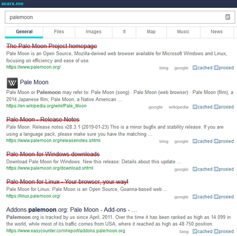

This is a source code of Maslin Bossé's "*Are links vulnerable to MITM?*".

PRs are welcome.





```
You've searched something on the internet.
Are these links vulnerable to MITM attack or not?

This add-on is using Searxes' "MITM test API" to scan FQDN(URL's hostname).
This add-on never send other information.
```

[Download add-on](https://api.searxes.eu.org/_/addon.php?dl=dl&for=ismitmlink)