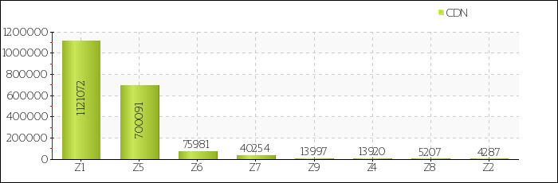

# CDN users FQDN list

- Cloudflare data (code "Z3") is [/cloudflare_users/domains](../../cloudflare_users/domains)

 [ℹ](https://ss.wodferndripvpe6ib4uz4rtngrnzichnirgn7t5x64gxcyroopbhsuqd.onion/ss/pct_zc.php)

- See [instructions.md](../../instructions.md) for file purpose and format specifications.
