# El gran núvol

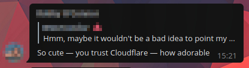

---

## Atureu Cloudflare

|  🖹  |  🖼 |
| --- | --- |
|  "The Great Cloudwall" és Cloudflare Inc., l'empresa nord-americana.Ofereix serveis CDN (xarxa de lliurament de contingut), mitigació de DDoS, seguretat a Internet i serveis DNS distribuïts (servidor de noms de domini).  |   |
|  Cloudflare és el proxy MITM més gran del món (servidor intermediari invers).Cloudflare posseeix més del 80% de la quota de mercat de CDN i el nombre d'usuaris de cloudflare creixen cada dia.Han ampliat la seva xarxa a més de 100 països.Cloudflare serveix més trànsit web que Twitter, Amazon, Apple, Instagram, Bing i Viquipèdia.Cloudflare ofereix un pla gratuït i molta gent l'utilitza en lloc de configurar els servidors adequadament.Van comerciar privadesa per comoditat.  |  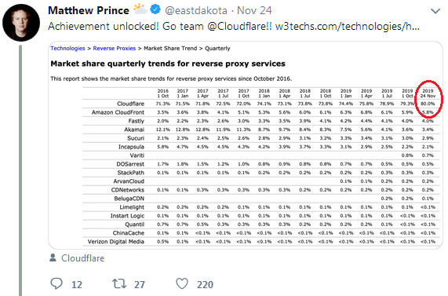  |
|  Cloudflare se situa entre vosaltres i el servidor web d'origen, actuant com un agent de patrulla de frontera.No podeu connectar-vos al destí escollit.Esteu connectant-vos a Cloudflare i tota la vostra informació es descifra i es lliura de forma ininterrompuda. |  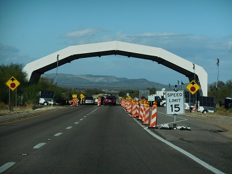  |
|  L'administrador del servidor web d'origen va permetre a l'agent - Cloudflare - decidir qui pot accedir a la seva "propietat web" i definir "àrea restringida".  |  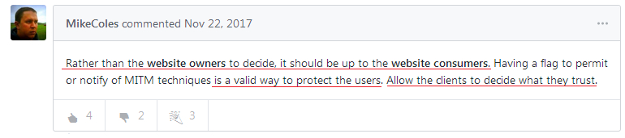  |
|  Mireu la imatge adequada.Pensareu que Cloudflare bloqueja només els dolents.Pensareu que Cloudflare sempre està en línia (no es tanca mai).Pensareu que els bots legals i els rastrejadors poden indexar el vostre lloc web.  |  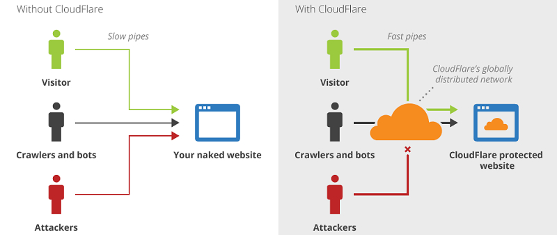  |
|  Tanmateix, no són certs.Cloudflare està bloquejant persones innocents sense cap raó.La fallada de núvols pot baixar.Cloudflare bloqueja els bots legítims.  |  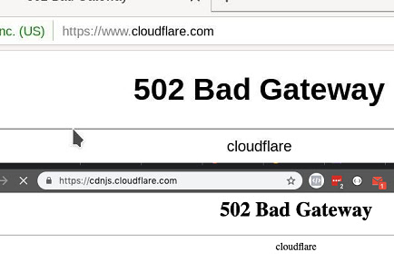  |
|  Igual que qualsevol servei d’allotjament, Cloudflare no és perfecte.Veureu aquesta pantalla encara que el servidor d'origen funcioni bé.  |   |
|  De debò creieu que Cloudflare té un temps de funcionament 100%?No tens ni idea quantes vegades baixa Cloudflare.Si Cloudflare baixa, el vostre client no pot accedir al vostre lloc web. |  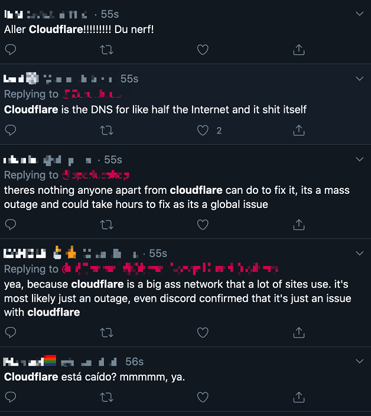 |
|  D’això se’n fa referència al gran tallafoc de la Xina, que fa un treball comparable a l’hora de filtrar molts humans de veure contingut web (és a dir, tothom a la Xina continental i persones de fora).Si bé, al mateix temps, els no afectats van veure una web dràcticament diferent, una web lliure de censura com ara una imatge de “home del tanc” i la història de les “protestes a la plaça de Tiananmen”. | 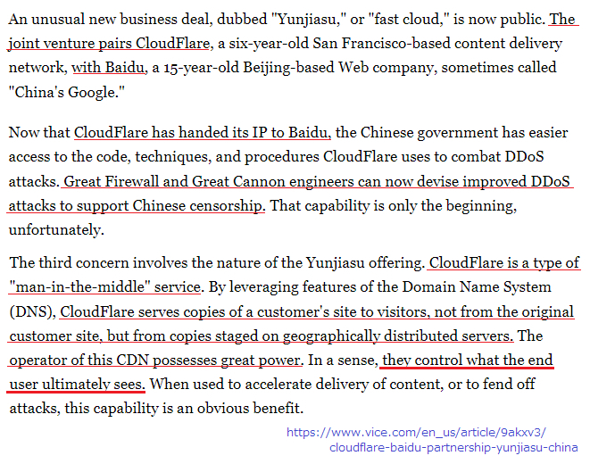  |
|  Cloudflare té un gran poder.En certa manera, controlen el que al final l'usuari final veu.Se li impedeix navegar pel lloc web a causa de Cloudflare. | 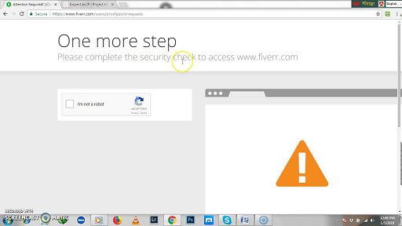 |
|  Cloudflare es pot utilitzar per a la censura. | 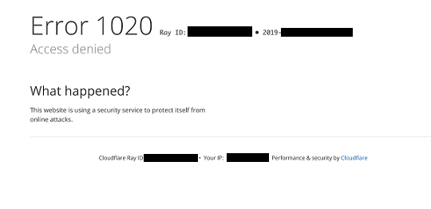 |
|  No podeu veure el lloc web cloudflared si feu servir un navegador menor que Cloudflare pot pensar que és un bot (perquè no molta gent l’utilitza). | 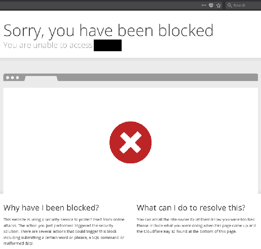 |
|  No podeu passar aquesta “comprovació del navegador” sense habilitar Javascript.Es tracta d’una pèrdua de cinc (o més) segons de la vostra valuosa vida. | 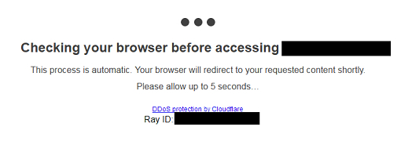 |
|  Cloudflare també bloqueja automàticament robots / rastrejadors legítims com ara clients de Google, Yandex, Yacy i API.Cloudflare segueix activament la comunitat "bypass cloudflare" amb la intenció de trencar els robots de recerca legítims. | 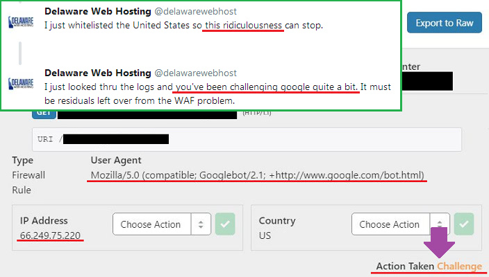 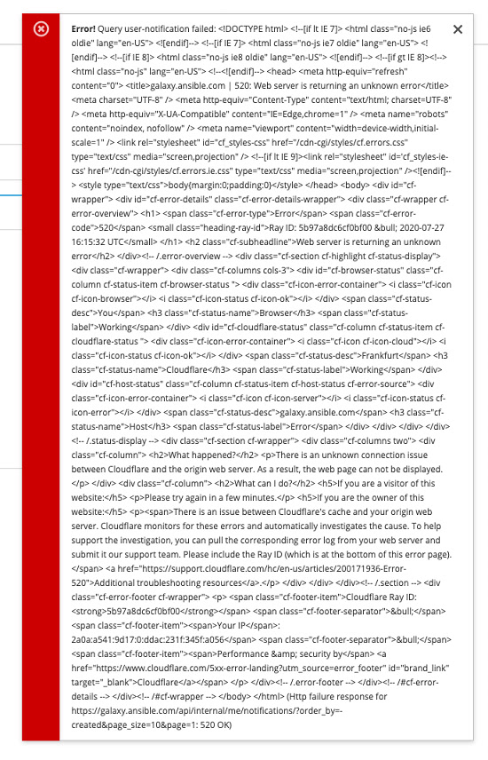 |
|  De manera similar, Cloudflare impedeix que moltes persones que tinguin una mala connexió a Internet accedeixin als llocs web que hi ha al darrere (per exemple, podrien estar al darrere de més de 7 capes de NAT o compartir una mateixa IP, per exemple, wifi pública) tret que resolguin múltiples CAPTCHA d’imatges.En alguns casos, aquest procés trigarà entre 10 i 30 minuts a satisfer Google. |  |
|  L'any 2020 Cloudflare va passar de Recaptcha a Google a hCaptcha, ja que Google té intenció de cobrar-ne el seu ús.Cloudflare li va dir que els importa la seva privadesa ("ajuda a respondre a una privacitat"), però evidentment és una mentida.Es tracta de diners.“HCaptcha permet als llocs web guanyar diners per atendre aquesta demanda alhora que bloquegen els robots i altres formes d’abús”. | 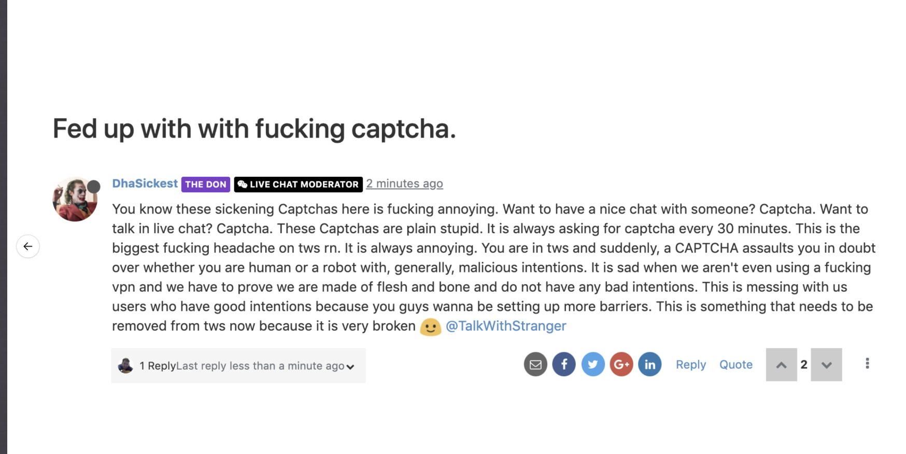 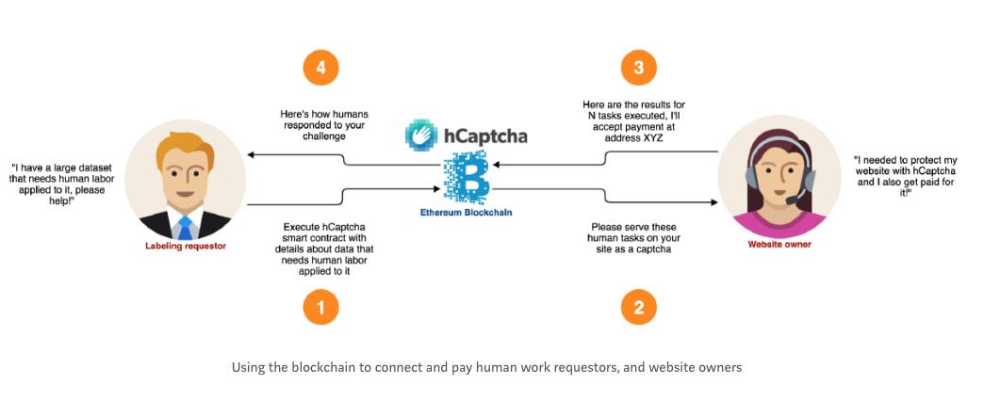 |
|  Des de la perspectiva de l’usuari, això no canvia gaire. Estàs obligat a solucionar-ho. | 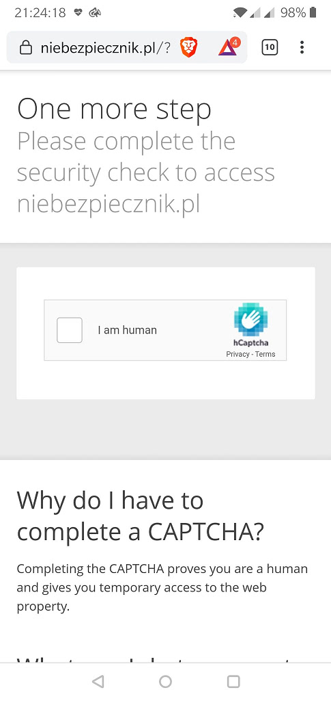 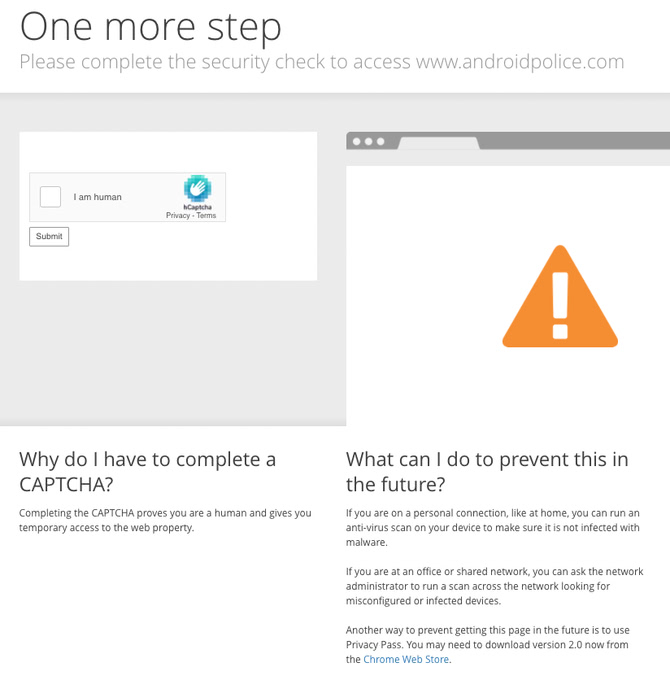 |
|  Cloudflare està bloquejat molts humans i programari cada dia. | 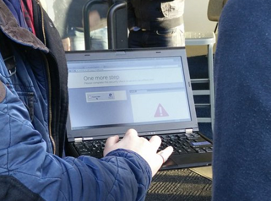 |
|  Cloudflare molesta molta gent a tot el món.Doneu un cop d'ull a la llista i penseu si l’adopció de Cloudflare al vostre lloc és bona per a l’experiència de l’usuari. |  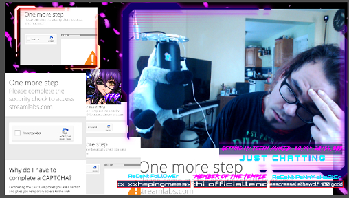 |
|  Quin és l’objectiu d’internet si no podeu fer el que vulgueu?La majoria de les persones que visiten el vostre lloc web només buscaran altres pàgines si no poden carregar una pàgina web.És possible que no bloquegeu activament cap visitant, però el tallafoc predeterminat de Cloudflare és prou estricte per bloquejar moltes persones. | 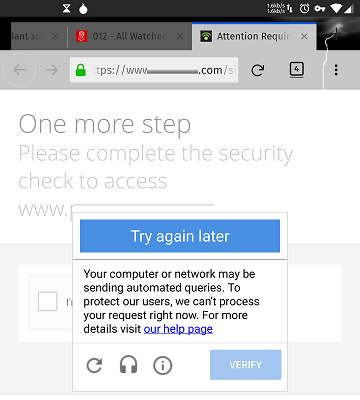 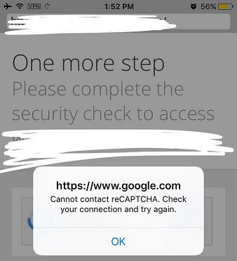 |
|  No hi ha manera de resoldre el captcha sense habilitar Javascript i Cookies.Cloudflare els utilitza per fer una signatura del navegador per identificar-vos.Cloudflare necessita conèixer la vostra identitat per decidir si és elegible per continuar navegant pel lloc. | 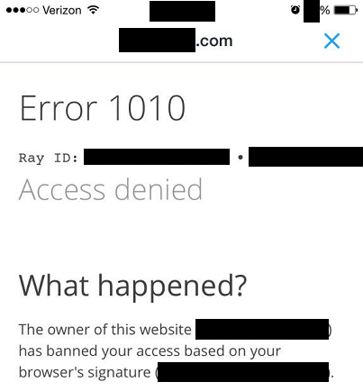 |
|  Els usuaris de Tor i els usuaris de VPN també són víctimes de Cloudflare.Ambdues solucions estan sent utilitzades per moltes persones que no poden pagar-se internet sense censura a causa de la seva política de país / corporació / xarxa o que volen afegir capes addicionals per protegir la seva privadesa.Cloudflare està atacant descaradament a aquestes persones, obligant-les a desactivar la seva solució de representació. | 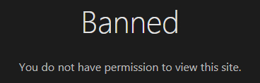 |
|  Si fins aquest moment no heu provat Tor, us recomanem que descarregueu Tor Browser i visiteu els vostres llocs web preferits.Us suggerim que no inicieu la sessió al lloc web bancari o a la pàgina web del govern o que marqui el vostre compte. Utilitzeu la VPN per a aquests llocs web. | 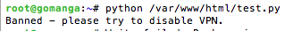 |
|  Potser voldreu dir: "Tor és il·legal! Els usuaris de Tor són criminals! Tor és dolent! ". No.Potser heu après a Tor des de la televisió, dient que Tor es pot utilitzar per navegar per darknet i canviar armes, drogues o porno xicotet.Si bé la declaració anterior és certa que hi ha molts llocs web del mercat on es poden comprar aquests articles, aquests llocs també apareixen sovint a claredat.  | 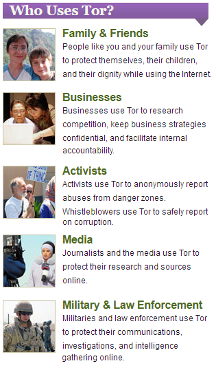 |
|  Tor va ser desenvolupat per US Army, però Tor actual està desenvolupat pel projecte Tor.Hi ha moltes persones i organitzacions que utilitzen Tor, inclosos els teus futurs amics.Així, si utilitzeu Cloudflare al vostre lloc web, bloquegeu humans reals.Perdràs possibles acords d’amistat i negocis. | 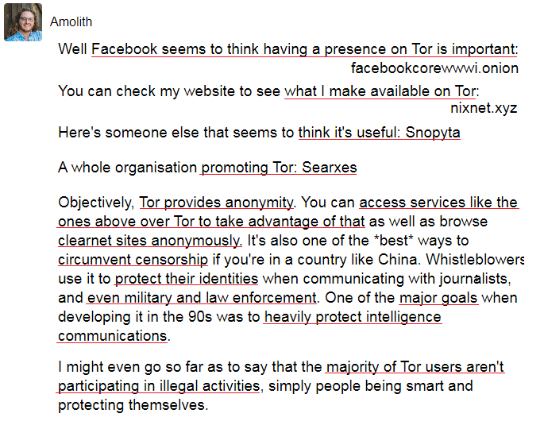 |
|  I el seu servei DNS, 1.1.1.1, també filtra els usuaris que visiten el lloc web retornant una adreça IP falsa propietat de Cloudflare, IP localhost com ara "127.0.0.x", o simplement no retornen res. | 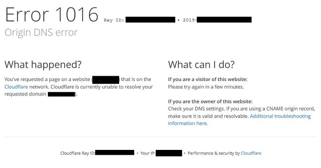 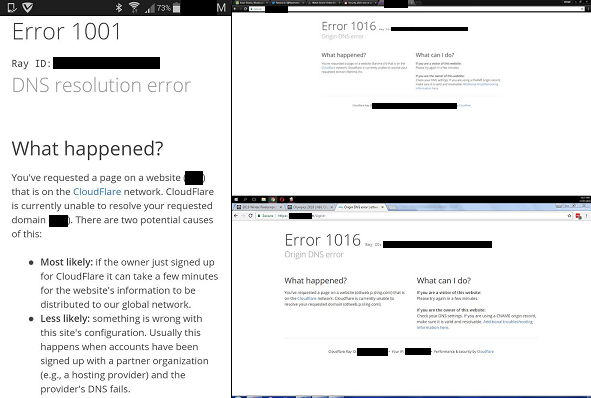 |
|  El DNS de Cloudflare també trenca el programari en línia des de l'aplicació per a telèfons intel·ligents al joc d'ordinador a causa de la seva resposta DNS falsa.El DNS de Cloudflare no pot consultar alguns llocs web bancaris. | 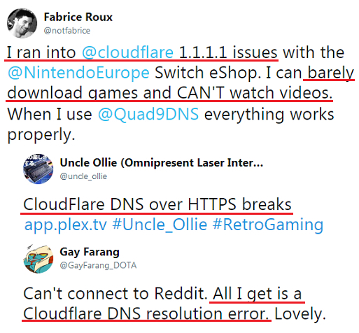 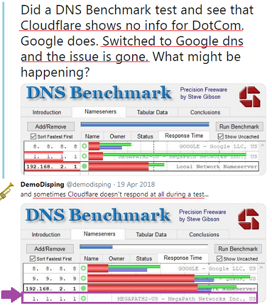 |
|  I aquí podríeu pensar, No estic utilitzant Tor o VPN, per què m’hauria d’importar? Confio en el màrqueting de Cloudflare, per què m’hauria d’importar El meu lloc web és https per què m’hauria d’importar |  |
|  Si visiteu el lloc web que utilitza Cloudflare, compartiu la informació no només amb el propietari del lloc web, sinó també Cloudflare.Així funciona el servidor intermediari invers. | 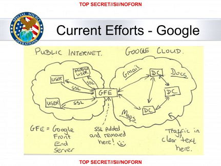 |
|  És impossible analitzar sense desxifrar el trànsit TLS. | 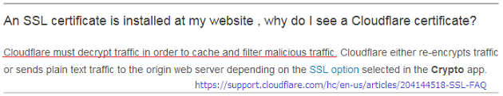 |
|  Cloudflare coneix totes les vostres dades, com ara la contrasenya bruta. | 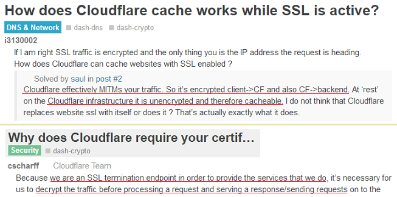 |
|  El núvol es pot produir en qualsevol moment. | 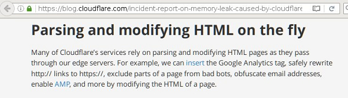 |
|  El https de Cloudflare mai no és de final. |  |
|  Vols compartir les teves dades amb Cloudflare i també amb una agència de tres cartes? | 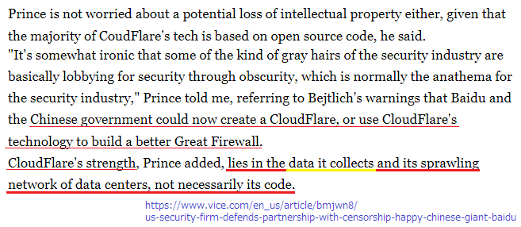 |
|  El perfil en línia d'un usuari d'Internet és un "producte" que el govern i les grans empreses de tecnologia volen comprar. | 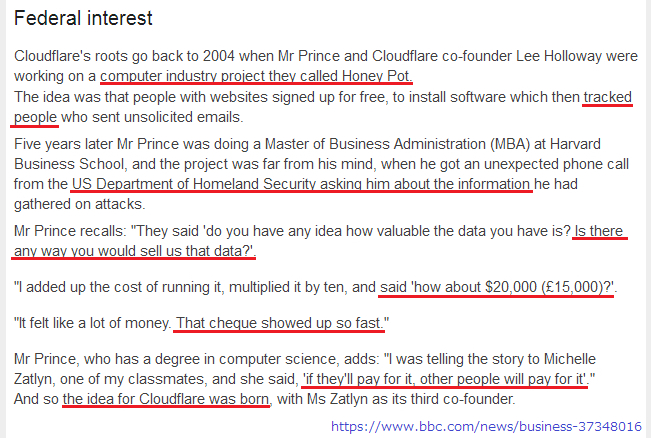 |
|  Va dir el Departament de Seguretat Nacional dels EUA:  Tens alguna idea de quina valor són les dades que tens? Hi ha alguna manera de vendre'ns aquestes dades?  | 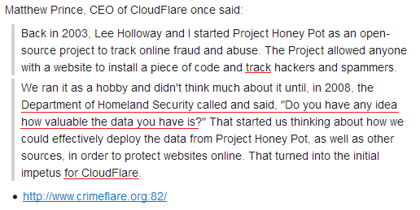 |
|  Cloudflare també ofereix un servei de VPN GRATU calledT, anomenat "Cloudflare Warp".Si l’utilitzeu, totes les connexions del vostre telèfon intel·ligent (o del vostre ordinador) s’envien als servidors de Cloudflare.Cloudflare pot saber en quin lloc web heu llegit, quin comentari heu publicat, amb qui heu parlat, etc.Esteu donant voluntàriament tota la vostra informació a Cloudflare.Si penses “estàs fent broma? Cloudflare és segur. " llavors heu d’aprendre com funciona la VPN. | 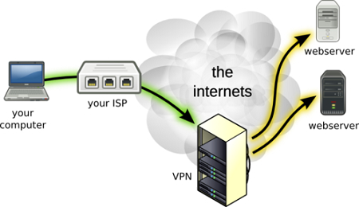 |
|  Cloudflare va dir que el seu servei VPN fa que la vostra xarxa sigui ràpida.Però la VPN fa que la vostra connexió a Internet sigui més lenta que la vostra connexió existent. | 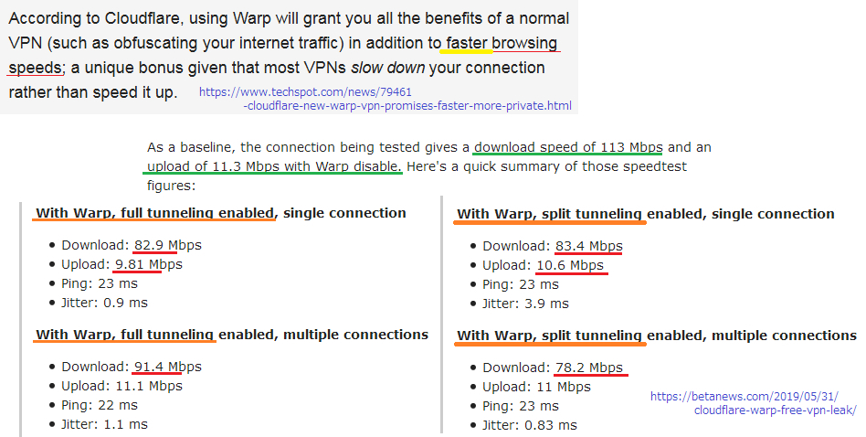 |
|  Potser ja sabreu sobre l’escàndol PRISM.És cert que AT&T permet a NSA copiar totes les dades d’internet per a la seva vigilància. | 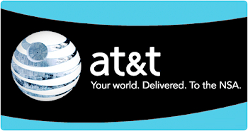 |
|  Diguem que treballes a l’NSA i que desitges el perfil d’internet de cada ciutadà.Sabeu que la majoria d’ells confien cegament en Cloudflare i l’utilitzen (només una passarel·la centralitzada) per fer referència a la connexió del servidor de la seva empresa (SSH / RDP), lloc web personal, lloc web de xat, lloc web del fòrum, lloc web del banc, lloc web d’assegurances, motor de cerca, membre secret -un lloc web únic, lloc web de subhastes, compres, lloc web de vídeos, lloc web NSFW i lloc web il·legals.També sabeu que utilitzen el servei DNS de Cloudflare ("1.1.1.1") i el servei VPN ("Cloudflare Warp") per a "Secure! Més ràpid! Millor!" experiència a Internet.Si es combinen amb l’adreça IP de l’usuari, l’empremta digital del navegador, les cookies i el RAY-ID, serà útil per crear el perfil en línia del destinatari. | 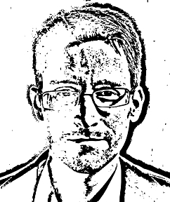  |
|  Vostè vol les seves dades. Què faràs? |  |
|  **Cloudflare és un punt mel.** |  |
|  **Mel gratis per a tothom. Algunes cadenes enganxades.** | 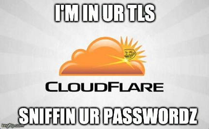 |
|  **No utilitzeu Cloudflare.** | 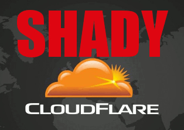 |
|  **Descentralitzar Internet.** |  |

---

##    Continua a la pàgina següent:  "[Ètica del núvol del núvol](ca.ethics.md)"

---

_feu clic a mi_

## Dades i més informació

Aquest dipòsit és una llista de llocs web que hi ha al darrere de "The Great Cloudwall", que bloquegen els usuaris de Tor i altres CDNs.

**Dades**
* [Cloudflare Inc.](../cloudflare_inc/)
* [Usuaris de Cloudflare](../cloudflare_users/)
* [Domini de núvols incloents](../cloudflare_users/domains/)
* [Usuaris de CDN que no siguin Cloudflare](../not_cloudflare/)
* [Usuaris anti-Tor](../anti-tor_users/)

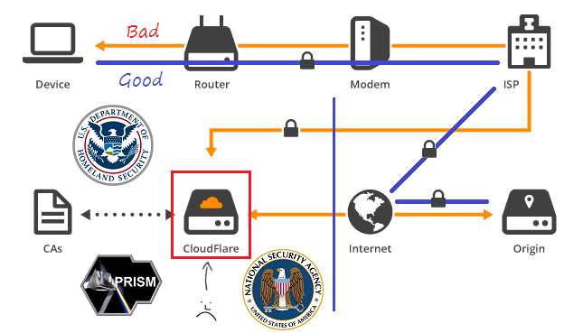

**Més informació**
* [Myth Catalog](../subfiles/myth_catalog.md)
* [The Great Cloudwall](../pdf/2019-Jeff_Cliff_Book1.txt), [Mr. Jeff Cliff](https://shitposter.club/users/jeffcliff)
  * descarregar: [PDF](../pdf/2019-The_Great_Cloudwall.pdf), [ePUB](../pdf/2019-Jeff_Cliff_The_Great_Cloudwall.epub)
  * BookRix GmbH ha suprimit el llibre electrònic electrònic original (ePUB) a causa d'una infracció dels drets d'autor del material CC0
* [Padlock icon indicates a secure SSL connection established w MITM-ed](https://bugs.debian.org/cgi-bin/bugreport.cgi?bug=831835), Anonymous
* [Block Global Active Adversary Cloudflare](https://trac.torproject.org/projects/tor/ticket/24351), nym-zone
  * El bitllet va ser vandalitzat tantes vegades.
  * [Suprimit pel Projecte Tor.](https://lists.torproject.org/pipermail/anti-censorship-team/2020-May/000098.html) [Veure el bitllet 34175.](https://trac.torproject.org/projects/tor/ticket/34175)
  * [Últim bitllet d’arxiu 24351.](https://web.archive.org/web/20200301013104/https://trac.torproject.org/projects/tor/ticket/24351)
* [Shared on Mastodon](../subfiles/shared_on_mastodon.md)
* [Cloudflare Watch](http://www.crimeflare.org:82/)
* [Criticism and controversies](https://en.wikipedia.org/wiki/Cloudflare#Criticism_and_controversies), Wikipedia

---

_feu clic a mi_

## Què pots fer?

* [Llegiu la nostra llista d’accions recomanades i compartiu-la amb els vostres amics.](../ACTION.md)

* [Llegiu la veu d’un altre usuari i escriviu els vostres pensaments.](../PEOPLE.md)

* Busca alguna cosa: [Ansero](https://ansero.nnpaefp7pkadbxxkhz2agtbv2a4g5sgo2fbmv3i7czaua354334uqqad.onion/) ([clearnet](https://ansero.eu.org/)), [Ss \#Search](https://sercxi.nnpaefp7pkadbxxkhz2agtbv2a4g5sgo2fbmv3i7czaua354334uqqad.onion/?ul=ca) ([clearnet](https://sercxi.eu.org/))

* Actualitzeu la llista de dominis: [Llista instruccions](../INSTRUCTION.md).

* [Afegiu Cloudflare o esdeveniment relacionat amb el projecte a l’historial.](../HISTORY.md)

* [Proveu i escrigui nova eina / script.](../tool/)

* [A continuació, es descriuen alguns PDF / ePUB.](../pdf/)

* [Help translate stop_cloudflare](translateData/instructions.md)

---

### Quant a comptes falsos

Informeu-vos de l'existència de comptes falsos que substitueixen els nostres canals oficials, ja sigui Twitter, Facebook, Patreon, OpenCollective, Villages, etc.
**Mai demanem el vostre correu electrònic.
Mai demanem el vostre nom.
Mai demanem la vostra identitat.
Mai preguntem la vostra ubicació.
Mai demanem la vostra donació.
Mai demanem la vostra crítica.
Mai us demanem que seguiu les xarxes socials.
Mai preguntem als vostres mitjans de comunicació social.**

# NO CONFIEU FACTURAR COMPTES.

---

| 🖼 | 🖼 |
| --- | --- |
| 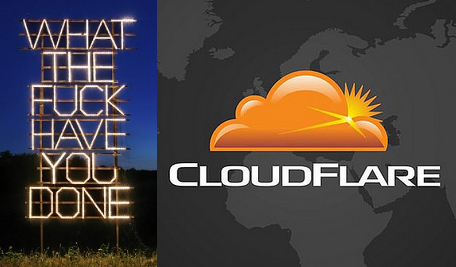 | 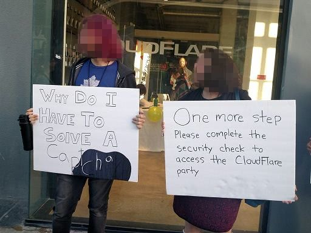 |
| 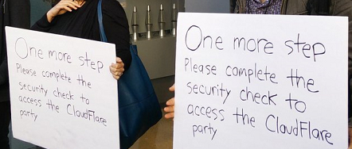 | 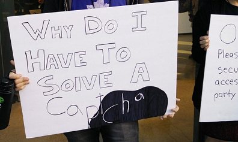 |
| 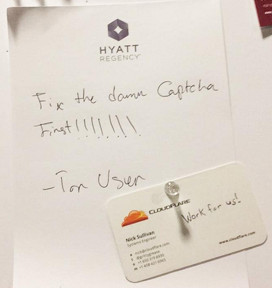 |  |

---

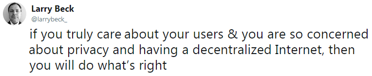

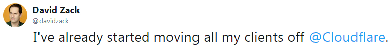

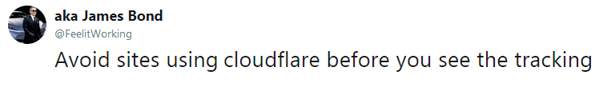

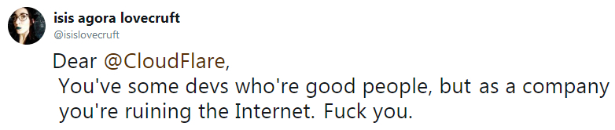

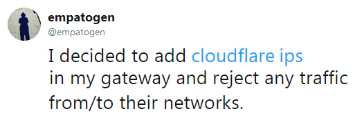

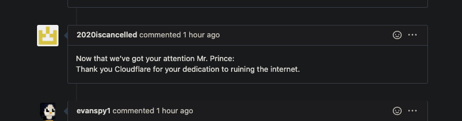

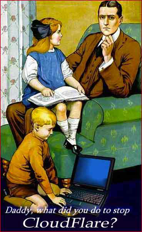
