# 👋 [_Non-English_ versions](../README.md)
<br><br><br><br><br>


---


# Ethical Issues


"_Don't support this company which is void of ethics_"

"_Your company isn't trustworthy. You claim to enforce DMCA but have many lawsuits for not doing so._"

"_They only censor those who question their ethics._"

"_I guess the truth is inconvenient and better hidden from public view._"  -- [phyzonloop](https://twitter.com/phyzonloop)


---


<details>
<summary>_click me_

## CloudFlare spams people
</summary>


Cloudflare is sending spam emails to non-Cloudflare users.

- Only send emails to subscribers who’ve opted in
- When the user say "stop", then stop sending email

It's that simple. But Cloudflare doesn't care.
Cloudflare said using their service [can stop all spammers or attackers](https://support.cloudflare.com/hc/en-us/articles/200170066-Will-activating-Cloudflare-stop-all-spammers-or-attackers-).
How can we stop _Cloudflare spammers_ without activating Cloudflare?


| 🖼 | 🖼 |
| --- | --- |
| 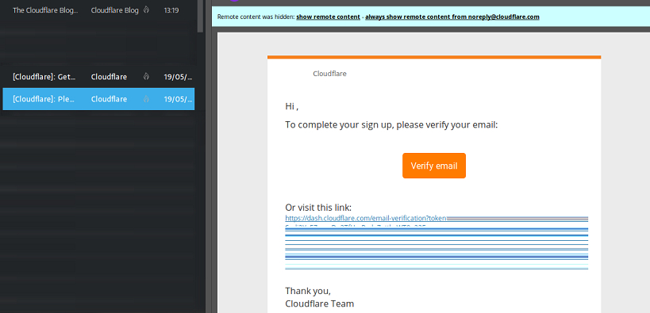 | 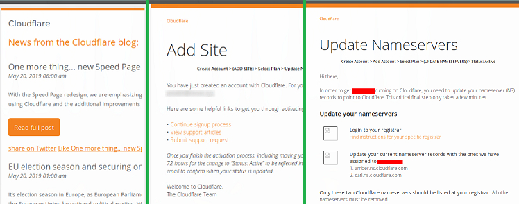 |
| 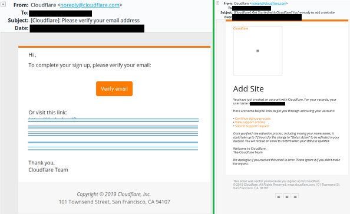 | 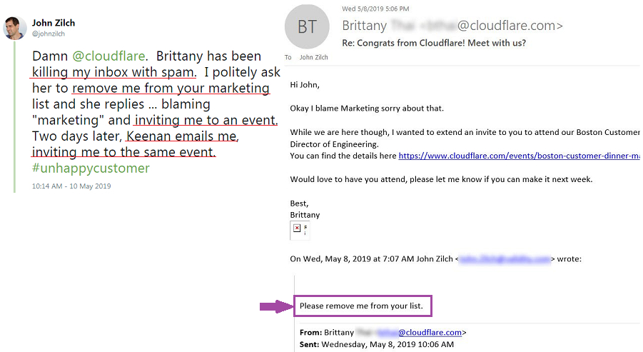<br>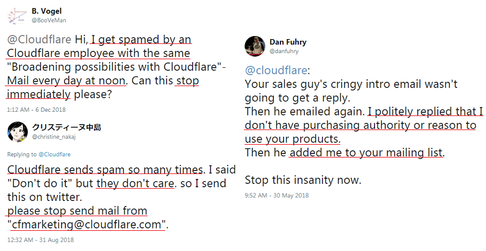 |

</details>

---

<details>
<summary>_click me_

## Remove user's review
</summary>


Cloudflare censor [negative reviews](https://web.archive.org/web/20191116004046/https://www.trustpilot.com/reviews/5aa6ee0ed5a5700a7c8cf853). If you post _anti-Cloudflare_ text on Twitter, you have a chance to get a [reply](https://twitter.com/CloudflareHelp/status/1126051764917145601) from [Cloudflare employee](cloudflare_inc/cloudflare_members.txt) with "_[No, it's not](PEOPLE.md)_" message. If you post a negative review on any review site, they will try to [censor](https://twitter.com/phyzonloop/status/1178836176985366529) [it](https://twitter.com/dxgl_org/status/1178722159432220672).


| 🖼 | 🖼 |
| --- | --- |
| <br>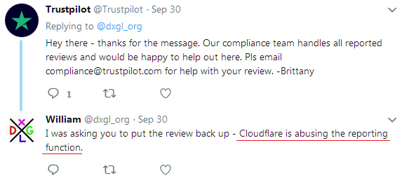 | 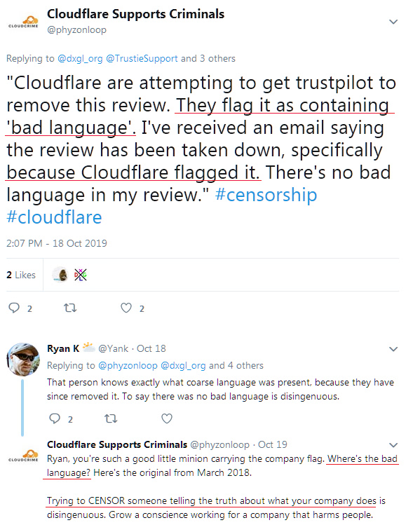 |

</details>

---

<details>
<summary>_click me_

## Share user's private information
</summary>


Cloudflare has a massive [harassment problem](https://web.archive.org/web/20171024040313/http://www.businessinsider.com/cloudflare-ceo-suggests-people-who-report-online-abuse-use-fake-names-2017-5).
Cloudflare [shares personal information](https://archive.ph/ePdvi) of those [who](https://twitter.com/ZJemptv/status/898299709634248704) [complain](https://twitter.com/TinyPirate/status/554718958176067584) [about](https://twitter.com/remembrancermx/status/1010329041235148802) [hosted](https://twitter.com/Bridaguy/status/915003769280172037) [sites](https://twitter.com/HelloAndrew/status/897260208845500416). They sometimes ask you to provide
your true ID. If you don't want to get harassed, [assaulted](https://twitter.com/NiteShade925/status/1158469203420205056), [swatted](https://boingboing.net/2015/01/19/invasion-boards-set-out-to-rui.html) or [killed](https://twitter.com/RusEmbUSA/status/1187363092793040901), you better stay away from Cloudflared websites.


| 🖼 | 🖼 |
| --- | --- |
| 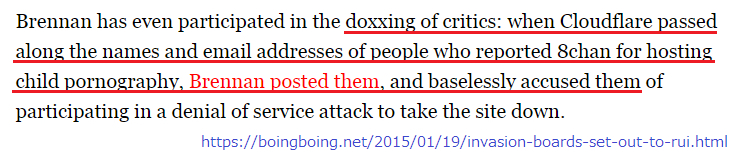 | 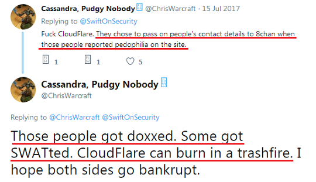 |
| 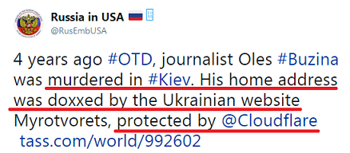 | 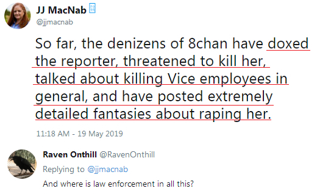 |
| 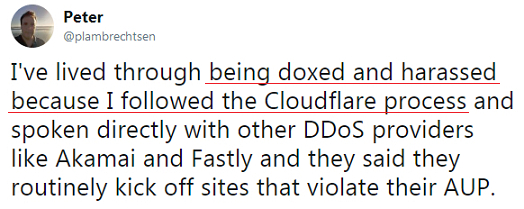 | <br>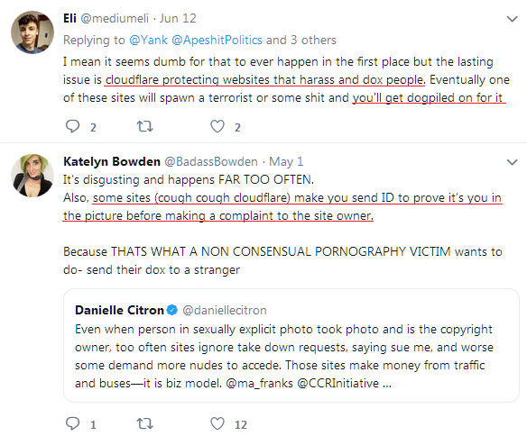 |

</details>

---

<details>
<summary>_click me_

## Corporate solicitation of charitable contributions
</summary>


CloudFlare is [asking](https://web.archive.org/web/20191112033605/https://opencollective.com/cloudflarecollective#section-about) for charitable contributions. It’s quite appalling that an American corporation would ask for charity alongside non-profit organizations that have good causes. If you like [blocking people or wasting other people's time](PEOPLE.md), you might want to order some pizzas🍕 for Cloudflare employees.


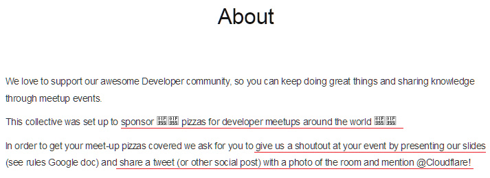

</details>

---

<details>
<summary>_click me_

## Terminating sites
</summary>


What will you do if your site goes down _suddenly_? There are reports that Cloudflare is [deleting](https://twitter.com/stefan_eady/status/1126033791267426304) [user's](https://twitter.com/derivativeburke/status/903755267053117440) [configuration](https://twitter.com/lordscarlet/status/1046785164792205314) or [stopping service without any warning](https://twitter.com/svolentin/status/1227324408475344896), [silently](https://twitter.com/BlnaryMlke/status/1194339461984854018). We suggest you find [better provider](what-to-do.md).

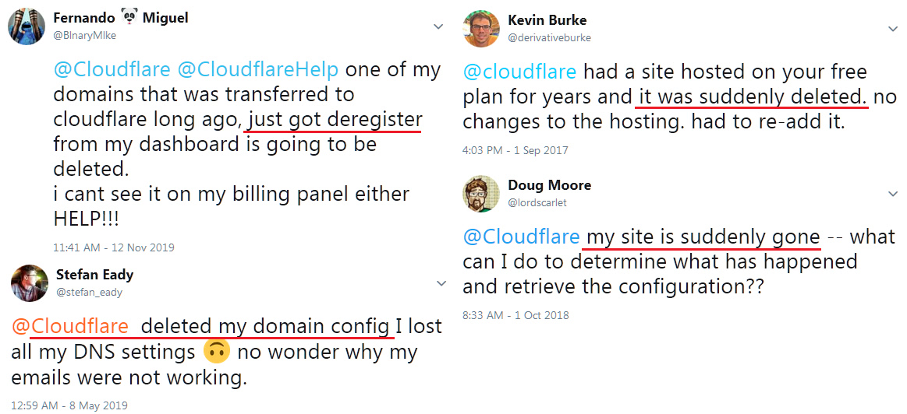

</details>

---

<details>
<summary>_click me_

## Browser vendor discrimination
</summary>


CloudFlare gives preferential treatment to those using Firefox while giving hostile treatment to users of non-Tor-Browser over Tor.
Tor users of who rightfully refuse to execute non-free javascript also receive hostile treatment.
This access inequality is a network neutrality abuse and an abuse of power.


- Left: `Tor Browser` , Right: `Chrome`. Same IP address.


- Left: `[Tor Browser] Javascript Disabled, Cookie Enabled`
- Right: `[Chrome] Javascript Enabled, Cookie Disabled`

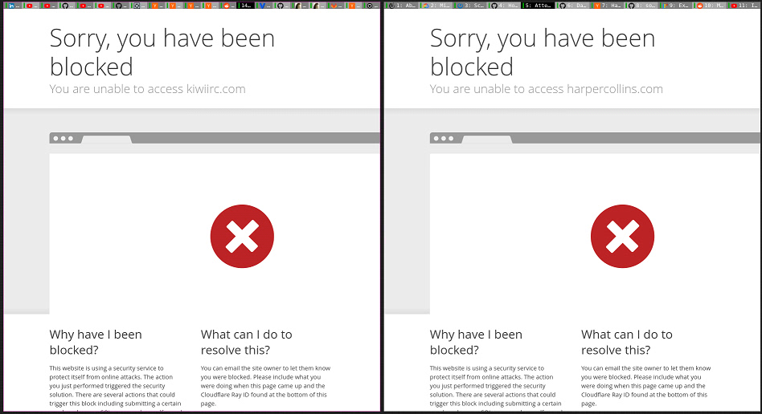

- QuteBrowser(minor browser) without Tor (Clearnet IP)

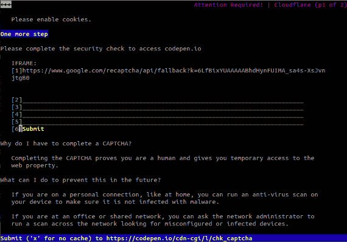

- Lynx


| ***Browser*** | ***Access treatment*** |
| --- | --- |
| Tor Browser (Javascript enabled) | access permitted |
| Firefox (Javascript enabled) | access degraded |
| Chromium (Javascript enabled) | access degraded (pushes Google reCAPTCHA) |
| Chromium or Firefox (Javascript disabled) | access denied (pushes *broken* Google reCAPTCHA) |
| Chromium or Firefox (Cookie disabled) | access denied |
| QuteBrowser | access denied |
| lynx | access denied |
| w3m | access denied |
| wget | access denied |


"_Why not use Audio button to solve easy challenge?_"

Yes, there is an audio button, but it _always_ [doesn't work over Tor](https://trac.torproject.org/projects/tor/ticket/23840). You will get this message when you click it:

```
Try again later
Your computer or network may be sending automated queries.
To protect our users, we can't process your request right now.
For more details visit our help page
```

</details>

---

<details>
<summary>_click me_

## Voter suppression
</summary>


Voters in US states register to vote ultimately through the state secretary's website in the state of their residence.
Republican-controlled state secretary offices engage in voter suppression by proxying the state secretary's website through Cloudflare.
Cloudflare's hostile treatment of Tor users, its MITM position as a centralized global point of surveillance, and its detrimental role overall 
makes prospective voters reluctant to register.  Liberals in particular tend to embrace privacy.  Voter registration forms collect sensitive information about a voter's political leaning, personal physical address, social security number, and date of birth.
Most states only make a subset of that information publicly available, but Cloudflare sees ***all*** that information when someone registers to vote.

Note that paper registration does not circumvent Cloudflare because the secretary of state data entry staff workers will likely use the
Cloudflare website to enter the data.

| 🖼 | 🖼 |
| --- | --- |
|  |  |

- Change.org is a famous website for gathering votes and take action. "[people everywhere are starting campaigns, mobilizing supporters, and working with decision makers to drive solutions.](https://web.archive.org/web/20200206120027/https://www.change.org/about)"
Unfortunately, many people cannot view change.org at all due to Cloudflare's aggressive filter. They are being blocked from signing the petition, thus excluding them from a democratic process. Using other non-cloudflared platform such as [OpenPetition](https://www.openpetition.eu/content/about_us) helps remedy the problem.

| 🖼 | 🖼 |
| --- | --- |
| 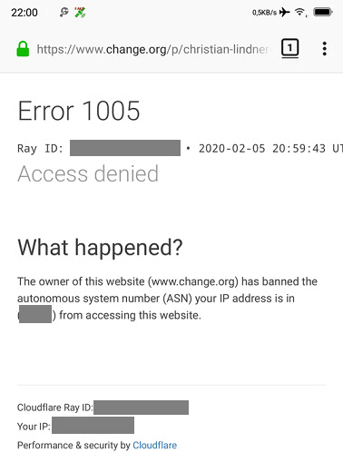 |  |

- Cloudflare's "[Athenian Project](https://www.cloudflare.com/athenian/)" offers free enterprise-level protection to state and local election websites. They said "_their constituents can access election information and voter registration_" but this is a lie because many people just can't browse the site at all.

</details>

---

<details>
<summary>_click me_

## Ignoring user's preference
</summary>


If you opt-out something, you expect that you receive no email about it. Cloudflare ignore user's preference and share data with third-party corporations [without customer's consent](https://twitter.com/thexpaw/status/1108424723233419264). If you're using their free plan, they sometimes send email to you asking to buy monthly subscription.

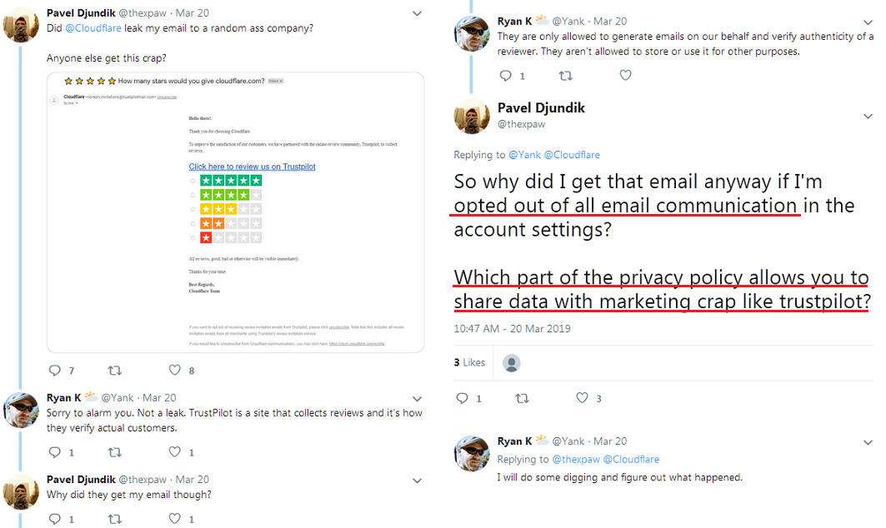

</details>

---

<details>
<summary>_click me_

## Lying about deleting user's data
</summary>


According to this [ex-cloudflare customer's blog](https://shkspr.mobi/blog/2019/11/can-you-trust-cloudflare-with-your-personal-data/), Cloudflare is lying about deleting accounts. Nowadays, many [companies keep your data](https://justdeleteme.xyz/) after you've closed or removed your account. Most of good companies do mention about it in their privacy policy. Cloudflare? No.

```
2019-08-05 CloudFlare sent me confirmation that they'd removed my account.
2019-10-02 I received an email from CloudFlare "because I am a customer"
```

Cloudflare didn't know about the word "remove". If it is really _removed_, why this ex-customer got an email? He also mentioned that Cloudflare's privacy policy doesn't mention about it.

```
Their new privacy policy doesn't make any mention of retaining data for a year.
```


How can you trust Cloudflare if [their privacy policy is a LIE](https://twitter.com/daviddlow/status/1197787135526555648)?

- [Over a year passed since I cancelled my Cloudflare account](https://shkspr.mobi/blog/2020/09/dont-trust-cloudflare-with-your-personal-data/)

</details>

---

<details>
<summary>_click me_

## Keep your personal information
</summary>


Deleting Cloudflare account is [hard level](https://justdeleteme.xyz/).

```
Submit a support ticket using the "Account" category,
and request account deletion in the message body.
You must have no domains or credit cards attached to your account prior to requesting deletion.
```

You will [receive this confirmation email](https://twitter.com/originalesushi/status/1199041528414527495).


"We have begun to process your deletion request" but "We will continue to store your personal information".

Can you "trust" this?


- How to cancel your Cloudflare account

1. Login to your [Cloudflare dashboard](https://dash.cloudflare.com/).
2. Delete all zones(domains) from your dashboard.
3. Click _support_ link.
4. Send a new ticket. Tell them that you want to close your account.
5. _Wait several days._
6. Cloudflare staff will ask for your confirmation and the reason why you have decided to leave Cloudflare.
7. Send a reply again.
8. _Wait several days._
9. You will get a message: "We have successfully deleted your account"


</details>

---

## Other information

- Joseph Sullivan (Joe Sullivan) ([Cloudflare CSO](https://twitter.com/eastdakota/status/1296522269313785862))
  - [Ex-Uber security head charged in connection with the cover-up of a 2016 hack that affected 57 million customers](https://www.businessinsider.com/uber-data-hack-security-head-joe-sullivan-charged-cover-up-2020-8)
  - [Former Chief Security Officer For Uber Charged With Obstruction Of Justice](https://www.justice.gov/usao-ndca/pr/former-chief-security-officer-uber-charged-obstruction-justice)

```
Sullivan took to allegedly cover it up, including making the $100,000 payout
under Uber's "bug bounty" program.
```

---


## Please continue to next page:   "[Cloudflare Voices](../PEOPLE.md)"

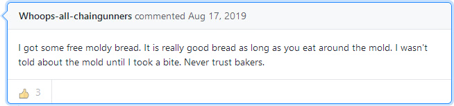

